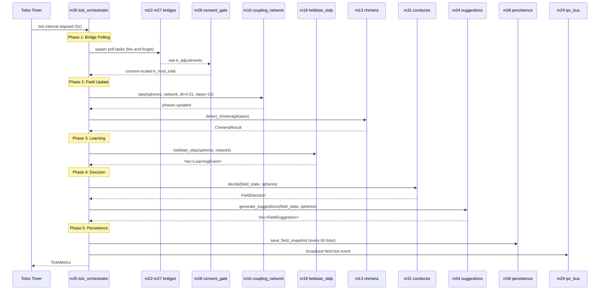
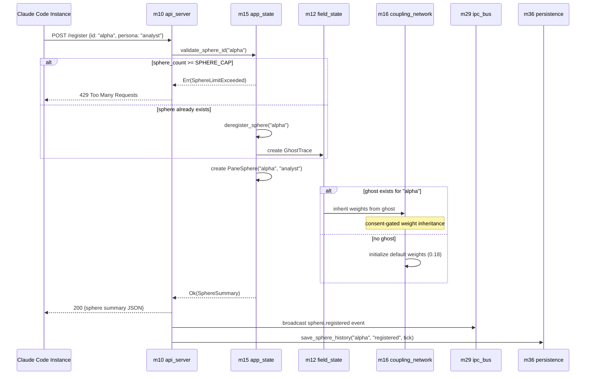
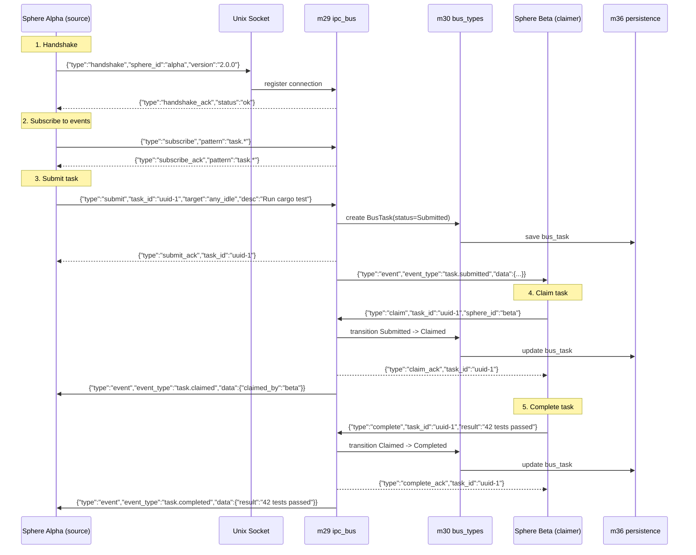
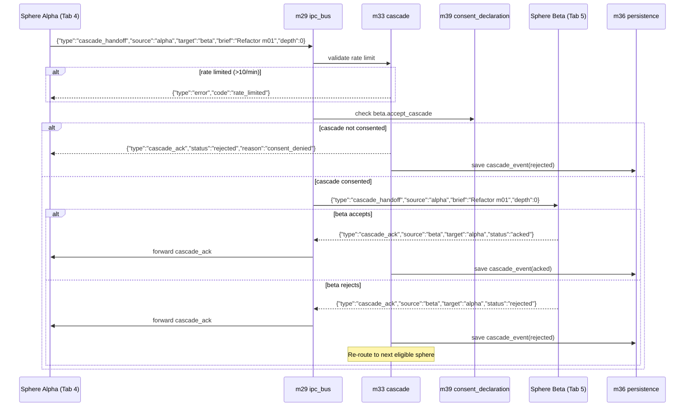
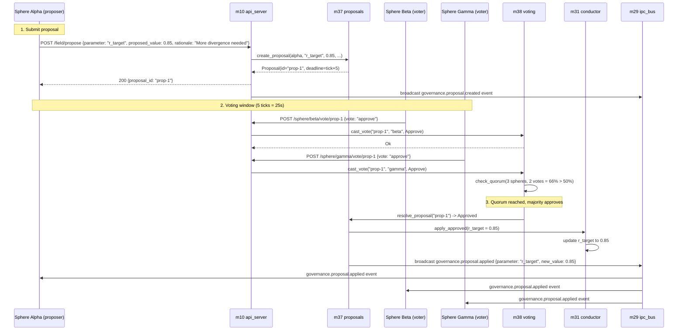
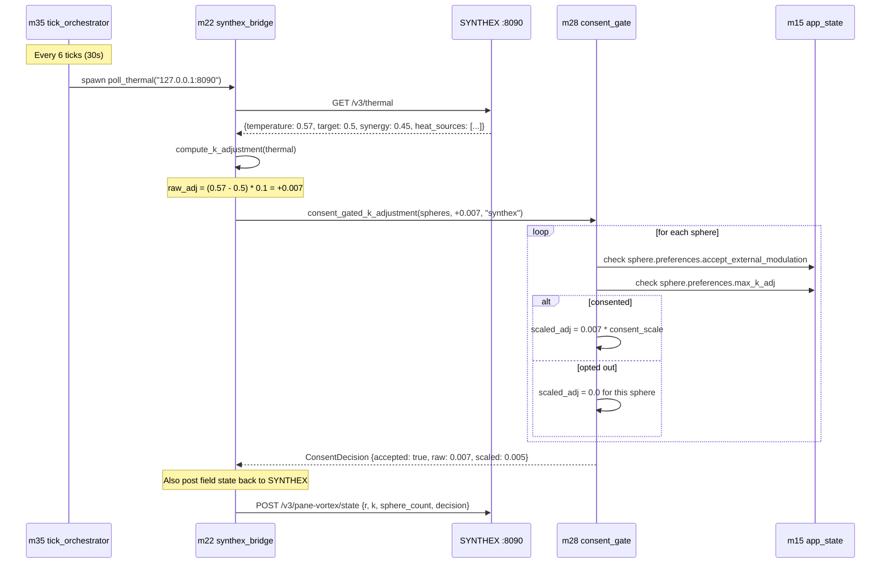

# Pane-Vortex V2 — Message Flows

> Sequence diagrams for key message flows in PV V2.
> Each diagram shows the modules involved, message format, and timing.

---

## 1. Tick Cycle (Every 5 Seconds)

The core tick loop orchestrates all field dynamics:



### Timing Budget

| Phase | Target | Description |
|-------|--------|-------------|
| Bridge Polling | <100ms | Fire-and-forget spawns, non-blocking |
| Field Update | <20ms | 15 coupling steps at dt=0.01 |
| Learning | <10ms | Hebbian LTP/LTD scan |
| Decision | <5ms | Priority chain + PI controller |
| Persistence | <10ms | SQLite WAL write |
| **Total** | **<50ms** | Well under 5s tick interval |

---

## 2. Sphere Registration

A Claude Code instance registers as a sphere:



### Registration Fields

```json
{
    "id": "alpha",
    "persona": "analyst",
    "initial_frequency": 1.0
}
```

All fields except `id` are optional. Defaults: persona="default", frequency=1.0.

---

## 3. Bus Task Submission and Claim

A sphere submits a task that gets claimed by another sphere:



### NDJSON Wire Protocol

Each message is a single JSON line terminated by `\n`:
```
{"type":"handshake","sphere_id":"alpha","version":"2.0.0"}\n
```

Field summary:
- `type` (required): Frame type identifier
- `sphere_id`: Sender identity (required in handshake, optional in others)
- `task_id`: UUID for task-related frames
- `pattern`: Glob pattern for subscribe/unsubscribe
- `data`: Arbitrary JSON payload for events

---

## 4. Cascade Handoff

A sphere delegates work to another sphere via the cascade system:



### Fallback (No Bus Connection)

If the target sphere has no active bus connection:
1. Cascade module writes a markdown brief to `~/projects/shared-context/tasks/cascade-{uuid}.md`
2. The brief contains: source, target, description, timestamp, depth
3. Target sphere picks it up on next session start (hook reads shared-context)

---

## 5. Governance Proposal (V3.4)

A sphere proposes changing a field parameter:



### Quorum Rules

- Quorum threshold: >50% of active (registered) spheres must vote
- Approval: votes_for > votes_against (simple majority)
- Voting window: 5 ticks (25 seconds)
- Max active proposals: 10
- One vote per sphere per proposal (UNIQUE constraint)

---

## 6. Bridge Polling (SYNTHEX Thermal)

Bidirectional bridge poll with consent gate:



---

## Message Format Reference

### HTTP API Messages

All HTTP endpoints accept and return JSON. Content-Type: application/json.

| Direction | Format | Example |
|-----------|--------|---------|
| Request body | JSON | `{"id": "alpha", "persona": "analyst"}` |
| Response body | JSON | `{"status": "ok", "sphere_count": 3}` |
| Error response | JSON | `{"error": "SphereNotFound", "message": "..."}` |

### IPC Bus Messages

NDJSON over Unix domain socket. One JSON object per line.

| Direction | Format | Example |
|-----------|--------|---------|
| Client -> Server | NDJSON | `{"type":"handshake","sphere_id":"alpha","version":"2.0.0"}` |
| Server -> Client | NDJSON | `{"type":"event","event_type":"field.tick","data":{...}}` |
| Error | NDJSON | `{"type":"error","code":"parse_error","message":"..."}` |

### Bridge Messages

Raw TCP HTTP (no hyper). Request/response follow HTTP/1.1 format.

| Direction | Format | Notes |
|-----------|--------|-------|
| PV -> Service | GET/POST HTTP/1.1 | Raw TCP, fire-and-forget for writes |
| Service -> PV | HTTP/1.1 200 + JSON body | Parsed with serde_json |
| PV -> RM | POST with TSV body | `printf 'cat\tagent\tconf\tttl\tcontent'` format |

---

## Cross-References

- **[STATE_MACHINES.md](STATE_MACHINES.md)** — FSM definitions for all state transitions
- **[SCHEMATICS.md](SCHEMATICS.md)** — Static architecture diagrams
- **[CODE_MODULE_MAP.md](CODE_MODULE_MAP.md)** — Module-level function signatures
- **[ERROR_TAXONOMY.md](ERROR_TAXONOMY.md)** — Error types referenced in error flows
- **[config/default.toml](../config/default.toml)** — Timing and threshold values
- **Obsidian:** `[[Pane-Vortex System Schematics — Session 027c]]` (V1 sequence diagrams)
