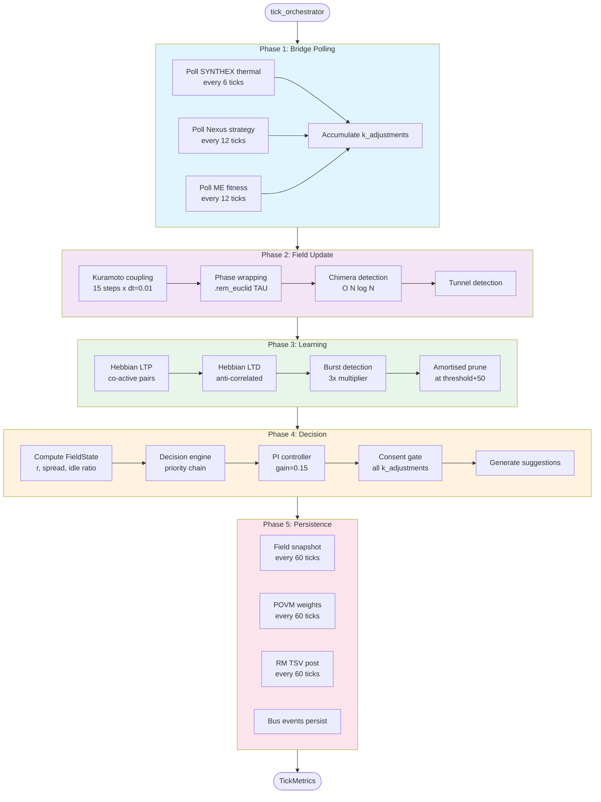
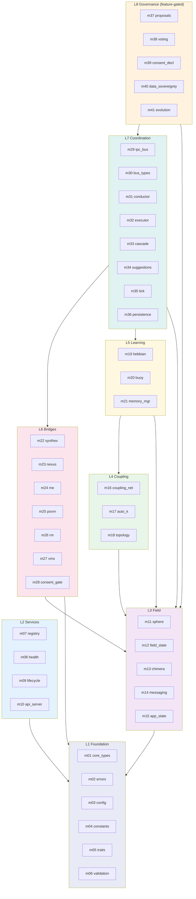
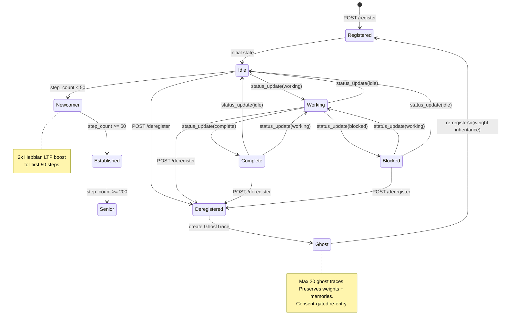
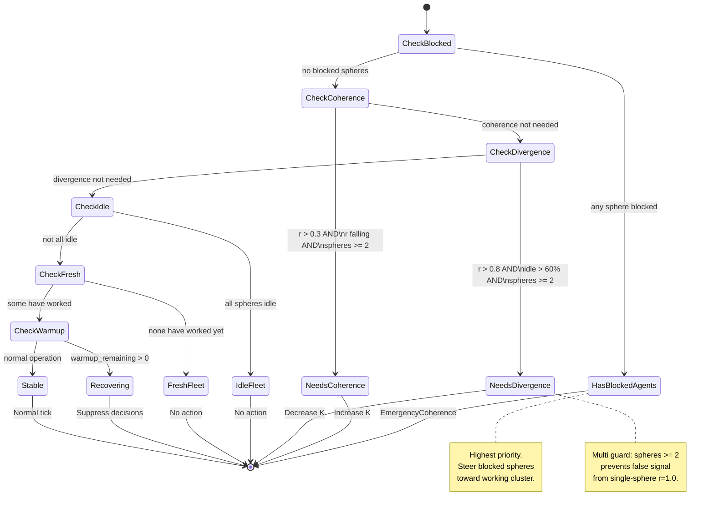
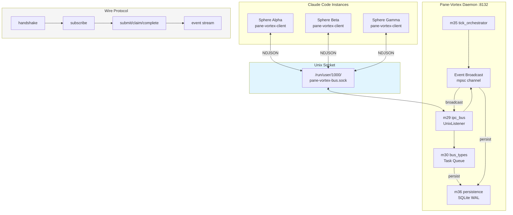

# Pane-Vortex V2 — Architecture Schematics

> 6 Mermaid diagrams covering the core architectural views.
> See also: `[[Session 036 — Complete Architecture Schematics]]` for 60+ V1 diagrams.

---

## 1. Tick Orchestrator (5 Phases)

The tick loop runs every 5 seconds and passes through 5 sequential phases:



---

## 2. Module Dependency Graph (8 Layers)

Strict downward-only dependency flow between layers:



---

## 3. Sphere Lifecycle FSM

State transitions for a PaneSphere from registration to deregistration:



---

## 4. Decision Engine FSM

The conductor decision priority chain:



---

## 5. Bridge Data Flow

How external services connect to PV through the consent gate:

```mermaid
flowchart LR
    subgraph External["External Services"]
        SX["SYNTHEX :8090<br>Cerebral Cortex"]
        NX["Nexus :8100<br>Basal Ganglia"]
        ME["ME :8080<br>Autonomic NS"]
        PO["POVM :8125<br>Spinal Cord"]
        RM["RM :8130<br>Prefrontal Cortex"]
        VM["VMS :8120<br>Hippocampus"]
    end

    subgraph Bridges["L6: Bridge Modules"]
        B22["m22<br>synthex_bridge"]
        B23["m23<br>nexus_bridge"]
        B24["m24<br>me_bridge"]
        B25["m25<br>povm_bridge"]
        B26["m26<br>rm_bridge"]
        B27["m27<br>vms_bridge"]
    end

    subgraph Gate["L6: Consent Gate"]
        B28["m28<br>consent_gate<br>k_mod budget<br>[0.85, 1.15]"]
    end

    subgraph Core["L7: Conductor"]
        COND["m31 conductor<br>PI controller<br>gain=0.15"]
    end

    SX <-->|thermal| B22
    NX <-->|strategy| B23
    ME -->|fitness| B24
    PO <--|snapshots| B25
    RM <--|TSV| B26
    VM <--|memory| B27

    B22 -->|k_adj| B28
    B23 -->|k_adj| B28
    B24 -->|k_adj| B28

    B28 -->|consent-scaled<br>k_mod_total| COND

    COND -->|effective_K| FIELD["L4: Coupling<br>Network"]

    style Gate fill:#ffcdd2
    style Core fill:#c8e6c9
```

---

## 6. IPC Bus Architecture

Unix domain socket bus with NDJSON wire protocol:



---

## Cross-References

- **[ARCHITECTURE_DEEP_DIVE.md](ARCHITECTURE_DEEP_DIVE.md)** — Detailed architecture narrative
- **[STATE_MACHINES.md](STATE_MACHINES.md)** — FSM formal definitions
- **[MESSAGE_FLOWS.md](MESSAGE_FLOWS.md)** — Sequence diagrams
- **[CODE_MODULE_MAP.md](CODE_MODULE_MAP.md)** — Module-level details
- **Obsidian:** `[[Session 036 — Complete Architecture Schematics]]` (60+ V1 Mermaid diagrams)
- **Obsidian:** `[[Session 039 — Architectural Schematics and Refactor Safety]]` (tick decomposition)
- **Obsidian:** `[[Pane-Vortex System Schematics — Session 027c]]` (V1 system schematics)
