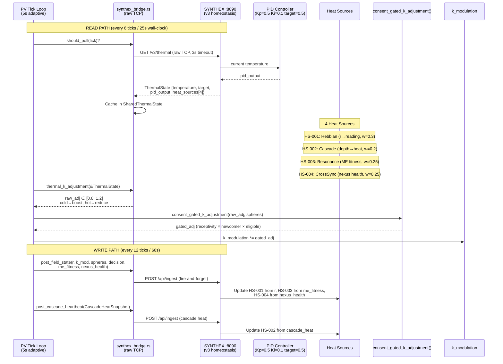
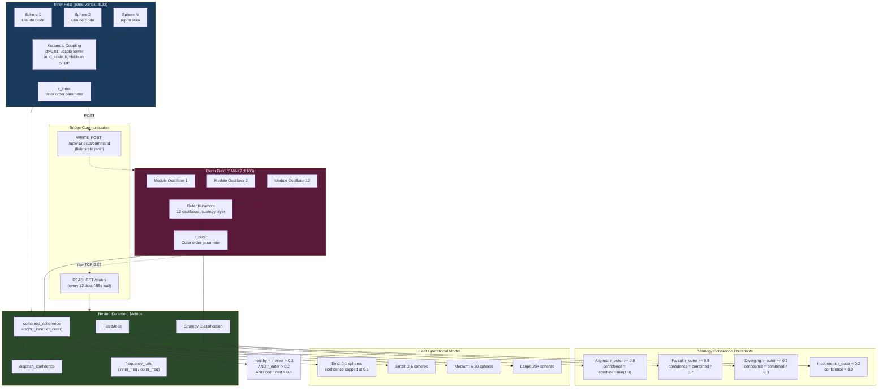
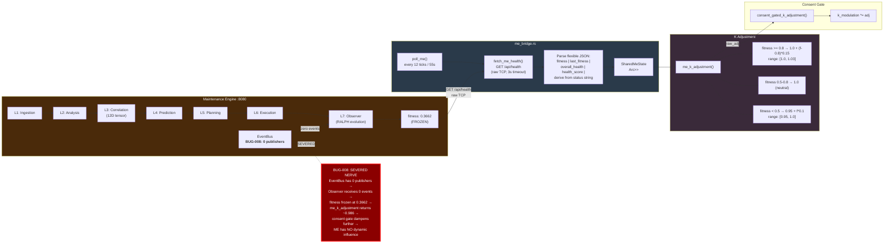
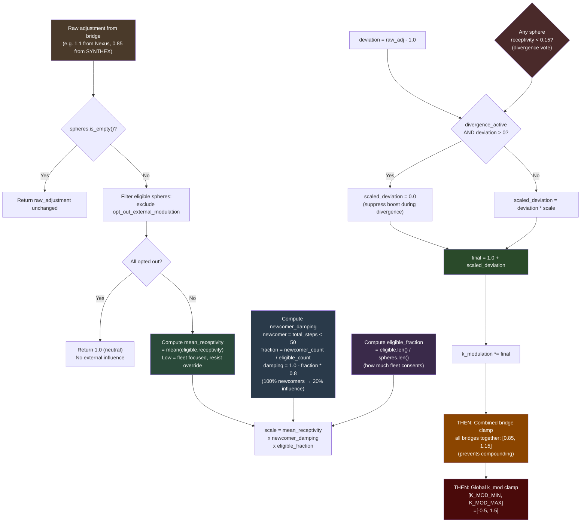
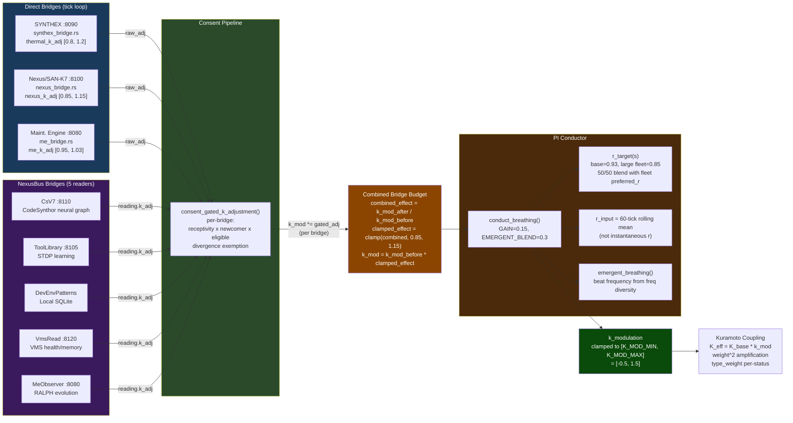
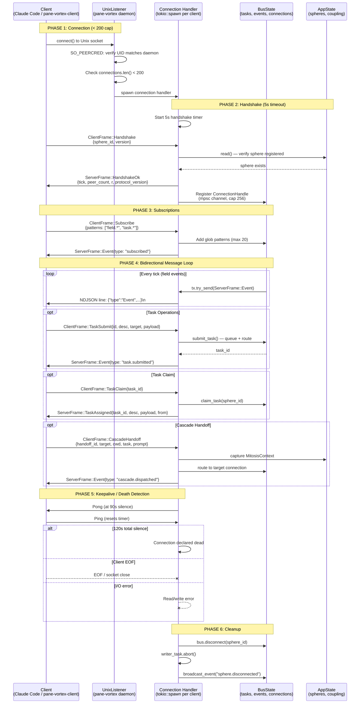
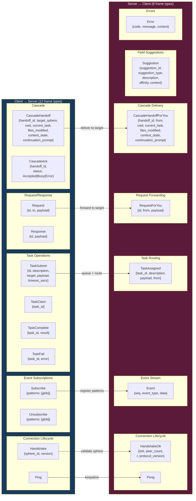
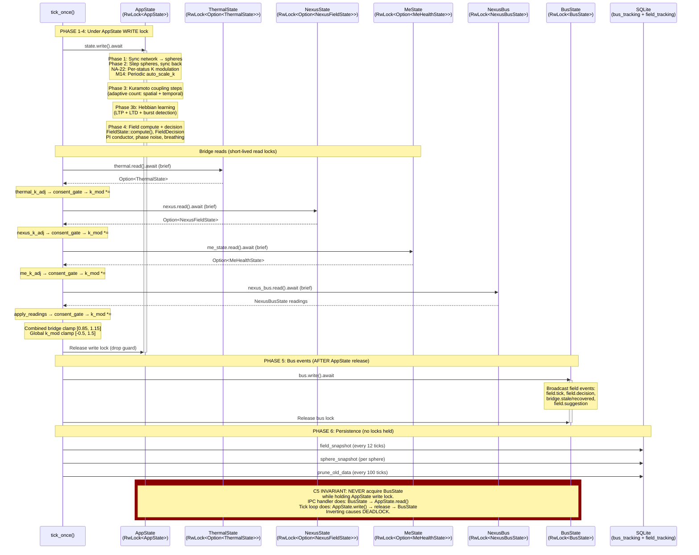
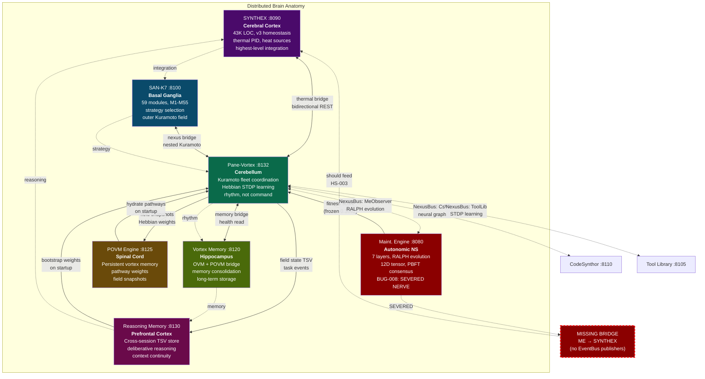
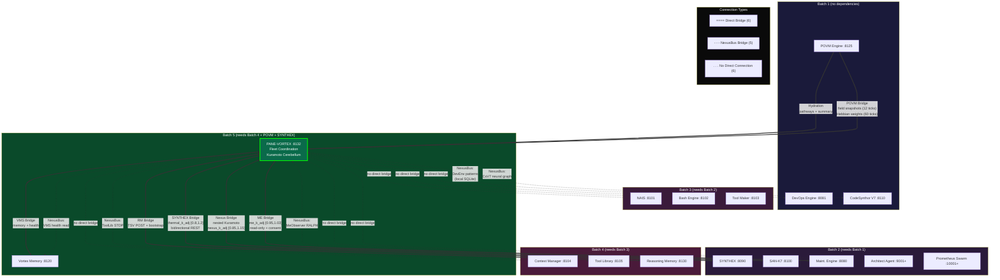

# Schematics: Bridges and Wiring

> **10 architecture diagrams** covering the full bridge topology, consent pipeline,
> wire protocol, lock ordering, and distributed brain anatomy of pane-vortex.
>
> **Companion to:** `ai_docs/SCHEMATICS.md` (field-layer diagrams)
> **Source of truth:** `src/synthex_bridge.rs`, `src/nexus_bridge.rs`, `src/me_bridge.rs`,
> `src/povm_bridge.rs`, `src/conductor.rs`, `src/bus.rs`, `src/ipc.rs`, `src/main.rs`
> **Cross-refs:** `ai_specs/API_SPEC.md`, `ai_specs/IPC_BUS_SPEC.md`, `ai_specs/WIRE_PROTOCOL_SPEC.md`

---

## 1. SYNTHEX Thermal Bridge Wiring

The SYNTHEX thermal bridge is a bidirectional link between pane-vortex and the SYNTHEX v3
homeostasis system (port 8090). The **read path** polls `/v3/thermal` every 6 ticks (30s) or
25s wall-clock (whichever fires first), extracting temperature, PID output, and 4 heat sources.
The **write path** pushes field state to `/api/ingest` every 12 ticks (60s). The thermal
deviation drives a linear K adjustment in `[0.8, 1.2]`: cold boosts coupling, hot reduces it.

The PID controller inside SYNTHEX operates at `Kp=0.5, Ki=0.1, target=0.5` and feeds 4 heat
sources that pane-vortex influences: HS-001 (Hebbian/field r), HS-002 (Cascade activity),
HS-003 (ME Resonance/fitness), and HS-004 (CrossSync/nexus health).

**Key constraints:**
- `thermal_k_adjustment` is a simple linear interpolation: `(1.0 - deviation * 0.2).clamp(0.8, 1.2)`
- The raw adjustment always passes through `consent_gated_k_adjustment` before touching `k_modulation`
- Wall-clock fallback (`THERMAL_POLL_WALL_SECS=25`) ensures polling at adaptive tick intervals (1s/5s/15s)
- `is_stale()` threshold is 60s -- stale readings are skipped in the tick loop
- BUG-034g: Do NOT call `writer.shutdown()` on the TCP half -- causes axum to drop connection

**Spec refs:** `ai_specs/API_SPEC.md` (SYNTHEX endpoints), `src/synthex_bridge.rs` (full implementation)

---

## 2. Nexus Nested Kuramoto (Inner / Outer)

Pane-vortex operates a **two-layer nested Kuramoto field**. The inner field (PV) contains up
to 200 spheres representing Claude Code instances, producing `r_inner`. The outer field
(SAN-K7 / NexusForge at port 8100) contains 12 oscillators representing strategic modules,
producing `r_outer`. The combined coherence is the geometric mean: `sqrt(r_inner * r_outer)`.

Strategy classification drives dispatch confidence: Aligned (r>=0.8) dispatches confidently,
Incoherent (r<0.2) pauses dispatch entirely. FleetMode qualifies interpretation -- a single
sphere always has r=1.0 (self-coherent) which is NOT fleet-coherent, so Solo mode caps
dispatch_confidence at 0.5.

**Key constraints:**
- `NestedKuramotoMetrics::compute()` is the single function that produces all derived metrics
- Solo mode cap prevents trivial self-coherence from being misinterpreted as fleet alignment
- The `nexus_k_adjustment()` function maps strategy to raw multiplier: Aligned=1.1, Partial=1.0, Diverging=0.9, Incoherent=0.85
- Frequency ratio (8.4) detects inter-scale tempo mismatches when both fields report mean frequency
- Supports dual-schema parsing: NexusForge native schema OR SAN-K7 `/status` with proxy field mapping

**Spec refs:** `src/nexus_bridge.rs` (full implementation), `ai_specs/KURAMOTO_FIELD_SPEC.md`

---

## 3. ME Bridge + BUG-008 Path

The Maintenance Engine (port 8080) is a 7-layer architecture with 12D tensors, PBFT consensus,
and RALPH evolution. Layer 7 (Observer) produces a fitness score. The ME bridge reads this via
`GET /api/health`, extracts fitness, and computes a narrow K adjustment in `[0.95, 1.03]` --
deliberately conservative because the ME has an advisory (not controlling) role.

**BUG-008** is the severed nerve: the ME's `EventBus` has zero publishers, so its Observer layer
receives no events and the fitness score is frozen at 0.3662 (the initial calibration value).
The bridge reads this stale fitness, derives a neutral-to-slightly-reduced K adjustment,
and the consent gate further dampens it. The ME effectively has no dynamic influence.

**Key constraints:**
- ME K adjustment range is deliberately narrow: `[0.95, 1.03]` (advisory role)
- Flexible JSON parsing handles variable ME response schemas (4 fallback fitness fields)
- `is_stale()` threshold is 120s (2 x 55s poll interval + margin)
- PG-12 mandate: ME bridge routes through `consent_gated_k_adjustment` for NA compliance
- BUG-008 fix requires wiring ME EventBus publishers -- the bridge code is correct, the problem is upstream

**Spec refs:** `src/me_bridge.rs`, `ai_specs/API_SPEC.md`, Obsidian `[[The Maintenance Engine V2]]`

---

## 4. Consent Gate Pipeline

Every external bridge influence on `k_modulation` passes through `consent_gated_k_adjustment()`.
This function implements 5 consent mechanisms that together ensure the fleet is never overridden
by external systems without the spheres' collective agreement. The function lives in
`src/nexus_bridge.rs` but is used by ALL bridges (SYNTHEX, Nexus, ME, NexusBus).

**Key constraints:**
- NA-GAP-1: Mean receptivity scales influence -- focused fleet (low receptivity) resists external override
- NA-GAP-2: `opt_out_external_modulation` flag excludes spheres from the eligible pool
- NA-GAP-3: Divergence exemption -- positive boost (deviation > 0) is suppressed when any sphere votes divergence (receptivity < 0.15)
- NA-GAP-4: Low mean receptivity naturally dampens because it multiplies the deviation
- NA-GAP-5: Newcomer protection -- fleets with many new spheres (< 50 steps) get dampened influence (down to 20%)
- Combined bridge budget `[0.85, 1.15]` is applied AFTER all individual bridge adjustments
- Global clamp `[K_MOD_MIN, K_MOD_MAX]` = `[-0.5, 1.5]` is the final backstop

**Spec refs:** `src/nexus_bridge.rs:705-757` (consent_gated_k_adjustment), `src/main.rs:794-877` (bridge application)

---

## 5. All-Bridge Combined Influence into Conductor

Six bridges feed into the consent gate, which feeds into the conductor's PI controller, which
governs `k_modulation` and thereby the Kuramoto coupling strength. Three bridges are polled
directly by the tick loop (SYNTHEX, Nexus, ME), and five additional bridges are managed by
the NexusBus subsystem (CsV7, ToolLibrary, DevEnvPatterns, VmsRead, MeObserver). The combined
effect of all bridges is clamped to `[0.85, 1.15]` per tick to prevent compounding.

**Key constraints:**
- Order matters: direct bridges (SYNTHEX, Nexus, ME) are applied first, then NexusBus readings
- k_mod_before_bridges is captured BEFORE any bridge adjustment, used as baseline for budget clamp
- The combined effect `[0.85, 1.15]` prevents the scenario where 8 bridges each pushing 1.1 yields 1.1^8 = 2.14
- After budget clamp, the conductor's `conduct_breathing()` further adjusts k_mod toward `r_target`
- NA-P-5: Conductor suppresses coherence-boosting when any sphere has receptivity < 0.15 (divergence vote)
- 4.6: Bridge adjustment values are stored in `BridgeAdjustments` for narrative attribution via `/sphere/{id}/narrative`

**Spec refs:** `src/main.rs:794-877` (bridge section), `src/conductor.rs` (PI controller), `src/nexus_bus/mod.rs` (NexusBus apply)

---

## 6. Unix Socket Connection Lifecycle

The IPC bus uses a Unix domain socket at `$XDG_RUNTIME_DIR/pane-vortex-bus.sock` with owner-only
permissions (0700). Each Claude Code instance connects, authenticates via handshake, subscribes
to event patterns, and enters a bidirectional message loop. The connection lifecycle includes
timeouts at every stage: 5s handshake, 90s keepalive, 120s dead detection.

**Key constraints:**
- SO_PEERCRED UID check: only the same user can connect (security hardening)
- Connection cap: 200 max (prevents O(N^2) memory exhaustion)
- Handshake timeout: 5s (`HANDSHAKE_TIMEOUT_SECS`)
- Keepalive: server sends Pong at 90s silence, declares dead at 120s
- Writer channel: mpsc with cap 256 -- `try_send()` drops frames when full (backpressure)
- Line length limit: 64KB per NDJSON line (DoS protection)
- C5: Lock ordering -- AppState read before BusState write in handshake validation

**Spec refs:** `ai_specs/IPC_BUS_SPEC.md`, `ai_specs/WIRE_PROTOCOL_SPEC.md`, `ai_specs/SECURITY_SPEC.md`

---

## 7. NDJSON Wire Protocol Frame Flow

The IPC bus uses NDJSON (newline-delimited JSON) over Unix sockets. Each line is a complete
JSON object tagged with `"type"`. Client frames (12 types) flow client-to-server; server
frames (8 types) flow server-to-client. Both directions are framed identically: one JSON
object per line, terminated by `\n`.

**Error codes:**
| Code | Name | Meaning |
|------|------|---------|
| 1000 | UNKNOWN_SPHERE | Sphere not registered in AppState |
| 1001 | NOT_AUTHENTICATED | First frame was not Handshake |
| 1002 | INVALID_FRAME | Malformed JSON or unknown frame type |
| 1003 | LINE_TOO_LONG | NDJSON line exceeds 64KB |
| 2000 | QUEUE_FULL | Task queue at 1000 cap |
| 2001 | TASK_NOT_FOUND | Task ID not in queue |
| 2002 | TASK_ALREADY_CLAIMED | Another sphere claimed first |
| 2003 | TASK_NOT_YOURS | Claimer mismatch on complete/fail |
| 2004 | TASK_EXPIRED | Task TTL exceeded |
| 3000 | TARGET_NOT_FOUND | Cascade/request target offline |

**Spec refs:** `ai_specs/WIRE_PROTOCOL_SPEC.md`, `src/bus.rs` (frame definitions), `src/ipc.rs` (handler)

---

## 8. Lock Acquisition Sequence

The tick loop acquires locks in a strict order: AppState write lock first, then (after release)
BusState for event broadcasting. This ordering is a **critical safety invariant** (C5 in the
anti-patterns library). Inverting the order risks deadlock because the IPC handler acquires
BusState then reads AppState for sphere validation.

The tick is divided into phases: phases 1-4 operate under the AppState write lock (coupling,
Hebbian, field compute, conductor). Phase 5 (bus events) operates under BusState. Bridge polls
(SYNTHEX, Nexus, ME) use independent `Arc<RwLock>` caches and only touch AppState through the
main write lock.

**Key constraints:**
- C5 lock ordering: AppState BEFORE BusState -- NEVER invert
- Bridge state caches (thermal, nexus, me, nexus_bus) use independent `Arc<RwLock>` -- short-lived reads while holding AppState
- The IPC handler acquires BusState first, then AppState read -- this is safe because tick_once releases AppState before acquiring BusState
- SQLite operations happen with NO locks held (Phase 6) -- they use their own connection pool
- SIGTERM handler: `tokio::time::timeout(5s, state.write())` -- will skip snapshot if tick loop holds lock

**Spec refs:** `ai_specs/patterns/CONCURRENCY_PATTERNS.md` (C5), `ai_specs/patterns/ASYNC_PATTERNS.md`, `src/main.rs:514+`

---

## 9. Distributed Brain Anatomy

The ULTRAPLATE service mesh forms a distributed brain, with each service playing a neurological
role. Pane-vortex (Cerebellum) coordinates the fleet through Kuramoto coupling -- it does not
command but orchestrates rhythm. The ME's severed nerve (BUG-008) means the autonomic nervous
system cannot send signals to the cerebral cortex.

**Key observations:**
- PV (Cerebellum) has 6 direct bridges: SYNTHEX, Nexus/SAN-K7, ME, POVM, RM, VMS
- PV has 5 NexusBus bridges: CsV7, ToolLibrary, DevEnvPatterns (local SQLite), VmsRead, MeObserver
- The ME's severed nerve (BUG-008) means fitness is frozen -- the autonomic system cannot signal distress
- SYNTHEX integrates all signals into its thermal PID controller -- it is the highest-level convergence point
- The RM-to-SYNTHEX path is indirect (through PV's field state push) -- there is no direct RM-SYNTHEX bridge
- POVM is strictly a persistence layer -- it stores and retrieves but does not compute

**Spec refs:** Obsidian `[[Session 036 — Complete Architecture Schematics]]`, `[[Vortex Sphere Brain-Body Architecture]]`

---

## 10. Full System Wiring (16 Services to PV)

All 16 active ULTRAPLATE services organized by startup batch (1-5). Pane-vortex sits in Batch 5
(depends on POVM Engine and SYNTHEX). The diagram shows which services PV bridges to directly
(6 bridges), which it reaches through NexusBus (5 bridges), and which it has no direct connection to.

**Service inventory (16 active):**
| Service | Port | Bridge | k_adj Range | Poll Interval |
|---------|------|--------|-------------|---------------|
| SYNTHEX | 8090 | Direct (synthex_bridge.rs) | [0.8, 1.2] | 6 ticks / 25s |
| SAN-K7 | 8100 | Direct (nexus_bridge.rs) | [0.85, 1.15] | 12 ticks / 55s |
| Maint. Engine | 8080 | Direct (me_bridge.rs) + NexusBus | [0.95, 1.03] | 12 ticks / 55s |
| POVM Engine | 8125 | Direct (povm_bridge.rs) | Write-only | 12/60 ticks |
| Reasoning Memory | 8130 | Direct (bridge.rs) | Startup + periodic | 12 ticks |
| Vortex Memory | 8120 | Direct (vms_bridge.rs) + NexusBus | Read health | Startup + poll |
| CodeSynthor V7 | 8110 | NexusBus (cs_v7.rs) | Consent-gated | 60 ticks |
| Tool Library | 8105 | NexusBus (tool_library.rs) | Consent-gated | 60 ticks |
| DevOps Engine | 8081 | NexusBus (devenv_patterns.rs) | Consent-gated | 60 ticks |

**Disabled services:** library-agent (8083), sphere-vortex (8120, VMS owns port)

**Key constraints:**
- PV depends on POVM Engine + SYNTHEX at startup (Batch 5)
- All bridge k_adjustments pass through consent gate before touching k_modulation
- Combined bridge budget clamp [0.85, 1.15] prevents compounding
- NexusBus bridges poll less frequently (60 ticks = 5 min) than direct bridges
- 3.6: Startup smoke test probes all 6 direct bridges and logs WARN for unreachable ones

**Spec refs:** `~/.config/devenv/devenv.toml` (service definitions), `CLAUDE.md` (batch ordering), `src/main.rs` (smoke test)
