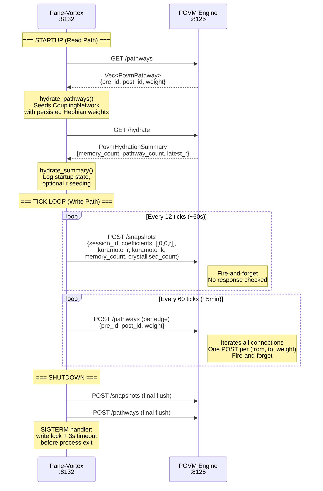
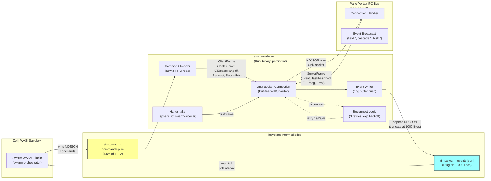
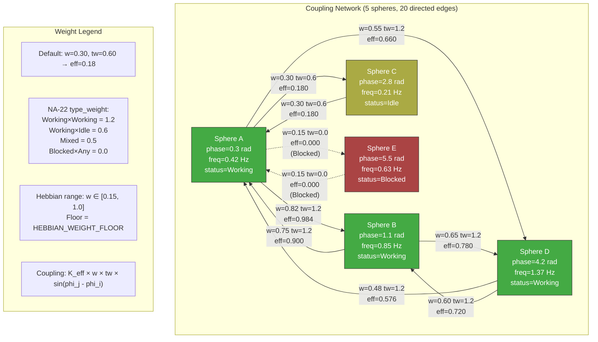
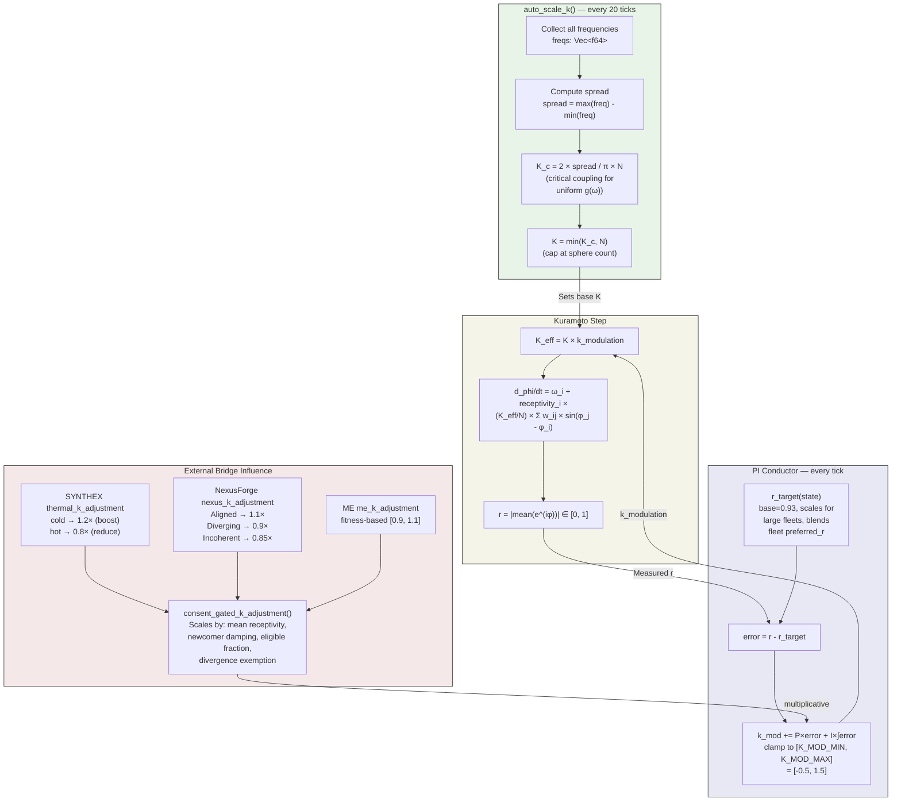
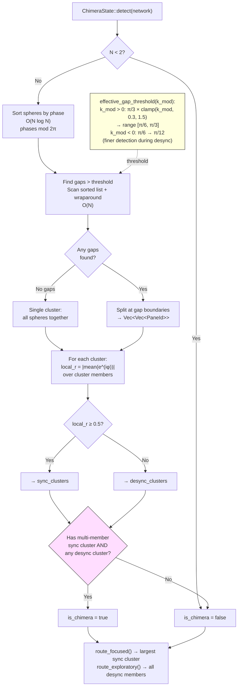
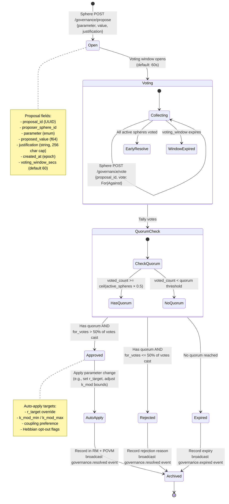
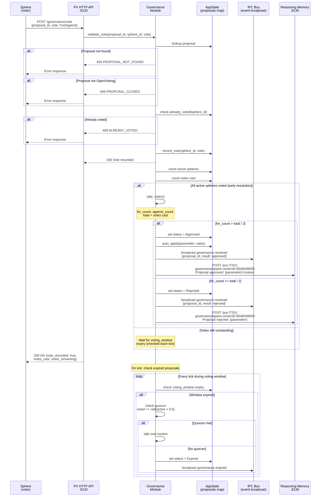
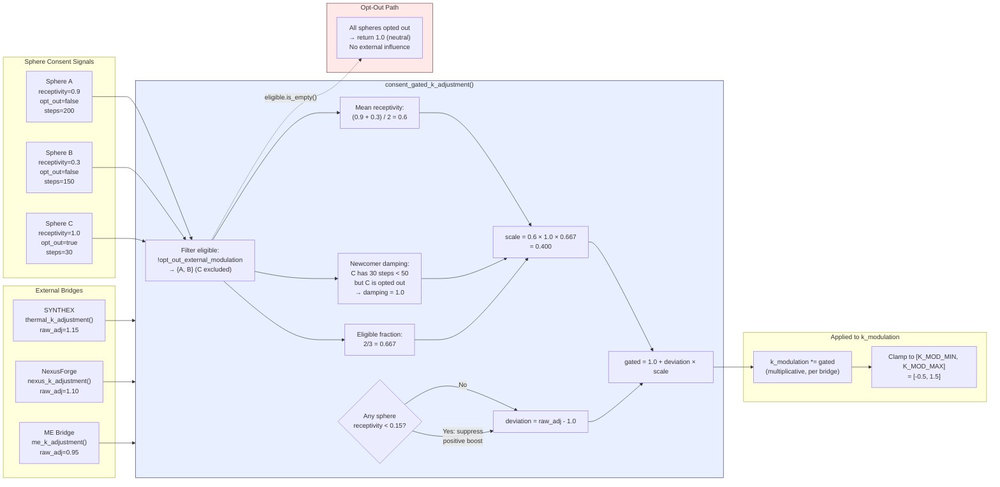
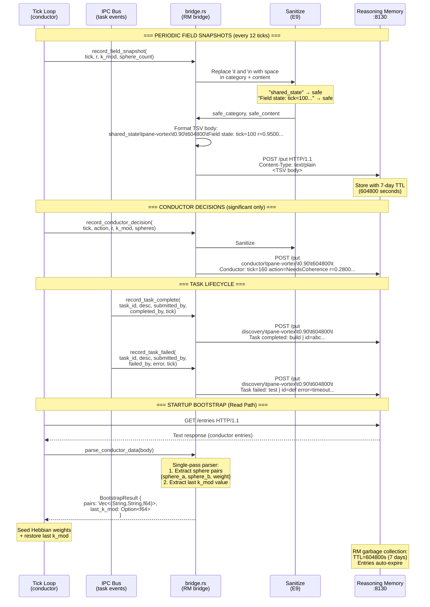

# Schematics: Field & Governance (Medium + Low Priority)

> 10 architecture diagrams covering bridge protocols, coupling topology,
> detection algorithms, phase space, governance lifecycle, and data flows.
>
> **Companion file:** `SCHEMATICS.md` (high-priority system context, module deps, tick loop, API routes, lifecycle FSMs, IPC bus, cascade flow, bridge topology, field computation)
>
> **Cross-references:** `ai_specs/KURAMOTO_FIELD_SPEC.md` | `ai_specs/IPC_BUS_SPEC.md` | `ai_specs/API_SPEC.md` | `ai_specs/DATABASE_SPEC.md` | `ai_specs/SECURITY_SPEC.md`

---

## 1. POVM Bidirectional Bridge

The POVM Engine (port 8125) provides cross-session persistence for the Kuramoto field state and Hebbian coupling weights. The bridge uses raw TCP HTTP (no client library) with fire-and-forget semantics on the write path and blocking hydration on the read path during startup only.

All constants are defined in `src/povm_bridge.rs`:
- `POVM_SYNC_INTERVAL` = 12 ticks (every ~60s at 5s/tick)
- `HEBBIAN_SYNC_MULTIPLIER` = 5 (every 60 ticks, ~5min)
- `TIMEOUT_SECS` = 3 (connect + read timeout per request)



**Key constraints:**
- Write path is fire-and-forget: POVM downtime does not affect PV operation.
- Read path runs once at startup, after RM bootstrap (Hebbian seeding order matters).
- Raw TCP HTTP avoids adding `reqwest`/`hyper` client dependencies.
- Shutdown flush uses tokio `timeout(3s)` to prevent hanging on SIGTERM.
- Address configurable via `POVM_ADDR` env var (default `127.0.0.1:8125`).

**Cross-references:** `src/povm_bridge.rs` | `ai_specs/DATABASE_SPEC.md` (field_snapshots table) | `CLAUDE.md` (POVM Bridge Details)

---

## 2. Sidecar WASM-to-Bus Bridge

The Swarm WASM plugin runs inside the Zellij WASI sandbox, which cannot hold Unix sockets. The `swarm-sidecar` Rust binary bridges the gap using filesystem intermediaries: a named FIFO pipe for commands (WASM-to-bus) and a ring-buffered JSONL file for events (bus-to-WASM).

Constants from `swarm-sidecar/src/main.rs`:
- `RING_CAP` = 1000 lines (event ring buffer)
- `MAX_RETRIES` = 3 (reconnect attempts with exponential backoff)
- `EVENTS_PATH` = `/tmp/swarm-events.jsonl`
- `COMMANDS_PATH` = `/tmp/swarm-commands.pipe`



**Key constraints:**
- WASM plugins cannot open Unix sockets (WASI limitation) -- filesystem is the only IPC channel.
- The event ring file is truncated to `RING_CAP` lines to prevent unbounded growth.
- Commands pipe is a named FIFO (`mkfifo`); sidecar reopens on EOF to handle plugin restarts.
- Sidecar subscribes to `field.*`, `task.*`, `cascade.*`, `decision.*` event patterns.
- Rate limiting on the command path: sidecar validates frame structure before forwarding.
- Graceful shutdown on SIGTERM/SIGINT writes final event and removes PID file.

**Cross-references:** `swarm-sidecar/src/main.rs` (380 LOC) | `swarm-orchestrator/src/lib.rs` (67 tests) | `src/client.rs` (Sidecar subcommand) | `ai_specs/IPC_BUS_SPEC.md`

---

## 3. Coupling Network Topology

The Kuramoto coupling network is a fully-connected directed graph where each pair of spheres has two directed edges (ordered-pair keys). Edges carry a base `weight` (Hebbian-learned, 0.0..1.0) and a `type_weight` (status-based modifier). The effective coupling is `weight * type_weight`.

An adjacency index (`adj_index: HashMap<PaneId, Vec<usize>>`) maps each sphere to its outgoing connection indices for O(degree) lookup instead of O(E) linear scan.



**Key constraints:**
- Edges use ordered-pair keys: `(from, to)` is distinct from `(to, from)` when `asymmetric_hebbian=true`.
- Default `asymmetric_hebbian=false` keeps both directions symmetric on `set_weight()`.
- New registrations create connections to ALL existing spheres (fully connected).
- `adj_index` is rebuilt on every `register()`/`deregister()` call.
- Frequency is hash-scaled: `base_freq * hash_scale` where `hash_scale` in [0.2, 2.0] with 10K bins.
- Integration uses Jacobi method: snapshot all phases, then update (no in-place mutation during step).

**Cross-references:** `src/coupling.rs` | `ai_specs/KURAMOTO_FIELD_SPEC.md` | `ai_specs/patterns/CONCURRENCY_PATTERNS.md` (CP-7: Jacobi integration)

---

## 4. Auto-K Feedback Loop

The coupling strength K is automatically scaled to maintain the system near the critical coupling threshold (Kuramoto transition). The conductor PI controller then modulates `k_modulation` to push the system sub- or supercritical depending on the field decision. External bridges (SYNTHEX, NexusForge, ME) further influence `k_modulation` through the consent gate.



**Key constraints:**
- `auto_scale_k` runs every 20 ticks (configurable), NOT every tick -- avoids K oscillation.
- K_c formula assumes uniform frequency distribution: `K_c = 2 * spread / pi * N`.
- K is capped at N to prevent runaway coupling in small fleets.
- `k_modulation` is clamped to `[K_MOD_MIN, K_MOD_MAX]` = `[-0.5, 1.5]` (authoritative values in `conductor.rs`).
- All external bridge adjustments route through `consent_gated_k_adjustment()` for NA compliance.
- The consent gate checks: receptivity, opt-out flags, newcomer protection, divergence exemption.
- Negative k_modulation produces repulsive coupling (deliberate desynchronization).

**Cross-references:** `src/coupling.rs` (auto_scale_k) | `src/conductor.rs` (K_MOD_MIN/MAX, r_target) | `src/nexus_bridge.rs` (consent_gated_k_adjustment) | `src/main.rs` (tick loop wiring)

---

## 5. Chimera Detection Algorithm

Chimera states are the coexistence of synchronized and desynchronized clusters in the same oscillator network. Detection uses the phase-gap method with adaptive gap threshold that scales with `k_modulation`.

Algorithm complexity: O(N log N) from the sort step.



**Key constraints:**
- `SYNC_THRESHOLD` = 0.5 (local order parameter threshold for sync classification).
- Gap threshold is adaptive: scales with `k_modulation` for sensitivity in different regimes.
- Negative k_mod (repulsive coupling) uses finer detection: `[pi/12, pi/6]` range.
- Single-member clusters are NOT counted as evidence for chimera (prevents false positives).
- `local_order_parameter()` uses `found.len()` as denominator (not `members.len()`), handling missing phases.
- Wraparound gap (last element to first) is explicitly computed.
- Route functions: `route_focused()` returns the largest sync cluster; `route_exploratory()` returns all desync members.

**Cross-references:** `src/chimera.rs` | `ai_specs/KURAMOTO_FIELD_SPEC.md` (chimera section) | `src/conductor.rs` (K_MOD_MIN for negative threshold branch)

---

## 6. Phase Space Visualization

The Kuramoto order parameter r measures phase coherence on the unit circle. This cannot be rendered in Mermaid (no polar coordinates), so an ASCII representation illustrates the three key regimes.

```
                    COHERENT (r → 1.0)              CHIMERA (r ~ 0.5-0.7)           INCOHERENT (r → 0)
                    Tight cluster                    Two clusters                     Uniform spread

                        ·  B                              C                               E
                      · A ·                           ·     ·                          ·       ·
                     ·  C  ·                         ·       ·                        ·    B    ·
                    ·   D   ·                    A ·           · D                   ·           ·
                    ·       ·                    B ·           · E                F ·           · A
                     ·     ·                         ·       ·                        ·    D    ·
                      ·   ·                           ·     ·                          ·       ·
                        ·                               F                               C

                    r = 0.98                         r = 0.62                         r = 0.08
                    K_eff > K_c                      K_eff ≈ K_c                     K_eff < K_c
                    All Working                      Sync: {A,B}                     Free-running
                    Decision: Stable                 Desync: {D,E,F}                 Decision: NeedsCoherence
                                                     Decision: chimera routing

    ┌──────────────────────────────────────────────────────────────────────────────────────────────┐
    │                                                                                              │
    │  ORDER PARAMETER:  r = |1/N × Σ e^(iφ_k)|     where φ_k ∈ [0, 2π)                          │
    │                                                                                              │
    │  MEAN PHASE:       ψ = arg(1/N × Σ e^(iφ_k))  (direction of centroid on unit circle)       │
    │                                                                                              │
    │  INTERPRETATION:                                                                             │
    │    r = 1.0  →  All oscillators phase-locked (identical phases)                               │
    │    r > 0.8  →  Strong synchronization (conductor may trigger NeedsDivergence if idle > 60%)  │
    │    r < 0.3  →  Weak coherence (conductor triggers NeedsCoherence if r is falling)            │
    │    r ≈ 0.0  →  Uniform distribution (maximum entropy, no coupling effect)                    │
    │                                                                                              │
    │  FIELD DECISIONS (priority chain):                                                           │
    │    HasBlockedAgents > NeedsCoherence (r>0.3, falling, ≥2 spheres)                           │
    │    > NeedsDivergence (r>0.8, idle>60%, ≥2 spheres)                                          │
    │    > IdleFleet > FreshFleet > Stable                                                         │
    │                                                                                              │
    │  R_THRESHOLDS:                                                                               │
    │    R_HIGH = 0.8    R_LOW = 0.3    R_FALLING = -0.03/tick                                    │
    │                                                                                              │
    └──────────────────────────────────────────────────────────────────────────────────────────────┘
```

**Key constraints:**
- The "multi guard" (`spheres.len() >= 2`) prevents false coherence/divergence signals from single-sphere r=1.0.
- `Recovering` is returned during warmup (5 ticks after snapshot restore).
- `FreshFleet` is returned when spheres exist but none have the `has_worked` flag set.
- r history is maintained as a VecDeque of 60 samples (`R_HISTORY_MAX`), used to compute dr/dt for falling detection.

**Cross-references:** `src/field.rs` (FieldDecision, thresholds) | `src/coupling.rs` (order_parameter) | `src/state.rs` (R_HISTORY_MAX)

---

## 7. Proposal Lifecycle FSM

The governance proposal system (NA-P-15) enables spheres to collectively decide on field parameter changes. This is a planned feature (V3.4) building on the consent gate pattern established by `consent_gated_k_adjustment()`.

Proposals target parameter changes (r_target, k_mod bounds, coupling preferences) and require quorum to resolve.



**Key constraints:**
- **STATUS: PLANNED (V3.4)** -- not yet implemented. Design based on NA-P-15 gap analysis.
- Quorum threshold: `ceil(active_spheres * 0.5)` (majority of active spheres must participate).
- Approval requires > 50% of cast votes to be `For` (simple majority).
- Voting window default: 60 seconds (configurable per proposal).
- Early resolution: if all active spheres have voted, skip waiting for window expiry.
- Each sphere may cast exactly one vote per proposal (duplicates rejected with error).
- Proposals are immutable after creation; only the voting state changes.
- Archived proposals are persisted to RM (TSV) and optionally POVM for cross-session continuity.

**Cross-references:** `CLAUDE.local.md` (V3.4 Governance phase) | `src/nexus_bridge.rs` (consent_gated_k_adjustment -- pattern to extend) | NA-P-15 gap analysis

---

## 8. Voting Quorum Flow

Detailed sequence for vote submission through resolution, showing validation checks and early-exit conditions.



**Key constraints:**
- **STATUS: PLANNED (V3.4)** -- design spec, not yet implemented.
- Vote validation order: proposal exists -> proposal is open -> sphere has not voted -> record vote.
- Early resolution triggers immediately when `votes_cast == active_sphere_count`.
- Quorum check only runs on window expiry (not on each vote, to avoid premature resolution edge case with sphere deregistration mid-vote).
- Active sphere count for quorum is computed at resolution time, not at proposal creation (handles dynamic fleet).
- RM entries use category `governance` with 7-day TTL (604800 seconds).

**Cross-references:** `src/bridge.rs` (post_reasoning_memory pattern) | `ai_specs/API_SPEC.md` (planned governance routes) | NA-P-15 gap analysis

---

## 9. Consent Declaration Data Flow

The consent gate is the central NA (Non-Anthropocentric) mechanism ensuring external bridge influences on the coupling field are proportional to fleet agreement. Every external k_modulation adjustment (from SYNTHEX thermal, NexusForge strategy, ME fitness) routes through `consent_gated_k_adjustment()`.



**Key constraints:**
- `opt_out_external_modulation` is a per-sphere boolean set via `POST /sphere/{id}/preferences`.
- Receptivity ranges from 0.0 (fully resistant) to 1.0 (fully open); set automatically by activation density (NA-14).
- Newcomer protection: spheres with `total_steps < 50` dampen external influence. At 100% newcomers, only 20% of adjustment passes through.
- Divergence exemption (NA-GAP-3): if ANY sphere has `receptivity < 0.15`, positive boosts (adj > 1.0) are suppressed to 0.0 deviation.
- Negative adjustments (reducing coupling) are never suppressed -- spheres can always request less coupling.
- Empty fleet (no spheres): raw adjustment passes through unchanged.
- Each bridge applies independently and multiplicatively to `k_modulation`.

**Cross-references:** `src/nexus_bridge.rs` (consent_gated_k_adjustment, lines 705-755) | `src/main.rs` (tick loop wiring, lines 810-848) | `src/nexus_bus/mod.rs` (NexusBus consent routing) | `src/sphere.rs` (opt_out_external_modulation field)

---

## 10. RM TSV Bridge Flow

The Reasoning Memory bridge persists field state, conductor decisions, and task lifecycle events to the Reasoning Memory service (port 8130). The wire format is **strictly TSV** (tab-separated values), never JSON. This is the most common integration mistake in the codebase.

Format: `category\tagent\tconfidence\tttl\tcontent`



**Key constraints:**
- **NEVER send JSON to RM.** The wire format is `text/plain` with TSV fields. This is the most common integration mistake (recurred 3x).
- TSV fields: `category\tagent\tconfidence\tttl\tcontent` (exactly 5 fields, tab-separated).
- E9 sanitization: all tabs and newlines in `category` and `content` are replaced with spaces before formatting.
- Agent is always `pane-vortex`. Confidence is `0.90`. TTL is `604800` (7 days).
- Categories used: `shared_state` (field snapshots), `conductor` (decisions), `discovery` (task events), `governance` (planned).
- Fire-and-forget on write path: 2-second connect timeout, errors logged at debug level.
- Bootstrap read path: bounded to 64KB response to prevent memory pressure.
- `parse_conductor_data()` is a single-pass parser extracting both sphere pairs AND last k_mod from `Conductor:` lines.
- Weight values from bootstrap are clamped to `[0.05, 1.0]`.
- Address configurable via `REASONING_MEMORY_ADDR` env var (default `127.0.0.1:8130`).

**Cross-references:** `src/bridge.rs` | `ai_specs/patterns/SERDE_PATTERNS.md` (SP-9: TSV format) | `CLAUDE.md` (Trap #4: RM is TSV, not JSON) | `ai_specs/DATABASE_SPEC.md`
