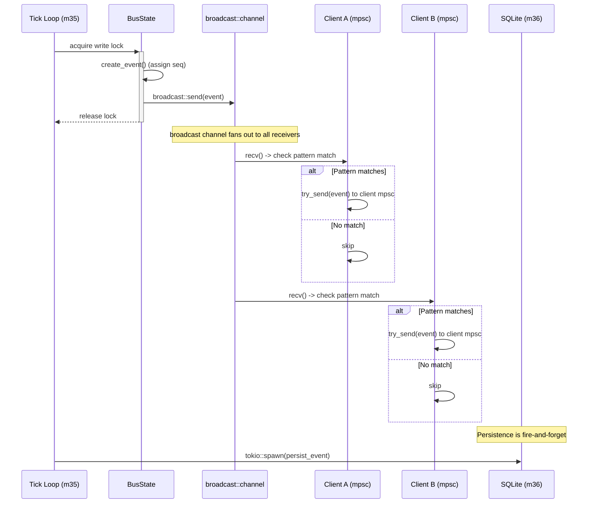

# Event System Specification

> Event generation, subscription matching, delivery, rate limiting, and persistence
> for the pane-vortex v2 IPC bus.
> Modules: m29_ipc_bus (delivery), m30_bus_types (BusEvent), m35_tick (generation), m36_persistence (SQLite)
> Schema: `.claude/schemas/bus_event.schema.json` (24 event types, 5 namespaces)
> Migration: `migrations/002_bus_tables.sql` (bus_events, event_subscriptions)
> Plan: `MASTERPLAN.md` V3.2 | Spec: `IPC_BUS_SPEC.md`, `WIRE_PROTOCOL_SPEC.md`
> v1: `pane-vortex/ai_specs/EVENT_SYSTEM_SPEC.md`

## Overview

The event system bridges the L3 Kuramoto field, L7 coordination layer, and external
bus clients. Each tick, the daemon computes field state, diffs it against the previous
state, and generates typed events. Task lifecycle changes, sphere lifecycle events,
conductor actions, and bus connection events also generate events inline.

Connected clients receive events matching their subscription patterns over the IPC
socket. All events are persisted to SQLite for audit and historical queries.

## 1. Design Principles

1. **Diff-based generation for field events**: Field events are derived from state
   differences between ticks, not raw state dumps. This minimizes payload size and
   gives clients actionable deltas.
2. **Inline generation for lifecycle events**: Task, sphere, conductor, and bus
   events are emitted at the point of state change in their respective handlers.
3. **Glob-pattern subscriptions**: Clients subscribe with simple glob patterns
   (e.g., `field.*`, `task.completed`). Pattern matching uses dot-separated segment
   comparison.
4. **Non-blocking delivery (C6)**: Event emission happens AFTER lock release via
   `tokio::spawn`. Slow clients lose events rather than blocking the tick loop.
5. **Bounded channels (C12)**: Per-connection mpsc channels with capacity 256.
   `try_send` drops events for full channels. No client can stall the system.
6. **Monotonic sequencing**: Every event carries a strictly increasing `seq` for
   gap detection by clients.

## 2. Event Types (24 types, 5 namespaces)

All event types are defined in `.claude/schemas/bus_event.schema.json`.

### 2.1 Task Events (task.*)

| Event Type | Trigger | Data Fields | Emitter |
|------------|---------|-------------|---------|
| `task.submitted` | New task enters queue | `task_id`, `source_sphere`, `target_type`, `description` | `handle_task_submit()` |
| `task.available` | Task ready for claiming (deps met) | `task_id`, `target_type`, `eligible_count` | `handle_task_submit()` or `sweep_dependencies()` |
| `task.claimed` | Sphere claims a task | `task_id`, `claimed_by` | `handle_task_claim()` |
| `task.completed` | Task completed successfully | `task_id`, `claimed_by`, `result_summary` | `handle_task_complete()` |
| `task.failed` | Task failed with error | `task_id`, `claimed_by`, `error` | `handle_task_fail()` |
| `task.expired` | Task TTL exceeded | `task_id`, `expired_phase`, `source_sphere` | `sweep_expired_tasks()` |

### 2.2 Field Events (field.*)

| Event Type | Trigger | Data Fields | Emitter |
|------------|---------|-------------|---------|
| `field.tick` | Every tick (5s) | `tick`, `r`, `sphere_count`, `k_mod` | `broadcast_field_events()` |
| `field.decision` | FieldDecision changes from previous tick | `action`, `r`, `k_mod`, `modulation_breakdown` | `broadcast_field_events()` |
| `field.sync` | `r` crosses above R_HIGH_THRESHOLD (0.8) | `r`, `tick`, `trend` | `broadcast_field_events()` |
| `field.desync` | `r` crosses below R_LOW_THRESHOLD (0.3) | `r`, `tick`, `trend` | `broadcast_field_events()` |
| `field.chimera_detected` | `is_chimera` transitions false -> true | `sync_clusters`, `desync_clusters`, `cluster_count` | `broadcast_field_events()` |
| `field.chimera_resolved` | `is_chimera` transitions true -> false | `final_r`, `tick` | `broadcast_field_events()` |

### 2.3 Conductor Events (conductor.*)

| Event Type | Trigger | Data Fields | Emitter |
|------------|---------|-------------|---------|
| `conductor.scale_k` | Auto-K recalculation (every 20 ticks) | `old_k`, `new_k`, `sphere_count`, `mean_weight` | `auto_scale_k()` in m35_tick |
| `conductor.inject_phase` | Conductor injects phase to restore coherence | `target_spheres`, `injection_strength` | `conduct_breathing()` |
| `conductor.dampen` | Conductor dampens to break over-synchronization | `dampen_factor`, `r_before` | `conduct_breathing()` |
| `conductor.cruise` | k_mod within stable band, no action needed | `k_mod`, `r`, `r_target` | `conduct_breathing()` |
| `conductor.emergency` | Emergency coherence action (r < 0.1) | `r`, `action`, `targets` | `conduct_breathing()` |

### 2.4 Sphere Events (sphere.*)

| Event Type | Trigger | Data Fields | Emitter |
|------------|---------|-------------|---------|
| `sphere.registered` | New sphere registered via API | `sphere_id`, `persona`, `phase` | `register_sphere()` in m10 API |
| `sphere.deregistered` | Sphere deregistered (voluntary or cleanup) | `sphere_id`, `ghost_created` | `deregister_sphere()` in m10 API |
| `sphere.status_change` | PaneStatus transitions (Idle->Working, etc.) | `sphere_id`, `old_status`, `new_status` | `update_sphere_status()` |
| `sphere.tunnel_formed` | Phase tunnel appears between two spheres | `sphere_a`, `sphere_b`, `overlap`, `semantic_labels` | `broadcast_field_events()` |
| `sphere.tunnel_broken` | Phase tunnel dissolves | `sphere_a`, `sphere_b` | `broadcast_field_events()` |

### 2.5 Bus Events (bus.*)

| Event Type | Trigger | Data Fields | Emitter |
|------------|---------|-------------|---------|
| `bus.connect` | IPC client completes handshake | `sphere_id`, `version`, `connection_count` | `handle_connection()` in m29 |
| `bus.disconnect` | IPC client disconnects (EOF or error) | `sphere_id`, `duration_secs`, `events_received` | Connection cleanup in m29 |

### 2.6 Namespace Summary

| Namespace | Count | Generation Pattern | Frequency |
|-----------|-------|-------------------|-----------|
| `task.*` | 6 | Inline in IPC/API handlers | Per task lifecycle event |
| `field.*` | 6 | Diff-based in tick loop | Every tick (5s) for tick; on-change for others |
| `conductor.*` | 5 | Inline in conductor module | Every 20 ticks for scale_k; on-action for others |
| `sphere.*` | 5 | Inline in API handlers + tick loop | Per sphere lifecycle event |
| `bus.*` | 2 | Inline in IPC connection handler | Per connection/disconnection |
| **Total** | **24** | | |

## 3. BusEvent Structure

```rust
/// m30_bus_types.rs
#[derive(Debug, Clone, Serialize, Deserialize)]
pub struct BusEvent {
    /// Monotonically increasing sequence number (assigned by BusState)
    pub seq: u64,
    /// Dot-separated event type (e.g., "field.tick", "task.completed")
    pub event_type: String,
    /// What generated this event (sphere ID, "tick_loop", "conductor", etc.)
    pub source: Option<String>,
    /// Tick number when the event was generated (None for non-tick events)
    pub tick: Option<u64>,
    /// Event-specific payload
    pub payload: serde_json::Value,
    /// Timestamp (assigned by BusState on creation)
    pub timestamp: chrono::DateTime<chrono::Utc>,
}
```

### 3.1 Sequence Number Assignment

Sequence numbers are assigned by `BusState` when the event is created:

```rust
/// m30_bus_types.rs
impl BusState {
    pub fn create_event(&mut self, event_type: &str, source: Option<&str>,
                        tick: Option<u64>, payload: serde_json::Value) -> BusEvent {
        self.event_seq += 1;
        BusEvent {
            seq: self.event_seq,
            event_type: event_type.to_string(),
            source: source.map(String::from),
            tick,
            payload,
            timestamp: chrono::Utc::now(),
        }
    }
}
```

Sequence numbers are:
- Strictly monotonically increasing (never reused, never decremented)
- Reset to 0 on daemon restart (clients detect restart via `welcome` frame tick)
- Unique across all event types (single counter for all namespaces)

## 4. Subscription System

### 4.1 Pattern Syntax

Clients subscribe with glob-style patterns applied to dot-separated event type strings:

| Pattern | Matches | Does Not Match |
|---------|---------|----------------|
| `field.*` | `field.tick`, `field.decision`, `field.sync` | `task.submitted`, `conductor.scale_k` |
| `task.*` | `task.submitted`, `task.claimed`, `task.expired` | `field.tick` |
| `conductor.*` | `conductor.scale_k`, `conductor.cruise` | `sphere.registered` |
| `sphere.*` | `sphere.registered`, `sphere.tunnel_formed` | `bus.connect` |
| `*` | Everything (firehose mode) | (nothing excluded) |
| `task.completed` | `task.completed` only | `task.failed`, `task.submitted` |
| `sphere.tunnel_*` | `sphere.tunnel_formed`, `sphere.tunnel_broken` | `sphere.registered` |

### 4.2 Pattern Matching Algorithm

Simple glob matching without regex overhead:

```rust
/// m30_bus_types.rs
pub fn pattern_matches(pattern: &str, event_type: &str) -> bool {
    // Firehose: match everything
    if pattern == "*" {
        return true;
    }

    // Split both by '.' and match segment-by-segment
    let pat_segs: Vec<&str> = pattern.split('.').collect();
    let evt_segs: Vec<&str> = event_type.split('.').collect();

    // Segment count must match (no ** support)
    if pat_segs.len() != evt_segs.len() {
        return false;
    }

    pat_segs.iter().zip(evt_segs.iter()).all(|(p, e)| {
        // Wildcard segment matches anything
        if *p == "*" {
            return true;
        }
        // Prefix wildcard: "tunnel_*" matches "tunnel_formed"
        if let Some(prefix) = p.strip_suffix('*') {
            return e.starts_with(prefix);
        }
        // Exact match
        *p == *e
    })
}
```

### 4.3 Subscription Wire Protocol

Clients subscribe via the `subscribe` frame (WIRE_PROTOCOL_SPEC.md, Section 1.3):

```json
{"type": "subscribe", "patterns": ["field.*", "task.*", "conductor.emergency"]}
```

Server responds:

```json
{"type": "subscribed", "patterns": ["field.*", "task.*", "conductor.emergency"], "total_subscriptions": 3}
```

### 4.4 Subscription Limits

| Limit | Value | Rationale |
|-------|-------|-----------|
| Max patterns per client | 20 | Prevent O(N*M) matching explosion |
| Max pattern length | 128 chars | Input validation (SECURITY_SPEC.md) |
| Duplicate patterns | Silently deduplicated | Idempotent subscribe |

Exceeding the pattern limit returns error code `subscription_limit`.

### 4.5 Subscription Persistence

Active subscriptions are persisted to `event_subscriptions` table in
`data/bus_tracking.db` for audit and restart recovery:

```sql
CREATE TABLE IF NOT EXISTS event_subscriptions (
    id          INTEGER PRIMARY KEY AUTOINCREMENT,
    sphere_id   TEXT NOT NULL,
    pattern     TEXT NOT NULL,
    created_at  TEXT DEFAULT (datetime('now'))
);
```

On daemon restart, subscriptions are NOT auto-restored. Clients must re-subscribe
after reconnection. The persisted data serves audit and diagnostics purposes.

## 5. Event Delivery

### 5.1 Delivery Architecture



### 5.2 Channel Architecture

The event system uses a two-tier channel architecture:

**Tier 1: broadcast::channel (BusState.event_tx)**
- Capacity: 256 (configured in `config/default.toml` `[ipc].event_buffer_size`)
- One sender owned by BusState
- One receiver per connection handler task
- Used for fan-out from tick loop to all connection handlers

**Tier 2: Per-connection mpsc (ConnectionHandle.tx)**
- Capacity: 256
- One sender per connection handler (filters events by subscription pattern)
- One receiver per connection writer task (serializes to NDJSON)
- Used for pattern-filtered delivery to individual clients

```rust
/// m29_ipc_bus.rs — connection handler event loop
async fn connection_event_loop(
    mut event_rx: broadcast::Receiver<BusEvent>,
    client_tx: mpsc::Sender<BusEvent>,
    patterns: &[String],
) {
    loop {
        match event_rx.recv().await {
            Ok(event) => {
                if patterns.iter().any(|p| pattern_matches(p, &event.event_type)) {
                    // Non-blocking send; drop if client is slow
                    if client_tx.try_send(event).is_err() {
                        // Client channel full — event dropped
                        // Increment drop counter (logged in digest)
                    }
                }
            }
            Err(broadcast::error::RecvError::Lagged(n)) => {
                // broadcast channel overflowed — n events lost
                // Log warning, continue
            }
            Err(broadcast::error::RecvError::Closed) => break,
        }
    }
}
```

### 5.3 Event Emission Timing (C6: AFTER Lock Release)

All events are emitted AFTER the originating lock is released. This is design
constraint C6 from DESIGN_CONSTRAINTS.md, preventing deadlock between AppState
and BusState:

```rust
/// m35_tick.rs — correct emission pattern
async fn tick_once(app_state: &SharedState, bus_state: &SharedBusState, ...) {
    // Phase 2: Mutations under AppState write lock
    let (field, decision, events_to_emit) = {
        let mut app = app_state.write().await;
        // ... compute field, decision, collect events ...
        let events = collect_field_events(&app, &prev_field);
        (field, decision, events)
    }; // AppState lock DROPPED here

    // Phase 3: Event emission under BusState write lock
    {
        let mut bus = bus_state.write().await;
        for event_data in events_to_emit {
            let event = bus.create_event(
                &event_data.event_type,
                event_data.source.as_deref(),
                Some(event_data.tick),
                event_data.payload,
            );
            let _ = bus.event_tx.send(event.clone());
        }
    } // BusState lock DROPPED here

    // Phase 4: Persistence (no lock needed)
    tokio::spawn(async move {
        persist_batch_events(&dbs, &events_to_emit).await;
    });
}
```

**NEVER emit events while holding AppState lock.** The broadcast channel receiver
in each connection handler may attempt to acquire BusState, creating a potential
AB-BA deadlock if AppState is still held.

## 6. Rate Limiting

### 6.1 Server-Side Rate Control

| Mechanism | Target | Limit | Action on Exceed |
|-----------|--------|-------|-----------------|
| broadcast::channel capacity | Tick loop -> connection handlers | 256 events buffered | `RecvError::Lagged(n)` — n events lost |
| Per-connection mpsc try_send | Connection handler -> client writer | 256 events buffered | Event dropped for that client |
| Drop counter + digest | Per-connection tracking | N/A | 30s digest log message |
| Subscription limit | Per-client patterns | 20 patterns | Error frame returned |
| Frame rate limit | Per-connection inbound | 100 frames/second | WIRE_PROTOCOL_SPEC.md rate limit |

### 6.2 Drop Counter and 30-Second Digest

Each connection tracks the number of dropped events:

```rust
/// m29_ipc_bus.rs
struct ConnectionMetrics {
    events_delivered: u64,
    events_dropped: u64,
    last_digest_at: Instant,
}

impl ConnectionMetrics {
    fn record_drop(&mut self) {
        self.events_dropped += 1;
    }

    /// Called every tick. Returns digest if 30s elapsed and drops > 0.
    fn maybe_digest(&mut self) -> Option<DropDigest> {
        if self.last_digest_at.elapsed() >= Duration::from_secs(30)
            && self.events_dropped > 0
        {
            let digest = DropDigest {
                events_dropped: self.events_dropped,
                events_delivered: self.events_delivered,
                period_secs: 30,
            };
            self.events_dropped = 0;
            self.events_delivered = 0;
            self.last_digest_at = Instant::now();
            Some(digest)
        } else {
            None
        }
    }
}
```

When a digest is generated, the server sends it to the client as a special event:

```json
{
  "type": "event",
  "event_type": "bus._digest",
  "data": {
    "events_dropped": 12,
    "events_delivered": 244,
    "period_secs": 30,
    "drop_rate_pct": 4.7
  }
}
```

The `bus._digest` event type uses an underscore prefix to indicate it is a system
event, not a user-subscribable namespace. It is always delivered regardless of
subscription patterns.

### 6.3 Client-Side Gap Detection

Clients detect dropped events via the monotonic `seq` field:

```rust
// Client-side pseudocode
let mut expected_seq = 0;
loop {
    let event = read_event().await?;
    if event.seq > expected_seq + 1 {
        let gap = event.seq - expected_seq - 1;
        warn!("{gap} events missed (seq {expected_seq}..{event_seq})");
        // Re-sync: query HTTP for authoritative state
        resync_from_http().await?;
    }
    expected_seq = event.seq;
}
```

### 6.4 Sidecar Backpressure (Token Bucket)

The swarm sidecar (`swarm-sidecar`) connects to the PV bus and forwards events to
WASM agents. It implements a token bucket to prevent event flooding:

| Parameter | Value | Source |
|-----------|-------|--------|
| Bucket capacity | 50 events | Sidecar config |
| Refill rate | 10 events/second | Sidecar config |
| Overflow action | Drop + log | Sidecar internals |

When the sidecar's bucket is empty, events are dropped with a log warning. The
sidecar subscribes to `field.decision` and `task.*` only (not `field.tick` which
fires every 5s and would exhaust the bucket).

## 7. Event Generation

### 7.1 Field Events (Diff-Based)

Field events are generated by comparing the current FieldState against the previous
state cached in AppState:

```rust
/// m35_tick.rs
fn collect_field_events(
    current: &FieldState,
    previous: &FieldState,
    decision: &FieldDecision,
    prev_decision: &Option<FieldDecision>,
    tick: u64,
) -> Vec<PendingEvent> {
    let mut events = Vec::new();

    // field.tick: always generated
    events.push(PendingEvent {
        event_type: "field.tick".into(),
        source: Some("tick_loop".into()),
        tick,
        payload: json!({
            "tick": tick,
            "r": current.order_parameter.r,
            "sphere_count": current.sphere_count,
            "k_mod": current.k_modulation,
        }),
    });

    // field.decision: only on change
    let decision_changed = prev_decision.as_ref()
        .map_or(true, |prev| prev.action != decision.action);
    if decision_changed {
        events.push(PendingEvent {
            event_type: "field.decision".into(),
            source: Some("tick_loop".into()),
            tick,
            payload: json!({
                "action": format!("{:?}", decision.action),
                "r": current.order_parameter.r,
                "k_mod": current.k_modulation,
                "modulation_breakdown": decision.modulation_breakdown,
            }),
        });
    }

    // field.sync: r crosses above R_HIGH_THRESHOLD
    if current.order_parameter.r >= R_HIGH_THRESHOLD
        && previous.order_parameter.r < R_HIGH_THRESHOLD
    {
        events.push(PendingEvent {
            event_type: "field.sync".into(),
            source: Some("tick_loop".into()),
            tick,
            payload: json!({ "r": current.order_parameter.r, "tick": tick, "trend": "rising" }),
        });
    }

    // field.desync: r crosses below R_LOW_THRESHOLD
    if current.order_parameter.r <= R_LOW_THRESHOLD
        && previous.order_parameter.r > R_LOW_THRESHOLD
    {
        events.push(PendingEvent {
            event_type: "field.desync".into(),
            source: Some("tick_loop".into()),
            tick,
            payload: json!({ "r": current.order_parameter.r, "tick": tick, "trend": "falling" }),
        });
    }

    // field.chimera_detected: transition false -> true
    if current.chimera.is_chimera && !previous.chimera.is_chimera {
        events.push(PendingEvent {
            event_type: "field.chimera_detected".into(),
            source: Some("tick_loop".into()),
            tick,
            payload: json!({
                "sync_clusters": current.chimera.sync_cluster_count,
                "desync_clusters": current.chimera.desync_cluster_count,
                "cluster_count": current.chimera.total_clusters,
            }),
        });
    }

    // field.chimera_resolved: transition true -> false
    if !current.chimera.is_chimera && previous.chimera.is_chimera {
        events.push(PendingEvent {
            event_type: "field.chimera_resolved".into(),
            source: Some("tick_loop".into()),
            tick,
            payload: json!({ "final_r": current.order_parameter.r, "tick": tick }),
        });
    }

    events
}
```

### 7.2 Lifecycle Events (Inline)

Task, sphere, conductor, and bus events are generated inline at the point of
state change. Examples:

**Task event in IPC handler:**
```rust
/// m29_ipc_bus.rs
async fn handle_task_submit(bus_state: &SharedBusState, frame: SubmitFrame, sender: &PaneId) {
    let task_id = {
        let mut bus = bus_state.write().await;
        let task = bus.insert_task(frame, sender)?;
        let task_id = task.id.clone();

        // Create event while holding lock (seq assignment needs lock)
        let event = bus.create_event("task.submitted", Some(sender), None, json!({
            "task_id": &task_id,
            "source_sphere": sender,
            "target_type": &task.target_type,
            "description": &task.description,
        }));
        let _ = bus.event_tx.send(event);
        task_id
    }; // Lock released

    // Persist fire-and-forget (C14)
    tokio::spawn(async move { persist_task(&dbs, &task_id).await; });
}
```

**Sphere event in API handler:**
```rust
/// m10_api_server.rs
async fn register_sphere(app_state: &SharedState, bus_state: &SharedBusState, body: RegisterBody) {
    // Phase 1: Mutation under AppState lock
    {
        let mut app = app_state.write().await;
        app.spheres.insert(body.id.clone(), PaneSphere::new(body));
    } // AppState lock released

    // Phase 2: Event under BusState lock (C5: AppState before BusState)
    {
        let mut bus = bus_state.write().await;
        let event = bus.create_event("sphere.registered", Some(&body.id), None, json!({
            "sphere_id": &body.id,
            "persona": &body.persona,
            "phase": body.initial_phase,
        }));
        let _ = bus.event_tx.send(event);
    } // BusState lock released
}
```

## 8. Event Persistence

### 8.1 Storage Schema

Events are persisted to the `bus_events` table in `data/bus_tracking.db`:

```sql
-- migrations/002_bus_tables.sql
CREATE TABLE IF NOT EXISTS bus_events (
    id              INTEGER PRIMARY KEY AUTOINCREMENT,
    event_type      TEXT NOT NULL,
    source_sphere   TEXT,
    data            TEXT,       -- JSON event payload
    tick            INTEGER,
    created_at      TEXT DEFAULT (datetime('now'))
);

CREATE INDEX IF NOT EXISTS idx_bus_events_type ON bus_events(event_type);
CREATE INDEX IF NOT EXISTS idx_bus_events_tick ON bus_events(tick);
```

### 8.2 Batch Persistence

Events are not written one-by-one. Instead, they are batched for efficiency:

```rust
/// m36_persistence.rs
pub async fn persist_batch_events(db: &Connection, events: &[BusEvent]) -> PvResult<()> {
    let mut stmt = db.prepare_cached(
        "INSERT INTO bus_events (event_type, source_sphere, data, tick) VALUES (?1, ?2, ?3, ?4)"
    )?;

    for event in events {
        stmt.execute(params![
            &event.event_type,
            &event.source,
            serde_json::to_string(&event.payload).unwrap_or_default(),
            event.tick,
        ])?;
    }

    Ok(())
}
```

**Batch triggers:**
- Every 10 events accumulated in the persistence buffer
- Every 30 seconds (timer-based flush), whichever comes first
- On graceful shutdown (drain buffer)

### 8.3 Retention Policy

| Retention | Value | Strategy |
|-----------|-------|----------|
| Max rows | 10,000 | Oldest pruned on batch write when exceeded |
| Max age | 7 days | Pruned every 100 ticks (~8 minutes) |

```sql
-- Prune events older than 7 days
DELETE FROM bus_events WHERE created_at < datetime('now', '-7 days');

-- Prune to 10K rows (keep newest)
DELETE FROM bus_events WHERE id NOT IN (
    SELECT id FROM bus_events ORDER BY id DESC LIMIT 10000
);
```

### 8.4 Event Query API

Historical events are queryable via HTTP:

```
GET /bus/events?type=task.completed&limit=100&since_tick=500
```

| Parameter | Type | Default | Description |
|-----------|------|---------|-------------|
| type | string | (all) | LIKE filter on event_type |
| limit | integer | 100 | Max results (max 1000) |
| since_tick | integer | 0 | Only events at or after this tick |
| source | string | (all) | Filter by source sphere |

Response:
```json
{
  "events": [
    {
      "id": 42,
      "event_type": "task.completed",
      "source_sphere": "sphere-alpha-01",
      "data": {"task_id": "a1b2c3d4", "claimed_by": "sphere-beta-02"},
      "tick": 512,
      "created_at": "2026-03-19T14:30:00"
    }
  ],
  "total": 1,
  "has_more": false
}
```

## 9. Backpressure

### 9.1 Backpressure Points

```
Tick Loop
   |
   v
broadcast::channel (256)  <-- Tier 1 backpressure
   |
   +-- Connection Handler A
   |      |
   |      v
   |   pattern filter
   |      |
   |      v
   |   mpsc::channel (256)  <-- Tier 2 backpressure
   |      |
   |      v
   |   NDJSON writer (socket)
   |
   +-- Connection Handler B
   |      |
   |      (same structure)
   |
   +-- Sidecar
          |
          v
       token bucket (50)  <-- Tier 3 backpressure (sidecar-side)
```

### 9.2 Tier 1: Broadcast Channel Overflow

If the tick loop produces events faster than connection handlers consume them
(unlikely at 5s tick interval), the broadcast channel's `Lagged` error indicates
how many events were lost. Connection handlers log the gap and continue.

### 9.3 Tier 2: Per-Connection mpsc Overflow

The primary backpressure mechanism. When a client's mpsc channel is full (256
events buffered), `try_send` returns `Err`. The connection handler:

1. Increments the drop counter
2. Continues processing the next event (non-blocking)
3. Every 30 seconds, generates a `bus._digest` with drop statistics

**Why try_send, not send:** Using blocking `send` would cause the connection handler
to block on a slow client, which would cause the broadcast receiver to lag, which
would affect ALL other connection handlers via broadcast channel overflow. `try_send`
isolates slow clients.

### 9.4 Tier 3: Sidecar Token Bucket

See Section 6.4. The sidecar implements its own rate control independent of the
daemon. This protects WASM agents from event flooding.

### 9.5 Channel Capacity Tuning

The 256-event capacity is configured in `config/default.toml` `[ipc].event_buffer_size`.
At the default 5s tick interval:
- `field.tick` produces 1 event per tick = 12 events/minute
- `field.decision` produces 0-1 events per tick (change-based)
- Task events are bursty but bounded by queue capacity (200 tasks)
- Total steady-state: ~15-20 events/minute

256 capacity provides ~13 minutes of buffering at steady state, or ~50 seconds
under maximum burst (all 200 tasks completing simultaneously).

## 10. Reasoning Memory Bridge

Events can optionally be forwarded to the Reasoning Memory service at `:8130`:

### 10.1 Forwarded Events

Only high-value events are forwarded (to respect RM rate limits):

| Event Type | RM Category | Confidence | TTL |
|------------|-------------|------------|-----|
| `task.completed` | `task` | 0.9 | 86400 |
| `field.decision` (on change) | `field` | 0.85 | 86400 |
| `conductor.emergency` | `alert` | 0.95 | 172800 |

### 10.2 RM Format (TSV, NOT JSON)

```
event\tpane-vortex\t0.9\t86400\ttask.completed: {task_id} by {sphere_id}
```

**Maximum 1 POST per tick** (5 seconds). If multiple forwardable events occur in
the same tick, only the highest-priority one is sent.

## 11. Testing Strategy

### 11.1 Unit Tests (15 minimum)

| Test | Property |
|------|----------|
| Pattern matching: exact match (`task.completed` matches `task.completed`) | Segment equality |
| Pattern matching: wildcard segment (`field.*` matches `field.tick`) | Star expansion |
| Pattern matching: firehose (`*` matches everything) | Global wildcard |
| Pattern matching: no match (`field.*` does not match `task.submitted`) | Namespace isolation |
| Pattern matching: segment count mismatch (`field.*` does not match `field.a.b`) | Length check |
| Pattern matching: prefix wildcard (`sphere.tunnel_*` matches `sphere.tunnel_formed`) | Prefix glob |
| Sequence number monotonicity across multiple create_event calls | Monotonic seq |
| Field event generation: r crosses R_HIGH_THRESHOLD triggers field.sync | Threshold detection |
| Field event generation: chimera false->true triggers chimera_detected | Transition detection |
| Field event generation: no change between ticks generates only field.tick | Minimal events |
| Subscription limit enforcement (21st pattern rejected) | Capacity guard |
| Duplicate pattern deduplication | Idempotent subscribe |
| try_send failure increments drop counter | Backpressure accounting |
| Drop digest generated after 30s with drops > 0 | Digest timing |
| Event batch persistence roundtrip (write + read from SQLite) | Persistence correctness |

### 11.2 Integration Tests (5 minimum)

| Test | Property |
|------|----------|
| Subscribe via IPC -> trigger field change -> receive event frame | End-to-end delivery |
| Subscribe to `task.*` -> submit task -> receive `task.submitted` event | Lifecycle event delivery |
| Two subscribers with different patterns receive different events | Pattern isolation |
| Channel full -> event dropped -> seq gap detectable by client | Backpressure behavior |
| Persistence: 100 events -> query via HTTP -> all present | Batch persistence |

## 12. Anti-Patterns

1. **AP-1: Subscribing to `*` when you only need task events.** Over-broad
   subscriptions waste channel capacity and increase drop risk. Subscribe to the
   narrowest pattern that covers your needs.

2. **AP-2: Generating events inside AppState lock.** Events must be generated
   from field state (AppState), collected into a Vec, then dispatched under BusState
   lock AFTER AppState is released. Violating this inverts lock ordering (C5/C6).

3. **AP-3: Relying on event delivery for correctness.** Events can be dropped.
   Use them for optimization (avoid polling), not for state consistency. Always
   fall back to HTTP queries for authoritative state.

4. **AP-4: Storing event history in BusState.** In-memory events are fire-and-forget
   via broadcast channel. Persistent history lives in SQLite (`bus_events` table).
   Never grow an in-memory event log.

5. **AP-5: High-frequency field events without thresholds.** The R_HIGH/R_LOW
   threshold crossings and chimera transitions prevent event storms. Do not emit
   field events on every minor r fluctuation.

6. **AP-6: Blocking in event handler.** All event processing must be async and
   non-blocking. A blocking handler in one connection stalls event delivery to
   that client and may cause broadcast channel lag.

7. **AP-7: Sending JSON to Reasoning Memory.** RM accepts TSV only. Sending JSON
   causes silent failures (RM returns 200 but does not store).

## 13. Cross-References

| Document | Relationship |
|----------|-------------|
| [IPC_BUS_SPEC.md](IPC_BUS_SPEC.md) | Bus architecture, BusState, subscription storage |
| [WIRE_PROTOCOL_SPEC.md](WIRE_PROTOCOL_SPEC.md) | Event frame format (Section 1.7) |
| [TASK_QUEUE_SPEC.md](TASK_QUEUE_SPEC.md) | task.* event generation triggers |
| [CONSENT_SPEC.md](CONSENT_SPEC.md) | Sphere observation opt-out (accept_observation) |
| [DATABASE_SPEC.md](DATABASE_SPEC.md) | bus_events table, retention policy |
| [DESIGN_CONSTRAINTS.md](DESIGN_CONSTRAINTS.md) | C6 (emit after lock release), C12 (bounded channels) |
| [KURAMOTO_FIELD_SPEC.md](KURAMOTO_FIELD_SPEC.md) | Field state used for diff-based event generation |
| [SECURITY_SPEC.md](SECURITY_SPEC.md) | Input validation on subscription patterns |
| [API_SPEC.md](API_SPEC.md) | GET /bus/events HTTP query endpoint |
| [layers/L7_COORDINATION_SPEC.md](layers/L7_COORDINATION_SPEC.md) | m29-m36 module context |
| [patterns/ASYNC_PATTERNS.md](patterns/ASYNC_PATTERNS.md) | tokio::spawn for fire-and-forget emission |
| [patterns/IPC_PATTERNS.md](patterns/IPC_PATTERNS.md) | NDJSON framing, backpressure patterns |
| `.claude/schemas/bus_event.schema.json` | Event type enum validation |
| `migrations/002_bus_tables.sql` | bus_events, event_subscriptions tables |
| `config/default.toml` | `[ipc].event_buffer_size` channel capacity |
