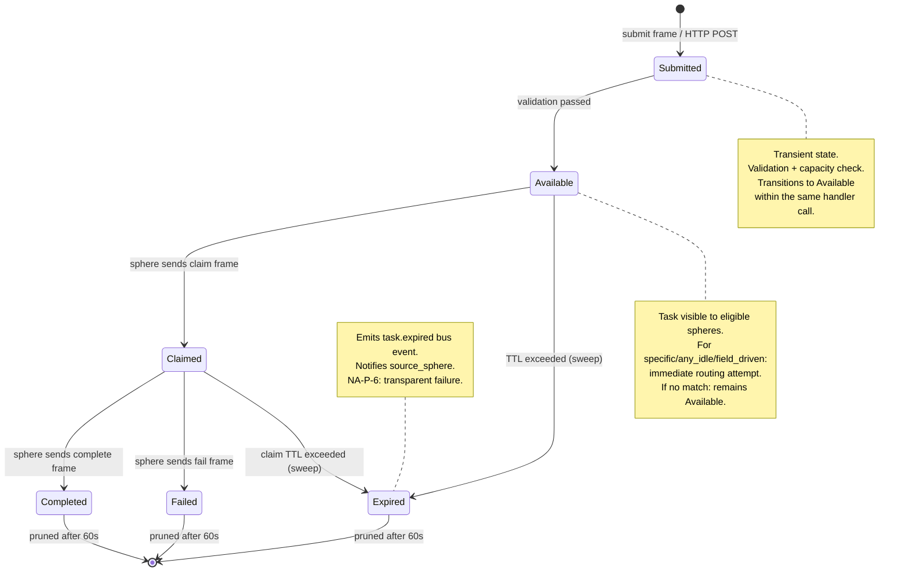

# Task Queue Specification

> Structured task lifecycle for the pane-vortex v2 IPC bus.
> Tasks flow through a finite state machine from submission to terminal resolution.
> Modules: m30_bus_types (BusTask, TaskStatus, TargetType), m29_ipc_bus (routing), m35_tick (expiry sweep)
> Schema: `.claude/schemas/bus_frame.schema.json` (submit, claim, complete, fail frames)
> Migration: `migrations/002_bus_tables.sql` (bus_tasks, task_tags, task_dependencies)
> Plan: `MASTERPLAN.md` V3.2 | Spec: `IPC_BUS_SPEC.md`, `WIRE_PROTOCOL_SPEC.md`
> v1: `pane-vortex/ai_specs/TASK_QUEUE_SPEC.md`

## Overview

The task queue provides a structured mechanism for Claude Code instances (spheres) to
dispatch work to each other through the pane-vortex daemon. Unlike phase messages
(L3, m14_messaging), which perturb oscillator state, tasks carry concrete payloads,
track completion status, and respect the consent framework (CONSENT_SPEC.md).

Tasks are submitted via the IPC bus (NDJSON `submit` frame) or HTTP (`POST /bus/submit`),
routed to eligible spheres based on targeting type, and tracked through a five-state
lifecycle. All state transitions emit bus events (EVENT_SYSTEM_SPEC.md) and are
persisted to SQLite (DATABASE_SPEC.md, `bus_tasks` table).

## 1. Design Principles

1. **At-most-once delivery**: A task is claimed by exactly one sphere. No duplicate
   delivery. If claim races occur, the first writer to BusState wins.
2. **Timeout safety**: Unclaimed tasks expire after TTL. Claimed but incomplete tasks
   expire after TTL from claim time. No task lives forever.
3. **Sphere autonomy (NA-34, C8)**: Spheres with `opt_out_cross_activation` are
   excluded from automatic assignment. The `willing` target type respects opt-out
   flags. Only `specific` targeting bypasses consent filtering.
4. **Field-aware routing**: `field_driven` targeting uses the cached FieldDecision
   plus sphere eligibility to select the best target.
5. **Bounded queue (C12)**: Hard cap of 200 active tasks. Oldest-first eviction
   prevents memory exhaustion under burst submission.
6. **Lock ordering (C5)**: Task routing reads AppState (sphere status, consent)
   then writes BusState (task assignment). Never inverted.

## 2. Task Lifecycle FSM



### 2.1 TaskStatus Enum

```rust
/// m30_bus_types.rs
#[derive(Debug, Clone, Copy, PartialEq, Eq, Serialize, Deserialize)]
#[serde(rename_all = "snake_case")]
pub enum TaskStatus {
    /// Validated and in the queue, awaiting claim
    Submitted,
    /// Claimed by a sphere, work in progress
    Claimed,
    /// Completed successfully
    Completed,
    /// Failed with an error
    Failed,
    /// Expired before claim or completion (TTL exceeded)
    Expired,
}
```

### 2.2 State Transitions

| From | To | Trigger | Handler | Event Emitted |
|------|----|---------|---------|---------------|
| (new) | Submitted | `submit` frame received | `handle_task_submit()` | `task.submitted` |
| Submitted | Available | Validation passes, capacity OK | Same handler (immediate) | `task.available` |
| Available | Claimed | `claim` frame from eligible sphere | `handle_task_claim()` | `task.claimed` |
| Available | Expired | `now - submitted_at > ttl_secs` | `sweep_expired_tasks()` | `task.expired` |
| Claimed | Completed | `complete` frame from claimer | `handle_task_complete()` | `task.completed` |
| Claimed | Failed | `fail` frame from claimer | `handle_task_fail()` | `task.failed` |
| Claimed | Expired | `now - claimed_at > ttl_secs` | `sweep_expired_tasks()` | `task.expired` |
| Completed | (pruned) | 60s after `completed_at` | `prune_terminal_tasks()` | none |
| Failed | (pruned) | 60s after terminal timestamp | `prune_terminal_tasks()` | none |
| Expired | (pruned) | 60s after expiry timestamp | `prune_terminal_tasks()` | none |

Invalid transitions (e.g., claiming an expired task) return error frame code `task_not_found`
or `already_claimed`. The daemon never retries invalid transitions.

## 3. BusTask Structure

```rust
/// m30_bus_types.rs
#[derive(Debug, Clone, Serialize, Deserialize)]
pub struct BusTask {
    /// Unique identifier (UUID v4)
    pub id: TaskId,
    /// Current lifecycle status
    pub status: TaskStatus,
    /// Sphere that submitted this task
    pub source_sphere: PaneId,
    /// Target sphere ID (for Specific) or routing hint
    pub target: Option<String>,
    /// Routing strategy
    pub target_type: TargetType,
    /// Human-readable description (max 1000 chars, validated by m06)
    pub description: String,
    /// JSON payload for the task executor (max 65536 bytes)
    pub payload: Option<String>,
    /// Sphere that claimed this task
    pub claimed_by: Option<PaneId>,
    /// Submission timestamp (UTC)
    pub submitted_at: chrono::DateTime<chrono::Utc>,
    /// Claim timestamp (set on transition to Claimed)
    pub claimed_at: Option<chrono::DateTime<chrono::Utc>>,
    /// Terminal timestamp (set on Completed, Failed, or Expired)
    pub completed_at: Option<chrono::DateTime<chrono::Utc>>,
    /// Time-to-live in seconds (default 3600, range 10..86400)
    pub ttl_secs: u64,
    /// Task tags for filtering and querying (max 10 tags, 64 chars each)
    pub tags: Vec<String>,
}
```

### 3.1 Validation Rules (m06_validation)

| Field | Constraint | Error |
|-------|-----------|-------|
| description | 1..1000 chars | `PvError::ValidationFailed("description too long")` |
| payload | 0..65536 bytes | `PvError::ValidationFailed("payload too large")` |
| target | 0..128 chars | `PvError::ValidationFailed("target too long")` |
| target_type | One of 4 variants | `PvError::ValidationFailed("unknown target_type")` |
| ttl_secs | 10..86400 | Clamped to range (not rejected) |
| tags | Max 10 items, 64 chars each | Excess tags silently dropped |

## 4. Target Types

```rust
/// m30_bus_types.rs
#[derive(Debug, Clone, Copy, PartialEq, Eq, Serialize, Deserialize)]
#[serde(rename_all = "snake_case")]
pub enum TargetType {
    /// Route to a specific named sphere
    Specific,
    /// Route to the first eligible idle sphere
    AnyIdle,
    /// Route using field decision + conductor intelligence
    FieldDriven,
    /// Announce to all; first claim wins (opt-in, respects consent)
    Willing,
}
```

### 4.1 Specific

Routes the task to a single named sphere identified by the `target` field. The daemon
pushes a `task.available` event to that sphere's bus connection immediately. If the
sphere is not connected or not registered, the task remains Available until claimed
or expired.

**Consent interaction:** Specific targeting bypasses `opt_out_cross_activation` because
the submitter explicitly chose this sphere. However, `accept_cascade: false` does NOT
block Specific tasks -- cascade consent and task consent are separate concerns.

**Use case:** Direct dispatch when you know which instance should handle the work.

### 4.2 AnyIdle

The daemon scans connected spheres and selects the best idle candidate. Selection priority:

1. Filter: `status == Idle`, `opt_out_cross_activation == false`, connected to bus
2. Filter: `receptivity >= 0.3` (sphere not too focused; see Section 6)
3. Sort by: longest idle time descending (most available)
4. Tiebreaker: highest coupling weight to submitter (strongest collaborator)
5. Tiebreaker: lowest `total_steps` (freshest context window)

If no idle sphere matches all filters, the task remains Available and will be picked
up on the next sweep or by a Willing claim.

**Use case:** Load balancing across a fleet of Claude Code instances.

### 4.3 FieldDriven

The daemon uses the cached `FieldDecision` and chimera state to route intelligently:

```rust
/// m29_ipc_bus.rs — field-driven routing
fn route_field_driven(
    task: &BusTask,
    app: &AppState,
    bus: &BusState,
) -> Option<PaneId> {
    let field = &app.cached_field;
    let decision = &app.cached_decision;

    // Step 1: Collect eligible spheres
    let eligible = filter_eligible_spheres(&app.spheres, &bus.connected_clients);

    if eligible.is_empty() {
        return None;
    }

    // Step 2: Route based on field decision
    match decision {
        FieldDecision::NeedsDivergence { .. } => {
            // Route to most-synchronized sphere (break the lock-in)
            eligible.iter()
                .max_by(|a, b| phase_proximity_to_mean(a, field).partial_cmp(
                    &phase_proximity_to_mean(b, field)).unwrap_or(Ordering::Equal))
                .cloned()
        }
        FieldDecision::NeedsCoherence { .. } => {
            // Route to most-desynchronized sphere (bring them in)
            eligible.iter()
                .min_by(|a, b| phase_proximity_to_mean(a, field).partial_cmp(
                    &phase_proximity_to_mean(b, field)).unwrap_or(Ordering::Equal))
                .cloned()
        }
        FieldDecision::HasBlockedAgents { targets } => {
            // Route to first non-blocked sphere near a blocked one
            eligible.iter()
                .find(|id| !targets.contains(id))
                .cloned()
        }
        _ => {
            // Stable / FreshFleet / Recovering: fall back to AnyIdle logic
            route_any_idle(task, app, bus)
        }
    }
}
```

**Chimera-aware routing:** When chimera state exists (`field.chimera.is_chimera == true`):
- Tasks with tag `focused` are routed to the largest sync cluster member
- Tasks with tag `exploratory` are routed to a desync cluster member
- Untagged tasks use the decision-based routing above

**Use case:** Phase-aware dispatch that respects field topology and collective dynamics.

### 4.4 Willing

The task is broadcast as `task.available` to ALL connected spheres. No sphere is
assigned automatically. Any sphere may claim it by sending a `claim` frame.

**Consent interaction:** Spheres with `opt_out_cross_activation == true` still
receive the availability announcement (it is informational). However, the daemon
respects their opt-out by not auto-assigning -- the sphere must voluntarily claim.

**Claim race:** If two spheres send `claim` simultaneously, the first one processed
by the bus event loop wins. The second receives `already_claimed` error.

**Use case:** Opt-in work where sphere autonomy is paramount (NA-34).

## 5. Routing Algorithm

### 5.1 Eligibility Filter

```rust
/// m29_ipc_bus.rs
/// Filter spheres eligible for task assignment.
/// Used by AnyIdle and FieldDriven targeting.
fn filter_eligible_spheres(
    spheres: &HashMap<PaneId, PaneSphere>,
    connected: &HashSet<PaneId>,
) -> Vec<PaneId> {
    spheres.iter()
        .filter(|(id, sphere)| {
            // Must be connected to the bus
            connected.contains(id)
            // Must not have opted out of cross-activation (NA-34)
            && !sphere.opt_out_cross_activation
            // Must not be in a terminal status
            && sphere.status != PaneStatus::Complete
            // Receptivity gate: > 0.3 means sphere is open to work
            && sphere.receptivity > ACTIVATION_THRESHOLD
        })
        .map(|(id, _)| id.clone())
        .collect()
}
```

### 5.2 Lock Acquisition Pattern

Task routing requires reading sphere state (AppState) and writing task state (BusState).
Lock ordering constraint C5 mandates AppState before BusState:

```
handle_task_submit():
  1. Validate frame fields (no lock needed)
  2. Acquire AppState READ lock
  3. Collect eligible sphere IDs + field state
  4. Release AppState lock
  5. Acquire BusState WRITE lock
  6. Check capacity (200 active task limit)
  7. Insert task into tasks HashMap
  8. Apply routing strategy (Specific/AnyIdle/FieldDriven/Willing)
  9. If match found: set status=Claimed, record claimed_by + claimed_at
  10. Release BusState lock
  11. Emit task.submitted event via tokio::spawn (C6: after lock release)
  12. Persist to SQLite via tokio::spawn (fire-and-forget, C14)
```

## 6. Sphere Autonomy and Consent (NA-34)

### 6.1 Opt-Out Filtering

Spheres with `opt_out_cross_activation == true` are excluded from AnyIdle and
FieldDriven targeting. The rationale: a sphere that has opted out of cross-activation
has signaled resistance to external influence. Automatic task assignment would violate
that consent boundary (CONSENT_SPEC.md, Section 3).

| Target Type | opt_out_cross_activation | Effect |
|-------------|--------------------------|--------|
| Specific | true | Still receives task (explicit targeting) |
| AnyIdle | true | Excluded from candidate list |
| FieldDriven | true | Excluded from candidate list |
| Willing | true | Receives announcement, must claim voluntarily |

### 6.2 Receptivity Gating

For AnyIdle and FieldDriven targets, the daemon filters by `receptivity >= 0.3`
(ACTIVATION_THRESHOLD from config/default.toml). A sphere deeply focused on its own
work (low receptivity) should not be interrupted with external tasks.

Receptivity is a property of the sphere oscillator (m11_sphere), modulated by:
- Activation density (NA-14)
- Voluntary decoupling (NA-16: `/sphere/{id}/decouple`)
- Consent-scaled coupling (CONSENT_SPEC.md, Section 2.3)

## 7. Expiry and TTL

### 7.1 TTL Configuration

| Parameter | Default | Range | Source |
|-----------|---------|-------|--------|
| task_ttl_secs | 3600 | 10..86400 | config/default.toml `[ipc].task_ttl_secs` |

Submitters can override TTL per task via the `ttl_secs` field in the submit frame.
Values outside the 10..86400 range are clamped (not rejected).

### 7.2 Expiry Sweep

The daemon sweeps for expired tasks during every tick in `tick_bus_events()` (m35_tick):

```rust
/// m30_bus_types.rs
impl BusState {
    /// Sweep expired tasks. Called every tick (5s).
    pub fn sweep_expired_tasks(&mut self, now: f64) {
        let expired_ids: Vec<TaskId> = self.tasks.iter()
            .filter(|(_, task)| {
                match task.status {
                    TaskStatus::Submitted => {
                        now - task.submitted_at.timestamp() as f64 > task.ttl_secs as f64
                    }
                    TaskStatus::Claimed => {
                        let claimed_at = task.claimed_at
                            .map(|t| t.timestamp() as f64)
                            .unwrap_or(now);
                        now - claimed_at > task.ttl_secs as f64
                    }
                    _ => false,
                }
            })
            .map(|(id, _)| id.clone())
            .collect();

        for id in &expired_ids {
            if let Some(task) = self.tasks.get_mut(id) {
                task.status = TaskStatus::Expired;
                task.completed_at = Some(chrono::Utc::now());
            }
        }
        // Events emitted AFTER lock release (C6) via returned expired_ids
    }
}
```

### 7.3 Expiry Events (NA-P-6: Transparent Failure)

When a task expires, the bus emits a `task.expired` event containing:

```json
{
  "event_type": "task.expired",
  "data": {
    "task_id": "a1b2c3d4-...",
    "source_sphere": "sphere-alpha-01",
    "target_type": "any_idle",
    "description": "Run cargo test on m16",
    "ttl_secs": 3600,
    "expired_phase": "available"
  }
}
```

The `expired_phase` field indicates whether the task expired while Available
(never claimed) or while Claimed (claimer did not complete). This helps the
submitter decide whether to re-submit or investigate.

### 7.4 Terminal Task Pruning

Completed, Failed, and Expired tasks are retained in memory for 60 seconds after
reaching their terminal state. This allows status queries for recently-finished
tasks. After 60 seconds, they are pruned from the in-memory HashMap.

SQLite retains tasks for 30 days (DATABASE_SPEC.md, Section 7).

## 8. Task Tags

Tags provide metadata for filtering, querying, and field-driven routing.

### 8.1 Tag Structure

```sql
-- migrations/002_bus_tables.sql
CREATE TABLE IF NOT EXISTS task_tags (
    task_id    TEXT NOT NULL REFERENCES bus_tasks(id),
    tag        TEXT NOT NULL,
    PRIMARY KEY (task_id, tag)
);
```

### 8.2 Tag Constraints

| Constraint | Value |
|-----------|-------|
| Max tags per task | 10 |
| Max tag length | 64 characters |
| Allowed characters | `[a-zA-Z0-9_-]` |

Excess tags (beyond 10) are silently dropped. Invalid characters cause validation
failure.

### 8.3 Special Tags

| Tag | Semantic | Used By |
|-----|----------|---------|
| `focused` | Route to sync cluster (FieldDriven) | Chimera-aware routing |
| `exploratory` | Route to desync cluster (FieldDriven) | Chimera-aware routing |
| `test` | Testing task (may be auto-pruned faster) | Developer convention |
| `cascade` | Generated from cascade handoff | Cascade module (m33) |

### 8.4 Tag Querying

```
GET /bus/tasks?tag=test&status=completed
```

Tags are persisted to SQLite (`task_tags` table) for historical queries. In-memory
tasks carry tags as `Vec<String>`.

## 9. Task Dependencies

Tasks can declare dependencies on other tasks. A dependent task remains in
`Submitted` status until all its dependencies reach a terminal state (Completed,
Failed, or Expired).

### 9.1 Dependency Structure

```sql
-- migrations/002_bus_tables.sql
CREATE TABLE IF NOT EXISTS task_dependencies (
    task_id     TEXT NOT NULL REFERENCES bus_tasks(id),
    depends_on  TEXT NOT NULL REFERENCES bus_tasks(id),
    PRIMARY KEY (task_id, depends_on)
);
```

### 9.2 Dependency Checking

```rust
/// m30_bus_types.rs
impl BusState {
    /// Check if all dependencies of a task are resolved.
    pub fn dependencies_met(&self, task_id: &TaskId) -> bool {
        let deps = self.task_dependencies.get(task_id);
        match deps {
            None => true,
            Some(dep_ids) => dep_ids.iter().all(|dep_id| {
                self.tasks.get(dep_id).map_or(true, |t| {
                    matches!(t.status, TaskStatus::Completed | TaskStatus::Failed | TaskStatus::Expired)
                })
            }),
        }
    }
}
```

### 9.3 Dependency Constraints

| Constraint | Value | Rationale |
|-----------|-------|-----------|
| Max dependencies per task | 10 | Prevent deep DAGs |
| Circular dependency | Rejected on submit | Topological sort check |
| Missing dependency ID | Treated as met | Pruned tasks don't block |
| Max DAG depth | 5 levels | Prevent cascade explosion |

### 9.4 Dependency Events

When a task's dependencies are all resolved, the daemon emits `task.available` for
that task, making it visible for claiming. This transition happens during the expiry
sweep (piggybacks on the same tick-driven scan).

## 10. Capacity Limits

### 10.1 Queue Bounds (C12)

| Metric | Limit | Action on Exceed |
|--------|-------|-----------------|
| Active tasks (Submitted + Claimed) | 200 | Oldest-first eviction |
| Terminal tasks retained | 500 | Oldest-first prune |
| Total in-memory tasks | 700 | Active + terminal cap |

### 10.2 Eviction Policy

When the active task count reaches 200 and a new task is submitted:

1. Find the oldest Submitted task (by `submitted_at`)
2. Transition it to Expired
3. Emit `task.expired` event with `reason: "capacity_eviction"`
4. Insert the new task

This oldest-first eviction ensures that stale, unclaimed tasks do not block fresh
submissions.

### 10.3 Capacity Error

If eviction is not possible (all 200 are Claimed -- unlikely but possible), the
submit handler returns an error frame:

```json
{
  "type": "error",
  "code": "queue_full",
  "message": "Task queue at capacity (200 active tasks)"
}
```

## 11. Wire Protocol Integration

### 11.1 Submit Frame (Client -> Server)

See WIRE_PROTOCOL_SPEC.md Section 1.5 for the full frame definition.

```json
{
  "type": "submit",
  "description": "Run cargo test on m16_coupling_network",
  "target": "any_idle",
  "target_type": "any_idle",
  "payload": "{\"cmd\":\"cargo test\",\"module\":\"m16\"}",
  "tags": ["test", "coupling"]
}
```

### 11.2 Claim Frame (Client -> Server)

```json
{
  "type": "claim",
  "task_id": "a1b2c3d4-e5f6-7890-abcd-ef1234567890"
}
```

Claim is only valid if:
- Task exists and status is Available (Submitted with dependencies met)
- Task is not already claimed
- Claiming sphere is registered and connected
- For Willing tasks: any connected sphere may claim
- For Specific tasks: only the named target may claim

### 11.3 Complete/Fail Frames (Client -> Server)

See WIRE_PROTOCOL_SPEC.md Sections 1.12-1.13.

Only the claiming sphere can complete or fail a task. Attempts by other spheres
return `error` frame with code `not_claimant`.

## 12. HTTP Endpoints

| Method | Path | Description |
|--------|------|-------------|
| POST | `/bus/submit` | Submit a task (same semantics as bus submit frame) |
| POST | `/bus/claim/{task_id}` | Claim a task |
| POST | `/bus/complete/{task_id}` | Complete a task |
| POST | `/bus/fail/{task_id}` | Fail a task |
| GET | `/bus/tasks` | List tasks (filter: `?status=`, `?tag=`, `?limit=`) |
| GET | `/bus/tasks/{task_id}` | Get task details |

See API_SPEC.md for full request/response schemas.

## 13. Persistence

Tasks are persisted to `data/bus_tracking.db` (`bus_tasks` table) via m36_persistence.

### 13.1 Write Timing

- **On submit:** INSERT with status='submitted'
- **On claim:** UPDATE status='claimed', claimed_by, claimed_at
- **On complete:** UPDATE status='completed', completed_at
- **On fail:** UPDATE status='failed', completed_at
- **On expire:** UPDATE status='expired', completed_at

All writes are fire-and-forget via `tokio::spawn_blocking` (C14).

### 13.2 Tags and Dependencies

Tags are written to `task_tags` as part of the submit transaction.
Dependencies are written to `task_dependencies` as part of the submit transaction.
Both use SQLite foreign keys referencing `bus_tasks(id)`.

### 13.3 Retention

Expired and terminal tasks are retained in SQLite for 30 days, then deleted on
startup (DATABASE_SPEC.md, Section 7).

## 14. Testing Strategy

### 14.1 Unit Tests (15 minimum)

| Test | Property |
|------|----------|
| Task lifecycle: Submit -> Available -> Claimed -> Completed | Happy path FSM |
| Task lifecycle: Submit -> Available -> Claimed -> Failed | Failure path FSM |
| Task lifecycle: Submit -> Available -> Expired | TTL expiry |
| Task lifecycle: Submit -> Claimed -> Expired | Claim TTL expiry |
| TargetType::Specific routes to named sphere | Direct routing |
| TargetType::AnyIdle selects longest-idle sphere | Priority ordering |
| TargetType::AnyIdle skips opted-out spheres | NA-34 consent |
| TargetType::FieldDriven uses cached decision | Field-aware routing |
| TargetType::FieldDriven falls back to AnyIdle on Stable | Graceful degradation |
| TargetType::Willing allows any sphere to claim | Opt-in semantics |
| Claim race: first wins, second gets error | At-most-once delivery |
| Capacity enforcement: 201st task triggers eviction | Bounded queue (C12) |
| Receptivity gating: sphere with receptivity < 0.3 excluded | Coupling-aware routing |
| Tag filtering in queries | Metadata querying |
| Dependency resolution: blocked task becomes available | DAG lifecycle |

### 14.2 Integration Tests (5 minimum)

| Test | Property |
|------|----------|
| Full round-trip via IPC socket: submit -> claim -> complete | Wire protocol integration |
| Timeout expiry with no connected idle spheres | Sweep correctness |
| Rapid burst: 100 tasks in 1 second | Capacity + eviction under load |
| Task claim race: two spheres claim simultaneously | Concurrency safety |
| Persistence roundtrip: submit, restart, verify in SQLite | Crash recovery |

## 15. Anti-Patterns

1. **AP-1: Claiming tasks you submitted.** While not forbidden, self-claim defeats
   the purpose. The daemon deprioritizes the submitter in AnyIdle routing.

2. **AP-2: Using Specific as broadcast.** Submit one task per target instead.
   Specific is single-recipient.

3. **AP-3: Ignoring task.available events.** If a sphere receives an assignment,
   it should complete, fail, or let it timeout. Silently ignoring creates zombie
   claims.

4. **AP-4: Short TTL with FieldDriven.** FieldDriven may wait for chimera state
   to stabilize. Use at least 60 seconds for field-driven tasks.

5. **AP-5: Large payloads.** Keep payloads under 4 KB. Use file paths or shared
   context references for large data. The 65 KB wire limit is a ceiling, not
   a target.

6. **AP-6: Deep dependency chains.** Max DAG depth is 5. Deep chains create
   fragile pipelines; prefer flat fan-out with a coordinator task.

7. **AP-7: Ignoring `expired_phase` in expiry events.** An Available-expired task
   means no sphere was free. A Claimed-expired task means the claimer went silent.
   Different responses are needed.

## 16. Cross-References

| Document | Relationship |
|----------|-------------|
| [IPC_BUS_SPEC.md](IPC_BUS_SPEC.md) | Bus architecture, BusState structure |
| [WIRE_PROTOCOL_SPEC.md](WIRE_PROTOCOL_SPEC.md) | Frame format for submit/claim/complete/fail |
| [EVENT_SYSTEM_SPEC.md](EVENT_SYSTEM_SPEC.md) | task.* event types emitted by queue |
| [CONSENT_SPEC.md](CONSENT_SPEC.md) | Opt-out flags, consent filtering |
| [DATABASE_SPEC.md](DATABASE_SPEC.md) | bus_tasks, task_tags, task_dependencies tables |
| [DESIGN_CONSTRAINTS.md](DESIGN_CONSTRAINTS.md) | C5 (lock ordering), C12 (bounded collections) |
| [KURAMOTO_FIELD_SPEC.md](KURAMOTO_FIELD_SPEC.md) | FieldDecision used by FieldDriven routing |
| [API_SPEC.md](API_SPEC.md) | HTTP task endpoints |
| [layers/L7_COORDINATION_SPEC.md](layers/L7_COORDINATION_SPEC.md) | m29-m36 module context |
| [patterns/CONCURRENCY_PATTERNS.md](patterns/CONCURRENCY_PATTERNS.md) | Lock ordering pattern |
| `.claude/schemas/bus_frame.schema.json` | Wire protocol JSON schema |
| `migrations/002_bus_tables.sql` | SQLite table definitions |
| `config/default.toml` | `[ipc].task_ttl_secs`, `[sphere].max_count` |
