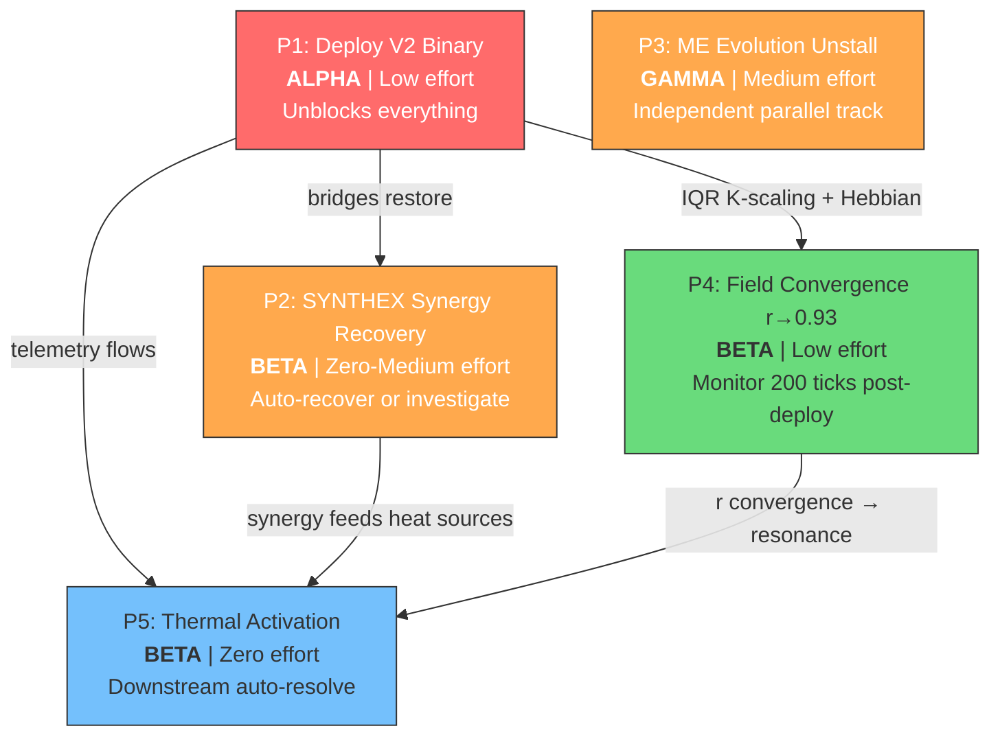

# BETA Remediation Plan — Fleet Wave 2

**Instance:** BETA-BOT-RIGHT
**Based on:** Wave 1 Bridge Analysis (tick 71,489)
**Created:** 2026-03-21

---

## Thermal State Comparison

| Metric | Wave 1 Snapshot | Wave 2 Current | Delta |
|--------|----------------|----------------|-------|
| temperature | 0.03 | 0.03 | 0.00 (frozen) |
| target | 0.50 | 0.50 | — |
| pid_output | -0.335 | -0.335 | 0.00 |
| damping_adjustment | 0.0167 | 0.0167 | 0.00 |
| decay_rate_multiplier | 0.8995 | 0.8995 | 0.00 |
| HS-001 Hebbian | 0.0 | 0.0 | 0.00 |
| HS-002 Cascade | 0.0 | 0.0 | 0.00 |
| HS-003 Resonance | 0.0 | 0.0 | 0.00 |
| HS-004 CrossSync | 0.2 | 0.2 | 0.00 |

**Verdict:** Thermal state is completely static between snapshots. Zero drift across all metrics. The PID controller is outputting a strong correction signal (-0.335) but no heat sources are responding. This confirms the system is thermally frozen — the V1 binary lacks the Hebbian STDP tick integration (BUG-031 fix) that would generate thermal activity.

---

## Prioritized Remediation Plan

### Priority 1 (BLOCKING): Deploy V2 Binary

| Field | Detail |
|-------|--------|
| **Issue** | CRIT-2 (3/6 bridges stale), CRIT-4 (coupling matrix empty) |
| **Root Cause** | Running V1 binary (`./bin/pane-vortex`, built Mar 20). V2 source has 7 GAPs closed, Hebbian STDP wired, 6-bridge consent, coupling matrix API — but none is live. |
| **Fix Approach** | Execute `deploy plan` — build V2 release, hot-swap binary at `./bin/` and `~/.local/bin/`, restart via devenv. Steps 9-11 in CLAUDE.local.md deploy plan. |
| **Effort** | Low (~5 min). Code complete, 1,516 tests passing. Build + swap + restart. |
| **Fleet Instance** | **ALPHA** (primary operator — deploy is a privileged, irreversible action requiring user authorization) |
| **Unblocks** | CRIT-2, CRIT-4, CRIT-5, partially CRIT-1 |

---

### Priority 2 (HIGH): Resolve SYNTHEX Synergy Critical

| Field | Detail |
|-------|--------|
| **Issue** | CRIT-1 — Synergy probe at 0.5, critical threshold 0.7 |
| **Root Cause** | SYNTHEX synergy score reflects cross-service coherence. With 3/6 PV2 bridges stale and coupling matrix empty, SYNTHEX sees half the coordination fabric as dark. Synergy cannot rise when the bridge inputs are missing. |
| **Fix Approach** | Two-phase: (1) Deploy V2 binary (Priority 1) to restore all 6 bridges — synergy should auto-recover as bridge telemetry flows. (2) If synergy remains below 0.7 after V2 deploy + 100 ticks, investigate SYNTHEX-side synergy calculation weights via `/v3/homeostasis/config`. |
| **Effort** | Phase 1: zero (piggybacks on Priority 1). Phase 2: medium (~30 min investigation) if needed. |
| **Fleet Instance** | **BETA** (this instance — monitor synergy post-deploy, escalate if Phase 2 needed) |
| **Depends on** | Priority 1 complete |

---

### Priority 3 (HIGH): Unstall ME Evolutionary Engine

| Field | Detail |
|-------|--------|
| **Issue** | CRIT-3 — ME Degraded, fitness 0.609, declining trend, mutations_proposed=0 |
| **Root Cause** | The observer is ingesting events (431K) and finding correlations (4.7M) but proposing zero mutations. Likely cause: the fitness landscape has flattened at generation 26 — the mutation proposal threshold may be too conservative, or the emergence cap (1,000) is saturated and blocking new mutation triggers. |
| **Fix Approach** | (1) Check ME mutation config: `curl -s localhost:8080/api/evolution/config`. (2) If emergence_cap is 1,000 and saturated, raise it via ME API or restart with higher cap. (3) If mutation_threshold is too high relative to current correlations, lower it. (4) As a forcing function, inject a synthetic event via `/api/events` to shake the fitness landscape. |
| **Effort** | Medium (~20 min). Config investigation + targeted adjustment. |
| **Fleet Instance** | **GAMMA** (independent of V2 deploy — can proceed in parallel) |
| **Depends on** | None (ME is independent service) |

---

### Priority 4 (MEDIUM): Restore Field Convergence (r → R_TARGET)

| Field | Detail |
|-------|--------|
| **Issue** | CRIT-5 — r=0.69 vs R_TARGET=0.93, k_modulation at floor (0.85) |
| **Root Cause** | Compound effect: (1) V1 binary lacks IQR K-scaling (coded in V2), so auto-K cannot adapt coupling strength per-sphere. (2) k_modulation pinned at floor 0.85 means coupling is dampened 15% below nominal. (3) Without Hebbian STDP (BUG-031 fix, V2 only), weight differentiation cannot emerge, so all sphere pairs couple uniformly — thermodynamically unfavorable for convergence. |
| **Fix Approach** | Primarily resolved by Priority 1 (V2 deploy). V2 binary brings: IQR K-scaling (auto-adjusts k per sphere spread), Hebbian STDP tick integration (weight differentiation via LTP/LTD), multiplicative conductor/bridge composition, EMA decay α=0.95. After deploy, monitor r over 200 ticks. If r < 0.85 after 200 ticks, investigate sphere phase distribution via `/field/state`. |
| **Effort** | Low (auto-resolves with V2). Monitoring: ~10 min post-deploy. |
| **Fleet Instance** | **BETA** (monitor r trajectory post-deploy) |
| **Depends on** | Priority 1 complete |

---

### Priority 5 (LOW): Thermal System Activation

| Field | Detail |
|-------|--------|
| **Issue** | Thermal state frozen at 0.03/0.50 target. 3/4 heat sources reading zero. PID output stuck at -0.335. |
| **Root Cause** | Heat sources (Hebbian, Cascade, Resonance) depend on PV2 field activity propagating through SYNTHEX bridge. V1 binary doesn't emit the telemetry events that feed these heat sources. CrossSync (0.2) works because it reads from Nexus, which is live. |
| **Fix Approach** | Auto-resolves with Priority 1 + Priority 2. Once V2 is deployed with Hebbian STDP active, HS-001 (Hebbian) will start reading non-zero. Cascade (HS-002) will follow as field decisions propagate. Resonance (HS-003) will activate when coupling matrix populates and buoy resonance is detectable. |
| **Effort** | Zero (downstream effect of Priorities 1-2). |
| **Fleet Instance** | **BETA** (verify thermal readings climb post-deploy) |
| **Depends on** | Priority 1, Priority 2 |

---

## Dependency Graph



---

## Fleet Instance Assignment Summary

| Instance | Tasks | Parallelizable |
|----------|-------|----------------|
| **ALPHA** | P1: Deploy V2 binary (requires user `deploy plan` authorization) | Blocking — must go first |
| **BETA** | P2: Monitor synergy post-deploy, P4: Monitor r trajectory, P5: Verify thermal activation | Yes — all post-deploy monitoring |
| **GAMMA** | P3: ME evolution unstall (config investigation + adjustment) | Yes — independent of V2 deploy |

---

## Execution Timeline

```
T+0     ALPHA: deploy plan (build, swap, restart)         GAMMA: ME evolution config check
T+5min  ALPHA: verify 5 post-deploy checks                GAMMA: adjust mutation threshold
T+10min BETA: check synergy (expect auto-recovery)        GAMMA: verify mutations_proposed > 0
T+15min BETA: check r at tick+100 (expect r > 0.75)
T+30min BETA: check r at tick+200 (expect r > 0.85)
T+30min BETA: verify thermal temp > 0.10 (heat sources active)
T+60min ALL: full bridge sweep — expect 6/6 live, synergy > 0.7, r > 0.85
```

---

BETA-WAVE2-COMPLETE
