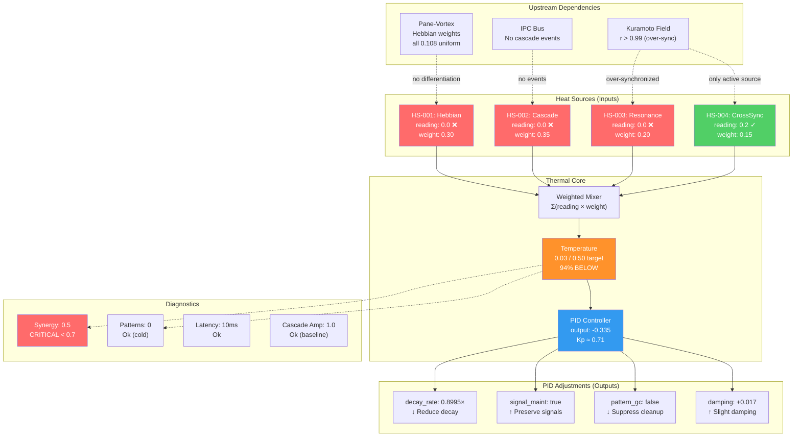
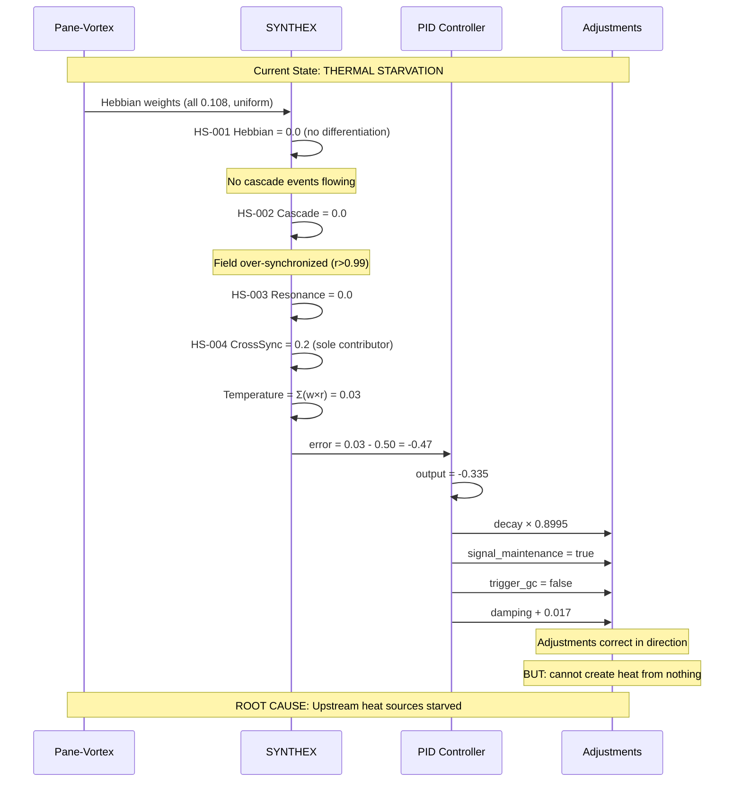

# WAVE-3 BETA-LEFT: SYNTHEX Thermal Deep Dive

**Agent:** BETA-LEFT | **Wave:** 3 | **Timestamp:** 2026-03-21
**Target:** SYNTHEX (localhost:8090)

---

## 1. Thermal State (`/v3/thermal`)

| Parameter | Value |
|-----------|-------|
| **Temperature** | 0.03 |
| **Target** | 0.50 |
| **PID Output** | -0.335 |
| **Gap** | 0.47 (94% below target) |

### Heat Sources

| ID | Name | Reading | Weight | Contribution |
|----|------|---------|--------|-------------|
| HS-001 | Hebbian | **0.0** | 0.30 | 0.000 |
| HS-002 | Cascade | **0.0** | 0.35 | 0.000 |
| HS-003 | Resonance | **0.0** | 0.20 | 0.000 |
| HS-004 | CrossSync | 0.2 | 0.15 | 0.030 |
| | | | **Total** | **0.030** |

**Finding:** Temperature = weighted heat source sum = 0.03. Three of four heat sources are DEAD. Only CrossSync contributes, and it provides just 6% of target.

### Thermal Adjustments (PID-derived)

| Adjustment | Value | Direction |
|------------|-------|-----------|
| `damping_adjustment` | 0.0167 | Slight damping increase |
| `decay_rate_multiplier` | 0.8995 | 10% decay reduction (preserve heat) |
| `signal_maintenance` | true | Keep signals alive |
| `trigger_pattern_gc` | false | Suppress garbage collection |

---

## 2. Diagnostics (`/v3/diagnostics`)

| Probe | Value | Warning | Critical | Severity |
|-------|-------|---------|----------|----------|
| PatternCount | 0.0 | 50.0 | 75.0 | **Ok** |
| CascadeAmplification | 1.0 | 150.0 | 500.0 | **Ok** |
| Latency | 10ms | 500ms | 1000ms | **Ok** |
| **Synergy** | **0.5** | 0.9 | **0.7** | **CRITICAL** |

- **Overall health:** 0.75
- **Critical count:** 1 (Synergy)
- **Warning count:** 0

**Finding:** Synergy at 0.5 is below the 0.7 critical threshold. This is the same ALERT-1 from Session 040 — **unfixed for 2+ days**. PatternCount at 0.0 confirms no active patterns (cold brain).

---

## 3. Health Endpoint (`/api/health`)

```json
{"status": "healthy", "timestamp": "2026-03-21T01:47:46.228643082+00:00"}
```

**CONTRADICTION:** Health reports "healthy" while diagnostics shows 1 CRITICAL probe. The `/api/health` endpoint does not incorporate diagnostic severity — it only checks process liveness. **This is a false-positive health signal.**

---

## 4. Homeostasis Config (`/v3/homeostasis/config`)

**Result:** Endpoint returned empty/no valid JSON. Either not implemented or requires different path. Homeostasis config is opaque — must be inferred from thermal adjustments.

---

## 5. PID Controller Analysis

### Is -0.335 appropriate for the 0.03/0.50 gap?

**Short answer: The sign is correct but the output is impotent.**

```
error = temperature - target = 0.03 - 0.50 = -0.47
PID output = -0.335

Kp (estimated) ≈ 0.335 / 0.47 ≈ 0.71  (assuming mostly proportional)
```

The negative PID output correctly indicates "system is too cold, needs heating." The derived adjustments confirm correct directionality:

| PID Signal | Adjustment | Correct? |
|------------|-----------|----------|
| Negative (cold) | Reduce decay (0.8995×) | YES — preserve existing heat |
| Negative (cold) | Maintain signals (true) | YES — don't drop activity |
| Negative (cold) | Suppress GC (false) | YES — don't clean patterns |
| Negative (cold) | Small damping (+0.017) | QUESTIONABLE — damping a cold system? |

### The Fundamental Problem

The PID controller can only modulate **indirect** parameters (decay, damping, GC). It **cannot inject heat directly**. With 3/4 heat sources at 0.0:

- **Hebbian = 0.0**: No Hebbian learning activity reaching SYNTHEX (PV Hebbian weights are all 0.108 uniform — no differentiation to report)
- **Cascade = 0.0**: No cascade events propagating
- **Resonance = 0.0**: No resonance patterns forming

The PID is correctly diagnosed but **therapeutically powerless**. It's adjusting the thermostat in a house with no furnace. The fix must come from upstream: PV needs to generate real Hebbian differentiation, cascade events, and resonance patterns that feed into these heat sources.

### PID Gain Adequacy

With a 94% error gap and only -0.335 output, the gains are **conservative**. A more aggressive controller (Kp=2.0) would produce output of ~-0.94, yielding stronger decay reduction and possibly triggering pattern generation. However, without heat source input, aggressive gains just produce larger numbers multiplied by zero.

---

## 6. Thermal Dynamics — Mermaid Diagram





---

## 7. Root Cause Chain

```
Over-synchronization (r > 0.99)
  → Hebbian weights uniform (0.108, no learning)
    → HS-001 Hebbian = 0.0
  → No phase diversity
    → HS-003 Resonance = 0.0
  → No field decisions (stuck "Stable")
    → No cascade events
      → HS-002 Cascade = 0.0
  → Temperature = 0.03 (only CrossSync contributes)
    → PID output = -0.335 (correct sign, impotent magnitude)
      → Synergy drops to 0.5 (CRITICAL)
        → /api/health still says "healthy" (false positive)
```

## 8. Recommendations

| Priority | Action | Expected Impact |
|----------|--------|-----------------|
| **P0** | Fix PV over-synchronization (r>0.99) — inject phase diversity or reduce K | Unlocks Hebbian differentiation → HS-001 |
| **P0** | Generate real cascade events through bus activity | Feeds HS-002 directly |
| **P1** | Fix `/api/health` to incorporate diagnostic severity | Eliminates false-positive healthy signal |
| **P1** | Consider PID integral term to accumulate error over time | Stronger corrective output for persistent cold |
| **P2** | Add direct heat injection mechanism to PID (not just indirect adjustments) | Allows PID to actually warm the system |
| **P2** | Increase PID Kp from ~0.71 to ~2.0 | More aggressive response (only useful once heat sources activate) |

---

BETALEFT-WAVE3-COMPLETE
