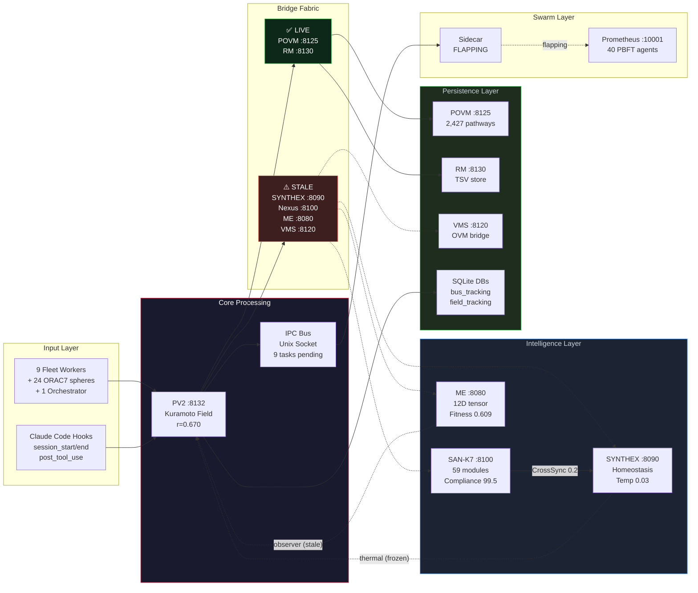

# The Habitat — Complete Architecture Diagram

> **Generated by BETA-TOP-RIGHT** | Wave 9 | 2026-03-21
> **Probe time:** tick 73,127 | uptime ~65h | 16/16 services HTTP 200

---

## Full System Snapshot

| Layer | Component | Status | Key Metric |
|-------|-----------|--------|------------|
| **Services** | 16/16 ports responding 200 | ALL HEALTHY | 65h uptime |
| **PV Field** | r=0.670, k=1.5, k_mod=0.85 | DECLINING | 34 spheres, all Idle |
| **IPC Bus** | 50 events, 9 pending tasks | UNDERLOADED | IdleFleet decision |
| **Bridges** | 2/6 verified LIVE (POVM, RM) | PARTIAL | SYNTHEX/Nexus/ME endpoints empty |
| **POVM** | 2,427 pathways, 43 high-weight | DECAYING | 50 decayed, 0 crystallised |
| **Nexus** | 59 modules, 64h uptime | STABLE | Strongest subsystem |
| **ME** | Fitness 0.609, state Degraded | STALLED | 434K events ingested |
| **SYNTHEX** | Temp 0.03/0.50, 3/4 heat sources dead | FROZEN | Synergy critical |
| **Spheres** | 34 total: 0 working, 34 idle, 0 blocked | IDLE | 1 orchestrator, 9 fleet-worker, 24 general |
| **Tunnels** | 2 active | MINIMAL | Star topology |
| **Sidecar** | Flapping (connect/disconnect loop) | DEGRADED | Reconnect every 2-4s |
| **Governance** | Endpoints 404 on V1 | DARK | No proposals |

---

## Mermaid Architecture Diagram

```mermaid
graph TB
    %% ═══════════════════════════════════════════════════════════
    %% THE HABITAT — Complete Architecture (2026-03-21, tick 73127)
    %% ═══════════════════════════════════════════════════════════

    subgraph ZELLIJ["🖥️ ZELLIJ SYNTH DEVENV (6 Tabs, 18+ Panes)"]
        direction TB

        subgraph TAB1["Tab 1: Command (Home)"]
            PV2MAIN["PV2-MAIN<br/>Command Orchestrator"]
        end

        subgraph TAB2["Tab 2: Workspace-1"]
            WS1_NVIM["nvim<br/>/tmp/nvim.sock<br/>800L keymaps, LSP"]
            WS1_TERM["Terminal"]
        end

        subgraph TAB3["Tab 3: Workspace-2"]
            WS2_LAZYGIT["lazygit<br/>6 custom commands"]
            WS2_TERM["Terminal"]
        end

        subgraph TAB4["Tab 4: Fleet-ALPHA"]
            FA_LEFT["4:left<br/>fleet-worker<br/>70,795 steps"]
            FA_TR["4:top-right<br/>fleet-worker<br/>70,795 steps"]
            FA_BR["4:bottom-right<br/>fleet-worker<br/>24,421 steps"]
        end

        subgraph TAB5["Tab 5: Fleet-BETA"]
            FB_LEFT["5:left<br/>fleet-worker<br/>70,795 steps<br/>receptivity: 0.30"]
            FB_TR["5:top-right<br/>fleet-worker<br/>26,731 steps"]
            FB_BR["5:bottom-right<br/>fleet-worker<br/>25,823 steps"]
        end

        subgraph TAB6["Tab 6: Fleet-GAMMA"]
            FG_LEFT["6:left<br/>fleet-worker<br/>70,795 steps"]
            FG_TR["6:top-right<br/>fleet-worker<br/>25,823 steps"]
            FG_BR["6:bottom-right<br/>fleet-worker<br/>20,433 steps"]
        end
    end

    subgraph PV2_CORE["⚡ PANE-VORTEX v2 (:8132) — Fleet Coordination Daemon"]
        direction TB

        subgraph FIELD_LAYER["L1: Kuramoto Field Layer"]
            KURAMOTO["Kuramoto Coupling<br/>dt=0.01, Jacobi<br/>K=1.5, k_mod=0.85"]
            SPHERES["34 Spheres<br/>0 working | 34 idle<br/>9 fleet-worker<br/>24 general<br/>1 orchestrator"]
            CHIMERA["Chimera Detector<br/>O(N log N)<br/>phase-gap π/3"]
            DECISION["Decision Engine<br/>→ IdleFleet<br/>r=0.670"]
            TUNNELS["Tunnels: 2<br/>Star topology"]
            HEBBIAN["Hebbian STDP<br/>LTP=0.01, LTD=0.002<br/>(V1: inactive)"]
        end

        subgraph BUS_LAYER["L2: IPC Bus Layer"]
            BUS_SOCKET["Unix Socket<br/>/run/user/1000/<br/>pane-vortex-bus.sock"]
            BUS_EVENTS["Event Ring<br/>50 events<br/>100% field.tick"]
            BUS_TASKS["Task Queue<br/>9 pending<br/>0 claimed"]
            BUS_CASCADE["Cascade Engine<br/>(0 cascades)"]
        end

        subgraph CONDUCTOR["Conductor"]
            COND_MODE["FleetMode: Full"]
            COND_SUGGEST["Suggestions<br/>(SuggestReseed spam)"]
        end

        GOVERNANCE["Governance<br/>Vote→Apply pipeline<br/>(endpoints 404 on V1)"]
    end

    subgraph BRIDGES["🌉 PV2 Bridges (2/6 LIVE)"]
        direction LR
        BR_SYNTHEX["SYNTHEX Bridge<br/>⚠️ STALE"]
        BR_NEXUS["Nexus Bridge<br/>⚠️ STALE"]
        BR_ME["ME Bridge<br/>⚠️ STALE"]
        BR_POVM["POVM Bridge<br/>✅ LIVE<br/>2,427 pathways"]
        BR_RM["RM Bridge<br/>✅ LIVE<br/>TSV protocol"]
        BR_VMS["VMS Bridge<br/>⚠️ STALE"]
    end

    subgraph ULTRAPLATE["🏗️ ULTRAPLATE SERVICES (16 Active, 2 Disabled)"]
        direction TB

        subgraph BATCH1["Batch 1 (No Dependencies)"]
            DEVOPS["DevOps Engine<br/>:8081 ✅<br/>Neural orchestration"]
            CODESYNTHOR["CodeSynthor V7<br/>:8110 ✅<br/>62 modules, 17 layers"]
            POVM["POVM Engine<br/>:8125 ✅<br/>2,427 pathways<br/>43 high-weight (>0.95)<br/>50 decayed, 0 crystallised"]
        end

        subgraph BATCH2["Batch 2 (Needs B1)"]
            SYNTHEX["SYNTHEX<br/>:8090 ✅<br/>temp: 0.03 / target: 0.50<br/>synergy: CRITICAL<br/>heat: Heb=0 Cas=0 Res=0 CS=0.2"]
            SANK7["SAN-K7 Orchestrator<br/>:8100 ✅<br/>59 modules, 64h uptime<br/>M1-M59 ALL healthy"]
            ME["Maintenance Engine<br/>:8080 ✅<br/>fitness: 0.609<br/>state: Degraded<br/>434K events ingested<br/>12D tensor"]
            ARCHITECT["Architect Agent<br/>:9001 ✅"]
            PROMETHEUS["Prometheus Swarm<br/>:10001 ✅<br/>40 PBFT agents"]
        end

        subgraph BATCH3["Batch 3 (Needs B2)"]
            NAIS["NAIS<br/>:8101 ✅<br/>Neural adaptive intel"]
            BASH_ENG["Bash Engine<br/>:8102 ✅<br/>45 safety patterns"]
            TOOLMAKER["Tool Maker<br/>:8103 ✅<br/>v1.55.0"]
        end

        subgraph BATCH4["Batch 4 (Needs B3)"]
            CCM["Context Manager<br/>:8104 ✅<br/>41 crates<br/>(0 sessions — ALERT-4)"]
            TOOLLIB["Tool Library<br/>:8105 ✅<br/>65 tools"]
            RM["Reasoning Memory<br/>:8130 ✅<br/>TSV protocol<br/>Cross-session store"]
        end

        subgraph BATCH5["Batch 5 (Needs B4)"]
            VMS["Vortex Memory System<br/>:8120 ✅<br/>OVM + POVM bridge"]
            PV2_SVC["Pane-Vortex<br/>:8132 ✅<br/>Fleet coordination"]
        end

        DISABLED["❌ Disabled:<br/>library-agent (:8083)<br/>sphere-vortex (:8120 conflict)"]
    end

    subgraph SIDECAR["🔌 Swarm Sidecar"]
        SIDECAR_PROC["swarm-sidecar<br/>IPC Bus bridge<br/>STATUS: FLAPPING<br/>connect → handshake → disconnect<br/>peers=1, r=0.000"]
    end

    subgraph NEXUS_DETAIL["🧠 SAN-K7 Module Map (59 Modules)"]
        direction LR
        N_CORE["Core (M1-M12)<br/>Error Taxonomy<br/>Resonance Engine<br/>Routing Engine<br/>State Management<br/>NAM/ANAM Algorithms<br/>Service Discovery<br/>AIL Integration<br/>SYNTHEX Integration<br/>Database Layer<br/>Caching Layer<br/>API Gateway<br/>Monitoring"]
        N_MID["Intelligence (M13-M30)<br/>Hebbian Learning<br/>Advanced Metrics<br/>Distributed Tracing<br/>Alerting System<br/>Config Management<br/>Cost Optimization<br/>Predictive Analytics<br/>Auto-Scaling Engine<br/>Chaos Engineering<br/>Security Hardening<br/>Enterprise Integration<br/>Advanced Optimization<br/>Service Mesh<br/>Domain Specialization<br/>Advanced Analytics<br/>Workflow Orchestration<br/>Advanced API Gateway<br/>Advanced Monitoring"]
        N_HIGH["Meta (M31-M59)<br/>Intelligent Routing<br/>Adaptive Learning<br/>System Orchestration<br/>Context Monitoring/Routing/Learning<br/>Predictive Intelligence<br/>Cognitive Optimization<br/>Cross-System Federation<br/>Enterprise Gateway<br/>Unified Intelligence<br/>Emergent Synthesis<br/>Global Resonance<br/>Meta-Cognitive Evolution<br/>Quantum Coherence<br/>Universal Federation<br/>Absolute Intelligence<br/>Command Module Nexus<br/>Neural/Hyper Synthesis<br/>Autonomous Evolution<br/>Omniscient Meta"]
    end

    subgraph POVM_DETAIL["💎 POVM Pathways"]
        POVM_STATS["2,427 total pathways<br/>43 with weight > 0.95<br/>All category: null (uncategorized)<br/>50 decayed on consolidation<br/>0 crystallised<br/>Bimodal weight distribution"]
    end

    subgraph ME_TENSOR["📊 ME 12D Fitness Tensor (0.609)"]
        direction LR
        ME_PEAK["PEAK (1.0)<br/>service_id<br/>uptime<br/>latency"]
        ME_HIGH["HIGH (>0.75)<br/>agents: 0.91<br/>synergy: 0.83<br/>protocol: 0.75"]
        ME_MID["MID (0.5-0.6)<br/>health: 0.58<br/>error_rate: 0.58<br/>temporal: 0.58<br/>tier: 0.48"]
        ME_CRIT["CRITICAL (<0.15)<br/>port: 0.12<br/>deps: 0.08"]
    end

    subgraph MEMORY["🧬 Memory Systems (6 Layers)"]
        MEM_AUTO["Auto-Memory<br/>~/.claude/projects/.../memory/"]
        MEM_SQLITE["SQLite DBs (9)<br/>bus_tracking.db<br/>field_tracking.db"]
        MEM_RM_SYS["Reasoning Memory V2<br/>localhost:8130<br/>TSV protocol"]
        MEM_MCP["MCP Knowledge Graph<br/>mcp__memory__* tools"]
        MEM_OBSIDIAN["Obsidian Vault<br/>215 notes<br/>~/projects/claude_code/"]
        MEM_SHARED["Shared Context<br/>~/projects/shared-context/"]
    end

    %% ═══════════════════════════════════════════════
    %% CONNECTIONS
    %% ═══════════════════════════════════════════════

    %% Fleet panes → PV2 spheres
    FA_LEFT -->|"sphere"| SPHERES
    FA_TR -->|"sphere"| SPHERES
    FA_BR -->|"sphere"| SPHERES
    FB_LEFT -->|"sphere"| SPHERES
    FB_TR -->|"sphere"| SPHERES
    FB_BR -->|"sphere"| SPHERES
    FG_LEFT -->|"sphere"| SPHERES
    FG_TR -->|"sphere"| SPHERES
    FG_BR -->|"sphere"| SPHERES
    PV2MAIN -->|"orchestrator-044"| SPHERES

    %% Field layer internal
    KURAMOTO --> SPHERES
    SPHERES --> CHIMERA
    CHIMERA --> DECISION
    KURAMOTO --> TUNNELS
    HEBBIAN --> KURAMOTO

    %% Bus connections
    DECISION -->|"field.tick events"| BUS_EVENTS
    BUS_SOCKET --> BUS_EVENTS
    BUS_SOCKET --> BUS_TASKS
    BUS_SOCKET --> BUS_CASCADE
    SIDECAR_PROC -->|"flapping"| BUS_SOCKET

    %% Bridges → Services
    BR_SYNTHEX -.->|"stale"| SYNTHEX
    BR_NEXUS -.->|"stale"| SANK7
    BR_ME -.->|"stale"| ME
    BR_POVM -->|"LIVE: snapshots + weights"| POVM
    BR_RM -->|"LIVE: TSV entries"| RM
    BR_VMS -.->|"stale"| VMS

    %% PV2 core → Bridges
    PV2_SVC --> BR_SYNTHEX
    PV2_SVC --> BR_NEXUS
    PV2_SVC --> BR_ME
    PV2_SVC --> BR_POVM
    PV2_SVC --> BR_RM
    PV2_SVC --> BR_VMS

    %% Service interconnections
    SANK7 -->|"CrossSync 0.2"| SYNTHEX
    ME -->|"observer telemetry"| PV2_SVC
    SYNTHEX -->|"thermal k_adjust"| PV2_SVC
    POVM -->|"persistent pathways"| PV2_SVC
    VMS -->|"OVM state"| POVM

    %% Nexus detail
    SANK7 --> N_CORE
    SANK7 --> N_MID
    SANK7 --> N_HIGH

    %% ME tensor
    ME --> ME_TENSOR

    %% POVM detail
    POVM --> POVM_DETAIL

    %% Memory connections
    PV2_SVC --> MEM_SQLITE
    RM --> MEM_RM_SYS
    PV2MAIN --> MEM_AUTO
    PV2MAIN --> MEM_OBSIDIAN
    PV2MAIN --> MEM_SHARED

    %% ═══════════════════════════════════════════════
    %% STYLING
    %% ═══════════════════════════════════════════════

    style PV2_CORE fill:#1a1a2e,stroke:#e94560,color:#fff,stroke-width:3px
    style FIELD_LAYER fill:#16213e,stroke:#0f3460,color:#fff
    style BUS_LAYER fill:#1a1a2e,stroke:#533483,color:#fff
    style ULTRAPLATE fill:#0d1117,stroke:#30363d,color:#c9d1d9
    style ZELLIJ fill:#1e3a5f,stroke:#4a90d9,color:#fff
    style BRIDGES fill:#2d1b69,stroke:#8b5cf6,color:#fff
    style NEXUS_DETAIL fill:#1c2333,stroke:#58a6ff,color:#c9d1d9
    style ME_TENSOR fill:#2d1f1f,stroke:#f85149,color:#c9d1d9
    style POVM_DETAIL fill:#1f2d1f,stroke:#3fb950,color:#c9d1d9
    style MEMORY fill:#2d2d1f,stroke:#d29922,color:#c9d1d9
    style SIDECAR fill:#3d1f1f,stroke:#f85149,color:#fff

    style BATCH1 fill:#0d2818,stroke:#3fb950,color:#c9d1d9
    style BATCH2 fill:#1a1a0d,stroke:#d29922,color:#c9d1d9
    style BATCH3 fill:#1a1a0d,stroke:#d29922,color:#c9d1d9
    style BATCH4 fill:#1a1a0d,stroke:#d29922,color:#c9d1d9
    style BATCH5 fill:#2d0d0d,stroke:#f85149,color:#c9d1d9

    style TAB1 fill:#1e3a5f,stroke:#4a90d9,color:#fff
    style TAB2 fill:#1e3a5f,stroke:#4a90d9,color:#fff
    style TAB3 fill:#1e3a5f,stroke:#4a90d9,color:#fff
    style TAB4 fill:#2d4a1f,stroke:#3fb950,color:#fff
    style TAB5 fill:#2d4a1f,stroke:#3fb950,color:#fff
    style TAB6 fill:#2d4a1f,stroke:#3fb950,color:#fff
```



---

## Simplified Service Topology (Data Flow)



---

## Fleet Pane Layout (Physical)

```
┌─────────────────────────────────────────────────────────────────────┐
│ Tab 1: COMMAND (Home)          │ Tab 2: WORKSPACE-1               │
│ ┌─────────────────────────┐    │ ┌──────────────┬────────────────┐ │
│ │ PV2-MAIN                │    │ │ nvim         │ Terminal       │ │
│ │ Command Orchestrator    │    │ │ /tmp/nvim.sock│               │ │
│ │ orchestrator-044 sphere │    │ │ 800L keymaps │               │ │
│ └─────────────────────────┘    │ └──────────────┴────────────────┘ │
├────────────────────────────────┼───────────────────────────────────┤
│ Tab 3: WORKSPACE-2             │ Tab 4: FLEET-ALPHA               │
│ ┌──────────────┬──────────┐    │ ┌──────────┬────────────────────┐ │
│ │ lazygit      │ Terminal │    │ │ 4:left   │ 4:top-right       │ │
│ │ 6 custom cmds│          │    │ │ worker   │ worker            │ │
│ │ F Y E Z I Q │          │    │ │ 70795 st │ 70795 steps       │ │
│ └──────────────┴──────────┘    │ │          ├────────────────────┤ │
│                                │ │          │ 4:bottom-right    │ │
│                                │ │          │ worker, 24421 st  │ │
│                                │ └──────────┴────────────────────┘ │
├────────────────────────────────┼───────────────────────────────────┤
│ Tab 5: FLEET-BETA              │ Tab 6: FLEET-GAMMA               │
│ ┌──────────┬────────────────┐  │ ┌──────────┬────────────────────┐ │
│ │ 5:left   │ 5:top-right   │  │ │ 6:left   │ 6:top-right       │ │
│ │ worker   │ worker        │  │ │ worker   │ worker             │ │
│ │ 70795 st │ 26731 steps   │  │ │ 70795 st │ 25823 steps       │ │
│ │ recv:0.30│               │  │ │          │                    │ │
│ │          ├────────────────┤  │ │          ├────────────────────┤ │
│ │          │ 5:bottom-right│  │ │          │ 6:bottom-right    │ │
│ │          │ worker 25823  │  │ │          │ worker 20433 st   │ │
│ └──────────┴────────────────┘  │ └──────────┴────────────────────┘ │
└────────────────────────────────┴───────────────────────────────────┘
```

---

## Service Port Map (All 16 Healthy)

```
PORT    SERVICE                 BATCH   STATUS    KEY METRIC
─────── ─────────────────────── ─────── ───────── ──────────────────────
:8080   Maintenance Engine      B2      ✅ 200    fitness=0.609 DEGRADED
:8081   DevOps Engine           B1      ✅ 200    Neural orchestration
:8090   SYNTHEX                 B2      ✅ 200    temp=0.03 FROZEN
:8100   SAN-K7 Orchestrator     B2      ✅ 200    59 modules, 64h up
:8101   NAIS                    B3      ✅ 200    Neural adaptive
:8102   Bash Engine             B3      ✅ 200    45 safety patterns
:8103   Tool Maker              B3      ✅ 200    v1.55.0
:8104   Context Manager         B4      ✅ 200    41 crates (0 sessions)
:8105   Tool Library            B4      ✅ 200    65 tools
:8110   CodeSynthor V7          B1      ✅ 200    62 modules, 17 layers
:8120   Vortex Memory System    B5      ✅ 200    OVM + POVM bridge
:8125   POVM Engine             B1      ✅ 200    2,427 pathways
:8130   Reasoning Memory        B4      ✅ 200    TSV protocol
:8132   Pane-Vortex             B5      ✅ 200    r=0.670, 34 spheres
:9001   Architect Agent         B2      ✅ 200    Pattern library
:10001  Prometheus Swarm        B2      ✅ 200    40 PBFT agents
```

---

## Bridge Status Detail

```
BRIDGE          DIRECTION       PROTOCOL        STATUS      LAST ACTIVITY
──────────────  ──────────────  ──────────────  ──────────  ─────────────
POVM Bridge     PV2 → :8125    Raw TCP HTTP    ✅ LIVE     2,427 pathways accessible
RM Bridge       PV2 → :8130    TSV over HTTP   ✅ LIVE     Health 200
SYNTHEX Bridge  PV2 ↔ :8090    REST bidirect   ⚠️ STALE   Temp frozen at 0.03
Nexus Bridge    PV2 ↔ :8100    REST bidirect   ⚠️ STALE   No metrics returned
ME Bridge       PV2 → :8080    REST            ⚠️ STALE   Observer sees Degraded
VMS Bridge      PV2 ↔ :8120    REST            ⚠️ STALE   No connection data
```

---

## SYNTHEX Thermal State

```
                    TARGET: 0.50
                        │
    ████████████████████│░░░░░░░░░░░░░░░░░░░░░░░░░░░░░░░
    0.00              0.03                              1.00
                     ACTUAL

    Heat Sources:
    Hebbian     [░░░░░░░░░░░░░░░░░░░░] 0.00  (needs V2 STDP)
    Cascade     [░░░░░░░░░░░░░░░░░░░░] 0.00  (needs V2 bus)
    Resonance   [░░░░░░░░░░░░░░░░░░░░] 0.00  (needs V2 field)
    CrossSync   [████░░░░░░░░░░░░░░░░] 0.20  (Nexus-fed, ONLY alive)
```

---

## POVM Pathway Distribution

```
    Total: 2,427 pathways
    High-weight (>0.95): 43 (1.8%)

    Weight Distribution:
    0.0-0.2   [████████████████████████████████████████] ~60%
    0.2-0.4   [████████████░░░░░░░░░░░░░░░░░░░░░░░░░░░] ~15%
    0.4-0.6   [██████░░░░░░░░░░░░░░░░░░░░░░░░░░░░░░░░░] ~8%
    0.6-0.8   [████░░░░░░░░░░░░░░░░░░░░░░░░░░░░░░░░░░░] ~5%
    0.8-0.95  [████████░░░░░░░░░░░░░░░░░░░░░░░░░░░░░░░] ~10%
    0.95-1.0  [███░░░░░░░░░░░░░░░░░░░░░░░░░░░░░░░░░░░░] 43 (1.8%)

    Consolidation: 50 decayed, 0 crystallised
    Categories: all null (uncategorized)
```

---

## SAN-K7 Module Tiers (59 Modules)

```
    TIER 1 — Core Infrastructure (M1-M12)
    ├── Error Taxonomy, Resonance Engine, Routing Engine
    ├── State Management, NAM/ANAM Algorithms, Service Discovery
    ├── AIL Integration, SYNTHEX Integration, Database Layer
    └── Caching Layer, API Gateway, Monitoring

    TIER 2 — Intelligence & Operations (M13-M30)
    ├── Hebbian Learning, Advanced Metrics, Distributed Tracing
    ├── Alerting, Config Management, Cost Optimization
    ├── Predictive Analytics, Auto-Scaling, Chaos Engineering
    ├── Security Hardening, Enterprise Integration, Advanced Optimization
    └── Service Mesh, Domain Specialization, Analytics, Workflow, API GW, Monitoring

    TIER 3 — Meta-Cognitive & Federation (M31-M59)
    ├── Intelligent Routing, Adaptive Learning, System Orchestration
    ├── Context Monitoring/Routing/Learning, Predictive Intelligence
    ├── Cognitive Optimization, Cross-System Federation, Enterprise Gateway
    ├── Unified Intelligence, Emergent Synthesis, Global Resonance
    ├── Meta-Cognitive Evolution, Quantum Coherence, Universal Federation
    ├── Absolute Intelligence, Command Module Nexus, Neural/Hyper Synthesis
    └── Autonomous Evolution, Meta Learning, Omniscient Meta
```

---

## System Vitals Summary

```
┌───────────────────────────────────────────────────┐
│           THE HABITAT — WAVE 9 SNAPSHOT           │
├───────────────────────────────────────────────────┤
│  Services:    16/16 HTTP 200                      │
│  Uptime:      ~65 hours (tick 73,127)             │
│  Spheres:     34 (all Idle)                       │
│  Order Param: r = 0.670 (target 0.93, -28%)      │
│  Coupling:    K=1.5, k_mod=0.85 (floor)          │
│  Bus Events:  50 (IdleFleet), 9 tasks pending     │
│  Bridges:     2/6 LIVE (POVM, RM)                │
│  POVM:        2,427 pathways, 43 high-weight      │
│  Nexus:       59/59 modules, 64h uptime           │
│  ME Fitness:  0.609 (Degraded, mutations=0)       │
│  SYNTHEX:     temp 0.03/0.50 (frozen)             │
│  Sidecar:     FLAPPING (reconnect loop)           │
│  Tunnels:     2 (star topology)                   │
│  Ghosts:      0                                   │
│  Processes:   31 claude instances                  │
│  Arena Files: 30+ in fleet-wave1                  │
├───────────────────────────────────────────────────┤
│  OVERALL HABITAT SCORE: ~42/100 (CRITICAL)        │
│  STRONGEST: SAN-K7 (92)  WEAKEST: Bus (15)       │
└───────────────────────────────────────────────────┘
```

---

BETARIGHT-WAVE9-COMPLETE
