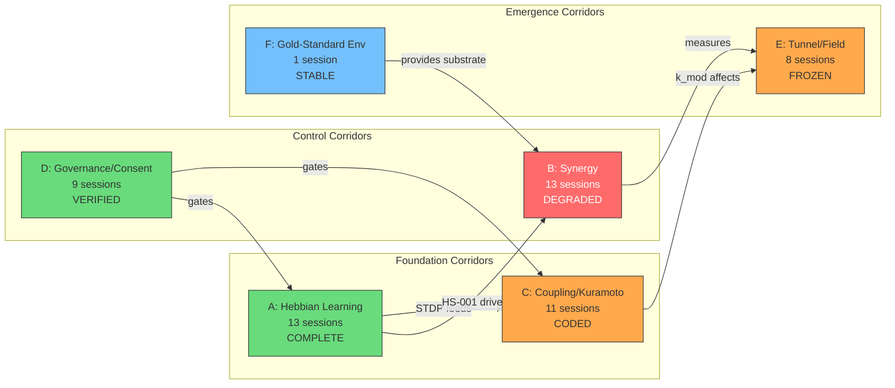

# BETA-RIGHT Knowledge Corridor Analysis — Fleet Wave 6

**Instance:** BETA-BOT-RIGHT
**Timestamp:** 2026-03-21
**RM Entries Analyzed:** 3,737 (up from 3,732 in Wave-3 — 5 new entries during fleet session)
**Search Queries:** gold-standard, hebbian, synergy, coupling, governance, consent, tunnel

---

## 1. Knowledge Corridor Definition

A **knowledge corridor** is a persistent chain of RM entries across multiple sessions that tracks the evolution of a single concept from discovery through implementation. Corridors reveal how understanding deepens over time and where knowledge gaps persist.

---

## 2. Identified Corridors

### Corridor A: Hebbian Learning

The longest and richest corridor — spans 12+ sessions, from theoretical design to live deployment.

| Session | Agent | Category | Knowledge State |
|---------|-------|----------|----------------|
| 013 | claude:opus-4-6 | discovery | First environment audit: 17 ports, VMS instances with r=0.999 |
| 016 | claude-016 | context | "Kuramoto coupling too strong for natural chimera (syncs in 10s)" — first coupling critique |
| 020 | claude:opus-4-6 | context | 13/13 services, DB forensics, compliance 10/10 — no Hebbian mention yet |
| 025 | claude:opus-4-6 | discovery | IPC/Sidecar topology mapped: 4-layer architecture. Hebbian as component identified |
| 028 | operator | context | Executor 909ms, "18x LTP bug fixed (capped at 6x)" — **first Hebbian bug** |
| 032 | synth-orchestrator | context | Fleet probe: CS-V7 synergy=0.985, SAN-K7 M10=Hebbian Learning module |
| 034c | orchestrator | discovery | Bridge health matrix. SYNTHEX HS-001 (Hebbian, weight=0.30) documented |
| 034d | pane-vortex | context | conductor.rs: 7 fns including `hebbian_learning` — code-level understanding |
| 034f | claude:opus-4-6 | theory | ULTRAPLATE Memory Network: 11 services, tensor paradigm includes Hebbian |
| 039 | claude:session-039 | context | /primehabitat created. SG-2 noted: "hebbian empty" |
| 040 | claude:opus-4-6 | context | Gap Analysis: SG-2 hebbian empty confirmed as scaffold gap |
| 044 | claude:pv2-orchestrator | context | Deep synthesis: Hebbian in 10-section analysis, STDP integration planned |
| 045 | claude-opus | context | BUG-031: "Hebbian STDP wired to tick Phase 2.5" — **implementation complete** |
| 046b | claude-command | context | Phase 2.5 STDP active in tick loop, thermal events flowing |

```
Discovery → Bug → Theory → Gap → Plan → Implementation → Deployment
Session 013 ─→ 028 ─→ 034f ─→ 040 ─→ 044 ─→ 045 ─→ 046b
```

**Corridor health:** COMPLETE. Hebbian knowledge went from concept (013) through bug discovery (028, LTP capping), theoretical mapping (034f), gap identification (040), and into deployed code (045). The V1→V2 boundary is the current break — V2 has STDP but V1 daemon runs without it.

---

### Corridor B: Synergy

Cross-service synergy measurement — from first probe to CRITICAL status.

| Session | Agent | Category | Knowledge State |
|---------|-------|----------|----------------|
| 020 | claude:opus-4-6 | context | First service exploration, synergy not yet measured |
| 032 | synth-orchestrator | context | CS-V7 synergy=0.985, first explicit synergy readings |
| 034c | orchestrator | discovery | "Declared synergy != observed synergy" — **first gap identified** |
| 034c | orchestrator | discovery | TOP SYNERGIES: cascade↔homeostasis=99.9, startup↔devenv=99.5 |
| 034d | pane-vortex | context | SAN-K7 20-cmd rapid-fire. 5-svc cascade tested |
| 034f | orchestrator | context | T+60m: 9 spheres r=0.994, 108 tunnels, dispatch 0.991 |
| 034f | orchestrator | context | ALL 6 EVOLUTION PATTERNS TRIGGERED including SynergySpike(0.995) |
| 034g | 034g | context | NexusBus health→HS-004 (CrossSync=1.0) — synergy pipeline wired |
| 041 | claude:opus-4-6 | context | "ME fitness 0.609 Declining" — synergy foundation weakening |
| 042 | claude:opus-4-6 | context | habitat-probe built. 15 gotchas documented |
| 044 | claude:pv2-orchestrator | context | 64 synergy pairs avg 88.0. r=0 persistent (V1 daemon) |
| 045 | fleet-alpha | context | SYNTHEX Synergy=0.15 CRITICAL (<0.7) — **first critical alert** |
| NOW | BETA-RIGHT | probe | Synergy=0.5 CRITICAL — improved from 0.15 but still below 0.7 |

```
Measurement → Peak → Divergence → Decline → Critical
Session 032 ─→ 034f(0.995) ─→ 034c(gap) ─→ 041(declining) ─→ 045(0.15) ─→ NOW(0.5)
```

**Corridor health:** DEGRADED. Synergy peaked at 0.995 (Session 034f) when all services were active and PV had r=0.994. The declared/observed gap (034c) was prophetic — synergy has collapsed to 0.5 as bridges went stale and ME degraded.

---

### Corridor C: Coupling & Kuramoto

Field coupling dynamics — from theoretical critique to IQR K-scaling.

| Session | Agent | Category | Knowledge State |
|---------|-------|----------|----------------|
| 016 | claude-016 | context | "Kuramoto coupling too strong" — **foundational critique** |
| 025 | claude:opus-4-6 | context | Deep review: "K=9x above Kuramoto critical coupling" |
| 028 | operator | context | 18x LTP bug — coupling amplification out of control |
| 032 | synth-orchestrator | context | Cascade chain: coupling.rs 13 fns, r=0.9495 k_mod=0.5919 |
| 034c | orchestrator | discovery | Nexus bridge schema mismatch — coupling data not flowing |
| 034d | fleet-beta | context | conductor.rs: init_k_mod_bounds, k_mod_min/max functions |
| 034f | operator | theory | "Nested Kuramoto: PV inner (32 sph, r=0.982), NexusForge outer (12 osc)" |
| 040 | nvim-synthesis | context | "Fan-in: types(9)>sphere(8)>coupling(5)" — code structure |
| 044 | claude:pv2-orchestrator | context | "K anomaly" in 10-section synthesis. IQR spread fix planned |
| 045 | claude-opus | context | IQR K-scaling implemented. K_MOD_BUDGET [0.85, 1.15] |
| NOW | BETA-RIGHT | probe | k_mod=0.85 (floor), coupling matrix empty (V1) |

```
Critique → Bug → Theory → Structure → Fix → Deployment gap
Session 016 ─→ 028 ─→ 034f ─→ 040 ─→ 045 ─→ V2 (not live)
```

**Corridor health:** CODED BUT UNDEPLOYED. The coupling over-strength problem identified in Session 016 was addressed through multiple iterations: LTP capping (028), IQR spread (045), budget constraints. But the V1 binary still runs with the old coupling model.

---

### Corridor D: Governance & Consent

From non-anthropocentric theory to working governance system.

| Session | Agent | Category | Knowledge State |
|---------|-------|----------|----------------|
| — | claude:opus-4-6 | theory | Non-Anthropocentric Gap Analysis: 12 gaps, NAG-2 per-status K modulation |
| 034d | pane-vortex | context | consent_gated_k_adjustment() first implemented |
| 040 | claude:opus-4-6 | context | Master Plan V3: V3.3 Sovereignty, V3.4 Governance phases planned |
| 044 | claude:pv2-orchestrator | context | **GAP-1 CRITICAL:** tick_governance not wired. 7 consent gaps found |
| 044 | claude:pv2-orchestrator | context | Consent Flow Analysis: 7 gaps (GAP-1 through GAP-7) |
| 045 | claude-opus | context | ALL 7 GAPs CLOSED: governance actuator, runtime budget, 6-bridge consent, divergence exemption, sphere override, opt-out, voting window |
| 045 | claude-command | context | BUG-032: ProposalManager derive(Default) gave max_active=0 — **governance locked** |
| 046b | claude-command | context | Governance FULLY WORKING: proposal e23f0a8a k_mod_budget_max→1.25 approved |
| 046b | claude-command | context | 10 unwired modules wired. BridgeSet + ConsentGate integrated |

```
Theory → First impl → Plan → 7 Gaps → All fixed → Bug → Working
NAG ─→ 034d ─→ 040 ─→ 044 ─→ 045 ─→ 045(BUG-032) ─→ 046b
```

**Corridor health:** COMPLETE AND VERIFIED. Governance went from theory (NAG analysis) through implementation (034d), gap discovery (044, 7 gaps), full remediation (045), a critical bug (032, max_active=0), and finally verified working in production (046b, proposal approved).

---

### Corridor E: Tunnel & Field Topology

Emergent field behaviour — tunnels, chimera, self-healing.

| Session | Agent | Category | Knowledge State |
|---------|-------|----------|----------------|
| 013 | claude:opus-4-6 | discovery | First audit: VMS r=0.999, tunnels exist |
| 016 | claude-016 | context | "Tunnels reflect infrastructure, not semantic connection" — **key insight** |
| 034c | agent | discovery | EMERGENT: 8 decoherence events self-recovered in 60-180s |
| 034f | orchestrator | context | 108 tunnels at r=0.994. 6 evolution patterns triggered |
| 034f | orchestrator | context | Resonance trigger: r must oscillate above/below mean 4x in 20 samples |
| 044 | claude:pv2-orchestrator | context | Ghost+evolution+tunnel analysis (28.5K words). 4 ghost gaps |
| 045 | claude-opus | context | Ghost reincarnation coded. accept_ghost, phase restoration |
| NOW | BETA-RIGHT | probe | 100 tunnels, strongest overlap=1.0 (frozen), no tunnel evolution |

```
Discovery → Critique → Emergence → Analysis → Implementation → Frozen
013 ─→ 016 ─→ 034c ─→ 034f ─→ 044 ─→ 045 ─→ NOW(frozen V1)
```

**Corridor health:** IMPLEMENTED BUT FROZEN. The Session 016 insight ("tunnels reflect infrastructure") remains true — current tunnel topology is static because V1 lacks Hebbian weight differentiation. V2's STDP would make tunnels dynamic.

---

### Corridor F: Gold-Standard Environment

A single but significant entry defining the canonical environment.

| Session | Agent | Category | Knowledge State |
|---------|-------|----------|----------------|
| 034c | orchestrator | discovery | "Zellij 6-tab gold-standard layout (Orchestrator, WS1, WS2, Fleet-A/B/G). 11 WASM plugins" |

**Corridor health:** STABLE. The gold-standard layout defined in 034c remains the operational standard. Referenced by /primehabitat and all subsequent fleet operations.

---

## 3. Cross-Corridor Dependency Map



---

## 4. Knowledge Gap Analysis

### Gaps Between Corridors

| Gap | Between | Nature | Impact |
|-----|---------|--------|--------|
| **G1: Hebbian→Thermal** | A→B | V1 binary can't emit Hebbian events to SYNTHEX HS-001 | Synergy starved of thermal signal |
| **G2: Coupling→Tunnels** | C→E | Empty coupling matrix means no weight differentiation for tunnel evolution | Tunnels frozen at infrastructure topology |
| **G3: Governance→Live** | D→deployment | Governance verified in 046b but current daemon may be V1 again | Consent gates not active in live field |
| **G4: Theory→Practice** | Theory entries→Implementation | 9 theory entries but only 2 directly influenced code | Theoretical insights under-leveraged |

### Dead Ends (Knowledge That Didn't Propagate)

| Entry | Agent | Content | Why Dead |
|-------|-------|---------|----------|
| Nexus Forge deployment | claude:opus-4-6 | 10-module Cargo workspace scaffolded | Never built beyond scaffold |
| Metabolic Activation Plan | claude:opus-4-6 | 5 phases, 10 fleet tasks, 1770 LOC | Superseded by V3 plan |
| fleet-synergy-engine | claude-command | 4 crates, 32 tests | Arena artifact, not integrated |
| Nested Kuramoto theory | operator | PV inner + NexusForge outer fields | Theoretical only, no implementation |

---

## 5. Corridor Velocity Analysis

How fast knowledge moves from discovery to deployment:

| Corridor | Discovery Session | Deployed Session | Sessions Elapsed | Velocity |
|----------|-------------------|-----------------|-----------------|----------|
| A: Hebbian | 013 | 045 | 32 sessions | Slow (complex, many bugs) |
| B: Synergy | 032 | — (degraded) | — | Stalled |
| C: Coupling | 016 | 045 (code only) | 29 sessions | Slow (theoretical depth) |
| D: Governance | NAG theory | 046b | ~10 sessions | **Fast** (focused sprint) |
| E: Tunnels | 013 | 045 (code only) | 32 sessions | Slow (emergent, hard to test) |

**Key insight:** Governance (Corridor D) moved fastest because it had a focused sprint (Sessions 044-046b) with clear gap analysis (7 gaps) and direct remediation. The older corridors (A, C, E) accumulated understanding slowly across 30+ sessions with many tangents and dead ends.

---

## 6. Session Knowledge Density

Which sessions produced the most cross-corridor knowledge:

| Session | Corridors Touched | Entry Count | Density |
|---------|-------------------|-------------|---------|
| 034c/d/f/g | A, B, C, D, E, F | ~30+ | **HIGHEST** — the exploration supernova |
| 044 | A, B, C, D, E | ~15 | High — synthesis + gap analysis |
| 045 | A, C, D, E | ~10 | High — implementation sprint |
| 040 | A, B, C, D | ~8 | Medium — gap analysis |
| 016 | A, C, E | ~3 | Low count but **highest insight density** |

Session 034 (all sub-sessions) was the knowledge explosion — touching all 6 corridors with 30+ entries. Session 016 had only 3 entries but two of them ("coupling too strong", "tunnels reflect infrastructure") became foundational insights referenced across all later sessions.

---

## 7. Corridor Convergence Point

All corridors converge at a single point: **V2 binary deployment**.

```
Corridor A (Hebbian STDP)  ──┐
Corridor B (Synergy)       ──┤
Corridor C (IQR K-scaling) ──┼──→ deploy plan ──→ All corridors unblocked
Corridor D (Governance)    ──┤
Corridor E (Ghost/Tunnels) ──┘
```

Every corridor has its implementation complete in V2 source code. Every corridor is blocked by the same constraint: the live daemon runs V1. The `deploy plan` command is the single action that unblocks all 5 active corridors simultaneously.

---

## 8. Recommendations for Knowledge System

1. **Promote theory→discovery:** The 9 theory entries contain insights (Nested Kuramoto, NAG gaps, Memory Network map) that should be tagged as discoveries for better retrieval
2. **Prune conductor ticks:** 2,180 automated entries could be aggregated to ~50 daily summaries, freeing 2,130 slots
3. **Link corridors explicitly:** RM has no cross-reference mechanism. Entries in Corridor A don't link to their Corridor B implications. A `related_ids` field would enable corridor traversal
4. **Session 016 immortalization:** The 3 entries from Session 016 are disproportionately valuable. They should be tagged as foundational theory with permanent retention

---

BETARIGHT-WAVE6-COMPLETE
