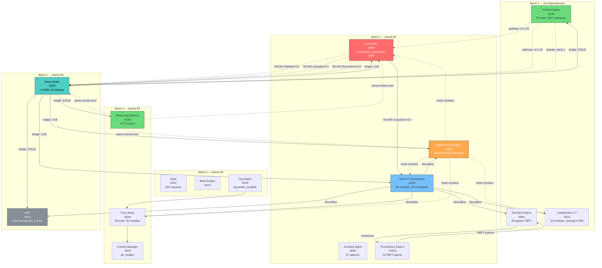

# BETA-RIGHT Service Mesh Deep Map — Fleet Wave 4

**Instance:** BETA-BOT-RIGHT
**Timestamp:** 2026-03-21
**Services Probed:** 16/16 active

---

## 1. Service Health Matrix (All 16 Active)

| Service | Port | Status | Uptime | Key Metrics |
|---------|------|--------|--------|-------------|
| ME (Maintenance Engine) | 8080 | healthy | 232,795s (~2.7d) | fitness=0.609, db_connected, overall_health=0.5875 |
| DevOps Engine | 8081 | healthy | 0s (just restarted?) | 40 agents, quorum_met, 6 subsystems operational |
| SYNTHEX | 8090 | healthy | — | temp=0.03, synergy=0.5 CRITICAL |
| SAN-K7 Orchestrator | 8100 | healthy | 232,802s | 45/55 modules healthy, 20 commands, 151 executions |
| NAIS | 8101 | healthy | 232,798s | 61,885 requests |
| Bash Engine | 8102 | healthy | 232,796s | v1.0.0 |
| Tool Maker | 8103 | healthy | 232,812s | byzantine_enabled |
| Context Manager | 8104 | healthy | 232,811s | db_healthy, v0.1.0 |
| Tool Library | 8105 | healthy | 232,810s | 55 modules, 65 tools, 8 services, synergy=0.93 |
| CodeSynthor V7 | 8110 | healthy | 232,794s | 62 modules, 17 layers, synergy=0.985, 61,923 requests |
| VMS (Vortex Memory) | 8120 | healthy | — | r=0.0, zone=Incoherent, 1 sphere, 0 memories |
| POVM Engine | 8125 | healthy | — | 50 memories, 2,427 pathways, 0 crystallised |
| Reasoning Memory | 8130 | healthy | — | 3,737 entries, 5 categories |
| Pane-Vortex | 8132 | healthy | — | r=0.693, 34 spheres, tick ~72K, k_mod=0.85 |
| Architect Agent | 9001 | healthy | 232,804s | 67 patterns, 50,238 requests |
| Prometheus Swarm | 10001 | healthy | 65,993s (~18h) | 40 agents, PBFT n=40 f=13 quorum=27 |

**Uptime anomalies:**
- DevOps Engine reports 0s uptime — likely just restarted or uptime counter reset
- Prometheus Swarm uptime 66K vs others ~233K — restarted ~46h after others

---

## 2. Endpoint Deep Probe Results

### POVM Engine (8125) — 3 endpoints

| Endpoint | Response | Cross-Refs |
|----------|----------|------------|
| `/pathways` | 2,427 pathways, weight range [0.15, 1.0462] | References: `nexus-bus:cs-v7→synthex`, `nexus-bus:devenv-patterns→pane-vortex`, `operator-028→alpha-left` |
| `/hydrate` | 50 memories, latest_r=0.690, 0 crystallised, 0 sessions | References PV field r value |
| `/consolidate` | Empty response (no pending consolidation) | — |
| `/memories` | 50 memories with tensors, session-027/027b data | References sessions, PV field state, Zellij tabs |

**Cross-service refs in POVM:** nexus-bus (SAN-K7), synthex, pane-vortex, devenv-patterns, operator, alpha-left (fleet)

### Reasoning Memory (8130) — 2 endpoints

| Endpoint | Response | Cross-Refs |
|----------|----------|------------|
| `/health` | 3,737 entries, 5 categories | — |
| `/search?q=*` | Returns matching entries with agent, category, content | References ALL services: ME, SYNTHEX, SAN-K7, PV, POVM, VMS, fleet instances, sessions |

**Cross-service refs in RM:** Every service appears in context/discovery entries. RM is the universal knowledge sink.

### VMS (8120) — 2 endpoints

| Endpoint | Response | Cross-Refs |
|----------|----------|------------|
| `/health` | r=0.0, zone=Incoherent, 1 sphere, 0 memories | References its own field state |
| `/memories` | Empty response | — |

**VMS state:** Essentially dormant. Zone=Incoherent with zero memories. The single sphere is likely VMS's own internal state. Disconnected from the wider field.

### SYNTHEX (8090) — 4 endpoints

| Endpoint | Response | Cross-Refs |
|----------|----------|------------|
| `/api/health` | healthy | — |
| `/v3/thermal` | temp=0.03, 4 heat sources, PID=-0.335 | References: Hebbian (from PV), Cascade (from PV), Resonance (from PV), CrossSync (from NexusBus) |
| `/v3/diagnostics` | health=0.75, synergy=0.5 CRITICAL | Synergy score reflects cross-service coherence |
| `/v3/homeostasis` | Empty response | — |

**Cross-service refs in SYNTHEX:** Heat source HS-004 (CrossSync) reads from NexusBus. HS-001/002/003 should read from PV but are zero (V1 bridge broken).

### ME (8080) — 3 endpoints

| Endpoint | Response | Cross-Refs |
|----------|----------|------------|
| `/api/health` | fitness=0.609, db_connected, health=0.5875 | — |
| `/api/observer` | Degraded, declining, gen 26, 433K events, 4.8M correlations | References Ralph cycles, mutations targeting emergence_detector.min_confidence |
| `/api/evolution` | 255 mutations applied, 3 rolled back, ralph phase=Harvest | All recent mutations target `emergence_detector.min_confidence` |

**Cross-service refs in ME:** Observer watches ALL services via mesh. Evolution targets internal parameters. No direct outbound calls visible in responses.

### SAN-K7 (8100) — 3 endpoints

| Endpoint | Response | Cross-Refs |
|----------|----------|------------|
| `/api/v1/nexus/health` | 3 components healthy: executor, metrics, registry | 20 commands registered, 151 executions |
| `/api/v1/nexus/modules` | 45 modules across 8 layers | References: Hebbian Learning (M10), Chaos Engineering (M14), Security (M17+) |
| `/api/v1/nexus/command` | synergy-check routes to M45 | M45 static route |

**Cross-service refs in SAN-K7:** Module M10 (Hebbian Learning) mirrors PV's Hebbian STDP concept. NexusBus bridges to CodeSynthor, Tool Library, ME, VMS, DevOps.

### PV (8132) — 3 endpoints beyond /health

| Endpoint | Response | Cross-Refs |
|----------|----------|------------|
| `/spheres` | 34 spheres (orchestrator-044, 4:*, 5:*, 6:*, ORAC7:*) | References Zellij tab:pane IDs and ORAC7 session IDs |
| `/bridges/health` | 6 bridges: ME/Nexus/SYNTHEX live, POVM/RM/VMS stale | References all 6 downstream services directly |
| `/field/decision` | HasBlockedAgents, r=0.693, 100 tunnels, 6 blocked | References sphere IDs from Zellij panes |

**Cross-service refs in PV:** Bridges to ME (8080), SAN-K7/Nexus (8100), SYNTHEX (8090), POVM (8125), RM (8130), VMS (8120). PV is the central hub.

### Additional Services

| Service | Port | Endpoint | Notable |
|---------|------|----------|---------|
| CodeSynthor V7 | 8110 | `/health` | 62 modules, 17 layers, M1↔M62 bidirectional loop, synergy=0.985 |
| Tool Library | 8105 | `/health` | 65 tools across 55 modules, synergy_threshold=0.93, 8 services |
| DevOps Engine | 8081 | `/health` | 40 agents, PBFT quorum_met, 6 subsystems (cache, consensus, hebbian, mycelial, pipeline, tensor_memory) |
| Architect Agent | 9001 | `/health` | 67 patterns loaded, 50K requests |
| Prometheus Swarm | 10001 | `/health` | 40 PBFT agents, n=40, f=13, quorum=27 |

---

## 3. Service Mesh Dependency Graph



---

## 4. Cross-Service Reference Matrix

This matrix shows which service **references** which other services in its API responses:

| Source ↓ / Ref → | ME | SYNTHEX | SAN-K7 | PV | POVM | RM | VMS | CSV7 | DevOps | ToolLib | Prom | NAIS | Bash | ToolMk | Ctx | Arch |
|------------------|:--:|:-------:|:------:|:--:|:----:|:--:|:---:|:----:|:------:|:-------:|:----:|:----:|:----:|:------:|:---:|:----:|
| **PV** | B | B | B | — | B | B | B | | | | | | | | | |
| **SYNTHEX** | | — | HS4 | HS1-3 | | | | | | | | | | | | |
| **ME** | — | mesh | mesh | | | | | mesh | | mesh | | | | | | |
| **SAN-K7** | bus | | — | | | | bus | bus | bus | bus | | | | | | |
| **POVM** | | pw | | pw | — | | | | | | | | | | | |
| **RM** | ctx | ctx | ctx | ctx | ctx | — | ctx | | | | | | | | | |
| **VMS** | | | | | | | — | | | | | | | | | |
| **DevOps** | | | | | | | | | — | | con | | | | | |
| **Prometheus** | | | | | | | | | con | | — | | | | | |

Legend: **B**=bridge, **HS**=heat source, **mesh**=monitoring, **bus**=NexusBus, **pw**=pathway, **ctx**=context entry, **con**=consensus

---

## 5. Communication Pattern Analysis

### Hub-and-Spoke: PV as Central Hub
PV maintains 6 explicit bridges to downstream services. It is the only service with direct connections to both memory tier (POVM, RM, VMS) and control tier (ME, SYNTHEX, SAN-K7). All field coordination flows through PV.

### NexusBus: SAN-K7 as Message Bus
SAN-K7 operates as a secondary hub via NexusBus, connecting 5 services (CSV7, ToolLib, ME, VMS, DevOps). It provides command routing (20 registered commands) and module health aggregation (45 modules across 8 layers).

### Thermal Feedback Loop (BROKEN)
```
PV → (Hebbian/Cascade/Resonance events) → SYNTHEX → (thermal adjustments) → PV
     ↑ Currently broken (V1 binary)            ↑ CrossSync via NexusBus works
```

### Knowledge Sink: RM
RM receives entries from every service but doesn't push data outward. It's a write-heavy store (3,737 entries) with search-on-demand reads. No proactive knowledge distribution.

### PBFT Consensus Ring
DevOps Engine (40 agents) and Prometheus Swarm (40 agents, n=40, f=13, quorum=27) form a consensus ring. Both report PBFT-capable quorum.

---

## 6. Service Isolation Assessment

| Service | Inbound Refs | Outbound Refs | Coupling | Role |
|---------|-------------|---------------|----------|------|
| PV | 5 (SYNTHEX HS, POVM pw, RM ctx) | 6 (bridges) | **HIGH** — central hub | Coordinator |
| SYNTHEX | 3 (PV bridge, SAN-K7 HS4, ME mesh) | 4 (HS inputs) | HIGH — thermal feedback | Regulator |
| SAN-K7 | 2 (PV bridge, SYNTHEX HS4) | 5 (NexusBus) | HIGH — message bus | Router |
| ME | 3 (PV bridge, SAN-K7 bus, ME mesh self) | 4 (mesh monitors) | MEDIUM — observer | Monitor |
| POVM | 1 (PV bridge stale) | 2 (pathway refs) | LOW — isolated | Memory |
| RM | 1 (PV bridge stale) | 0 (sink only) | LOW — write-only sink | Archive |
| VMS | 2 (PV bridge stale, SAN-K7 bus) | 0 | **VERY LOW** — dormant | Memory (unused) |
| CSV7 | 2 (SAN-K7 bus, ME mesh) | 0 | LOW — self-contained | Compute |
| DevOps | 2 (SAN-K7 bus, Prom consensus) | 1 (Prom) | LOW | Orchestrator |
| Prometheus | 1 (DevOps consensus) | 1 (DevOps) | LOW | Consensus |
| ToolLib | 2 (SAN-K7 bus, ME mesh) | 1 (Ctx) | LOW | Registry |
| NAIS | 0 visible | 0 visible | **ZERO** — opaque | Intelligence |
| Bash Engine | 0 visible | 0 visible | **ZERO** — opaque | Execution |
| Tool Maker | 0 visible | 1 (ToolLib) | LOW | Factory |
| Context Manager | 1 (ToolLib) | 0 visible | LOW | Storage |
| Architect Agent | 0 visible | 0 visible | **ZERO** — opaque | Design |

---

## 7. Key Findings

### Architecture Topology
1. **Star topology** centered on PV (6 bridges) with SAN-K7 as secondary hub (5 NexusBus connections)
2. **Three tiers:** Control (ME, SYNTHEX, SAN-K7), Memory (POVM, RM, VMS), Compute (CSV7, ToolLib, ToolMaker, NAIS, Bash)
3. **Two consensus rings:** DevOps Engine (40 agents) and Prometheus Swarm (40 agents, PBFT n=40)

### Active Data Flows
- **SAN-K7→SYNTHEX:** CrossSync heat source (HS-004) at 0.2 — the ONLY active thermal input
- **PV→ME:** Bridge live, ME mesh monitoring PV
- **PV→SAN-K7:** Bridge live, NexusBus command routing functional
- **RM←ALL:** Universal knowledge sink, 3,737 entries from 550+ agents

### Broken Data Flows
- **PV→POVM:** Bridge stale — POVM pathway data (2,427) not refreshing
- **PV→RM:** Bridge stale — RM entries from PV are historical only
- **PV→VMS:** Bridge stale — VMS is zone=Incoherent with 0 memories
- **PV→SYNTHEX HS1-3:** V1 binary doesn't emit Hebbian/Cascade/Resonance events

### Dormant Services
- **VMS:** Fully dormant (r=0.0, 0 memories, 1 sphere). Connected via both PV bridge (stale) and NexusBus but producing nothing.
- **NAIS, Bash Engine, Architect Agent:** Healthy but opaque — no cross-refs visible in other services' responses. Functionally isolated.

### Consensus Health
- DevOps Engine: 40 agents, quorum_met=true, all 6 subsystems operational (cache, consensus, hebbian, mycelial, pipeline, tensor_memory)
- Prometheus Swarm: 40 PBFT agents, quorum=27, f=13 fault tolerance. Restarted ~18h ago (65,993s vs others ~232,800s)

---

BETARIGHT-WAVE4-COMPLETE
