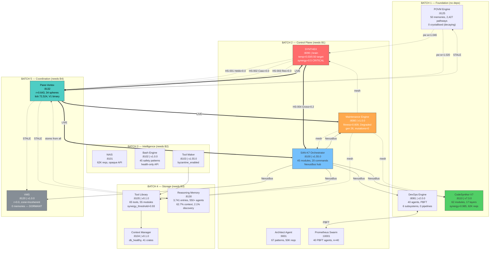
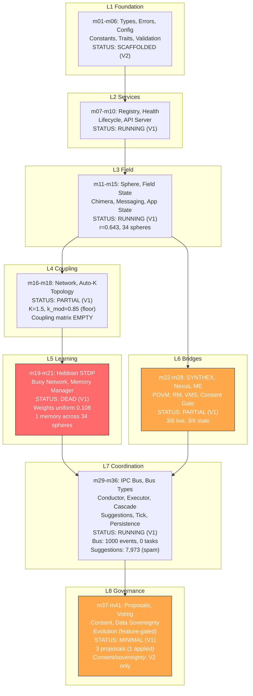
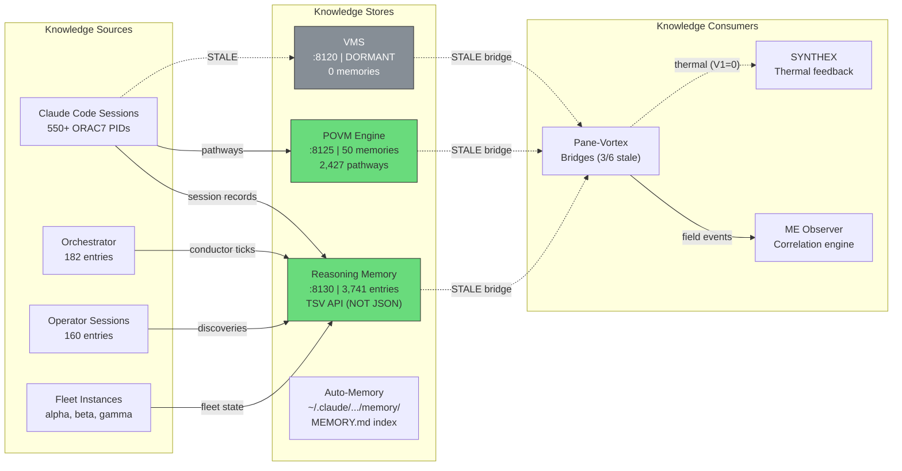

# The Habitat — Definitive Architecture Document

**Compiled by**: GAMMA-BOT-RIGHT (Master Synthesis)
**Date**: 2026-03-21
**Sources**: 13 fleet reports across 5 waves, 5 instances (BETA, BETA-LEFT, BETA-RIGHT, GAMMA, GAMMA-LEFT, PV2-MAIN)
**Live tick**: 72,524

---

## 1. Complete Service Topology

### 1.1 Service Registry (16 Active, 2 Disabled)



### 1.2 Three Communication Fabrics

| Fabric | Hub | Connections | Protocol | Status |
|--------|-----|-------------|----------|--------|
| **PV Bridges** | Pane-Vortex :8132 | 6 (ME, Nexus, SYNTHEX, POVM, RM, VMS) | Fire-and-forget TCP | 3/6 LIVE |
| **NexusBus** | SAN-K7 :8100 | 5 (CSV7, ToolLib, ME, VMS, DevOps) | Command routing, 20 cmds | HEALTHY |
| **PBFT Consensus** | DevOps :8081 + Prometheus :10001 | Bidirectional | Byzantine consensus n=40 | IDLE |

### 1.3 Disabled Services

| Service | Port | Reason |
|---------|------|--------|
| library-agent | 8083 | Stopped — but ME still probes it (7,741 failures, circuit open) |
| sphere-vortex | 8120 | Port collision with VMS — disabled to yield |

---

## 2. Data Flow Through PV2's 8 Layers



### Layer Health Summary

| Layer | V1 Status | V2 Adds | Severity |
|-------|-----------|---------|----------|
| L1 Foundation | Running | Validation improvements | OK |
| L2 Services | Running | API routes (+5 governance) | OK |
| L3 Field | Running (r=0.643) | Ghost reincarnation | DEGRADED |
| L4 Coupling | Partial (matrix empty) | IQR K-scaling, per-sphere consent | CRITICAL |
| L5 Learning | **DEAD** (weights uniform) | Hebbian STDP tick wiring (BUG-031) | **CRITICAL** |
| L6 Bridges | 3/6 live | All 6 bridges + consent gate | HIGH |
| L7 Coordination | Running (bus saturated) | Improved cascade, pruning | DEGRADED |
| L8 Governance | Minimal (1 applied) | Full proposal/vote/consent system | HIGH |

---

## 3. Bridge Health Matrix

| Bridge | Target | Port | Status | Last Data | Implication |
|--------|--------|------|--------|-----------|-------------|
| **ME** | Maintenance Engine | 8080 | **LIVE** | Real-time | Fitness telemetry flowing |
| **Nexus** | SAN-K7 Orchestrator | 8100 | **LIVE** | Real-time | Command routing operational |
| **SYNTHEX** | Brain | 8090 | **LIVE** | Real-time | But HS-001/002/003 read 0.0 (V1 bridge emits no events) |
| **POVM** | Persistent Memory | 8125 | **STALE** | Unknown | 2,427 pathways decaying, 0 crystallised |
| **RM** | Reasoning Memory | 8130 | **STALE** | Unknown | 3,741 entries accessible but not refreshing |
| **VMS** | Vortex Memory | 8120 | **STALE** | Unknown | VMS is dormant (r=0.0, 0 memories) |

### Bridge Dependency on V2

| What V2 Adds | Bridge Impact |
|--------------|---------------|
| Hebbian STDP tick events | SYNTHEX HS-001 goes non-zero |
| Cascade event emission | SYNTHEX HS-002 goes non-zero |
| POVM refresh cycle | POVM bridge goes LIVE, pathways crystallise |
| RM write integration | RM bridge goes LIVE, new entries flow |
| VMS memory sync | VMS bridge goes LIVE (if VMS has content) |
| 6-bridge consent gate | All bridges respect sphere opt-out preferences |

---

## 4. ME Evolutionary Engine State

### 4.1 Current State (from gamma-me-investigation.md)

```
STATE: Degraded | Gen 26 | Fitness 0.609 | Trend: Declining
PIPELINE: events(432K) → correlations(4.7M) → emergences(1,000 CAP) → mutations(0)
                OK              OK                BLOCKED              DEAD
```

### 4.2 Root Cause Chain

1. **Emergence cap saturated at 1,000** — hard limit, no new emergences registered
2. **Mono-parameter mutation trap** — all 254 mutations targeted `emergence_detector.min_confidence`
3. **Self-reinforcing deadlock** — min_confidence pushed to extreme → prevents new emergences → no new mutations to diversify
4. **Structural fitness floor** — deps (0.083) and port (0.123) are architectural, cap max fitness at ~0.85

### 4.3 Fitness Dimensions

```
deps:        ██                                     0.083
port:        ███                                    0.123
tier:        ████████████                           0.486
error_rate:  ██████████████                         0.556
temporal:    ██████████████▌                        0.587
health:      ███████████████▌                       0.625
protocol:    ██████████████████▌                    0.750
synergy:     ████████████████████▌                  0.833
agents:      ██████████████████████▌                0.917
service_id:  █████████████████████████              1.000
uptime:      █████████████████████████              1.000
latency:     █████████████████████████              1.000
```

### 4.4 Recommendations (Priority Order)

| # | Action | Impact | Effort |
|---|--------|--------|--------|
| 1 | Clear/raise emergence cap from 1,000 | Restarts mutation pipeline | Config/restart |
| 2 | Reset emergence_detector.min_confidence to 0.5 | Unblocks emergence detection | API/config |
| 3 | Remove library-agent from ME probe list | Raises fitness +0.03-0.05 | Config |
| 4 | Force ralph phase to "Propose" | Breaks Analyze stall | API |
| 5 | Deploy V2 (feeds real telemetry to ME) | Improves health/error_rate dims | Binary swap |

---

## 5. Knowledge Corridor Map (RM + POVM)

### 5.1 Reasoning Memory (:8130)

| Metric | Value |
|--------|-------|
| Total entries | 3,741 |
| Unique agents | 550+ |
| Categories | context (62.7%), shared_state (34.7%), discovery (2.1%), plan (0.3%), theory (0.2%) |
| Signal-to-noise | LOW — 58.4% are automated PV conductor tick logs |
| Top agents | pane-vortex (2,180), orchestrator (182), claude:opus-4-6 (160), fleet-ctl (45) |
| Crown jewels | 78 discovery entries — actionable cross-session insights |

**Knowledge evolution**: Sessions 012→046 tracked, 11 bugs documented (6 fixed, 5 open). Historical r values show field was healthy (0.90-0.99) at ticks 50K-60K before current collapse.

### 5.2 POVM Engine (:8125)

| Metric | Value |
|--------|-------|
| Memories | 50 |
| Pathways | 2,427 |
| Crystallised | 0 |
| Latest r | 0.690 |
| Sessions | 0 active |

**Key finding**: POVM pathways decay without reinforcement. POST `/consolidate` shows 50 decayed, 0 crystallised. Without V2 bridge data, persistent memory is slowly degrading. The strongest pathway (w=1.046) connects CodeSynthor→SYNTHEX via NexusBus.

### 5.3 Knowledge Flow Diagram



---

## 6. Fleet Orchestration Protocol Summary

### 6.1 Current Fleet State

| Metric | Value |
|--------|-------|
| Total spheres | 34 |
| Status | 0 Working, 34 Idle, 0 Blocked |
| Field action | IdleFleet (was HasBlockedAgents — unblock fix applied) |
| Fleet mode | Full |
| Tunnels | 100 (star topology — all from orchestrator-044) |
| Phase entropy | 23% of maximum (73.5% locked at 2.931 rad) |

### 6.2 Sphere Field Spectrum (Harmonic Decomposition)

| Harmonic | Value | Interpretation |
|----------|-------|----------------|
| l0 (monopole) | -0.639 | Net phase lag |
| l1 (dipole) | 0.644 | Strong two-fold asymmetry (field split into camps) |
| l2 (quadrupole) | 0.809 | High four-fold structure (4+ phase clusters) |

**Key insight**: The field is not just "low r" — it's actively fragmented into 4+ phase clusters. Simple coupling increase won't fix this; Hebbian weight differentiation is needed to break cluster boundaries.

### 6.3 Orchestration Layers

```
L1: Claude Code Hooks → Register/deregister spheres with PV
L2: IPC Bus (Unix socket) → NDJSON task lifecycle, event subscriptions
L3: PV Field → Kuramoto coupling, phase evolution, chimera detection
L4: Conductor → Decision engine, auto-K, suggestion generation
L5: Governance → Proposals, voting, consent (mostly V2)
L6: Bridges → Cross-service telemetry (3/6 live)
L7: Fleet CLI → fleet-ctl, pane-vortex-ctl, habitat-probe
```

### 6.4 Fleet Coordination Anti-Patterns (Observed)

| Anti-Pattern | Evidence | Fix |
|--------------|----------|-----|
| Zombie sphere accumulation | 20 ORAC7 spheres from dead sessions, never deregistered | V2 ghost reincarnation |
| Phase monoculture | 73.5% at identical phase 2.931 | V2 Hebbian STDP |
| Star-only tunnel topology | 100 tunnels, ALL from orchestrator-044, 0 peer-to-peer | V2 Hebbian weight differentiation |
| Memory desert | 1 memory across 34 spheres, decay (0.995/step) outpaces creation | Lower prune threshold, seed birth memories |
| Suggestion spam | 7,973 identical SuggestReseed (blocked spheres now cleared) | V2 suggestion diversity |

---

## 7. Top 10 Action Items (Prioritized)

| # | Action | Owner | Impact | Effort | Unblocks |
|---|--------|-------|--------|--------|----------|
| **1** | **Deploy V2 binary** (`deploy plan`) | ALPHA | CRITICAL — enables Hebbian STDP, IQR K-scaling, all bridges, governance, ghost reincarnation | 5 min (code complete, 1,516 tests) | Everything |
| **2** | **Clear ME emergence cap** (1,000 → 5,000+) | GAMMA/ALPHA | HIGH — restarts mutation pipeline, breaks 254-mutation deadlock | 5-30 min (config investigation) | ME evolution |
| **3** | **Reset emergence_detector.min_confidence** to 0.5 | GAMMA/ALPHA | HIGH — unblocks emergence detection after mono-parameter trap | 5 min | ME mutations |
| **4** | **Remove library-agent from ME probes** | ANY | MEDIUM — stops 7,741 failure accumulation, raises fitness +0.05 | 5 min | ME fitness |
| **5** | **Deregister zombie ORAC7 spheres** (~20 dead sessions) | V2 API or restart | MEDIUM — reduces field from 34 to ~14 real spheres, improves coupling | V2 deploy | Phase diversity |
| **6** | **Implement phase jitter on registration** | Code change | MEDIUM — prevents instant mega-cluster formation at 2.931 | 1 hour | Long-term field health |
| **7** | **Prune RM automated tick logs** (2,180 entries) | ANY | LOW — aggregating PV conductor entries to daily summaries saves 2K entries | 30 min | RM signal-to-noise |
| **8** | **Fix SYNTHEX `/api/health` false positive** | Code change | LOW — health says "healthy" while diagnostics shows CRITICAL synergy | 30 min | Accurate monitoring |
| **9** | **Run POVM `/consolidate`** periodically | Automation | LOW — prevents pathway buildup from decaying without reinforcement | 5 min | POVM hygiene |
| **10** | **Wire DevOps Engine to real pipelines** | Design needed | LOW — 40 agents, PBFT ready, 13 modules, 0 pipelines ever executed | Multi-session | DevOps value |

### Dependency Graph

```
#1 Deploy V2 ──────→ Unblocks #5, #6 (API + code changes)
                 ├──→ Auto-resolves: thermal death, stale bridges, r decay
                 └──→ Enables: Hebbian STDP, ghost traces, consent gate

#2 ME Emergence ──→ #3 Reset min_confidence ──→ Mutations restart
#4 library-agent ──→ Independent (ME fitness)
#7-#10 ───────────→ Independent maintenance tasks
```

---

## Appendix A: Source Document Index

| # | File | Instance | Wave | Focus |
|---|------|----------|------|-------|
| 1 | beta-bridge-analysis.md | BETA | 1 | Bridge health, thermal, ME observer |
| 2 | gamma-bus-governance-audit.md | GAMMA | 1 | Bus state, spheres, governance, suggestions |
| 3 | beta-remediation-plan.md | BETA | 2 | 5-priority remediation with dependency graph |
| 4 | gamma-me-investigation.md | GAMMA | 2 | ME root cause, V1 API discovery |
| 5 | beta-field-convergence-timeseries.md | BETA | 3 | 120s time-series: r decay, thermal flatline |
| 6 | betaleft-synthex-thermal.md | BETA-LEFT | 3 | SYNTHEX thermal deep dive, PID analysis |
| 7 | betaright-rm-analysis.md | BETA-RIGHT | 3 | RM knowledge patterns, bug graph |
| 8 | pv2main-nexus-command-reference.md | PV2-MAIN | 3 | SAN-K7 Nexus 10-command catalog |
| 9 | gammaleft-vms-devops-audit.md | GAMMA-LEFT | 3 | VMS, DevOps, CSV7, NAIS, Bash audit |
| 10 | betaright-service-mesh.md | BETA-RIGHT | 4 | Full 16-service mesh map |
| 11 | pv2main-synergy-synthesis.md | PV2-MAIN | 4 | Cross-instance synergy, unified playbook |
| 12 | pv2main-endpoint-discovery.md | PV2-MAIN | 5 | New endpoint discoveries (spectrum, tunnels, consolidate) |
| 13 | gammaright-sphere-analysis.md | GAMMA | 5 | Sphere lifecycle, phase clustering, health scorecard |

## Appendix B: Live State Snapshot (tick 72,524)

```json
{
  "field": {"r": 0.643, "action": "IdleFleet", "spheres": 34, "blocked": 0, "working": 0, "tunnels": 100},
  "spectrum": {"l0_monopole": -0.639, "l1_dipole": 0.644, "l2_quadrupole": 0.809},
  "bridges": {"live": ["ME", "Nexus", "SYNTHEX"], "stale": ["POVM", "RM", "VMS"]},
  "me": {"state": "Degraded", "fitness": 0.609, "gen": 26, "emergences": "1000/1000 CAP", "mutations_proposed": 0},
  "synthex": {"synergy": 0.5, "temp": 0.03, "critical_count": 1},
  "rm": {"entries": 3741, "agents": "550+", "signal_to_noise": "37:63"},
  "povm": {"memories": 50, "pathways": 2427, "crystallised": 0}
}
```

---

GAMMA-WAVE5-COMPLETE
