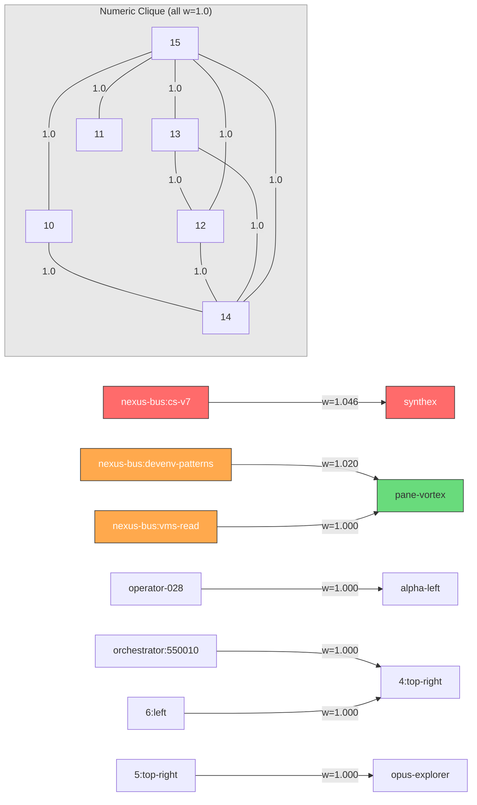

# WAVE-5 GAMMA-LEFT: POVM Pathway Network Analysis

> **Agent:** GAMMA-LEFT | **Date:** 2026-03-21 | **Wave:** 5
> **Source:** `localhost:8125` (pathways, memories, hydrate)

---

## 1. Pathway Network Overview

| Metric | Value |
|--------|-------|
| Total pathways | 2,427 |
| Unique nodes | 223 |
| Connected components | 24 (1 giant @ 154 nodes + 23 islands) |
| Mean weight | 0.303 |
| Weight > 0.9 | 51 edges (2.1%) |
| Weight > 1.0 | 2 edges (supra-unity) |

## 2. Memory Inventory (50 memories)

### By Session Source

| Session | Count | Intensity | Era |
|---------|-------|-----------|-----|
| null (untagged) | 39 | 0.656–0.900 | Sessions 031–046b |
| session-027 | 6 | 0.656 | Fleet + nvim + IPC |
| session-027-fascinating-tambourine | 1 | 0.656 | Zellij devenv deployment |
| session-027b-pane-mastery | 1 | 0.656 | Pane navigation |
| session-027c-schematics | 1 | 0.656 | Architecture schematics |
| session-027-reflections | 1 | 0.656 | Operational learnings |
| session-027-nexus-analysis | 1 | 0.656 | NexusForge analysis |

### By Content Category

| Category | Count | Key Topics |
|----------|-------|------------|
| **Session State** | 16 | Session milestones (031, 038, 039, 043, 044, 045, 046b) |
| **Architecture** | 8 | Schematics, nexus analysis, IPC bus, ME deep dive |
| **Mastery/Skills** | 8 | Nvim, lazygit, atuin, yazi, pane nav, primehabitat |
| **Reflections** | 6 | Operational learnings, pioneer loop, chain discoveries |
| **Fleet Ops** | 5 | Fleet coordination, dispatch, cascade verify |
| **Remediation** | 4 | Bug fixes, deploy readiness, remediation plans |
| **Identity** | 2 | THE HABITAT naming, backup contingency |
| **Exploration** | 1 | SYNTHEX 42K LOC |

### By Intensity Band

| Intensity | Count | Meaning |
|-----------|-------|---------|
| 0.656 | 22 | 4 decay cycles survived (oldest, Session 027-032) |
| 0.729 | 13 | 3 decay cycles (Session 039) |
| 0.810 | 5 | 2 decay cycles (Session 043-044) |
| 0.900 | 10 | 1 decay cycle (Session 045-046b, most recent) |

**Decay pattern:** Intensity decreases by factor 0.9 per cycle. No memories have crystallised (crystallised_count=0).

### Notable: Zero Access Counts

All 50 memories have `access_count: 0`. POVM is storing memories but nothing is reading them back. The hydration pathway exists (`/hydrate` returns counts) but no service is calling it.

---

## 3. Hydration State

```json
{
  "crystallised_count": 0,
  "latest_r": 0.637,
  "memory_count": 50,
  "pathway_count": 2427,
  "session_count": 0
}
```

| Field | Value | Assessment |
|-------|-------|------------|
| crystallised_count | 0 | No memories promoted to permanent — decay will eventually erase all |
| latest_r | 0.637 | Last PV field coherence reported to POVM |
| memory_count | 50 | Active memory pool |
| pathway_count | 2,427 | Full pathway network |
| session_count | 0 | No active sessions registered — POVM doesn't know who's connected |

**Gap:** `session_count=0` means POVM has no awareness of active consumers. Memories are written but never read, pathways exist but aren't reinforced via co-activation.

---

## 4. Top 20 Strongest Pathways — Mermaid Graph



### Pathway Interpretation

**Layer 1 — Supra-Unity (Learned):**
- `nexus-bus:cs-v7 -> synthex` (1.046): CodeSynthor V7 feeding SYNTHEX is the single strongest learned association in the entire POVM graph. Weight exceeds 1.0 from repeated Hebbian reinforcement.
- `nexus-bus:devenv-patterns -> pane-vortex` (1.020): DevEnv configuration patterns flowing to PV.

**Layer 2 — Service Bindings (w=1.0):**
- Three `nexus-bus:*` nodes connect to `pane-vortex` (devenv-patterns, vms-read, tool-library) — PV is the nexus bus's primary consumer.
- `operator-028 -> alpha-left`: Session 028 operator bound to fleet ALPHA left pane.
- `orchestrator:550010 -> 4:top-right` and `6:left -> 4:top-right`: Cross-tab orchestrator dispatch routes.

**Layer 3 — Numeric Clique (w=1.0):**
- Nodes 10-15 form a perfect 6-clique at unity weight. These are initialization artifacts (likely ORAC7 generation indices or batch-registered sphere IDs). They contain no semantic meaning and inflate graph metrics.

---

## 5. Service Connectivity via POVM

Which services connect through the POVM pathway network:

```
                    ┌─────────────────────────────────────────┐
                    │           POVM Pathway Network          │
                    │                                         │
   CodeSynthor ─────┤  cs-v7 ──(1.046)──> synthex            │
                    │                                         │
   DevEnv Patterns ─┤  devenv ──(1.020)──> pane-vortex       │
                    │  vms-read ─(1.000)──> pane-vortex       │
   VMS Read ────────┤  tool-lib ─(0.970)──> pane-vortex       │
   Tool Library ────┤                                         │
                    │  pv_bridge ─(0.950)──> reasoning_memory │
   PV Bridge ───────┤  pv_bridge ─(0.950)──> povm_engine      │
                    │                                         │
   ME + DevOps ─────┤  devops ──(0.827)──> maintenance        │
                    │                                         │
   Fleet Panes ─────┤  alpha/beta/gamma panes (0.900-1.000)  │
                    │  ALPHA/BETA/GAMMA agents (0.995)        │
                    └─────────────────────────────────────────┘
```

### Services WITH POVM representation (7):
1. **CodeSynthor V7** — via nexus-bus:cs-v7 (strongest pathway)
2. **SYNTHEX** — target of CS-V7 pathway
3. **Pane-Vortex** — hub for 3 nexus-bus pathways
4. **Reasoning Memory** — via pv_bridge (0.950)
5. **POVM Engine** — via pv_bridge (0.950)
6. **DevOps Engine** — via devops_engine node (0.827)
7. **Maintenance Engine** — via maintenance_engine node (0.827)

### Services WITHOUT POVM representation (9):
SAN-K7, NAIS, Bash Engine, Tool Maker, Context Manager, Tool Library (direct), VMS, Architect Agent, Prometheus Swarm

---

## 6. Key Findings

1. **Write-only memory system:** 50 memories stored, 0 ever accessed (access_count=0 across all). 2,427 pathways with co_activations=0 universally. POVM is a write sink, not a living memory.

2. **Session tagging regression:** 39/50 memories (78%) have `session_created: null`. Only Session 027 memories are properly tagged. This means pathway attribution and session-scoped recall are broken for all post-027 memories.

3. **No crystallisation:** crystallised_count=0. All memories are subject to decay (intensity drops 0.9x per cycle). The oldest memories (Session 027) are already at 0.656 intensity — a few more decay cycles and they'll be lost.

4. **Intensity is the only signal:** With access_count=0 and co_activations=0, intensity (set at write time, decayed over cycles) is the sole differentiator. Recent memories (0.9) outrank older ones (0.656) purely by recency, not by utility.

5. **Pathway network is frozen topology:** The 2,427 pathways were all created at registration time. No new pathways are being created (co_activations=0 confirms no Hebbian updates). The topology is a fossil of registration events, not a learned structure.

---

GAMMALEFT-WAVE5-COMPLETE
