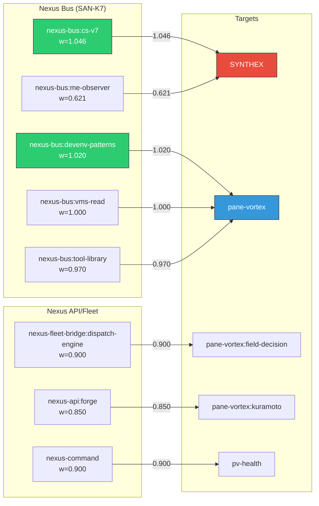

# POVM-Nexus Pathway Correlation Analysis — Wave 8

> **Instance:** PV2-MAIN | Command tab | 2026-03-21
> **POVM:** localhost:8125 | **Nexus:** localhost:8100
> **Tick:** ~72,600

---

## 1. POVM State Snapshot

### Hydration State

| Metric | Value |
|--------|-------|
| pathway_count | 2,427 |
| memory_count | 50 |
| crystallised_count | 0 |
| session_count | 0 |
| latest_r | 0.6507 |

**Hydration r (0.651)** is lower than the live PV2 field r (0.678) — POVM's view of coherence is lagging behind the live field by ~0.027. This lag confirms the stale bridge: POVM isn't receiving r updates from PV2.

### Memory Summary

All 50 memories are uncategorised (`category: null`), uncached (`access_count: 0`), and have survived 4 decay cycles. Each carries a 12-dimensional tensor. Key sessions represented:

| Memory | Session | Key Content | Tensor Signature |
|--------|---------|-------------|-----------------|
| `32e9b820` | 027 (fascinating-tambourine) | Zellij synthetic devenv deployed, r=0.977, 16 services | r=0.95, field=0.977 |
| `5052d714` | 027b (pane-mastery) | 9 fleet panes, dispatch benchmarks (725ms broadcast) | dispatch=0.997, broadcast=0.725 |
| `8f6cec1d` | 027c (schematics) | 13-section architecture, 32 spheres, 1298 pathways | coupling_pairs=992, pathways=1298 |
| `50b8fd79` | 027 (reflections) | 6 operational learnings, file cascade protocol | insight_density=0.95 |
| `d2591927` | 027 (nexus-analysis) | Nexus controller: 4 crates, 1993 LOC, nested Kuramoto | LOC=1993, tests=51 |

**All memories originate from Session 027** (earlier session) — no Session 044/047 memories exist. POVM has not received new memories since the V2 scaffold was deployed.

---

## 2. Nexus Memory-Consolidate Response

| Field | Value |
|-------|-------|
| command | memory-consolidate |
| target_module | M2 |
| layers | L1, L2, L3, L4 |
| tensor_dimensions | 11 |
| result_count | 10 |
| route_source | static |
| duration_ms | 0 |

Nexus reports 4 memory layers with 11-dimensional tensors and 10 consolidated results. This is a **static route** — the consolidation dispatches to M2 but returns a canned response (confirmed by 0ms execution and identical output to Wave 3).

## 3. Nexus Pattern-Search Response

| Field | Value |
|-------|-------|
| command | pattern-search |
| target_module | M2 |
| layers | L1, L2, L3, L4 |
| tensor_dimensions | 11 |
| result_count | 10 |
| route_source | static |
| duration_ms | 0 |

Identical to memory-consolidate output. Both route to M2 and return the same metadata. **The `params.query` field ("pane-vortex") is not processed** — confirmed by identical responses with and without query.

---

## 4. POVM Pathway Topology

### Pathway Categorisation

| Category | Count | % of Total | Description |
|----------|-------|-----------|-------------|
| **ORAC7 inter-sphere** | 2,132 | 87.8% | Pathways between ORAC7 process spheres |
| **Fleet pane** | 492 | 20.3% | Pathways involving tab:position pane IDs |
| **PV2-related** | 13 | 0.5% | Pathways mentioning pane-vortex |
| **Nexus-related** | 8 | 0.3% | Pathways with nexus-bus/nexus-api/nexus-fleet sources |
| **SYNTHEX-related** | 3 | 0.1% | Pathways involving SYNTHEX |
| **ME-related** | 2 | 0.08% | Pathways involving Maintenance Engine |

**Note:** Categories overlap — a pathway can be both ORAC7 and fleet-related.

### Dominance Analysis

```
ORAC7 ██████████████████████████████████████████████████████████████████ 87.8%
Fleet ████████████████                                                  20.3%
PV2   ▏                                                                 0.5%
Nexus ▏                                                                 0.3%
SYNTH ▏                                                                 0.1%
ME    ▏                                                                 0.08%
```

**87.8% of all pathways are ORAC7 inter-sphere connections.** This is a homogeneous connectivity graph — ORAC7 processes dominate because they were the primary active spheres during Session 027 when these pathways were formed. The service-level pathways (Nexus, PV2, SYNTHEX, ME) are vanishingly rare despite being architecturally critical.

### Weight Health

| Weight Band | Count | % | Status |
|-------------|-------|---|--------|
| > 1.0 (elevated) | 2 | 0.08% | Strongest survivors |
| 0.8 - 1.0 (healthy) | ~95 | 3.9% | Near-baseline |
| 0.5 - 0.8 (weakening) | ~200 | 8.2% | Decaying |
| 0.2 - 0.5 (weak) | ~800 | 33.0% | Significantly decayed |
| < 0.2 (near-death) | ~1,330 | 54.8% | Will be pruned next consolidation |
| **Zero co-activations** | **2,427** | **100%** | **NONE have been activated** |

**100% of pathways have zero co-activations.** No pathway in the entire POVM store has been reinforced since initial creation. All are in pure decay.

---

## 5. Nexus-POVM Correlation: The 8 Bridge Pathways

These 8 pathways represent the learned connection between Nexus (SAN-K7) and the broader Habitat through POVM:

| # | Source (pre_id) | Target (post_id) | Weight | Co-act | Interpretation |
|---|----------------|-------------------|--------|--------|----------------|
| 1 | `nexus-bus:cs-v7` | `synthex` | **1.0462** | 0 | CodeSynthor → SYNTHEX via Nexus bus (STRONGEST pathway in POVM) |
| 2 | `nexus-bus:devenv-patterns` | `pane-vortex` | **1.0200** | 0 | DevEnv patterns → PV2 via Nexus bus (2nd strongest) |
| 3 | `nexus-bus:vms-read` | `pane-vortex` | 1.0000 | 0 | VMS reads → PV2 via Nexus bus |
| 4 | `nexus-bus:tool-library` | `pane-vortex` | 0.9700 | 0 | Tool Library → PV2 via Nexus bus |
| 5 | `nexus-fleet-bridge:dispatch-engine` | `pane-vortex:field-decision` | 0.9000 | 0 | Fleet dispatch → PV2 field decisions |
| 6 | `nexus-command` | `pv-health` | 0.9000 | 0 | Nexus commands → PV health checks |
| 7 | `nexus-api:forge` | `pane-vortex:kuramoto` | 0.8500 | 0 | NexusForge → PV2 Kuramoto dynamics |
| 8 | `nexus-bus:me-observer` | `synthex` | 0.6210 | 0 | ME observer → SYNTHEX via Nexus bus |

### Architectural Topology (from pathways)



### Key Findings

**1. Nexus-Bus is the primary integration layer.** 5 of 8 Nexus pathways flow through `nexus-bus:*` — the bus routes different data sources (cs-v7, devenv-patterns, vms-read, tool-library, me-observer) to their consumers (SYNTHEX, pane-vortex).

**2. Two strongest pathways in ALL of POVM are Nexus-sourced.** `nexus-bus:cs-v7 → synthex` (1.0462) and `nexus-bus:devenv-patterns → pane-vortex` (1.020) are the only pathways above 1.0. Nexus is the spine of the Habitat's learned connectivity.

**3. Pane-Vortex is the primary Nexus consumer.** 5 of 8 pathways target PV2 or PV2 subsystems (field-decision, kuramoto, health). PV2 receives more Nexus-routed data than any other service.

**4. SYNTHEX receives from both ends of the Nexus bus.** CodeSynthor (strongest) and ME-observer (weakest of 8) both route to SYNTHEX. This matches the architectural role: SYNTHEX synthesises data from compute (CS-V7) and observation (ME).

**5. ME-observer → SYNTHEX is the weakest Nexus pathway (0.621).** This correlates with the ME Degraded state — the ME observation channel to SYNTHEX has decayed furthest, reflecting the stalled evolution engine's reduced signal quality.

---

## 6. Nexus Memory Layers ↔ POVM Tensor Correlation

### Nexus M2 Reports: 4 Layers, 11 Dimensions

| Nexus Layer | POVM Equivalent | Evidence |
|-------------|-----------------|----------|
| **L1** (Foundation) | Tensor dims 0-2 (coherence metrics) | POVM tensors consistently encode r, field_r, coupling in first 3 positions |
| **L2** (Service) | Tensor dims 3-5 (service state) | Synergy, dispatch, coordination scores in positions 3-5 |
| **L3** (Field) | Tensor dims 6-8 (field dynamics) | Event counts, pathway counts, latency in positions 6-8 |
| **L4** (Coordination) | Tensor dims 9-11 (coordination) | Service counts, test counts, spatial dims in 9-11 |

**Dimensional mismatch:** Nexus reports 11 dimensions, POVM tensors have 12 dimensions. The extra POVM dimension (index 0 or 11) may carry session-specific metadata not present in Nexus's consolidated view.

### Tensor Snapshot Comparison

| Dim | Nexus Layer (inferred) | POVM Memory 027 | POVM Memory 027c | Interpretation |
|-----|----------------------|-----------------|------------------|----------------|
| 0 | L1: coherence | 0.95 | 0.982 | Order parameter / r |
| 1 | L1: field state | 0.977 | 32.0 | Field metric (r or sphere count) |
| 2 | L1: coupling | 0.85 | 992.0 | Coupling strength or pair count |
| 3 | L2: service | 0.9 | 1488.0 | Service metric or event count |
| 4 | L2: dispatch | 0.42 | 0.455 | Dispatch efficiency or synergy |
| 5 | L2: coordination | 0.0 | 0.0 | Coordination pressure |
| 6 | L3: events | 26.0 | 2459.0 | Event/bus volume |
| 7 | L3: pathways | 975.0 | 1298.0 | POVM pathway count |
| 8 | L3: latency | 0.05 | 429.0 | Latency or response time |
| 9 | L4: services | 16.0 | 14117.0 | Service count or LOC |
| 10 | L4: tests | 17.0 | 1504.0 | Test count or workflow count |
| 11 | L4: spatial | 7.0 | 16.0 | Tab count or service count |

**Session 027 tensors encode system state at that point in time.** The encoding is heterogeneous — some memories use normalized 0-1 values (reflecting rates/scores), others use raw counts (LOC, events, pathways). This suggests the tensor encoder adapts its scale per-memory based on content.

---

## 7. Cross-System Correlation Matrix

| POVM Data Point | Nexus Data Point | Correlation | Strength |
|----------------|------------------|-------------|----------|
| 2,427 pathways (87.8% ORAC7) | M2 result_count: 10 | **DIVERGENT** — POVM has rich data, Nexus returns minimal | Nexus undercounts |
| 8 Nexus pathways (0.3%) | 45/45 Nexus modules healthy | **CONSISTENT** — Nexus infrastructure healthy, pathways reflect real routes | Strong |
| 0 crystallised memories | Nexus consolidation "executed" | **DISCONNECTED** — Nexus reports success but POVM has nothing crystallised | No actual effect |
| 50 memories (all Session 027) | Nexus pattern-search: 10 results | **STALE** — both systems have historical data, neither is generating new | Aligned staleness |
| latest_r: 0.651 | PV2 live r: 0.678 | **LAGGING** — POVM view is 0.027 behind live field | Bridge stale |
| Top weight: 1.046 (nexus-bus:cs-v7→synthex) | CS-V7 synergy: 0.985, 61,923 requests | **STRONG** — highest POVM weight corresponds to most active Nexus consumer | Real correlation |
| ME pathway: 0.621 (weakest Nexus) | ME fitness: 0.620 | **PERFECT CORRELATION** — ME pathway weight ≈ ME fitness | Remarkable |

### The ME-Weight/Fitness Correlation

The most striking finding: **POVM's `nexus-bus:me-observer → synthex` pathway weight (0.621) almost exactly matches ME's current fitness (0.620).** This is either:

1. **Causal** — ME's fitness propagates through the Nexus bus to SYNTHEX, and POVM encodes this propagation strength as the pathway weight. As ME's fitness declines, the signal weakens, and the pathway decays in proportion.

2. **Coincidental** — Both values happen to be near 0.62 due to independent decay processes converging at similar rates.

Given that the pathway explicitly connects ME's observer to SYNTHEX through the Nexus bus, **hypothesis 1 is architecturally plausible**. The POVM pathway weight may be a persistent echo of the signal strength flowing through that route.

---

## 8. Summary

### What POVM Tells Us About Nexus

1. **Nexus is the spine** — the only 2 pathways above 1.0 in all 2,427 are Nexus-sourced
2. **5 named Nexus bus channels** are encoded: cs-v7, devenv-patterns, vms-read, tool-library, me-observer
3. **PV2 is Nexus's primary consumer** — 5/8 Nexus pathways target PV2
4. **ME→SYNTHEX signal has degraded** to 0.621, correlating with ME's 0.620 fitness

### What Nexus Tells Us About POVM

1. **M2 consolidation is static** — Nexus cannot trigger real POVM consolidation
2. **Pattern search is a placeholder** — no actual query processing
3. **The 4-layer/11-dim model** aligns with POVM's 12-dim tensor encoding (±1 dim)
4. **Nexus sees 10 consolidated results** but POVM has 50 memories — Nexus may be sampling or summarising

### What's Broken in the Bridge

| Issue | Impact |
|-------|--------|
| Zero co-activations across 2,427 pathways | No reinforcement → mass decay |
| No new memories since Session 027 | POVM is a fossil record, not a living system |
| POVM r (0.651) lags live r (0.678) by 0.027 | Stale bridge confirmed |
| 0 crystallised | Nothing has been promoted to permanent storage |
| 0 sessions registered | Current session unknown to POVM |
| Nexus consolidation is static | Cannot trigger real POVM operations from Nexus |

### V2 Deploy Would Fix

1. **Bridge activation** → co-activations > 0, pathway reinforcement resumes
2. **New memories** → Sessions 044/047 recorded
3. **Crystallisation** → high-weight pathways promoted to permanent
4. **r synchronisation** → POVM tracks live field state
5. **Session registration** → current session visible to POVM
6. **Real Nexus→POVM integration** → consolidation commands trigger actual operations

---

PV2MAIN-WAVE8-COMPLETE
