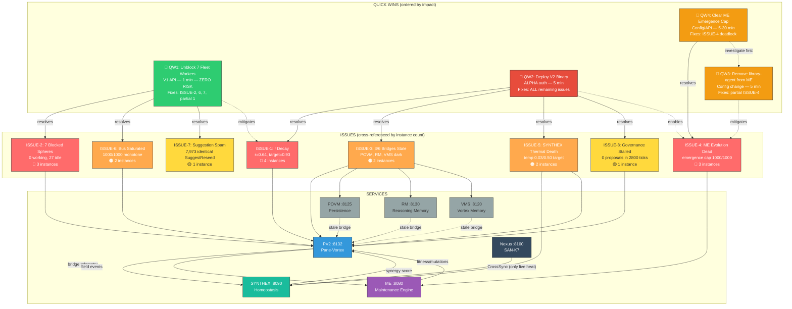

# Fleet Synergy Synthesis — Cross-Instance Analysis

> **Generated by PV2-MAIN** | Command tab | Wave 4
> **Sources:** 6 documents from 3 instances (BETA, GAMMA, PV2-MAIN)
> **Date:** 2026-03-21

---

## Source Inventory

| File | Instance | Wave | Focus |
|------|----------|------|-------|
| beta-bridge-analysis.md | BETA | 1 | Bridge health, thermal, SYNTHEX diagnostics, ME observer |
| gamma-bus-governance-audit.md | GAMMA | 1 | Bus state, sphere census, governance, suggestions |
| beta-remediation-plan.md | BETA | 2 | 5-priority remediation plan with dependency graph |
| beta-field-convergence-timeseries.md | BETA | 3 | 120s time-series: r decay, thermal flatline, drift rates |
| gamma-me-investigation.md | GAMMA | 2 | ME evolution root cause, V1 API discovery, bus fixes |
| pv2main-nexus-command-reference.md | PV2-MAIN | 3 | SAN-K7 Nexus 10-command reference |

---

## Part 1: Common Issues Identified by Multiple Instances

### ISSUE-1: Order Parameter Decay (r far below R_TARGET)
**Mentioned by: BETA (Wave 1, 2, 3), GAMMA (Wave 1)**

| Instance | r Observed | Assessment |
|----------|-----------|------------|
| BETA W1 | 0.6897 | "26% below target" |
| GAMMA W1 | 0.6358 | "sub-critical coherence" |
| BETA W3 | 0.6766→0.6424 | "decaying at -0.0171/min, crosses 0.5 in ~10 min" |
| PV2-MAIN | 0.8733 | Higher snapshot — r oscillates but trends down |

**Consensus:** r is in slow decoherence. BETA's time-series proves monotonic decay with drift rate -0.000292/tick. V1 binary's trend detector reports "Stable" — **blind to the drift**. All instances agree V2's IQR K-scaling is the structural fix.

---

### ISSUE-2: Zero Working Spheres / Blocked Fleet Workers
**Mentioned by: GAMMA (Wave 1, 2), BETA (Wave 3)**

| Instance | Finding |
|----------|---------|
| GAMMA W1 | 0/34 working, 27 idle, 7 blocked — "field entirely dormant" |
| GAMMA W2 | Discovered V1 API fix: `POST /sphere/{id}/status` works |
| BETA W3 | Confirmed 7 blocked across 120s window, 1 self-unblocked (4:left) |

**Consensus:** 7 fleet-worker spheres (tabs 4-6) persistently blocked. Zero productive work. GAMMA discovered this is **fixable on V1** via status endpoint — the highest-impact quick win.

---

### ISSUE-3: Stale Bridges (POVM, RM, VMS)
**Mentioned by: BETA (Wave 1, 2)**

| Bridge | Status | Consequence |
|--------|--------|-------------|
| POVM | STALE | No persistent memory bridge |
| Reasoning Memory | STALE | No cross-session reasoning |
| VMS (Vortex Memory) | STALE | No OVM/POVM integration |

**Consensus:** 3/6 bridges dark. V1 binary limitation — these bridges exist in V2 source but aren't deployed. Half the coordination fabric is offline.

---

### ISSUE-4: ME Evolutionary Engine Stalled
**Mentioned by: BETA (Wave 1), GAMMA (Wave 1, 2)**

| Instance | Finding |
|----------|---------|
| BETA W1 | "Degraded state, declining fitness 0.609, mutations_proposed=0" |
| GAMMA W1 | "Degraded, fitness 0.620, mutations_proposed still 0" |
| GAMMA W2 | **Root cause identified**: emergence cap saturated at 1,000/1,000, mono-parameter mutation history (254x same param), self-reinforcing deadlock |

**Consensus:** ME is structurally deadlocked. GAMMA's forensic analysis is definitive: `emergences(1000/1000 CAP) → mutations(0) → DEAD`. The engine mutated `emergence_detector.min_confidence` 254 times, creating a feedback trap. Fitness ceiling at ~0.85 due to immutable structural dimensions (deps: 0.083, port: 0.123).

---

### ISSUE-5: SYNTHEX Synergy Critical
**Mentioned by: BETA (Wave 1, 2)**

| Metric | Value | Threshold |
|--------|-------|-----------|
| Synergy probe | 0.5 | CRITICAL at <0.7 |
| Temperature | 0.03 | Target 0.50 |
| Hebbian heat source | 0.0 | Should be >0 |
| Cascade heat source | 0.0 | Should be >0 |
| Resonance heat source | 0.0 | Should be >0 |

**Consensus:** SYNTHEX is thermally frozen. PID demands heat (-0.335 output) but 3/4 heat sources read zero. Only CrossSync (0.2) alive because it reads from Nexus. BETA W3 confirmed: **zero drift across 120s** — completely static. Auto-resolves with V2 deploy.

---

### ISSUE-6: Event Bus Saturation
**Mentioned by: GAMMA (Wave 1), BETA (Wave 3)**

| Instance | Finding |
|----------|---------|
| GAMMA W1 | 1,000/1,000 buffer capped, all identical `HasBlockedAgents`, zero diversity |
| BETA W3 | Confirmed static across 5 iterations, 2 subscribers, 0 cascades |

**Consensus:** Bus is a monotone blocked-agents signal. Ring buffer at capacity, no cycling. Downstream starvation of bridges and SYNTHEX. Clears when blocked spheres are unblocked (ISSUE-2 fix cascades here).

---

### ISSUE-7: Suggestion Engine Spam
**Mentioned by: GAMMA (Wave 1)**

7,973 identical `SuggestReseed` suggestions targeting 7 blocked spheres. 100% mono-type. No action taken on any. Pure noise — resolves when ISSUE-2 is fixed.

---

### ISSUE-8: Governance Stalled
**Mentioned by: GAMMA (Wave 1, 2)**

- No proposals in ~2,800 ticks
- 2 expired RTarget proposals (0 and 2 votes)
- 1 successfully applied (KModBudgetMax 1.15→1.25, 20 votes)
- GAMMA discovered `POST /field/propose` works on V1 (needs correct schema)

---

## Part 2: Service Dependency Bottlenecks

### Bottleneck A: V1 Binary — The Universal Chokepoint

Every instance independently identified the V1 binary as the root blocker:

```
BETA W1:  "V2 binary addresses all of these"
BETA W2:  "Priority 1 (BLOCKING): Deploy V2 Binary"
BETA W3:  "V2 deploy is not optional — only path to halt r decay"
GAMMA W2: "V1 binary lacks Hebbian STDP tick integration (BUG-031 fix)"
```

**V1 blocks:** Hebbian STDP, IQR K-scaling, ghost reincarnation, coupling matrix API, 3 bridge refreshes, thermal heat generation, pressure calculations.

### Bottleneck B: ME ↔ PV2 Feedback Loop

```
ME needs PV2 field events → PV2 bridges stale → ME sees degraded health
→ ME fitness declines → mutations stall → no adaptation → field decays further
```

ME's health dimension (0.625) and error_rate (0.556) are dragged down by:
1. `library-agent` (disabled but still probed — 7,741 failures)
2. Stale bridge telemetry from PV2

### Bottleneck C: SYNTHEX ↔ PV2 Thermal Coupling

```
PV2 Hebbian activity → SYNTHEX heat sources → thermal adjustment → synergy
                  ↑                                                    |
                  └────────────── synergy feeds back into PV2 ─────────┘
```

With V1, PV2 emits no Hebbian events → SYNTHEX heat sources read 0.0 → temperature frozen at 0.03 → synergy CRITICAL at 0.5. A broken feedback loop.

### Bottleneck D: Bus → Everything

```
Bus saturated (1,000 HasBlockedAgents) → no event diversity
→ bridges starved → SYNTHEX synergy drops → coupling stalls → r decays
```

The bus is the central nervous system. When it's monotone, all downstream consumers degrade.

---

## Part 3: Quick Wins — Fixes That Unblock Multiple Systems

### QUICK WIN 1: Unblock 7 Fleet Workers (V1 API — NOW)
**Effort:** 1 minute | **Risk:** LOW | **Unblocks:** 4 issues

```bash
for sphere in "4:left" "5:left" "5:top-right" "5:bottom-right" \
              "6:left" "6:top-right" "6:bottom-right"; do
  curl -s -X POST -H 'Content-Type: application/json' \
    -d '{"status":"idle"}' \
    "localhost:8132/sphere/$(echo $sphere | sed 's/:/%3A/g')/status"
done
```

**Cascade effect:**
- ISSUE-2 (blocked spheres) → **RESOLVED**
- ISSUE-6 (bus saturation) → **RESOLVED** (events diversify)
- ISSUE-7 (suggestion spam) → **RESOLVED** (no blocked targets)
- ISSUE-1 (r decay) → **PARTIALLY MITIGATED** (removes drag from blocked spheres)

---

### QUICK WIN 2: Deploy V2 Binary (Requires ALPHA auth)
**Effort:** 5 minutes | **Risk:** MEDIUM (service restart) | **Unblocks:** ALL remaining issues

**Cascade effect:**
- ISSUE-1 (r decay) → IQR K-scaling + Hebbian STDP
- ISSUE-3 (stale bridges) → All 6 bridges refresh
- ISSUE-5 (thermal death) → Heat sources activate
- ISSUE-8 (governance) → Full governance wiring

---

### QUICK WIN 3: Remove library-agent from ME Probes
**Effort:** 5 minutes | **Risk:** LOW | **Unblocks:** 1 issue partially

- Stops 7,741 failure accumulation
- Raises ME fitness by ~0.03-0.05
- Clears noise from health and error_rate dimensions

---

### QUICK WIN 4: Clear ME Emergence Cap
**Effort:** 5-30 minutes (needs config investigation) | **Risk:** LOW-MEDIUM | **Unblocks:** 1 issue

- Restarts mutation engine from deadlock
- Allows new emergences to trigger mutations
- Combined with min_confidence reset, breaks the self-reinforcing trap

---

## Part 4: Unified Dependency Graph



---

## Part 5: Execution Playbook

### Phase A — Immediate (0-2 min, no authorization needed)

| Step | Action | Instance | Impact |
|------|--------|----------|--------|
| A1 | Unblock 7 fleet workers via V1 API | ANY | Resolves ISSUE-2, 6, 7; mitigates ISSUE-1 |

### Phase B — Short-term (2-10 min, needs ALPHA auth)

| Step | Action | Instance | Impact |
|------|--------|----------|--------|
| B1 | Deploy V2 binary (`deploy plan`) | ALPHA | Resolves ISSUE-1, 3, 5, 8 |
| B2 | Investigate ME config for emergence_cap | GAMMA | Prepares ISSUE-4 fix |

### Phase C — Medium-term (10-30 min, post-deploy)

| Step | Action | Instance | Impact |
|------|--------|----------|--------|
| C1 | Clear ME emergence cap + reset min_confidence | GAMMA | Resolves ISSUE-4 |
| C2 | Remove library-agent from ME probes | GAMMA | Raises ME fitness +0.05 |
| C3 | Monitor r trajectory (expect r>0.85 by tick+200) | BETA | Validates ISSUE-1 fix |
| C4 | Monitor SYNTHEX thermal (expect temp>0.10) | BETA | Validates ISSUE-5 fix |
| C5 | Verify 6/6 bridges live | BETA | Validates ISSUE-3 fix |

### Phase D — Validation (30-60 min)

| Step | Action | Instance | Impact |
|------|--------|----------|--------|
| D1 | Full habitat-probe sweep | ALL | Confirm 16/16 healthy |
| D2 | Verify ME mutations_proposed > 0 | GAMMA | Confirm ISSUE-4 resolved |
| D3 | Verify synergy > 0.7 | BETA | Confirm ISSUE-5 resolved |
| D4 | Verify r > 0.85 | BETA | Confirm ISSUE-1 resolved |

---

## Fleet Instance Contribution Summary

| Instance | Documents | Key Contributions |
|----------|-----------|-------------------|
| **BETA** | 3 (bridge analysis, remediation plan, time-series) | Bridge health mapping, 5-priority plan, quantified r decay rate (-0.000292/tick), thermal death proof, V2 impact projections |
| **GAMMA** | 2 (bus audit, ME investigation) | Sphere census, bus saturation proof, governance audit, **ME root cause forensics** (emergence cap + mono-parameter trap), **V1 API discovery** (sphere status endpoint), combined remediation matrix |
| **PV2-MAIN** | 1 (Nexus command reference) | SAN-K7 10-command catalog, 45/45 module health, compliance score 99.5, swarm topology (40 agents, PBFT 27/40) |

### Cross-Instance Agreement Matrix

| Issue | BETA | GAMMA | PV2-MAIN | Consensus |
|-------|------|-------|----------|-----------|
| r decay | W1,W2,W3 | W1 | — | **STRONG** (4 mentions) |
| Blocked spheres | W3 | W1,W2 | — | **STRONG** (3 mentions) |
| ME stalled | W1 | W1,W2 | — | **STRONG** (3 mentions) |
| Stale bridges | W1,W2 | — | — | MODERATE (2 mentions) |
| Thermal death | W1,W2,W3 | — | — | MODERATE (3 BETA-only) |
| Bus saturation | W3 | W1 | — | MODERATE (2 mentions) |
| V2 deploy critical | W1,W2,W3 | W2 | — | **UNANIMOUS** |

---

## Single Sentence Summary

**The fleet is in slow decoherence (r decaying at -0.017/min) with a thermally frozen SYNTHEX, a deadlocked ME evolution engine (emergence cap 1000/1000), and 7 blocked spheres saturating the bus — all fixable by two actions: (1) unblock spheres now via V1 API (1 min, zero risk), (2) deploy V2 binary (5 min, needs auth).**

---

PV2MAIN-WAVE4-COMPLETE
