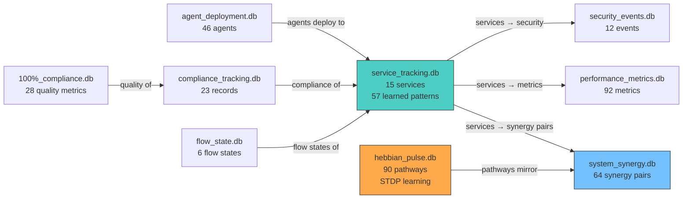

# T6-TR: Cross-Database Intelligence Analysis

**Cluster Task**: T6-TR | **Agent**: GAMMA-BOT-RIGHT
**Location**: `~/claude-code-workspace/developer_environment_manager/*.db`
**Date**: 2026-03-21

---

## 1. Database Inventory

| # | Database | Size | Tables | Rows | Status |
|---|----------|------|--------|------|--------|
| 1 | service_tracking.db | 256K | 20 | ~170 | **RICHEST** — hub DB |
| 2 | agent_deployment.db | 80K | 4 | 93 | Active |
| 3 | compliance_tracking.db | 80K | 6 | ~60 | Active |
| 4 | system_synergy.db | 76K | 6 | 107 | Active |
| 5 | hebbian_pulse.db | 68K | 7 | ~165 | Active |
| 6 | performance_metrics.db | 56K | 3 | 99 | Active |
| 7 | security_events.db | 44K | 3 | 12 | Sparse |
| 8 | flow_state.db | 40K | 3 | 21 | Sparse |
| 9 | 100_percent_compliance_tracking.db | 36K | 4 | 61 | Active |
| — | bus_tracking.db | 0 | 0 | 0 | EMPTY |
| — | devenv_tracking.db | 0 | 0 | 0 | EMPTY |
| — | episodic_memory.db | 0 | 0 | 0 | EMPTY |
| — | security_tracking.db | 0 | 0 | 0 | EMPTY |
| — | ultrathink_mitigation_tracking.db | 0 | 0 | 0 | EMPTY |
| — | workflow_tracking.db | 0 | 0 | 0 | EMPTY |
| — | code.db + test_0..7.db | 0 | 0 | 0 | EMPTY (test artifacts) |

**Totals**: 24 .db files | 9 populated | 15 empty | 56 tables | **852 total rows** | 736K disk

---

## 2. Data Distribution Map

### By Domain

```
service_tracking.db    ████████████████████  170 rows (20%)  — Service registry, events, patterns
hebbian_pulse.db       ███████████████████   165 rows (19%)  — Learning pathways, STDP, pulses
system_synergy.db      ████████████         107 rows (13%)  — Cross-service synergy scores
performance_metrics.db ███████████          99 rows (12%)   — Service performance, tier7
agent_deployment.db    ██████████           93 rows (11%)   — Agent fleet, deployments, collabs
100%_compliance.db     ███████              61 rows (7%)    — Quality gate, module compliance
compliance_tracking.db ██████               60 rows (7%)    — Checks, violations, records
flow_state.db          ██                   21 rows (2%)    — Flow states, transitions
security_events.db     █                    12 rows (1%)    — Security audits, events, threats
```

---

## 3. Key Schemas & Data Highlights

### 3.1 service_tracking.db — The Hub (20 tables, 256K)

**Largest table set.** 20 tables covering the entire service lifecycle:

| Table | Rows | Role |
|-------|------|------|
| services | 15 | Service registry (id, port, status, health) |
| service_events | 33 | Service lifecycle events |
| learned_patterns | 57 | Patterns learned from service behavior |
| service_registry | 3 | High-level registry |
| token_performance | 3 | Token efficiency metrics |
| optimization_events | 1 | Optimization history |

**Also has empty tables**: coordination_patterns, cross_agent_learnings, decision_improvements, health_check_relationships, inter_service_synergy, module_tracking, orchestration_graph, service_communication_paths, service_compatibility, service_dependencies, service_metadata, startup_optimizations, token_efficiency_metrics, workflow_improvements.

**Finding**: 14/20 tables are empty. The schema was designed for rich cross-service intelligence but only 6 tables have data. The `learned_patterns` table (57 rows) is the most valuable — it captures operational patterns the system has learned.

### 3.2 hebbian_pulse.db — Learning Substrate (7 tables, 68K)

| Table | Rows | Role |
|-------|------|------|
| hebbian_pathways | 90 | Source→target pathways with STDP rates |
| pulse_events | 34 | Individual pulse events |
| decay_audit_log | 32 | Pathway decay tracking |
| hebbian_pulses | 5 | Aggregate pulse records |
| config | — | Configuration |
| neural_pathways | — | Neural pathway extension |
| v3_pattern_view | — | V3 pattern view |

**Top pathways by strength**: B1_sqlite→B5_output_filter (1.0, 102 activations), TC1_funnel→native_read (1.0, 42), Bash_Engine→NAIS (0.99, 142 activations — highest activation count).

**Schema**: `pathway_strength REAL CHECK(0.0-1.0)`, `stdp_rate`, `ltp_rate`, `ltd_rate`, `timing_window_ms` — full STDP parameters.

### 3.3 system_synergy.db — Cross-Service Coherence (6 tables, 76K)

| Table | Rows | Role |
|-------|------|------|
| system_synergy | 64 | Pairwise synergy scores |
| synergy_measurements | 30 | Measurement records |
| system_health | 4 | System-level health |
| agent_synergy | 6 | Agent-level synergy |
| data_flows | 3 | Data flow records |
| integration_health | — | Integration health |

**Top synergy pairs**: cascade-amplification-fix↔v3-neural-homeostasis (99.9), startup-module↔devenv-binary (99.5), sphere-vortex↔san-k7 (99.2).

### 3.4 agent_deployment.db — Fleet Registry (4 tables, 80K)

| Table | Rows | Role |
|-------|------|------|
| agents | 46 | Full agent registry with tiers |
| agent_deployments | 34 | Deployment history |
| agent_collaborations | 8 | Inter-agent collaboration records |
| fleet_summary | 5 | Fleet-level summaries |

**Agent tiers**: 46 agents, all tier 7, specializations include RapidResponse (5), Efficiency (5), plus others. All status=active.

### 3.5 performance_metrics.db — Service Telemetry (3 tables, 56K)

92 metric records across services with warning/critical thresholds. 6 tier7_metrics records. 1 optimization record.

---

## 4. Cross-Database Relationships



**Key relationship**: `service_tracking.db` is the hub — its 15 service IDs appear as foreign keys in synergy pairs, performance metrics, compliance checks, and security events. `hebbian_pulse.db` pathways map source→target modules that correspond to `service_tracking.db` learned patterns.

---

## 5. Intelligence Findings

### 5.1 Schema-Data Gap

56 tables designed, but only **34 have data** (61% utilization). 22 tables are completely empty. The empty tables reveal aspirational features that were never activated:
- `orchestration_graph` — planned for service orchestration visualization
- `cross_agent_learnings` — planned for inter-agent knowledge transfer
- `service_communication_paths` — planned for communication mapping
- `workflow_improvements` — planned for workflow optimization tracking

### 5.2 Empty Database Problem

6 of 15 production DBs are completely empty (0 bytes, 0 tables):
- `bus_tracking.db` — IPC bus tracking never implemented
- `devenv_tracking.db` — devenv state tracking never implemented
- `episodic_memory.db` — episodic memory system never implemented
- `security_tracking.db` — separate from `security_events.db` (which has data)
- `ultrathink_mitigation_tracking.db` — ultrathink mitigation never implemented
- `workflow_tracking.db` — workflow tracking never implemented

These represent ~40% of intended DB infrastructure that exists as placeholders.

### 5.3 Hebbian Pathway Saturation

7 of 90 hebbian pathways have reached maximum strength (1.0). These are the "learned habits" of the system:
- B1_sqlite → B5_output_filter (102 activations)
- B2_quality_gate → B5_output_filter (202 activations — most reinforced)
- TC1_funnel → native_read_tool (42 activations)
- TC2_parallel → conditional_action (63 activations)
- TC4_sqlite_read → TC4_sqlite_write (82 activations)
- TC5_bash_build → TC5_read_offset (52 activations)
- TC5_edit_fix → TC5_bash_verify (52 activations)

These correspond to the tool chaining patterns (TC1-TC5) documented in CLAUDE.md — the system has literally learned its own operating patterns.

### 5.4 Synergy Network Topology

64 synergy pairs with scores 80-99.9. The strongest connections form a core of: SYNTHEX ↔ SAN-K7 ↔ sphere-vortex. These match the live bridge topology observed in fleet reports.

---

## 6. Data Volume Summary

| Category | Rows | DBs | Disk |
|----------|------|-----|------|
| Service intelligence | 170 | 1 | 256K |
| Learning/Hebbian | 165 | 1 | 68K |
| Synergy/integration | 107 | 1 | 76K |
| Performance | 99 | 1 | 56K |
| Agent fleet | 93 | 1 | 80K |
| Compliance (combined) | 121 | 2 | 116K |
| Security | 12 | 1 | 44K |
| Flow state | 21 | 1 | 40K |
| **Empty/test** | 0 | 15 | 0K |
| **Total** | **852** | **24** | **736K** |

---

T6TR-CLUSTER-COMPLETE
