# Fleet Bridge Topology — Pane-Vortex

> **Live snapshot:** 2026-03-21 | **Tick:** 81,560 | **r:** 0.409 | **Spheres:** 45
> **Source:** 6 bridge modules, 3,322 LOC total across `src/*bridge*.rs`
> **Prior snapshot:** Session 050 (tick 79,703, same r band, same sphere count)
> **See also:** [[ULTRAPLATE Master Index]] | [[Session 049 — Full Remediation Deployed]] | `ai_docs/SCHEMATICS_BRIDGES_AND_WIRING.md`

---

## 1. Bridge Health Status (live)

Endpoint: `GET localhost:8132/bridges/health`

```json
{
  "me_stale": false,
  "nexus_stale": false,
  "povm_stale": true,
  "rm_stale": false,
  "synthex_stale": false,
  "vms_stale": false
}
```

| Bridge | Target Service | Port | Module | LOC | Status | Stale? |
|--------|---------------|------|--------|-----|--------|--------|
| **SYNTHEX** | synthex (brain) | 8090 | `synthex_bridge.rs` | 575 | Connected | No |
| **Nexus** | san-k7-orchestrator | 8100 | `nexus_bridge.rs` | 1,426 | Connected | No |
| **ME** | maintenance-engine | 8080 | `me_bridge.rs` | 367 | Connected | No |
| **RM** | reasoning-memory | 8130 | `bridge.rs` | 441 | Connected | No |
| **POVM** | povm-engine | 8125 | `povm_bridge.rs` | 355 | Connected | **Yes** |
| **VMS** | vortex-memory-system | 8120 | `vms_bridge.rs` | 158 | Connected | No |

### Interpretation

- **5/6 bridges fresh.** All actively polling or syncing within their intervals.
- **POVM marked stale.** The POVM bridge syncs every 12 ticks (~60s) for field snapshots and every 60 ticks (~5min) for Hebbian weights. A stale flag means the last successful sync exceeded the freshness window. POVM itself is healthy (58 memories, 2,427 pathways) — likely a timing artefact rather than a connectivity failure.
- **No bridge is disconnected.** All 6 target services return HTTP 200 on health endpoints.
- **Delta from Session 050:** POVM was fresh last snapshot, now stale. All others unchanged.

---

## 2. SYNTHEX Thermal State (live)

Endpoint: `GET localhost:8090/v3/thermal`

### Current Readings

| Parameter | Value | Notes |
|-----------|-------|-------|
| **Temperature** | 0.030 | Far below target — system is cold |
| **Target** | 0.500 | Homeostatic setpoint |
| **PID Output** | -0.335 | Negative: PID trying to warm up |
| **Damping Adjustment** | 0.0167 | Slight damping active |
| **Decay Rate Multiplier** | 0.8995 | Reduced decay to conserve heat |
| **Signal Maintenance** | true | Active signal preservation |
| **Trigger Pattern GC** | false | No garbage collection needed |

### Heat Sources

| ID | Name | Weight | Reading | Effective Contribution |
|----|------|--------|---------|----------------------|
| HS-001 | **Hebbian** | 0.30 | 0.0 | 0.000 — no active Hebbian learning |
| HS-002 | **Cascade** | 0.35 | 0.0 | 0.000 — no cascades in flight |
| HS-003 | **Resonance** | 0.20 | 0.0 | 0.000 — no resonance detected |
| HS-004 | **CrossSync** | 0.15 | 0.2 | 0.030 — only active heat source |

### Analysis

The system is thermally cold (T=0.03 vs target 0.50). Three of four heat sources read zero:

1. **Hebbian at 0.0** — Consistent with Session 040 finding that `hebbian_pulse.db` has 0 neural pathways. No active LTP/LTD events firing.
2. **Cascade at 0.0** — No cross-tab cascade handoffs are in flight. Cascades generate heat when work distributes across fleet agents.
3. **Resonance at 0.0** — Resonance requires sustained phase-locked oscillation between sphere clusters. With r=0.41, the field is dynamic but not resonating.
4. **CrossSync at 0.2** — The only heat source. Cross-synchronisation detects aligned tool usage patterns. At 0.2/1.0, minimal cross-sync activity.

**Impact on PV coupling:** `thermal_k_adjustment()` maps cold state to coupling boost. At T=0.03, deviation from target = (0.03 - 0.50) / max_deviation = -0.94, so adjustment = `(1.0 - (-0.94) * 0.2)` ≈ 1.188, clamped to [0.8, 1.2].

**Delta from Session 050:** Unchanged. Temperature, target, PID output, and all heat source readings identical. System is in steady-state cold.

---

## 3. Coupling Matrix (live)

Endpoint: `GET localhost:8132/coupling/matrix`

```json
{
  "count": 0,
  "matrix": []
}
```

| Parameter | Value |
|-----------|-------|
| **Edge count** | 0 |
| **Matrix** | Empty |

### Interpretation

The coupling matrix is empty despite 45 registered spheres:

- **No Hebbian edges have formed.** Hebbian LTP requires two spheres to be active (tool calls) within the same coupling step. With 44/45 spheres idle (mostly persistent ORAC7 registrations), simultaneous activity is absent.
- **Coupling still functions** via the base Kuramoto model — all spheres influence each other through the global coupling constant K, modulated by bridge adjustments. The matrix tracks *learned* Hebbian weight overrides above the default.
- **This is the "learning-doing gap"** (ALERT-6, Session 040): 2,427 POVM pathways exist historically but the live Hebbian coupling matrix is unpopulated. The pathways would hydrate on restart, but runtime learning hasn't occurred.

---

## 4. Data Flow Diagram

```mermaid
graph TB
    subgraph PV["Pane-Vortex :8132"]
        TICK["Tick Loop<br/>5s adaptive"]
        FIELD["FieldState<br/>r=0.409, 45 spheres"]
        COUP["Coupling Network<br/>Kuramoto + Hebbian"]
        COND["Conductor<br/>FieldDecision"]
        API["axum API<br/>32 routes"]
    end

    subgraph SX["SYNTHEX :8090"]
        THERMAL["v3/thermal<br/>T=0.03 target=0.50"]
        SX_FIELD["v3/field-state<br/>receives PV state"]
    end

    subgraph NX["SAN-K7 :8100"]
        OUTER["Outer Kuramoto<br/>r_outer=0.991"]
        NX_INNER["field/inner-state<br/>receives PV state"]
        NX_DISP["dispatch/result<br/>receives outcomes"]
    end

    subgraph ME_SVC["Maintenance Engine :8080"]
        OBS["api/observer<br/>fitness=0.619"]
    end

    subgraph RM_SVC["Reasoning Memory :8130"]
        TSV["TSV Store<br/>4,857 entries"]
    end

    subgraph POVM_SVC["POVM Engine :8125"]
        MEM["Memories: 58"]
        PW["Pathways: 2,427"]
    end

    subgraph VMS_SVC["VMS :8120"]
        VFIELD["Vortex Field<br/>r=0.0, dormant"]
    end

    %% ── SYNTHEX Bridge (bidirectional, 6-tick) ──
    TICK -->|"poll_thermal()<br/>every 6 ticks ~30s"| THERMAL
    THERMAL -->|"ThermalState → cache"| FIELD
    FIELD -->|"post_field_state()<br/>r, spheres, k_mod"| SX_FIELD
    FIELD -->|"post_cascade_heat()<br/>on cascade events"| SX_FIELD
    THERMAL -.->|"thermal_k_adjustment()<br/>≈1.19 (cold boost)"| COUP

    %% ── Nexus Bridge (bidirectional, 12-tick) ──
    TICK -->|"poll_nexus()<br/>every 12 ticks ~60s"| OUTER
    OUTER -->|"NexusFieldState → cache"| FIELD
    FIELD -->|"post_inner_field_state()<br/>r, k_mod, spheres"| NX_INNER
    COND -->|"post_dispatch_result()<br/>on executor fire"| NX_DISP
    OUTER -.->|"nexus_k_adjustment()<br/>1.10 (Aligned)"| COUP
    OUTER -.->|"dispatch_rate_modifier()<br/>gates executor"| COND

    %% ── ME Bridge (read-only, 12-tick) ──
    TICK -->|"poll_me()<br/>every 12 ticks ~60s"| OBS
    OBS -->|"MeHealthState → cache"| FIELD
    OBS -.->|"me_k_adjustment()<br/>1.00 (degraded)"| COUP

    %% ── RM Bridge (bidirectional, event-driven) ──
    TICK -->|"record_field_snapshot()<br/>periodic"| TSV
    COND -->|"record_conductor_decision()<br/>on change"| TSV
    TSV -->|"bootstrap_from_rm()<br/>on startup only"| FIELD

    %% ── POVM Bridge (bidirectional, 12/60-tick) ──
    TICK -->|"post_field_snapshot()<br/>every 12 ticks ~60s"| MEM
    TICK -->|"post_hebbian_weights()<br/>every 60 ticks ~5min"| PW
    PW -->|"hydrate_pathways()<br/>on startup only"| COUP
    MEM -->|"hydrate_summary()<br/>on startup only"| FIELD

    %% ── VMS Bridge (write-heavy, 60-tick) ──
    TICK -->|"post_field_memory()<br/>every 60 ticks ~5min"| VFIELD
    VFIELD -->|"bootstrap_memory()<br/>on startup only"| FIELD

    %% ── Styles ──
    classDef pv fill:#1a1a2e,stroke:#e94560,stroke-width:2px,color:#eee
    classDef active fill:#16213e,stroke:#0f3460,stroke-width:1px,color:#eee
    classDef stale fill:#2d1b00,stroke:#e94560,stroke-width:2px,color:#ffa500
    classDef dormant fill:#1a1a1a,stroke:#444,stroke-width:1px,color:#888

    class PV pv
    class SX,NX,ME_SVC,RM_SVC active
    class POVM_SVC stale
    class VMS_SVC dormant
```



---

## 5. Per-Bridge Detail

### 5.1 SYNTHEX Bridge (`synthex_bridge.rs` — 575 LOC, 15 tests)

| Property | Value |
|----------|-------|
| **Direction** | Bidirectional |
| **Poll interval** | Every 6 ticks (~30s) + wall-clock fallback 25s |
| **Target** | `localhost:8090` |
| **Read** | `GET /v3/thermal` → `ThermalState` → `SharedThermalState` (Arc+RwLock cache) |
| **Write** | `POST /v3/field-state` — r, spheres, k_mod |
| **Write** | `POST /v3/cascade-heat` — on cascade events |
| **Write** | `POST /v3/cascade-heartbeat` — `CascadeHeatSnapshot` |
| **k_adjustment** | `thermal_k_adjustment()` → [0.8, 1.2] based on thermal deviation |
| **Staleness** | Wall-clock 120s threshold |
| **Current** | T=0.03, adj≈1.19, fresh |

**Semantic:** SYNTHEX is the brain of the devenv. Its thermal model reflects aggregate system activity. When cold (low Hebbian, no cascades), PV gets a coupling boost to encourage synchronisation. When hot (high activity), coupling reduces to prevent lock-in. The bridge also reports cascade heat back to SYNTHEX, closing the feedback loop.

### 5.2 Nexus Bridge (`nexus_bridge.rs` — 1,426 LOC, 17 tests)

| Property | Value |
|----------|-------|
| **Direction** | Bidirectional |
| **Poll interval** | Every 12 ticks (~60s), deep poll every 60 ticks (~5min) |
| **Target** | `localhost:8100` |
| **Read** | `GET /api/v1/field/state` → `NexusFieldState` (r_outer, strategy coherence) |
| **Read** | `GET /api/v1/pipeline/layers` → `NexusLayerHealth[]` (deep poll) |
| **Write** | `POST /api/v1/field/inner-state` — r, k_mod, sphere_count |
| **Write** | `POST /api/v1/dispatch/result` — on executor dispatch |
| **k_adjustment** | `nexus_k_adjustment()` → Aligned=1.1, Partial=1.0, Diverging=0.9, Incoherent=0.85 |
| **Consent gate** | `consent_gated_k_adjustment()` — scales by fleet receptivity, respects opt-out, suppresses boost during divergence |
| **dispatch_rate** | `dispatch_rate_modifier()` → gates executor dispatch confidence |
| **Staleness** | Wall-clock 120s threshold |
| **Current** | r_outer=0.991, strategy=Aligned, adj=1.10, fresh |

**Semantic:** SAN-K7 runs its own outer Kuramoto field across the ULTRAPLATE service mesh. PV is the inner field (sphere-level). The nexus bridge creates a **nested Kuramoto hierarchy**: outer strategy coherence modulates inner coupling. When the outer field is Aligned, PV coupling boosts to coordinate fleet execution. The consent gate (Session 034c) ensures external modulation respects sphere autonomy.

### 5.3 ME Bridge (`me_bridge.rs` — 367 LOC, 13 tests)

| Property | Value |
|----------|-------|
| **Direction** | Read-only (PV polls ME) |
| **Poll interval** | Every 12 ticks (~60s) + wall-clock fallback 55s |
| **Target** | `localhost:8080` |
| **Read** | `GET /api/observer` → `MeHealthState` (fitness, trend, correlations) |
| **k_adjustment** | `me_k_adjustment()` → fitness>=0.8: [1.0,1.03], [0.5,0.8): 1.0, <0.5: [0.95,1.0] |
| **Staleness** | Wall-clock 120s threshold |
| **Current** | fitness=0.619, adj=1.0, fresh |

**Semantic:** ME tracks system fitness via RALPH (evolutionary optimiser). When healthy (>=0.8), slight coupling boost — safe to coordinate tightly. When degraded (<0.5), coupling reduces to conserve. Current fitness 0.619 falls in the neutral band.

### 5.4 RM Bridge (`bridge.rs` — 441 LOC, 2 tests)

| Property | Value |
|----------|-------|
| **Direction** | Bidirectional |
| **Protocol** | Raw TCP HTTP, fire-and-forget writes, **TSV format** |
| **Target** | `localhost:8130` |
| **Write** | `POST /put` — field snapshots, conductor decisions, task events, shared-context activations |
| **Read** | `GET /search?q=conductor` + `GET /search?q=k_mod` — **startup bootstrap only** |
| **Bootstrap** | `bootstrap_from_reasoning_memory()` → recovers last k_mod + conductor history |
| **Format** | `category\tagent\tconfidence\tttl\tcontent` (TSV, **never JSON**) |
| **Current** | 4,857 active entries (≈67% from pane-vortex agent), fresh |

**Semantic:** RM is the cross-session memory substrate. PV writes a continuous stream of field observations so future instances can query historical behaviour. On startup, PV bootstraps from RM to recover last known k_mod and conductor decisions, enabling continuity across restarts.

### 5.5 POVM Bridge (`povm_bridge.rs` — 355 LOC, 11 tests)

| Property | Value |
|----------|-------|
| **Direction** | Bidirectional |
| **Protocol** | Raw TCP HTTP, fire-and-forget writes |
| **Sync intervals** | Field snapshots every 12 ticks (~60s), Hebbian weights every 60 ticks (~5min) |
| **Target** | `localhost:8125` |
| **Write** | `POST /memories` — field snapshots (r, k_mod, sphere_count) |
| **Write** | `POST /pathways` — Hebbian weight pairs (sphere_a, sphere_b, weight) |
| **Read** | `GET /pathways` → hydrate Hebbian coupling weights on startup |
| **Read** | `GET /hydrate` → memory count + pathway count summary |
| **Shutdown** | Flush both snapshots and weights on graceful shutdown |
| **Current** | 58 memories, 2,427 pathways, **stale** |

**Semantic:** POVM is the persistent oscillator memory. PV's in-memory Hebbian weights are lost on restart; POVM preserves them across lifetimes. On startup, PV hydrates its coupling network from POVM's stored pathways. This is how learned sphere relationships survive daemon restarts. Pathway density is 41.8 pathways/memory — rich associative structure but zero consolidation (BUG-034).

### 5.6 VMS Bridge (`vms_bridge.rs` — 158 LOC, 4 tests)

| Property | Value |
|----------|-------|
| **Direction** | Bidirectional (write-heavy) |
| **Sync interval** | Every 60 ticks (~5min) |
| **Target** | `localhost:8120` |
| **Write** | `POST /memories` — field snapshots with semantic tagging |
| **Read** | `bootstrap_memory()` — recover field context on startup |
| **Current** | r=0.0, 0 memories, zone=Incoherent, dormant |

**Semantic:** VMS runs its own vortex field. The bridge writes PV field snapshots into VMS as memories, creating a secondary persistence layer with VMS's own memory consolidation and fractal indexing. Currently dormant — receives data but has no active consumers.

---

## 6. Combined Bridge Effect on Coupling

All three k_adjustment functions compose multiplicatively in the tick loop:

```
combined_k = base_K * synthex_adj * nexus_adj * me_adj
```

| Bridge | Function | Current Adjustment | Range | Reason |
|--------|----------|-------------------|-------|--------|
| SYNTHEX | `thermal_k_adjustment()` | ≈1.19 | [0.8, 1.2] | Cold (T=0.03 vs target 0.50) → boost |
| Nexus | `nexus_k_adjustment()` | 1.10 | [0.85, 1.1] | Strategy Aligned (r_outer=0.991) → boost |
| ME | `me_k_adjustment()` | 1.00 | [0.95, 1.03] | Fitness 0.619, degraded band → neutral |
| **Combined** | — | **≈1.31** | — | Net 31% coupling boost above base K |

The consent gate (`consent_gated_k_adjustment` in `nexus_bridge.rs`) further scales these by:
1. Mean fleet receptivity (focused fleet → less external influence)
2. Per-sphere `opt_out_external_modulation` flag
3. Active divergence suppression (no positive boost during divergence)
4. Low-receptivity blend toward neutral when mean receptivity < 0.5

### k_adjustment Logic Summary

```
SYNTHEX: cold → boost, hot → reduce
         (1.0 - deviation * 0.2).clamp(0.8, 1.2)

Nexus:   Aligned → 1.1, Partial → 1.0, Diverging → 0.9, Incoherent → 0.85

ME:      fitness >= 0.8 → 1.0 + (f - 0.8) * 0.15    (boost: [1.0, 1.03])
         fitness >= 0.5 → 1.0                          (neutral)
         fitness <  0.5 → 0.95 + f * 0.1              (reduce: [0.95, 1.0])
```

---

## 7. Sync Timeline

At 5s/tick, one full cycle of all bridges completes within 5 minutes:

```
Tick N+0:   ── base tick ── Kuramoto step, sphere updates, field decision ──
Tick N+6:   SYNTHEX poll (thermal state read + field state write)
Tick N+12:  Nexus poll + POVM field sync + ME poll
Tick N+18:  SYNTHEX poll
Tick N+24:  SYNTHEX poll + Nexus poll + POVM field sync + ME poll
Tick N+30:  SYNTHEX poll
Tick N+36:  SYNTHEX poll + Nexus poll + POVM field sync + ME poll
Tick N+48:  SYNTHEX poll + Nexus poll + POVM field sync + ME poll
Tick N+60:  ALL ── SYNTHEX + Nexus + Nexus deep poll + POVM field + POVM Hebbian + ME + VMS
```

RM writes are **event-driven** (field snapshot intervals + conductor decision changes), not tick-aligned.

---

## 8. Upstream Service State (context for bridge analysis)

| Service | Key Metric | Status |
|---------|-----------|--------|
| SYNTHEX :8090 | Synergy 0.5 (critical < 0.7) | CRITICAL |
| SAN-K7 :8100 | r_outer=0.991, 20 commands | Healthy |
| ME :8080 | fitness=0.619, 41,970 correlations | Degraded |
| RM :8130 | 4,857 entries, healthy | Healthy |
| POVM :8125 | 58 mem, 2,427 pathways | Healthy (stale bridge) |
| VMS :8120 | r=0.0, 0 memories, Incoherent | Dormant |

---

## 9. Known Issues and Alerts

| # | Issue | Severity | Bridge | Status |
|---|-------|----------|--------|--------|
| ALERT-1 | SYNTHEX synergy 0.5 (below 0.7 critical threshold) | CRITICAL | synthex_bridge | Open since Session 040 |
| ALERT-2 | ME fitness frozen at 0.3662 in evolution_tracking.db since 2026-03-06 | HIGH | me_bridge | Open (live fitness 0.619 diverges from DB) |
| ALERT-5 | Combined bridge boost ≈1.31x may cause over-synchronisation if field becomes active | MEDIUM | all | Open |
| ALERT-6 | Learning-doing gap: 0 live Hebbian edges vs 2,427 POVM historical pathways | MEDIUM | povm_bridge | Open |
| BUG-034 | POVM write-only pathology: 2,427 pathways, 0 consolidation, 0 access_count | MEDIUM | povm_bridge | Open |
| POVM-STALE | POVM bridge stale flag set (was fresh in Session 050) | LOW | povm_bridge | Likely timing artefact |
| VMS-DORMANT | VMS r=0.0, 0 memories, zone Incoherent | LOW | vms_bridge | By design |

---

## 10. Delta from Session 050

| Metric | Session 050 | Current | Change |
|--------|-------------|---------|--------|
| PV tick | 79,703 | 81,560 | +1,857 ticks (~2.6h) |
| r | 0.409 | 0.409 | Stable |
| Spheres | 45 | 45 | Unchanged |
| POVM memories | 58 | 58 | Unchanged |
| POVM pathways | 2,427 | 2,427 | Unchanged |
| POVM stale | No | **Yes** | Regressed |
| SX temperature | 0.03 | 0.03 | Unchanged |
| ME fitness | 0.623 | 0.619 | -0.004 (within noise) |
| RM entries | unknown | 4,857 | New observation |
| Coupling edges | 0 | 0 | Unchanged |
| Combined bridge effect | ~1.017 | **~1.31** | Significant increase |

**Notable:** Combined bridge effect jumped from ≈1.017 to ≈1.31. The Session 050 value (nexus 1.02, synthex 0.994, ME 1.00) reflected warmer thermal state. Current cold thermal (T=0.03) drives SYNTHEX adjustment up to ≈1.19.

---

## 11. Cross-References

### Source Code
| File | LOC | Tests | Role |
|------|-----|-------|------|
| `src/synthex_bridge.rs` | 575 | 15 | SYNTHEX thermal + cascade heat |
| `src/nexus_bridge.rs` | 1,426 | 17 | Nested Kuramoto + consent gate |
| `src/me_bridge.rs` | 367 | 13 | ME fitness + k_adjustment |
| `src/bridge.rs` | 441 | 2 | RM TSV read/write + bootstrap |
| `src/povm_bridge.rs` | 355 | 11 | POVM persistence + hydration |
| `src/vms_bridge.rs` | 158 | 4 | VMS memory sync |
| `src/main.rs` | — | — | Tick loop orchestrating all bridges |

### Project Files
- `config/default.toml` — All interval constants and thresholds
- `ai_specs/API_SPEC.md` — HTTP route documentation (32 + 3 bus routes)
- `ai_specs/MODULE_MATRIX.md` — Cross-module dependency map
- `ai_docs/SCHEMATICS.md` — Architecture diagrams
- `ai_docs/SCHEMATICS_BRIDGES_AND_WIRING.md` — Dedicated bridge wiring schematic (planned, not yet created)

### Obsidian
- [[ULTRAPLATE Master Index]] — Service registry, port map, batch dependencies
- [[Session 049 — Full Remediation Deployed]] — Prior bridge remediation (ALERT-1 through ALERT-8)
- [[Pane-Vortex — Fleet Coordination Daemon]] — Full L1+L2 architecture
- [[POVM Persistence Bridge — Implementation Plan]] — POVM bridge design (Session 025)
- [[Swarm Orchestrator v3.0 — IPC Bus Integration]] — Sidecar bridge to swarm WASM
- [[Session 040 — Deep Exploration Findings]] — Bridge health baseline, 8 critical alerts
- [[Session 039 — Architectural Schematics and Refactor Safety]] — Concurrency model, tick decomposition
- [[The Habitat — Naming and Philosophy]] — Why these bridges exist

---

*Captured at tick 81,560 | r=0.409 | 45 spheres | 16/16 services | 5/6 bridges fresh | 2026-03-21*
