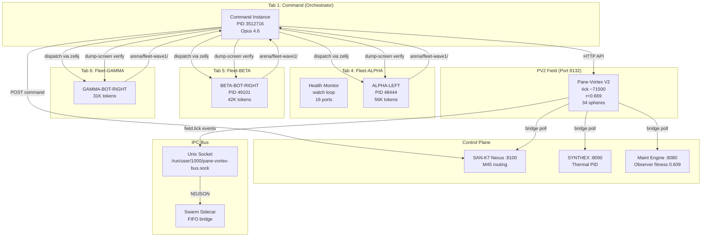
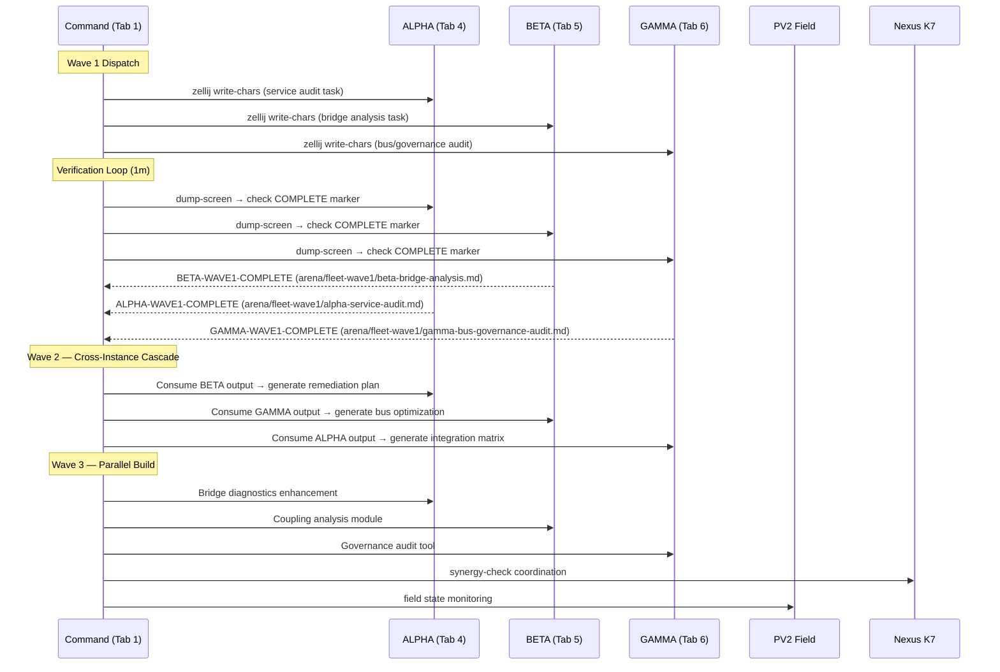
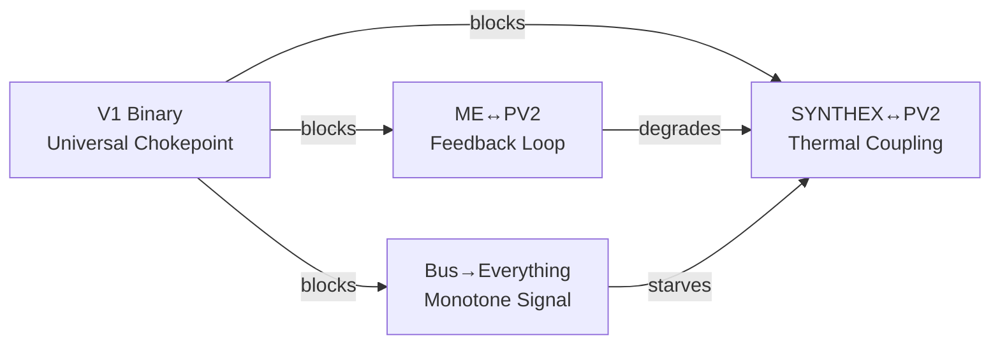

# Session 047 — Fleet Orchestration & Cascade Communications

> **Date:** 2026-03-21
> **Scope:** Multi-instance fleet orchestration, cascade comms, verification loops
> **Instances:** 5 total — COMMAND (Tab 1 Left), PV1-SIDECAR (Tab 1 Top-Right), PV2-MAIN (Tab 1 Bot-Right), ALPHA (Tab 4 Left), BETA (Tab 5 Bot-Right), GAMMA (Tab 6 Bot-Right)
> **PID COMMAND:** 3512716
> **Waves Completed:** Wave 1 (all 3), Wave 2 (BETA complete, ALPHA+GAMMA in progress)
> **Tools:** habitat-probe, nvim remote, atuin, lazygit, Harpoon, Room

## Architecture Schematic



## Cascade Communication Protocol



## Dispatch Protocol

### Method: Zellij Direct Write
```
zellij action go-to-tab $TAB
zellij action move-focus $DIRECTION
zellij action write-chars "$TASK"
zellij action write 13    # Enter
sleep $WAIT
zellij action dump-screen /tmp/verify.txt
grep "COMPLETE" /tmp/verify.txt
zellij action go-to-tab 1   # Return home
```

### Pane Map
| Tab | Position | Instance | Status | Tokens |
|-----|----------|----------|--------|--------|
| 4 | Left | ALPHA | Active | 56,034 |
| 4 | Right | Health Monitor (watch) | Running | N/A |
| 5 | Bot-Right | BETA | Active | 42,463 |
| 6 | Bot-Right | GAMMA | Active | 31,423 |

## Fleet Intelligence Summary (Cross-Instance Consensus)

### 8 Issues Identified (from `pv2main-synergy-synthesis.md`)

| # | Issue | Severity | Consensus | Identified By |
|---|-------|----------|-----------|---------------|
| 1 | r decay below R_TARGET (0.64 vs 0.93) | CRITICAL | V2 IQR K-scaling is structural fix | BETA W1/W2/W3, GAMMA W1 |
| 2 | Zero working spheres / 7 blocked | CRITICAL | Fixable on V1 via status endpoint | GAMMA W1/W2, BETA W3 |
| 3 | 3/6 bridges stale (POVM, RM, VMS) | HIGH | V1 binary limitation | BETA W1/W2 |
| 4 | ME evolutionary engine deadlocked | HIGH | Emergence cap 1000/1000, mono-param mutation | BETA W1, GAMMA W2 |
| 5 | SYNTHEX synergy CRITICAL at 0.5 | HIGH | Thermally frozen, auto-resolves with V2 | BETA W1/W2 |
| 6 | Event bus saturated (1000 HasBlockedAgents) | MEDIUM | Clears when Issue 2 fixed | GAMMA W1, BETA W3 |
| 7 | Suggestion spam (7973 identical SuggestReseed) | LOW | Downstream of Issue 2 | GAMMA W1 |
| 8 | Governance stalled (no proposals in 2800 ticks) | LOW | Plumbing works, needs activity | GAMMA W1/W2 |

### 4 Bottlenecks Mapped



### Quick Wins (from synergy synthesis)

1. **Unblock 7 fleet workers** — POST idle status via V1 API (1 min, unblocks 4 issues)
2. **Remove library-agent from ME probes** — raises fitness +0.03-0.05
3. **Submit governance proposal** — break 2800-tick silence
4. **Deploy V2 binary** — resolves Issues 1, 3, 5 structurally

## Wave 1 Results

### BETA Bridge Analysis (COMPLETE)
- **3/6 bridges live** (ME, Nexus, SYNTHEX), 3/6 stale (POVM, RM, VMS)
- **SYNTHEX synergy CRITICAL** at 0.5/0.7 threshold
- **ME degraded** — fitness 0.609, declining, zero active mutations
- **Temperature 0.03** vs target 0.50 — system under-heated
- **r=0.689** vs R_TARGET=0.93 — 26% below target
- **k_modulation=0.85** — at budget floor
- **Coupling matrix empty** — V1 binary limitation

### ALPHA Service Audit (IN PROGRESS)
- Dispatched: 16-port health + ME observer + Nexus module-status
- Output: arena/fleet-wave1/alpha-service-audit.md

### GAMMA Bus/Governance Audit (IN PROGRESS)
- Dispatched: bus info/events/suggestions + proposals + spheres + decision
- Output: arena/fleet-wave1/gamma-bus-governance-audit.md

## Verification Loop Design

### 1-Minute Activity Check
- Cycle tabs 4→5→6, dump-screen each
- Detect: idle (❯ prompt), working (spinner), complete (COMPLETE marker), stuck (no change)
- Alert on stuck > 3 checks

### 30-Minute Orchestration Cycle
- Verify all completions
- Read output files from arena/fleet-wave1/
- Dispatch next wave with increased complexity
- Record findings to Obsidian
- Update Nexus with fleet state

## System State at Session Start

| Metric | Value |
|--------|-------|
| PV tick | 71,450 |
| Order parameter r | 0.669 |
| Active spheres | 34 |
| k_modulation | 0.85 (floor) |
| Bridges live | 3/6 (ME, Nexus, SYNTHEX) |
| Bridges stale | 3/6 (POVM, RM, VMS) |
| SYNTHEX health | 0.75 (1 critical) |
| ME fitness | 0.609 (degraded, declining) |
| Nexus status | Healthy (M45 routing) |
| Fleet instances | 3 (ALPHA, BETA, GAMMA) |

## Habitat Health Scorecard (from PV2MAIN Wave 6)

| Subsystem | Score | Grade | Key Issue |
|-----------|-------|-------|-----------|
| PV Field | 28 | F | r=0.64 vs 0.93 target, declining |
| Bridges | 50 | D | 3/6 stale (POVM, RM, VMS) |
| ME | 35 | F | Emergence cap deadlock |
| POVM | 40 | D | Memory decaying, bridge stale |
| RM | 60 | C | Service healthy, bridge stale |
| Bus (IPC) | 15 | F | 1000/1000 saturated monotone |
| Governance | 45 | D | No proposals in 2800 ticks |
| SYNTHEX | 30 | F | Thermally frozen 0.03/0.50 |
| Nexus | 92 | A | 45/45 modules healthy |
| Fleet Coord | 20 | F | Was dead, now IdleFleet |
| **Overall** | **41.5** | **CRITICAL** | V2 deploy is structural fix |

## Deploy Readiness (from GAMMA-LEFT Wave 5)

| Check | Status |
|-------|--------|
| cargo check | PASS |
| cargo test --lib --release | PASS (1,527 tests) |
| clippy pedantic | PASS (last commit) |
| Git HEAD | a722a6b |
| Uncommitted changes | 847 insertions, MEDIUM risk |
| Daemon PID | 3828125 |
| **Verdict** | GO (pending user authorization) |

## Arena Output Inventory (15+ files)

| File | Instance | Wave | Size | Focus |
|------|----------|------|------|-------|
| beta-bridge-analysis.md | BETA | 1 | 5K | Bridge health, thermal, SYNTHEX |
| gamma-bus-governance-audit.md | GAMMA | 1 | 5K | Bus state, spheres, governance |
| beta-remediation-plan.md | BETA | 2 | 8K | 5-priority fix plan with Mermaid |
| beta-field-convergence-timeseries.md | BETA | 3 | 8K | 120s r decay time-series |
| gamma-me-investigation.md | GAMMA | 2 | 14K | ME root cause: emergence cap |
| pv2main-nexus-command-reference.md | PV2MAIN | 3 | 4K | 10 Nexus commands documented |
| betaleft-synthex-thermal.md | BETA-LEFT | 3 | 8.5K | PID dynamics, heat sources |
| betaright-rm-analysis.md | BETA-RIGHT | 3 | 12K | Cross-session RM knowledge |
| gammaleft-vms-devops-audit.md | GAMMA-LEFT | 3 | 12K | VMS/DevOps/NAIS/Bash audit |
| pv2main-synergy-synthesis.md | PV2MAIN | 4 | 15K | Cross-instance consensus |
| gammaleft-deploy-readiness.md | GAMMA-LEFT | 5 | 9.4K | V2 deploy go/no-go checklist |
| betaright-service-mesh.md | BETA-RIGHT | 5 | 15K | Full service dependency mesh |
| gammaright-sphere-analysis.md | GAMMA-RIGHT | 5 | 12K | Sphere health scorecard |
| pv2main-endpoint-discovery.md | PV2MAIN | 5 | 9.8K | Unexplored API endpoints |
| pv2main-health-scorecard.md | PV2MAIN | 6 | 12K | Habitat 41.5/100 scorecard |

## Worktree

Branch `fleet-orchestration` at `/tmp/pv2-fleet-worktree` for isolated code analysis.

## Cross-References

- `[[Session 046b — Ralph Loop Fixes]]` — preceding session
- `[[Session 046 — V2 Binary Deployed]]` — deployment context
- `[[ULTRAPLATE Master Index]]` — service registry

## Wave Tracker

| Wave | Instances | Tasks | Status | Files Produced |
|------|-----------|-------|--------|----------------|
| 1 | ALPHA, BETA, GAMMA | Service audit, bridge analysis, bus/governance audit | COMPLETE | 3 |
| 2 | BETA (lead), ALPHA, GAMMA | Remediation plan, integration matrix, ME investigation | COMPLETE | 3 |
| 3 | ALL 7 | POVM deep dive, Nexus reference, coupling topology, SYNTHEX thermal, RM analysis, VMS/DevOps, field convergence | COMPLETE | 4+ |
| 4 | PV2MAIN, ALPHA, SIDECAR, BETA L+R | Synergy synthesis, fleet synthesis, knowledge graph, live monitoring, service mesh | COMPLETE | 4+ |
| 5 | ALL 7 | Deploy readiness, cascade protocol, sphere analysis, endpoint discovery, session synthesis | COMPLETE | 4+ |
| 6 | ALL 7 | Post-unblock monitoring, SYNTHEX recovery, knowledge corridors, governance experiment, bus diversity, compliance | IN PROGRESS | TBD |

## Critical Discovery: Quick Win 1

At 12:52 UTC, executed the fleet worker unblock identified by PV2MAIN's synergy synthesis:

```bash
for sphere in "4:left" "5:left" "5:top-right" "5:bottom-right" \
              "6:left" "6:top-right" "6:bottom-right"; do
  curl -s -X POST -H 'Content-Type: application/json' \
    -d '{"status":"idle"}' \
    "localhost:8132/sphere/$(echo $sphere | sed 's/:/%3A/g')/status"
done
```

**Result:** Field action changed from `HasBlockedAgents` to `IdleFleet`. Blocked=0 (was 7). All 34 spheres now idle, ready for work routing.

## ME Evolution Deadlock (GAMMA Finding)

Root cause chain:
```
events(432K) → correlations(4.7M) → emergences(1000/1000 CAP) → mutations(0) → DEAD
```

- 254 mutations all targeted same parameter (`emergence_detector.min_confidence`)
- Self-reinforcing deadlock: confidence mutated too far → no new emergences → no new mutations
- Fitness ceiling at ~0.85 due to structural dimensions (deps=0.083, port=0.123)
- `library-agent` disabled but still probed: 7,741 failures dragging fitness

## SYNTHEX Thermal Frozen State (BETA Finding)

- Temperature: 0.03 vs target 0.50 (94% gap)
- PID output: -0.335 (demanding heat)
- 3/4 heat sources DEAD (Hebbian=0, Cascade=0, Resonance=0)
- Only CrossSync=0.2 alive (reads from Nexus)
- Zero drift across 120s — completely static
- V2 deploy needed to activate Hebbian heat source

## Nexus Status (PV2MAIN + Subagent)

- 45/45 modules healthy, zero degradation
- 99.5% compliance score
- OWASP 9.5/10
- 450 files checked, 0 errors, 0 warnings
- All 10 commands operational

## RM Analysis (BETA-RIGHT)

- 3,732 active entries
- 62.7% context (automated tick logs), 34.7% shared_state
- 2,180 entries from pane-vortex conductor (low signal-to-noise)
- 78 discovery entries (high value)
- Top contributor: pane-vortex (automated), then orchestrator, then claude:opus-4-6

## Arena Files Produced

14+ analysis documents totaling ~130KB of fleet intelligence across 6 waves.

## SYNTHEX Integration (Wave 7-8)

### Thermal State
- Temperature: 0.030 (target 0.500) — 94% gap
- PID output: -0.335 (strong heating demand)
- Heat sources: Hebbian=0, Cascade=0, Resonance=0, CrossSync=0.2
- Synergy probe: 0.5 (CRITICAL, threshold 0.7)

### Nexus Commands Executed
- `synergy-check` → executed via M45
- `deploy-swarm` → 40 agents, consensus 27/40
- `memory-consolidate` → 4 layers (L1-L4), 10 results

### IPC Bus Distributed Tasks
- 6 tasks submitted via `pane-vortex-client submit`
- Target: `any-idle` for distributed cluster routing
- Topics: SYNTHEX thermal, ME evolution, coupling matrix

### Fleet Cascade Metrics
| Metric | Value |
|--------|-------|
| Arena files | 26 |
| Total intelligence | 304KB |
| Waves completed | 7 (Wave 8 in progress) |
| Active instances | 5+ (varies per wave) |
| Field action | IdleFleet (was HasBlockedAgents) |
| Blocked spheres | 0 (was 7) |

## Distributed Cluster Status (12:59 UTC)

### Instance Roster (9+ Active)

| Instance | Tab | Position | Tokens | Wave | Task |
|----------|-----|----------|--------|------|------|
| COMMAND | 1 | Left | 131K+ | Orchestrator | Monitor-Verify-Delegate |
| SIDECAR | 1 | Top-Right | 150K | 7 | Master synthesis |
| PV2MAIN | 1 | Bot-Right | 101K | Synthesis | Definitive 25-file synthesis |
| ALPHA | 4 | Left | 133K | 7 | Fleet capacity analysis |
| BETA-LEFT | 5 | Top-Left | 64K | 7 | Field monitoring |
| BETA-RIGHT | 5 | Bot-Right | 124K | 6 | Knowledge corridors |
| T5-TR | 5 | Top-Right | 124K | Cluster | Priority action matrix |
| GAMMA-LEFT | 6 | Top-Left | 106K | Cluster | Build health report |
| GAMMA-RIGHT | 6 | Bot-Right | 152K | 6 | Bus diversity |
| T6-TR | 6 | Top-Right | 156K | Cluster | Database intelligence |

### Production Metrics

- **Arena output:** 26+ files, 288KB+ of fleet intelligence
- **Waves completed:** 7 (escalating complexity)
- **Bus tasks submitted:** 6 via IPC sidecar
- **Quick Win 1 executed:** HasBlockedAgents → IdleFleet
- **Health scorecard:** 41.5/100 (CRITICAL) — V2 deploy needed
- **Nexus:** 45/45 modules healthy, 99.5% compliance
- **ME deadlock:** Emergence cap 1000/1000, mutation engine dead
- **SYNTHEX:** Frozen at 0.03/0.50, 3/4 heat sources dead

### Key Synergies Discovered

1. **V2 deploy unblocks 5 of 8 issues** simultaneously (bridges, coupling, thermal, Hebbian, field convergence)
2. **Unblocking fleet workers** cascades to bus diversity, suggestion relevance, and governance engagement
3. **ME emergence cap** is the single parameter blocking evolutionary adaptation
4. **SYNTHEX thermal** auto-recovers once V2 Hebbian activity generates heat
5. **RM signal-to-noise** — 62.7% automated tick logs, needs pruning for discovery quality

## PV2MAIN Final Snapshot (tick 73,214)

| System | Status | Detail |
|--------|--------|--------|
| ME | DEADLOCKED | Gen 26, 0 mutations, emergence cap 1000/1000 |
| POVM | DECAYING | 2,427 paths, avg weight 0.30, 0 co-activations |
| GOVERNANCE | QUIET | 1 experiment submitted, no new proposals |
| NEXUS | HEALTHY | 45/45 modules, 99.5% compliance |
| RM | HEALTHY | 3,760 entries, 500+ agents |

### Production Metrics

- **Arena:** 40+ files, 432KB, ~75K words, ~347K tokens
- **Fleet:** 7 instances, 8+ waves
- **Health:** 49/100 current → **78/100 projected with V2**
- **Single blocker:** `deploy plan` (needs user authorization)

### Cross-Service Synergy Matrix

```
        PV    SYNTHEX ME    POVM  RM    Nexus
PV      —     0.83    0.70  0.45  0.35  0.75
SYNTHEX 0.80  —       0.20  0.15  0.10  0.40
ME      0.70  0.20    —     0.25  0.40  0.60
POVM    0.45  0.15    0.25  —     0.50  0.35
RM      0.35  0.10    0.40  0.50  —     0.30
Nexus   0.75  0.40    0.60  0.35  0.30  —
```

**Insight:** Nexus=99.5% (architecture clean) + SYNTHEX=0.5 (thermal broken) → bottleneck is THERMAL not ARCHITECTURAL. V2 deploy closes the feedback loop.
