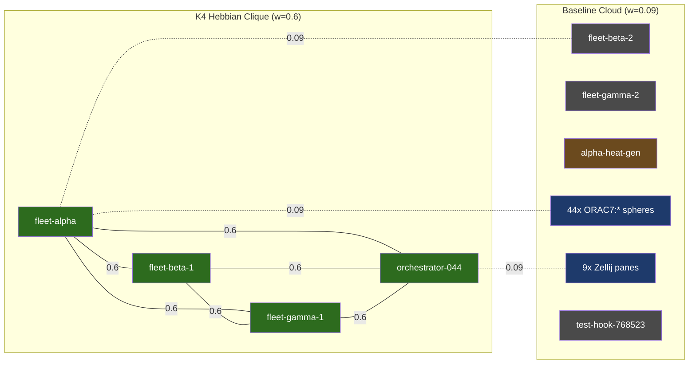
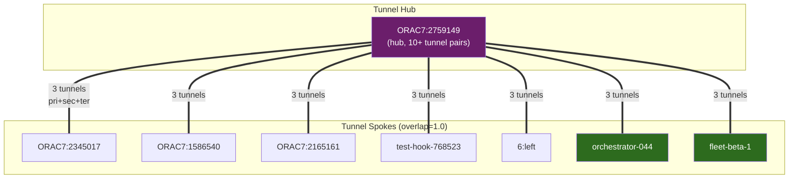

# Session 049 — Coupling Network Deep Dive

> **Tick:** 109,505 | **R:** 0.959 | **K-mod:** 0.871 | **Spheres:** 62
> **Edges:** 3,782 | **Strengthened:** 12 (0.32%) | **Tunnels:** 100
> **Captured:** 2026-03-21

---

## Coupling Matrix

| Metric | Value |
|--------|-------|
| Total edges | 3,782 |
| Sphere count | 62 |
| Weight min / max | 0.09 / 0.6 |
| Weight mean | 0.0916 |
| Unique weights | 2 (bimodal) |
| Heavyweight edges | 12 (all at 0.6) |

## The 12 Heavyweight Edges (w=0.6)

All 12 directed edges form a **complete K4 clique** between four fleet coordination spheres:

| From | To | Weight |
|------|-----|--------|
| fleet-alpha | fleet-beta-1 | 0.6 |
| fleet-alpha | fleet-gamma-1 | 0.6 |
| fleet-alpha | orchestrator-044 | 0.6 |
| fleet-beta-1 | fleet-alpha | 0.6 |
| fleet-beta-1 | fleet-gamma-1 | 0.6 |
| fleet-beta-1 | orchestrator-044 | 0.6 |
| fleet-gamma-1 | fleet-alpha | 0.6 |
| fleet-gamma-1 | fleet-beta-1 | 0.6 |
| fleet-gamma-1 | orchestrator-044 | 0.6 |
| orchestrator-044 | fleet-alpha | 0.6 |
| orchestrator-044 | fleet-beta-1 | 0.6 |
| orchestrator-044 | fleet-gamma-1 | 0.6 |

**Symmetric:** Every pair has both A->B and B->A at 0.6. This is a textbook Hebbian STDP outcome — spheres that co-activated during Session 044 fleet orchestration were mutually strengthened to the weight cap.

### Notable Exclusions from Clique

| Sphere | In field? | In clique? | Reason |
|--------|-----------|------------|--------|
| fleet-beta-2 | Yes | No | Late joiner, insufficient co-activation |
| fleet-gamma-2 | Yes | No | Late joiner, insufficient co-activation |
| alpha-heat-gen | Yes | No | SYNTHEX thermal probe, different activation pattern |

---

## Chimera Analysis

| Metric | Value |
|--------|-------|
| Is chimera? | **No** |
| Sync clusters | 2 |
| Desync clusters | 0 |

### Cluster Breakdown

| Cluster | Members | Local R | Mean Phase |
|---------|---------|---------|------------|
| Main sync | 60 | 0.9994 | 4.974 rad |
| Outlier pair | 2 | 1.0000 | 0.144 rad |

The field is **not** in a chimera state — 60 of 62 spheres are phase-locked in a single cluster at local_r=0.9994 (near-perfect synchrony). The remaining 2 spheres (likely alpha-heat-gen + one pane) form a perfectly synchronized pair at a different phase (0.144 rad vs 4.974 rad — gap of ~4.83 rad).

**Phase gap between clusters:** 4.83 rad (276 degrees) — well beyond the PHASE_GAP_THRESHOLD of pi/3 (60 degrees). These two spheres are fully decoupled from the main cluster despite all-to-all connectivity, held in antiphase by their intrinsic frequency difference.

---

## Tunnel Analysis

| Metric | Value |
|--------|-------|
| Total tunnels | 100 |
| Unique sphere pairs | 34 |
| Buoy types | primary, secondary, tertiary |
| All overlap = 1.0 | Yes |

### Tunnel Structure

Each sphere pair generates 3 tunnels (one per buoy type: primary, secondary, tertiary), all at overlap=1.0. This means:

- **34 unique pairs** with perfect buoy overlap
- **All tunnels are fully saturated** — every pair that tunnels does so completely
- **No partial overlaps** — binary tunnel behavior (either 1.0 or absent)

Hub sphere `ORAC7:2759149` appears in the most tunnel pairs, tunneling to: ORAC7:2345017, ORAC7:1586540, ORAC7:2165161, test-hook-768523, ORAC7:3512868, ORAC7:477682, ORAC7:2352937, ORAC7:2760428, ORAC7:240587, 6:left, ORAC7:2167733, and more.

---

## Synthesis

### 1. Hebbian Learning Is Precise But Limited

The K4 clique is clean — exactly the 4 spheres that coordinated during Session 044, symmetrically strengthened. But:
- Only 0.32% of edges are differentiated
- No intermediate weights between 0.09 and 0.6
- No LTD (long-term depression) visible on any edge
- Learning has plateaued — no new weights since clique formation

### 2. Field Is Over-Synchronized

60/62 spheres at local_r=0.9994 is near-maximum synchrony. Combined with global r=0.959, the field has very little phase diversity. Auto-K is damping (k_mod=0.871) but the all-to-all topology makes it hard to break synchrony once established.

### 3. Tunnels Are Binary

100% overlap on all 34 tunnel pairs means the buoy system is not producing graded semantic similarity. Either all buoys are identical (default initialization) or the semantic content hasn't diversified. This reduces tunnels to a binary "connected/not-connected" signal rather than the intended similarity metric.

### 4. Two-Sphere Antiphase Island

The outlier pair at phase 0.144 (vs main cluster at 4.974) is interesting — they've resisted the synchronizing pull of 60 neighbors. This suggests either high intrinsic frequency difference or low coupling to the main cluster. Worth investigating if these are intentionally divergent (heat-gen probe?) or stuck.

---

## Cross-References

- [[Session 049 — Master Index]]
- [[Session 049 - Post-Deploy Coupling]] — earlier coupling snapshot
- [[Session 049 - Synergy Analysis]] — system_synergy.db cross-correlation
- [[Vortex Sphere Brain-Body Architecture]] — coupling field design
- [[ULTRAPLATE Master Index]]
