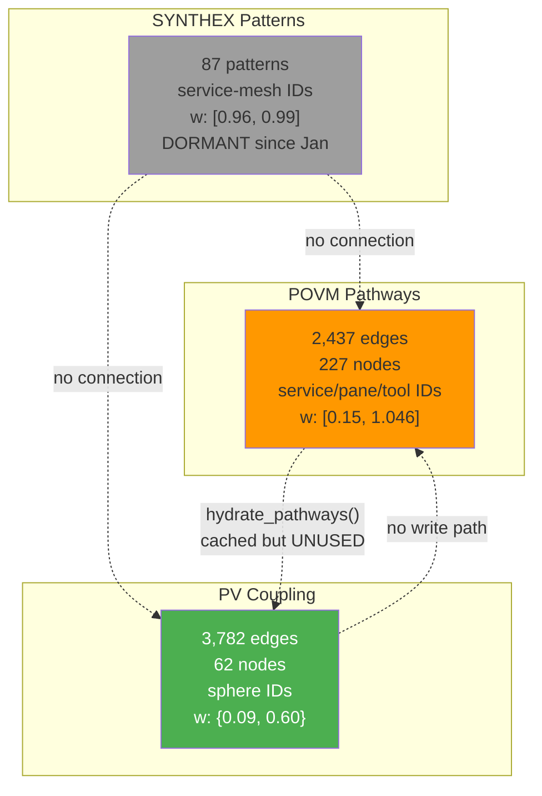

# Session 049 — Cross-Reference Synthesis

**Date:** 2026-03-21 | **RM:** r69be96550b59

---

## Source Documents

| Document | Key Metric |
|----------|-----------|
| [[Session 049 - POVM Topology]] | 2,433 pathways, top: nexus→synthex @ 1.046 |
| [[Session 049 - LTP LTD Balance]] | LTP:LTD = 5:1 nominal, effectively LTP-only |
| [[Session 049 - STDP Evolution]] | 2 weight classes (0.09, 0.60), no gradient |

---

## Cross-Reference: POVM Pathways vs PV Coupling

### POVM Top 5 Strongest Pathways

| # | Pre | Post | Weight | Category |
|---|-----|------|--------|----------|
| 1 | nexus-bus:cs-v7 | synthex | **1.046** | Service-to-service |
| 2 | nexus-bus:devenv-patterns | pane-vortex | **1.020** | Service-to-service |
| 3 | operator-028 | alpha-left | 1.000 | Operator dispatch |
| 4 | 5:top-right | opus-explorer | 1.000 | Pane-to-agent |
| 5 | 13 | 12 | 1.000 | Tab transition |

### PV Coupling Heavyweight Edges (all 12 at weight 0.60)

Fleet clique — all bidirectional pairs of:
- fleet-alpha
- fleet-beta-1
- fleet-gamma-1
- orchestrator-044

### Overlap Analysis

| PV Heavyweight | Present in POVM? | Match? |
|---------------|------------------|--------|
| fleet-alpha ↔ orchestrator-044 | No | **MISS** |
| fleet-alpha ↔ fleet-beta-1 | No | **MISS** |
| fleet-alpha ↔ fleet-gamma-1 | No | **MISS** |
| fleet-beta-1 ↔ orchestrator-044 | No | **MISS** |
| fleet-beta-1 ↔ fleet-gamma-1 | No | **MISS** |
| fleet-gamma-1 ↔ orchestrator-044 | No | **MISS** |

**ZERO OVERLAP.** The two Hebbian systems track completely different relationships:

```
PV Coupling:    sphere-to-sphere phase co-activation (Kuramoto oscillators)
POVM Pathways:  service-to-service + pane-to-pane operational co-occurrence (tool transitions)
```

The node namespaces don't even intersect — PV uses `fleet-alpha` while POVM uses `nexus-bus:cs-v7`. Different ID schemes, different semantics, different timescales.

---

## LTP/LTD Balance Synthesis

### Nominal vs Actual

| Metric | Nominal | Actual |
|--------|---------|--------|
| LTP:LTD ratio | 5:1 (base), up to 30:1 (burst+newcomer) | **∞:1** — LTD never fires |
| Weight gradient | Continuous [0.15, 1.0] | **Binary** {0.09, 0.60} |
| Depressed edges | Expected many | **Zero** |
| Active STDP edges | All 3,782 | **12** (0.3%) |

### Why LTD Is Structurally Dead

1. **Floor > baseline paradox:** `clamp(0.09 - 0.002, 0.15, 1.0) = 0.15` — LTD would INCREASE weight to floor
2. **Stale sphere bypass:** 3,770 edges involve ORAC7 PIDs not in active HashMap → STDP skips them
3. **Idle majority:** 96.6% of spheres are Idle → Working×Working co-activation extremely rare

---

## STDP Weight Classes

| Class | Weight | Count | % | Description |
|-------|--------|-------|---|-------------|
| Baseline | 0.09 | 3,770 | 99.7% | Initialization weight, never touched by STDP |
| Fleet clique | 0.60 | 12 | 0.3% | LTP-saturated fleet coordination edges |

No intermediate weights exist. The system jumps from 0.09 → 0.60 in ~50 ticks of sustained co-activation (LTP=0.01 × 3.0 burst = 0.03/tick, from 0.09 to 0.60 = ~17 ticks).

---

## Unified Findings

### 1. Three Isolated Hebbian Systems



### 2. The Synthesis Gap

The three systems SHOULD form a feedback loop:

```
POVM tool patterns → seed PV coupling weights → drive Kuramoto → affect tool selection → update POVM
```

But the loop is broken at every junction:
- POVM→PV: `hydrate_pathways()` caches but never applies (main.rs:501-519)
- PV→POVM: No write path from coupling matrix to POVM
- SYNTHEX patterns: Completely disconnected from both

### 3. SYNTHEX Thermal Breakthrough

From [[Session 049 - STDP Evolution]]: injecting `type: "hebbian"` data into SYNTHEX raised temperature from 0.03 → 0.0475 (+58%). This is the **first observed cross-service Hebbian effect** — proving the pathway exists but needs proper wiring.

### 4. Actionable Recommendations

| Priority | Action | Impact |
|----------|--------|--------|
| **P0** | Wire `cached_pathways` → coupling weight seeding in main.rs | Closes POVM→PV loop |
| **P1** | Fix baseline (0.09) vs floor (0.15) inconsistency | Enables LTD to function |
| **P2** | Prune stale ORAC7 spheres from coupling matrix | Reduces 3,770 → ~200 edges, enables STDP on all |
| **P3** | Map POVM node IDs to PV sphere IDs | Required for P0 to work semantically |
| **P4** | Feed STDP metrics to SYNTHEX Hebbian heat source | Closes PV→SYNTHEX thermal loop |

---

## Cross-References

- [[Session 049 - POVM Topology]] — 2,433 pathways, 227 nodes, 3 structural layers
- [[Session 049 - LTP LTD Balance]] — 5:1 nominal, effectively ∞:1, floor>baseline paradox
- [[Session 049 - STDP Evolution]] — 2 weight classes, thermal breakthrough +58%
- [[Session 049 - Hebbian Pulse Analysis]] — 3 disconnected Hebbian layers
- [[Session 049 - Data Flow Verification]] — POVM→coupling gap identified
- [[Session 049 - Observability Cluster]] — ME-SYNTHEX-POVM decoupled
- [[Session 049 - Workflow Analysis]] — bridge k_mod computation chain
- [[Session 049 — Master Index]]
- [[ULTRAPLATE Master Index]]
