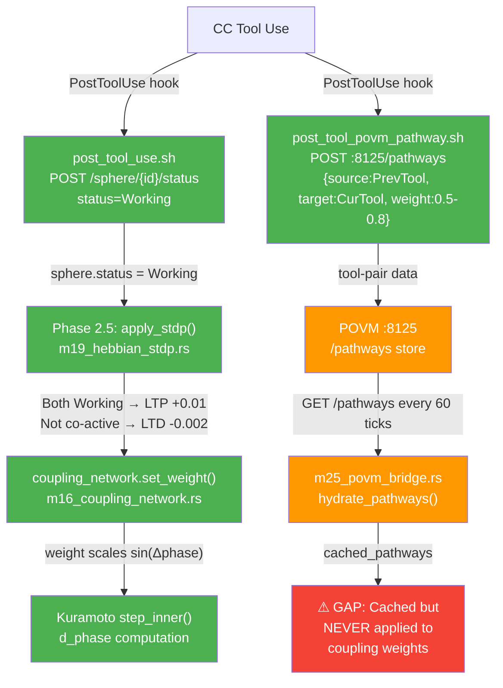
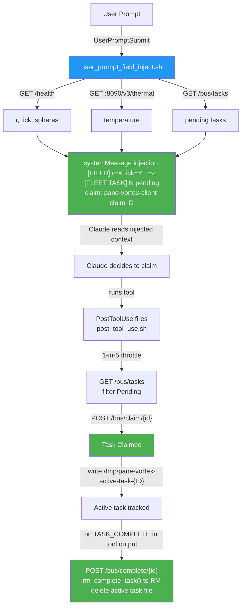

# Session 049 — Data Flow Verification (Subagent Analysis)

**Date:** 2026-03-21 | **Task:** 63ae7dd2

## Flow 1: Tool Use → POVM → Hebbian STDP → Coupling Weight

### Connected (working end-to-end)

| Stage | File | Status |
|-------|------|--------|
| Tool use → sphere status=Working | hooks/post_tool_use.sh | **CONNECTED** |
| Working status → STDP co-activity | m35_tick.rs Phase 2.5 | **CONNECTED** |
| STDP LTP/LTD → connection.weight | m19_hebbian_stdp.rs | **CONNECTED** |
| connection.weight → Kuramoto d_phase | m16_coupling_network.rs | **CONNECTED** |
| Hook → tool-pair → POVM Engine | hooks/post_tool_povm_pathway.sh | **CONNECTED** |
| POVM → bridge hydration | m25_povm_bridge.rs | **CONNECTED** |
| Cached pathways → coupling weights | NOWHERE | **GAP** |

### The Gap

`src/bin/main.rs:501-519` — `hydrate_pathways()` is called, pathways cached, but the `Vec<Pathway>` is logged and discarded. No code translates POVM tool→tool weights into sphere→sphere coupling weights. Semantic mismatch: pathways are `"Read"→"Edit"` but coupling is `"hostname:PID"→"hostname:PID"`.

---

## Flow 2: Prompt → Hook → Field Injection → Task Discovery → Claim

### Verified Connected

| Stage | File | Status |
|-------|------|--------|
| Prompt → hook fires | settings.json → user_prompt_field_inject.sh | **CONNECTED** |
| Hook → field + thermal + tasks | 3 curl calls | **CONNECTED** |
| Injection → Claude sees tasks | systemMessage output | **CONNECTED** |
| PostToolUse → auto-claim (1-in-5) | post_tool_use.sh | **CONNECTED** |
| TASK_COMPLETE → auto-complete | post_tool_use.sh grep | **CONNECTED** |
| RM mirroring (claim + complete) | hooks/lib/rm_bus.sh | **CONNECTED** |
| File queue fallback | hooks/lib/task_queue.sh | **CONNECTED** |

### Known Issues

1. **TASK_COMPLETE detection:** Greps `$TOOL_OUTPUT` not Claude's prose — if Claude says TASK_COMPLETE in text only, detection misses until next tool output contains it
2. **Doc mismatch:** FLEET_HOOK_WIRING.md lists `GET /field/decision` for hook 2, but actual script doesn't call it
3. **Project scope guard:** All hooks exit early if `pwd != pane-vortex-v2/` (GAP-G3 by design)

---

## Cross-References

- [[Session 049 - System Architecture]]
- [[Session 049 - Fleet Architecture]]
- [[IPC Bus Architecture Deep Dive]]
- [[ULTRAPLATE Master Index]]
