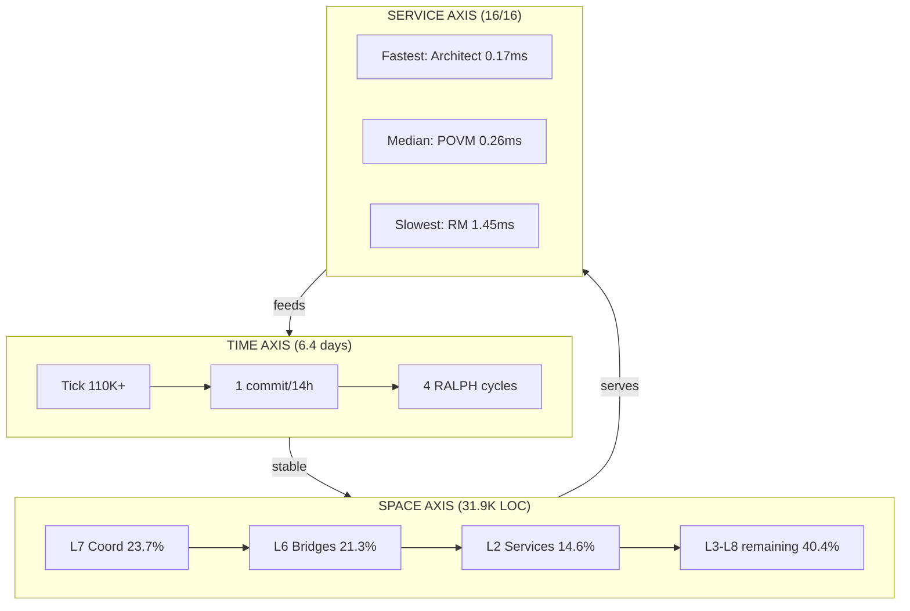

# Session 049 — Dimensional Analysis

**Date:** 2026-03-21 | **Method:** 3 parallel subagents + direct probes

## Axis 1: TIME

| Metric | Value |
|--------|-------|
| Tick | 110,330 |
| Tick interval | 5s |
| Implied uptime | ~6.4 days |
| Commits (14h) | 1 |
| RALPH cycles | 4 |

**Phase:** Stable operational — long uptime, minimal churn, low RALPH activity.

## Axis 2: SPACE

| Layer | Files | LOC | % | Dominant Module |
|-------|-------|-----|---|-----------------|
| L1 Foundation | 7 | 3,416 | 10.7% | m01_core_types (1,102) |
| L2 Services | 5 | 4,638 | 14.6% | m10_api_server (3,234) |
| L3 Field | 6 | 4,188 | 13.1% | m11_sphere (1,337) |
| L4 Coupling | 4 | 1,741 | 5.5% | m16_coupling_network (903) |
| L5 Learning | 4 | 1,441 | 4.5% | m19_hebbian_stdp (555) |
| L6 Bridges | 8 | 6,792 | 21.3% | m28_consent_gate (1,128) |
| L7 Coordination | 9 | 7,539 | 23.7% | m29_ipc_bus (1,956) |
| L8 Governance | 6 | 2,104 | 6.6% | m37_proposals (741) |
| **Total** | **49** | **31,859** | | |

## Axis 3: SERVICE (Latency Ranking)

| Rank | Port | Service | Latency |
|------|------|---------|---------|
| 1 | 9001 | Architect Agent | 0.17ms |
| 2 | 8110 | CodeSynthor V7 | 0.18ms |
| 3 | 10001 | Prometheus Swarm | 0.18ms |
| 4 | 8103 | Tool Maker | 0.20ms |
| 5 | 8102 | Bash Engine | 0.22ms |
| ... | ... | ... | ... |
| 14 | 8100 | SAN-K7 | 0.43ms |
| 15 | 8080 | ME | 0.45ms |
| 16 | 8130 | RM | 1.45ms |

**All sub-2ms.** RM slowest (1.45ms) due to SQLite query overhead.

## Cross-Dimensional Insights

1. **Coordination dominates space** — L7+L6 = 45% of LOC, reflecting PV2's primary role as fleet coordinator
2. **Time is calm** — 1 commit, 4 RALPH cycles in 14h = observation phase, not active development
3. **Service latency uniform** — 15/16 services under 0.5ms, only RM at 1.45ms (SQLite I/O)
4. **Uptime vs commits** — 6.4 days uptime with 1 commit suggests daemon stability post-deployment

---
*Cross-refs:* [[Session 049 — Master Index]], [[Session 049 - Field Cluster]], [[Session 049 - Subagent Exploration]]
