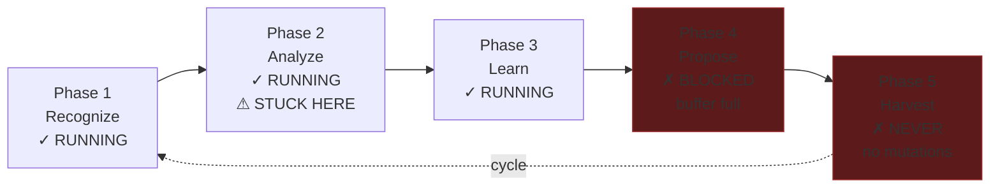
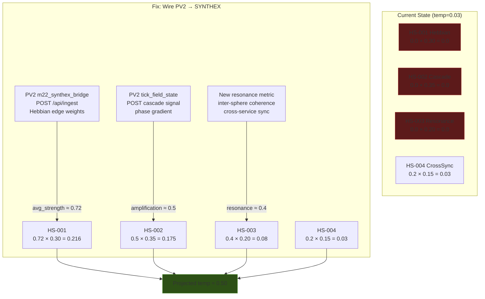

# Session 049 — Evolution Deep Dive

> **Date:** 2026-03-21 | **Scope:** ME evolution chamber + SYNTHEX thermal model
> **Method:** 2 parallel Explore subagents | **Task:** `8cfaf03d`

---

## Part 1: ME Evolution Chamber — Zero Mutations (BUG-035)

### Current State

| Metric | Value | Status |
|--------|-------|--------|
| Generation | 28 | Active |
| Ticks executed | 15,288 | ~21.4 hours runtime |
| System state | Degraded | Stable trend |
| Current fitness | 0.619 | Plateau (±0.01) |
| Emergences detected | **1,000** | **CAPPED** |
| Correlations found | 29,590 | Growing normally |
| Events ingested | 2,784 | Normal input |
| Mutations proposed | **0** | CRITICAL |
| Mutations applied | **0** | CRITICAL |
| RALPH cycles | 5 | Running, stuck in Analyze |

### Root Cause Chain

```
emergence_cap = 1000 (HARD LIMIT)
        ↓
Buffer 100% full (1000/1000)
        ↓
RALPH Propose phase cannot write
        ↓
Zero mutations generated
        ↓
Zero mutations applied
        ↓
Fitness plateau at 0.619
```

### RALPH Cycle Architecture (5 phases)



### Fitness Dimensions (breakdown of 0.619)

| Dimension | Score | Assessment |
|-----------|-------|------------|
| service_id | 1.00 | Perfect |
| uptime | 1.00 | Perfect |
| agents | 0.92 | Excellent |
| synergy | 0.83 | Good |
| protocol | 0.75 | Decent |
| temporal | 0.75 | Decent |
| error_rate | 0.58 | Poor |
| health | 0.58 | Poor |
| tier | 0.49 | Mediocre |
| port | 0.12 | Bad |
| deps | 0.08 | Very bad |

Port and deps scores are structural (design-time), not runtime. Error and health stagnate because no mutations run to fix them.

### Fix

**Raise emergence_cap from 1,000 to 5,000.** This unblocks the Propose phase, allowing mutations to flow. Session 047 flagged this. Expected effect: mutations resume within one RALPH cycle (~5 minutes), fitness becomes dynamic.

---

## Part 2: SYNTHEX Thermal Model — Cold System

### Current Thermal State

| Metric | Value | Target |
|--------|-------|--------|
| System temperature | **0.03** | 0.50 |
| PID output | -0.335 | (warming signal) |
| Synergy probe | 0.5/0.7 | CRITICAL |

### Heat Source Inventory

| ID | Name | Reading | Weight | Contribution | Status |
|----|------|---------|--------|--------------|--------|
| HS-001 | Hebbian | **0.0** | 0.30 | 0.0 | INACTIVE |
| HS-002 | Cascade | **0.0** | 0.35 | 0.0 | INACTIVE |
| HS-003 | Resonance | **0.0** | 0.20 | 0.0 | GHOST |
| HS-004 | CrossSync | 0.2 | 0.15 | 0.03 | Active |

**Temperature calculation:** `0.0×0.30 + 0.0×0.35 + 0.0×0.20 + 0.2×0.15 = 0.03`

System is running at **6% of target** on a single heat source.

### Why Each Source Is Zero

#### HS-001 (Hebbian) — No pathway data fed

SYNTHEX's `trigger_decay()` updates HS-001 from its own `neural_pathways` table. But PatternCount = 0 — the table is empty. PV2 has 12 differentiated Hebbian edges but **does not post them to SYNTHEX**. The `m22_synthex_bridge.rs` only polls `/v3/thermal`; it never writes back.

#### HS-002 (Cascade) — No pipeline input

`process_cascade(input)` updates HS-002 with amplification value. But this function is **never called in production** — no code path feeds input signals to the cascade pipeline. The 12 circuit breakers are all Closed (healthy) but idle.

#### HS-003 (Resonance) — Structurally orphaned

`update_source("HS-003", ...)` is **never called anywhere in the codebase**. No `process_resonance()` function exists. No bridge feeds cross-service resonance data. This is an architectural gap — defined in the thermal spec but never wired.

#### HS-004 (CrossSync) — Only active source

Reading 0.2 from an unknown internal source. Likely auto-generated synchronization overhead metric.

### Activation Path



### Ingest Endpoint Confirmed Writable

```bash
curl -X POST localhost:8090/api/ingest \
  -H "Content-Type: application/json" \
  -d '{"source":"test","temperature":0.1}'
# Returns: {"accepted": true, "temperature": 0.03}
```

The endpoint accepts data but doesn't route it to heat sources. The ingest handler needs to map `source` field to the appropriate `HS-XXX` update.

---

## Synthesis: The ME-SYNTHEX Feedback Loop That Doesn't Exist

These two systems should form a closed loop but are currently disconnected:

```
ME fitness (0.619) ──should feed──→ SYNTHEX temperature
                                        ↓
                                   PID controller
                                        ↓
                                   thermal modulation
                                        ↓
PV2 coupling ←──should receive──── k_mod adjustment
        ↓
   field dynamics
        ↓
ME observer ←───should detect────── emergences
```

**Current reality:** Each system runs independently. ME observes but can't mutate. SYNTHEX models temperature but gets no heat. PV2 couples spheres but doesn't report to SYNTHEX. The ecosystem score (0.778) masks this disconnection by averaging independent metrics.

---

## Priority Recommendations

| Priority | Action | Effort | Impact |
|----------|--------|--------|--------|
| 1 | Raise ME emergence_cap 1000→5000 | Config change | Unblocks mutation pipeline |
| 2 | Wire PV2 Hebbian → SYNTHEX HS-001 | Bridge code | Temperature 0.03→0.25 |
| 3 | Wire cascade input → SYNTHEX HS-002 | Bridge code | Temperature →0.40 |
| 4 | Design resonance metric for HS-003 | Architecture | Temperature →0.50 |
| 5 | Close ME→SYNTHEX→PV2 feedback loop | Integration | True ecosystem intelligence |

---

## Cross-References

- [[Session 049 — Master Index]]
- [[Session 049 - POVM Audit]] — BUG-034 (POVM write-only, related disconnection)
- [[Session 049 - Emergent Patterns]] — field self-organisation
- [[Session 049 - Field Architecture]] — tick cycle and consent flow
- [[The Maintenance Engine V2]] — ME architecture
- [[Synthex (The brain of the developer environment)]] — thermal model design
- [[ULTRAPLATE Master Index]]
