# Session 049 — Field Architecture Schematic

> **Tick:** 110,683 | **Date:** 2026-03-21 | **Source:** `src/m7_coordination/m35_tick.rs`, `src/m6_bridges/m28_consent_gate.rs`

---

## 1. Kuramoto Tick Cycle

Every 5 seconds (`TICK_INTERVAL`), `tick_once()` executes this pipeline:

```mermaid
graph TD
    TICK["tick_once() entry<br/>every 5s"] --> WU{Warmup<br/>remaining?}
    WU -->|yes| WR[tick_warmup<br/>increment counter]
    WU -->|no| P1

    WR --> P1

    P1["Phase 1: Sphere Stepping<br/>tick_sphere_steps()"] -->|advance all<br/>sphere phases| P2

    P2["Phase 2: Coupling Integration<br/>tick_coupling()<br/>N=20 substeps (governance)"] -->|Kuramoto: dθ/dt =<br/>ω + K·Σsin(θⱼ-θᵢ)| P25

    P25["Phase 2.5: Hebbian STDP<br/>tick_hebbian()<br/>BUG-031 fix"] -->|LTP: co-phase → +0.01<br/>LTD: anti-phase → -0.002<br/>3× burst on sync| P27

    P27["Phase 2.7: Bridge k_mod<br/>bridges.apply_k_mod()<br/>consent-gated"] -->|6 bridges compose<br/>multiplicative k_mod<br/>clamped to budget| P3

    P3["Phase 3: Field State<br/>tick_field_state()"] -->|compute r, ψ,<br/>harmonics, tunnels,<br/>chimera detection| P31

    P31["Phase 3.1: Harmonic Damping<br/>H3 — l₂ quadrupole feedback"] -->|if l₂ > 0.70:<br/>k_adj = 1 + 0.15·(1-r)·(l₂-0.70)/0.30<br/>clamp to K_MOD_BUDGET| P35

    P35["Phase 3.5: Governance Actuator<br/>tick_governance()<br/>feature-gated GAP-1 fix"] -->|apply approved proposals:<br/>CouplingSteps, KModBudgetMax,<br/>RTarget overrides| P4

    P4["Phase 4: Conductor Breathing<br/>tick_conductor()"] -->|auto-K: target r=0.85<br/>inject phase noise<br/>adjust k_modulation| P5

    P5["Phase 5: Persistence Check<br/>tick_persistence_check()"] -->|every 60 ticks:<br/>SQLite snapshot of<br/>field_state + events| RES

    RES["TickResult<br/>{field_state, decision,<br/>order_parameter, timings}"]

    style P1 fill:#1a3a5c,stroke:#2a6a9c
    style P2 fill:#1a3a5c,stroke:#2a6a9c
    style P25 fill:#2d5016,stroke:#4a8c2a
    style P27 fill:#5c3a1a,stroke:#9c6a2a
    style P3 fill:#3a1a5c,stroke:#6a2a9c
    style P31 fill:#3a1a5c,stroke:#6a2a9c
    style P35 fill:#5c1a1a,stroke:#9c2a2a
    style P4 fill:#1a5c5c,stroke:#2a9c9c
    style P5 fill:#3a3a3a,stroke:#6a6a6a
```

### Phase Details

| Phase | Function | Input | Output | Timing |
|-------|----------|-------|--------|--------|
| 1 | `tick_sphere_steps` | AppState | Incremented `total_steps` per sphere | ~0.01ms |
| 2 | `tick_coupling` | AppState, CouplingNetwork | Updated phases via Kuramoto eq. (20 substeps × dt=0.01) | ~0.1ms |
| 2.5 | `tick_hebbian` | AppState, CouplingNetwork | Updated edge weights (LTP/LTD) | ~0.05ms |
| 2.7 | `bridges.apply_k_mod` | BridgeSet, AppState | k_modulation scaled by 6 bridge effects | ~0.02ms |
| 3 | `tick_field_state` | AppState, CouplingNetwork | r, ψ, harmonics (l₂), chimera, tunnels, decision | ~0.2ms |
| 3.1 | Harmonic damping | l₂, r, CouplingNetwork | Adjusted k_modulation if l₂ > 0.70 | ~0.01ms |
| 3.5 | `tick_governance` | AppState | Applied proposals modify constants | ~0.01ms |
| 4 | `tick_conductor` | Conductor, decision | Auto-K breathing, phase noise injection | ~0.05ms |
| 5 | `tick_persistence_check` | AppState, tick | SQLite write if tick % 60 == 0 | ~1ms (write) |

---

## 2. Consent Flow

Every external influence on the Kuramoto field must pass through the consent gate:

```mermaid
graph TD
    subgraph "External Control Sources"
        NX[Nexus Bridge<br/>k_adj from K7]
        SX[SYNTHEX Bridge<br/>thermal k_mod]
        ME[ME Bridge<br/>fitness correction]
        POVM[POVM Bridge<br/>memory resonance]
        RM[RM Bridge<br/>context weight]
        VMS[VMS Bridge<br/>vortex memory]
    end

    NX --> MUL
    SX --> MUL
    ME --> MUL
    POVM --> MUL
    RM --> MUL
    VMS --> MUL

    MUL["Multiplicative Composition<br/>combined = Π(bridge_effects)<br/>~1.017 typical"] --> CG

    CG["consent_gated_k_adjustment()<br/>M28 Consent Gate"]

    CG --> R1["Step 1: Compute mean receptivity<br/>avg(sphere.receptivity) across field"]
    R1 --> R2["Step 2: Exclude opt-outs<br/>filter spheres with opt_out=true"]
    R2 --> R3["Step 3: Scale by receptivity<br/>gated = raw_adj × mean_receptivity"]
    R3 --> R4["Step 4: Newcomer dampening<br/>if steps < 50: gated × 0.2"]
    R4 --> R5["Step 5: Divergence exemption<br/>skip spheres with active<br/>divergence requests (GAP-4)"]
    R5 --> R6["Step 6: Budget clamp<br/>clamp to [K_MOD_MIN, K_MOD_MAX]<br/>[0.85, 1.40] (governance-widened)"]

    R6 --> APPLY["Apply to CouplingNetwork<br/>network.k_modulation = gated"]

    subgraph "Per-Sphere Consent"
        PS1[Sphere A<br/>receptivity=1.0<br/>opt_out=false]
        PS2[Sphere B<br/>receptivity=0.3<br/>opt_out=false]
        PS3[Sphere C<br/>receptivity=1.0<br/>opt_out=true]
    end

    PS1 -->|included| R1
    PS2 -->|included, dampens| R1
    PS3 -->|excluded| R2

    style CG fill:#5c1a1a,stroke:#9c2a2a
    style R6 fill:#1a3a5c,stroke:#2a6a9c
    style MUL fill:#5c3a1a,stroke:#9c6a2a
```



### Consent Gate Constants

| Constant | Value | Purpose |
|----------|-------|---------|
| `NEWCOMER_DAMPEN` | 0.2 | 80% reduction for new spheres |
| `NEWCOMER_STEPS` | 50 | Steps before full participation |
| `DEFAULT_RECEPTIVITY` | 1.0 | When no spheres present |
| `K_MOD_BUDGET_MIN` | 0.85 | Floor (from m04_constants) |
| `K_MOD_BUDGET_MAX` | 1.40 | Ceiling (governance-widened from 1.15) |

### Design Constraints (from source)
- **C8:** ALL external bridges MUST route through consent gate
- **PG-5:** Budget captures ALL bridges (present and future)
- **PG-12:** ME bridge included (not exempted)

> *"The consent gate gave spheres the right to say no."*

---

## 3. Current Field State

| Metric | Value | Source |
|--------|-------|--------|
| r (order parameter) | 0.965 | /health |
| ψ (mean phase) | ~0.074 | /field/chimera sync_clusters |
| K (base coupling) | 1.5 | /health |
| k_modulation | 0.875 | /health |
| Effective K | 1.313 | K × k_mod |
| Spheres | 62 | /health |
| Fleet mode | Full | /health |
| Warmup | 0 | Complete |
| Chimera | false | /field/chimera |
| Sync clusters | 2 | /field/chimera |
| Tunnels | 100 (all overlap=1.0) | /field/tunnels |
| Coupling edges | 3,782 | /coupling/matrix |
| Heavyweight edges | 12 (weight=0.6) | /coupling/matrix |
| Bridges stale | 0/6 | /bridges/health |
| Tick | 110,683 | /health |

### Sync Cluster Structure

| Cluster | Members | Local r | Mean Phase |
|---------|---------|---------|------------|
| Main field | 60 spheres | 0.996 | 0.074 |
| Anchor pair | 5:left + alpha-heat-gen | 1.000 | 1.585 |

The anchor pair (both with receptivity=0.3) phase-locked at 1.585 rad — **1.511 rad separated** from the main field (0.074). Below chimera threshold because it's only 2 members.

### Active Governance Overrides

| Parameter | Default | Governance | Proposer |
|-----------|---------|------------|----------|
| CouplingSteps | 15 | **20** | gamma-left-wave8 |
| KModBudgetMax | 1.15 | **1.40** | gamma-left-wave8 |
| RTarget | 0.93 | **0.85** | gamma-left-wave8 |

---

## Cross-References

- [[Vortex Sphere Brain-Body Architecture]] — coupling field design
- [[Consent Flow Analysis]] — consent gate philosophy
- [[Session 049 - Emergent Patterns]] — pacemaker/anchor roles
- [[Session 049 - Post-Deploy Coupling]] — coupling network detail
- [[Session 049 — Master Index]]
- [[ULTRAPLATE Master Index]]
