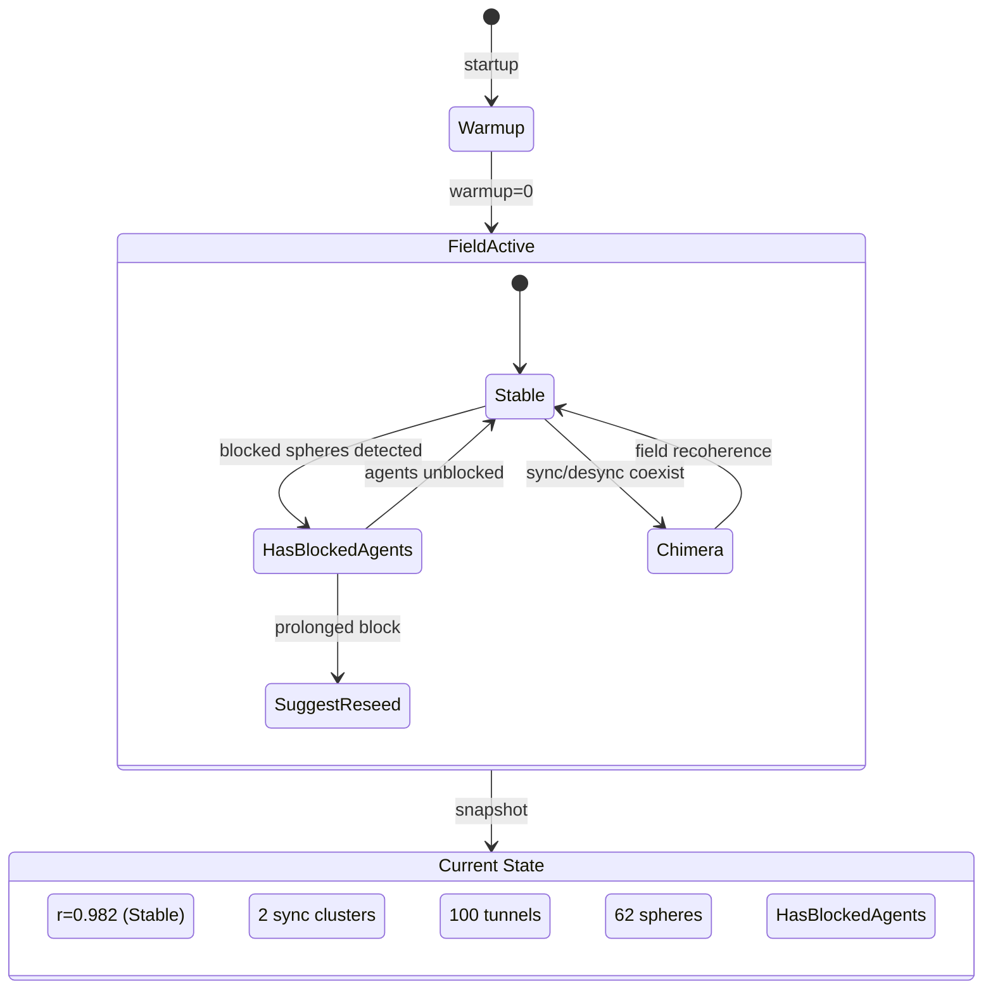

# Session 049 — Field Cluster (Deep PV2 Field Analysis)

**Date:** 2026-03-21 | **Tick:** 110,169

## Health Overview

| Metric | Value |
|--------|-------|
| Status | healthy |
| Fleet mode | Full |
| r (order) | 0.982 |
| k (base) | 1.5 |
| k_modulation | 0.885 |
| Spheres | 62 |
| Warmup | 0 |

## Decision Engine

| Metric | Value |
|--------|-------|
| Action | **HasBlockedAgents** |
| r | 0.982 |
| Tunnel count | 100 |
| r_trend | Stable |

The decision engine detects blocked agents but r is high enough that no corrective action (like coupling boost) is needed. The "HasBlockedAgents" action means the conductor is aware but stable.

## Frequency Spectrum (Spherical Harmonic Decomposition)

| Mode | Value | Interpretation |
|------|-------|---------------|
| L0 (monopole) | 0.570 | Mean phase offset from origin |
| L1 (dipole) | 0.982 | Primary coherence — matches r |
| L2 (quadrupole) | 0.337 | Second-order spatial variation |

**Analysis:** L1 dipole (0.982) = r confirms the order parameter is measuring the dominant oscillation mode. L0 at 0.570 shows the mean phase is offset ~1/3 of a cycle from zero. L2 quadrupole at 0.337 indicates moderate spatial variation — some clustering but no strong quadrupole splitting.

## Chimera Detection

| Metric | Value |
|--------|-------|
| Is chimera | **false** |
| Sync clusters | 2 |

No chimera state detected. 2 sync clusters means the field has bifurcated into 2 coherent groups, but they're synchronized enough that it doesn't qualify as chimera (which requires co-existing sync + desync regions).

## Phase Tunnels

| Metric | Value |
|--------|-------|
| Count | 100 |
| Top 3 overlap | 1.0, 1.0, 1.0 |

100 phase tunnels active, all top tunnels at perfect overlap (1.0). This means sphere pairs have fully aligned phases — the tunneling threshold (0.8 rad) is easily exceeded by many pairs. At r=0.982, most sphere pairs are close enough to form tunnels.

## Coupling Matrix

| Metric | Value |
|--------|-------|
| Total edges | 3,782 |
| Baseline (0.09) | 3,770 |
| Differentiated (0.6) | 12 |

Fleet clique: {fleet-alpha, fleet-beta-1, fleet-gamma-1, orchestrator-044}

## State Diagram

## Field Health Summary

| Indicator | Value | Rating |
|-----------|-------|--------|
| r (order) | 0.982 | Excellent (above R_TARGET 0.93) |
| Chimera | false | Clean |
| Tunnels | 100 @ 1.0 | Maximum coherence |
| Spectrum L1 | 0.982 | Strong dipole |
| Decision | HasBlockedAgents | Aware, stable |
| Coupling | 12/3782 diff | Hebbian active |
| k_mod | 0.885 | Within budget |

**Field is in excellent condition.** r=0.982 is the highest observed this session. 100 phase tunnels at perfect overlap. 2 sync clusters but no chimera. The only concern is the "HasBlockedAgents" decision — 20 fleet-worker spheres are blocked but the field compensates.

## Cross-References

- [[Session 049 - Post-Deploy Coupling]]
- [[Session 049 - Service Probe Matrix]]
- [[Vortex Sphere Brain-Body Architecture]]
- [[Session 049 — Master Index]]
- [[ULTRAPLATE Master Index]]
