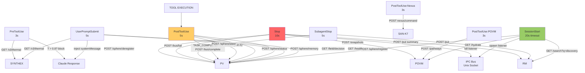
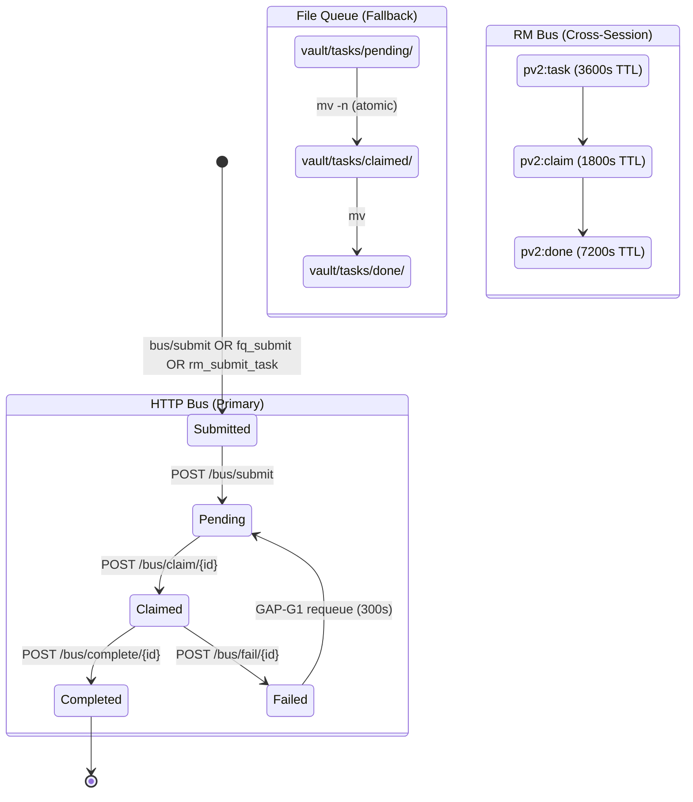
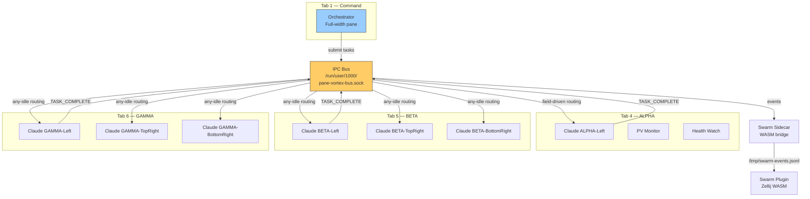

# Session 049 — Fleet Architecture Schematics

**Date:** 2026-03-21

## 1. Hook Pipeline (Event → Service Data Flow)

## 2. Task Lifecycle (3 Channels)

### Dedup Hierarchy (GAP-G9)
HTTP Bus > File Queue > RM Bus

## 3. Multi-Tab Fleet Topology

### Routing Modes
| Target | Behavior |
|--------|----------|
| any_idle | First idle sphere claims |
| field_driven | Conductor routes by phase coherence |
| specific | Named sphere only |
| willing | Opt-in spheres (consent-gated) |

---
*Cross-refs:* [[Fleet Coordination Spec]], [[IPC Bus Architecture Deep Dive]], [[Session 049 — Master Index]]
