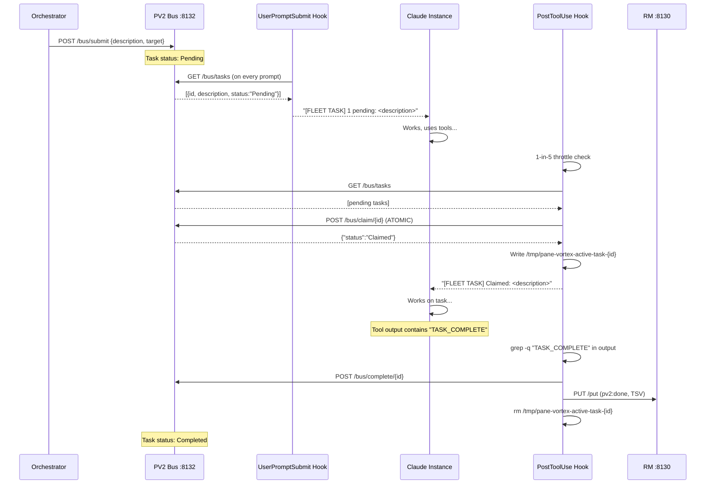
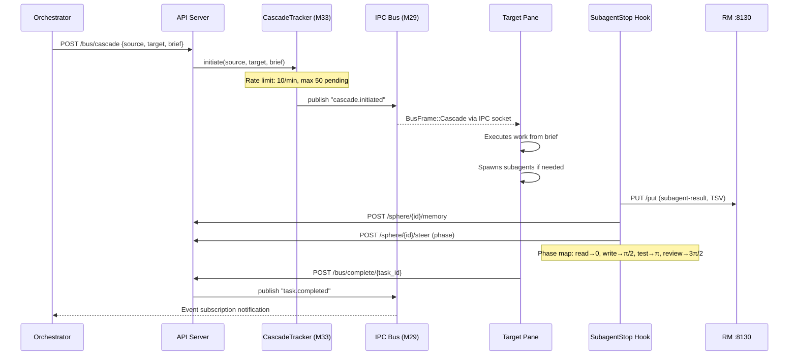

# Session 049 — Fleet Workflow Analysis

> **2 workflows mapped: Autonomous Task Discovery + Cascade Dispatch**
> **Task discovery: FULLY WIRED. Cascade: 6 gaps identified.**
> **Captured:** 2026-03-21

---

## Workflow 1: Autonomous Task Discovery

### Status: FULLY WIRED AND VERIFIED

| Step | Code | Tested |
|------|------|--------|
| Task submission | m10_api_server.rs:1071-1090 | Yes |
| Pending filter | user_prompt_field_inject.sh:33 | Yes |
| System message injection | user_prompt_field_inject.sh:43-47 | Yes |
| Atomic claim | m30_bus_types.rs:140-148 | Yes |
| TASK_COMPLETE detection | post_tool_use.sh:42 | Yes |
| Task completion | m10_api_server.rs:1199-1230 | Yes |
| File queue fallback | hooks/lib/task_queue.sh | Yes |
| Session-end failure recovery | session_end.sh:18-24 | Yes |

**Known limitations:** 1-in-5 polling throttle (4 tool uses delay), TASK_COMPLETE must be in stdout, no task prioritization.

---

## Workflow 2: Cascade Dispatch

### Status: PARTIALLY WIRED — 6 Gaps

| Gap | Issue | Impact |
|-----|-------|--------|
| GAP-A1 | Cascade ACK/REJECT endpoint missing from API routes | Target can't formally acknowledge receipt |
| GAP-A2 | Executor doesn't dispatch to Zellij | Rust daemon selects target but external agent must do zellij write-chars |
| GAP-A3 | SubagentStop hook assumes pane-vortex-client binary | No fallback if CLI missing |
| GAP-A4 | V1 sidecar bidirectional compat incomplete | V2 responses may confuse V1 clients |
| GAP-A5 | No auto-re-cascade on rejection | Manual operator intervention required |
| GAP-A6 | No callback URL in cascade request | Target doesn't know where to post results |

---

## Cross-References

- [[Session 049 — Master Index]]
- [[Fleet Coordination Spec]] — task protocol and hook wiring
- [[Session 049 - Hook Pipeline Audit]] — hook safety analysis
- [[ULTRAPLATE Master Index]]
