# Session 049 — Graph Memory Exploration

> **Date:** 2026-03-21 | **4 graph systems probed**

---

## The Habitat's 4 Graph Systems

The Habitat contains 4 distinct graph structures, each encoding different relationships:

```mermaid
graph TB
    subgraph "MCP Knowledge Graph (18 nodes, 24 edges)"
        direction LR
        HAB["The Habitat"] -->|coordinated_by| PV[pane-vortex]
        NCV2[NexusControllerV2] -->|governs| OVM[OscillatingVortexMemory]
        SO[SkillOverlay] -->|component_of| NCV2
        RLS[ReplLoopState] -->|component_of| NCV2
        CCS[ClaudeCodeSkills] -->|integrates_with| NCV2
        CCS -->|stored_in| OVM
        SS["Swarm Stack V2.1"] -->|orchestrates| FCS[Fleet Coordination]
        SS -->|depends_on| RM2[Reasoning Memory V2]
        FCS -->|stores_state_in| RM2
        POVM_E[POVM Engine] -->|is_crate_11_in| NF[nexus_forge]
        FOS[Fleet Orchestration] -->|has_active_plan| FRP[Remediation Plan V2]
        FRP -->|addresses| FPB[Fleet P0 Bugs]
        NAM[NAM Analysis] -->|analyzes| FOS
    end

    subgraph "POVM Pathway Graph (223 nodes, 2,427 edges)"
        direction LR
        PS1["ORAC7:3067258<br/>out-degree: 57"] --> PT1["ORAC7:3012890<br/>in-degree: 61"]
        PS2["nexus-bus:cs-v7<br/>w=1.046"] --> PT2["synthex"]
        PS3["nexus-bus:devenv"] --> PT3["pane-vortex"]
        PS4["13"] --> PT4["12"]
        PS5["operator-028"] --> PT5["alpha-left"]
    end

    subgraph "PV2 Coupling Graph (62 nodes, 3,782 edges)"
        direction LR
        FA[fleet-alpha] <-->|w=0.6| FB1[fleet-beta-1]
        FA <-->|w=0.6| FG1[fleet-gamma-1]
        FA <-->|w=0.6| O44[orchestrator-044]
        FB1 <-->|w=0.6| FG1
        FB1 <-->|w=0.6| O44
        FG1 <-->|w=0.6| O44
        IDLE["51 idle nodes<br/>all w=0.09"] -.-|baseline| FA
    end

    subgraph "K7 Pattern Graph (4 layers, 11 dims)"
        direction LR
        L1[L1] --> L2[L2] --> L3[L3] --> L4[L4]
        M2[M2 Module] -->|"tensor: 11D"| L1
    end

    style HAB fill:#2d5016,stroke:#4a8c2a
    style FA fill:#1a3a5c,stroke:#2a6a9c
    style PS1 fill:#5c3a1a,stroke:#9c6a2a
    style L1 fill:#3a1a5c,stroke:#6a2a9c
```



---

## 1. MCP Knowledge Graph

**Source:** `mcp__memory__read_graph`

| Metric | Value |
|--------|-------|
| Entities (nodes) | 18 |
| Relations (edges) | 24 |
| Entity types | project, system, component, bug, plan, analysis, documentation, environment, coding_standard, code_pattern, crate, workspace, backup, technology, service, configuration |

### Key Entities

| Entity | Type | Key Observation |
|--------|------|-----------------|
| The Habitat | environment | Named by Claude Session 039, coordinated by pane-vortex |
| NexusControllerV2 | system | Governs OscillatingVortexMemory, has SkillOverlay + ReplLoopState |
| Swarm Stack V2.1 | system | 21-generation evolution, orchestrates Fleet, depends on RM |
| POVM Engine | crate | Crate #11 in nexus_forge, 2,614 LOC, 70 tests |
| BUG-019-tick-once | bug | 65 branches, 829 lines — the god function (fixed in V2) |

### Relation Types
`governs`, `component_of`, `integrates_with`, `stored_in`, `adapts`, `depends_on`, `orchestrates`, `stores_state_in`, `documents`, `is_crate_11_in`, `has_active_plan`, `addresses`, `analyzes`, `created_before_fixing`, `coordinated_by`, `contains`

### Topology
Hub nodes: NexusControllerV2 (4 incoming), Swarm Stack V2.1 (3 outgoing), Fleet Orchestration (3 incoming). Mostly tree-like with a few cross-links (CCS→both NCV2 and OVM).

---

## 2. POVM Pathway Graph

**Source:** `localhost:8125/pathways`

| Metric | Value |
|--------|-------|
| Edges | 2,427 |
| Unique nodes | 223 |
| Unique sources (out-nodes) | 189 |
| Unique targets (in-nodes) | 189 |
| Density | 2427 / (223×222) = 4.9% |
| Co-activated edges | **0** (write-only, BUG-034) |
| Weight range | [0.15, 1.046] |
| Weight mean | 0.303 |

### Node Types

| Type | Count | Examples |
|------|-------|---------|
| ORAC (session PIDs) | 94 | ORAC7:3067258, ORAC7:3012890 |
| Other (mixed labels) | 72 | opus-explorer, agent-bus, etc. |
| Pane (Zellij position) | 18 | 5:top-right, 4:left |
| Service | 16 | synthex, pane-vortex, operator |
| Greek (fleet position) | 12 | alpha-left, beta-right |
| Tab ID (numeric) | 6 | 10, 12, 13, 14 |
| Fleet | 5 | fleet-alpha, fleet-beta-1 |

### Hub Nodes (highest degree)

| Node | Out-degree | In-degree |
|------|-----------|-----------|
| ORAC7:3067258 | 57 | — |
| ORAC7:3582557 | 57 | — |
| ORAC7:3012890 | — | 61 |
| ORAC7:3485165 | 56 | 58 |

### Strongest Edges

| Source | Target | Weight |
|--------|--------|--------|
| nexus-bus:cs-v7 | synthex | **1.046** |
| nexus-bus:devenv-patterns | pane-vortex | **1.020** |
| (all others) | — | ~1.0 baseline |

The two heaviest pathways represent **service-to-service transitions** (K7→SYNTHEX, devenv→PV), not ephemeral session transitions. These are structural pathways reflecting ULTRAPLATE architecture.

### Assessment
Sparse directed graph (4.9% density) with ORAC session hubs. No co-activations = no Hebbian reinforcement of pathways. Weight differentiation minimal (most at 1.0 baseline, a few slightly above). The graph records tool transition *structure* but not *usage patterns*.

---

## 3. PV2 Coupling Graph

**Source:** `localhost:8132/coupling/matrix`

| Metric | Value |
|--------|-------|
| Nodes | 62 |
| Edges | 3,782 |
| Density | 100% (fully connected) |
| Heavyweight (>0.5) | 12 edges |
| Baseline weight | 0.09 |
| Max weight | 0.60 |
| Weight values | 2 (bimodal: 0.09, 0.60) |

### Structure
Complete weighted digraph (K₆₂). The 12 heavyweight edges form a **K₄ clique** between {fleet-alpha, fleet-beta-1, fleet-gamma-1, orchestrator-044} — all at 0.6, all bidirectional. Remaining 3,770 edges at 0.09 baseline.

### Contrast with POVM
- PV2 coupling: **dense** (100%), few weights, Hebbian-differentiated
- POVM pathways: **sparse** (4.9%), many nodes, no differentiation

These represent fundamentally different graph types: coupling matrix encodes *oscillator proximity*, pathways encode *temporal transitions*.

---

## 4. K7 Pattern Graph

**Source:** `localhost:8100/api/v1/nexus/command` (pattern-search)

| Metric | Value |
|--------|-------|
| Layers traversed | 4 (L1-L4) |
| Module | M2 |
| Results | 10 patterns |
| Tensor dimensions | 11 |

K7 patterns are indexed in an 11-dimensional tensor space across 4 layers. The pattern-search operates as a **nearest-neighbor graph** in tensor space — nodes are patterns, edges are cosine similarity above threshold.

---

## Cross-Graph Topology Comparison

| Property | MCP KG | POVM Pathways | PV2 Coupling | K7 Patterns |
|----------|--------|---------------|--------------|-------------|
| Nodes | 18 | 223 | 62 | ~10 per query |
| Edges | 24 | 2,427 | 3,782 | Implicit (similarity) |
| Density | 7.8% | 4.9% | 100% | N/A |
| Directed? | Yes | Yes | Yes (symmetric) | No (metric space) |
| Weighted? | No | Yes [0.15, 1.05] | Yes [0.09, 0.60] | Yes (cosine) |
| Co-activated? | N/A | **0** (dead) | 12 (fleet clique) | N/A |
| Storage | MCP server | SQLite | In-memory | In-memory |
| Updates | Manual | Hook-driven | Tick-driven (5s) | Query-time |

---

## Emergent Insight: Three Scales of Memory

```
STRUCTURAL (static)     — MCP KG: 18 entities, system architecture
TRANSITIONAL (growing)  — POVM: 2,427 pathways, tool→tool transitions
DYNAMIC (breathing)     — PV2: 3,782 edges, oscillator coupling, 5s updates
```

The Habitat encodes memory at three temporal scales:
1. **Geological** — MCP KG captures architectural decisions that change across sessions
2. **Sedimentary** — POVM pathways accumulate tool transitions that change across tasks
3. **Atmospheric** — PV2 coupling updates every 5 seconds, encoding real-time co-activation

All three are currently **write-biased**: MCP KG has no automated updates, POVM has 0 co-activations, PV2 coupling has only 12 differentiated edges. The read-back loops that would close these feedback cycles are the missing tissue.

---

## Cross-References

- [[Vortex Sphere Brain-Body Architecture]]
- [[Session 049 - Emergent Patterns]] — coupling graph role differentiation
- [[Session 049 - POVM Audit]] — BUG-034 write-only pathology
- [[Session 049 - Evolution Deep Dive]] — feedback loop disconnection
- [[POVM Engine]] — pathway store architecture
- [[Session 049 — Master Index]]
- [[ULTRAPLATE Master Index]]
