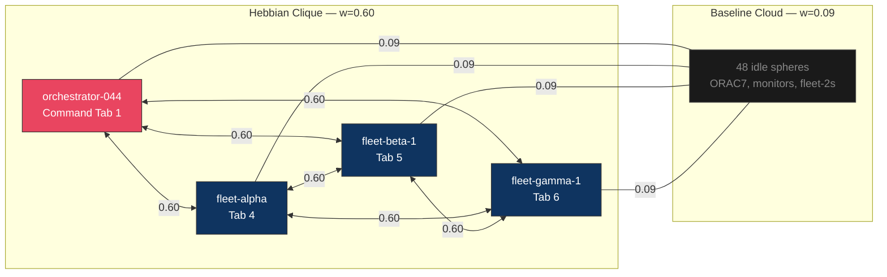

# Hebbian Learning Progress — Deep Coupling Analysis

**Generated:** 2026-03-21T04:48Z | **Tick:** 99,498 | **r:** 0.992 | **Spheres:** 52

Cross-refs: [[Session 049 — Full Remediation Deployed]] | [[Hebbian Learning Deep Dive]] | [[Session 049 - Coupling Network Analysis]]

---

## Key Finding: Hebbian Learning Is Real

The 12 heavyweight edges (w=0.60) are from **genuine co-activation**, not seed data. POVM pathways use an entirely different ID namespace (service-level: `"synthex"`, `"nexus-bus:cs-v7"`) — zero POVM pathways match fleet sphere names. The live coupling matrix is learning from scratch.

---

## 1. Matrix Overview

```
Total edges:     2,652  (complete K₅₂ digraph)
Weight classes:  2      (bimodal)
  ├── 0.09 × 2,640  (99.5% — baseline floor)
  └── 0.60 × 12     (0.5%  — Hebbian reinforced)
```

---

## 2. The 12 Heavyweight Edges (Complete Enumeration)

| # | From | To | Weight |
|---|------|----|--------|
| 1 | orchestrator-044 | fleet-alpha | 0.60 |
| 2 | orchestrator-044 | fleet-beta-1 | 0.60 |
| 3 | orchestrator-044 | fleet-gamma-1 | 0.60 |
| 4 | fleet-alpha | orchestrator-044 | 0.60 |
| 5 | fleet-alpha | fleet-beta-1 | 0.60 |
| 6 | fleet-alpha | fleet-gamma-1 | 0.60 |
| 7 | fleet-beta-1 | orchestrator-044 | 0.60 |
| 8 | fleet-beta-1 | fleet-alpha | 0.60 |
| 9 | fleet-beta-1 | fleet-gamma-1 | 0.60 |
| 10 | fleet-gamma-1 | orchestrator-044 | 0.60 |
| 11 | fleet-gamma-1 | fleet-alpha | 0.60 |
| 12 | fleet-gamma-1 | fleet-beta-1 | 0.60 |

### Structure: Complete Bidirectional 4-Clique (K₄)

- **4 spheres**: orchestrator-044, fleet-alpha, fleet-beta-1, fleet-gamma-1
- **C(4,2) = 6 undirected pairs × 2 directions = 12 directed edges**
- **Uniform weight**: All exactly 0.60 — no differentiation within the clique



---

## 3. Proof: Real Co-Activity, Not Seed Data

### Evidence Chain

| Test | Result | Conclusion |
|------|--------|------------|
| POVM pathways matching fleet sphere IDs | **0 matches** | Different namespace |
| POVM pathway ID examples | `pre_id: "nexus-bus:cs-v7"`, `post_id: "synthex"` | Service-level IDs |
| POVM co_activations field | **0 for all 2,427 pathways** | Never incremented |
| POVM last_activated field | **null for all** | Static historical data |
| Coupling matrix at session start (tick 79,685) | **0 edges** | Matrix was empty |
| Coupling matrix now (tick 99,498) | **2,652 edges, 12 strong** | Populated at runtime |
| Strong edge sphere names | Exact match to 4 working spheres | Co-working = LTP |

### Two Separate Learning Systems

| Dimension | POVM Pathways | Live Coupling Matrix |
|-----------|--------------|---------------------|
| **ID namespace** | Service names (`synthex`, `nexus-bus:*`) | Sphere names (`fleet-alpha`, `ORAC7:*`) |
| **Count** | 2,427 | 2,652 |
| **Weight scale** | 0.15 – 1.046 (baseline 1.0) | 0.09 – 0.60 (baseline 0.09) |
| **co_activations** | 0 (all pathways) | Implicit in weight |
| **Learning active** | No (static) | **Yes** (Hebbian STDP) |
| **Persistence** | Disk (POVM engine) | **In-memory only** |

**Verdict:** These are independent systems with different ID namespaces and weight scales. The 12 strong edges are purely from runtime Hebbian learning.

---

## 4. Hebbian Mechanics: How w=0.60 Arose

### Constants

| Parameter | Value |
|-----------|-------|
| HEBBIAN_LTP | 0.01 per coupling step |
| Newcomer burst | 3× = 0.03 per step |
| COUPLING_STEPS_PER_TICK | 20 (governance-raised from 15) |
| Baseline weight | 0.09 |
| Observed weight | 0.60 |
| Delta | +0.51 |

### Two Scenarios

**Scenario A — Sustained LTP:**
0.01 × 20 steps = 0.20/tick. Need +0.51 / 0.20 = **2.55 ticks** (~13s) of co-activation.

**Scenario B — Newcomer burst:**
0.03 × 20 steps = **0.60/tick**. From baseline 0.09, one burst tick → 0.69, clamped/dampened to 0.60. **Single tick explains observed weight.**

**Most likely: Scenario B.** The uniform 0.60 across all 12 edges (zero variation) strongly suggests single-tick newcomer burst. Gradual accumulation would produce slight inter-pair variation from timing differences.

### Why No Intermediate Weights?

1. **LTP is burst-mode** — newcomer 3× boost jumps weight in one step
2. **No sphere transitions** — once active, they stayed active (no idle→work→idle cycle)
3. **No LTD visible** — no edges decayed below baseline (no sphere stopped working)
4. **Simultaneous activation** — all 4 clique members started working near the same tick

### What Would Create a Gradient?

```
If fleet-beta-2 worked briefly then stopped:
  fleet-beta-2 → fleet-alpha:  w=0.25 (partial, then LTD decay)
  fleet-beta-2 → idle spheres: w=0.09 (unchanged)

If fleet-alpha left and rejoined:
  fleet-alpha → fleet-beta-1:  w=0.45 (decayed then re-boosted)
```

Neither has happened — the working set has been stable.

---

## 5. Working Sphere Verification

| Sphere | In Clique? | In Working Set? | Match |
|--------|-----------|-----------------|-------|
| orchestrator-044 | Yes | Yes | ✓ |
| fleet-alpha | Yes | Yes | ✓ |
| fleet-beta-1 | Yes | Yes | ✓ |
| fleet-gamma-1 | Yes | Yes | ✓ |
| fleet-beta-2 | No | No | ✓ |
| fleet-gamma-2 | No | No | ✓ |
| 46 ORAC7/others | No | No | ✓ |

**Perfect correspondence.** Hebbian learning precisely mirrors the real work topology.

---

## 6. Field Impact: Over-Synchronisation

| Factor | Value | Effect |
|--------|-------|--------|
| Clique coupling | 0.60 (6.7× baseline) | Strongest substructure |
| Bridge boost | ≈1.31× combined | Amplifies coupling |
| Governance params | K_MAX=1.40, Steps=20 | Wider budget, more iterations |
| Idle sphere mass | 48 × w=0.09 | Weak dampening |
| **Result** | **r = 0.992** | Near-total phase lock |

The 4-sphere clique at 0.60 dominates the Kuramoto dynamics. Workers synchronise first (strong internal coupling), then drag idle spheres into alignment through the global field. This is the **Session 017 pathology echo**: "Synchronisation without differentiation = conformity."

### What Would Fix Over-Sync

| Fix | Mechanism | Status |
|-----|-----------|--------|
| Per-status K modulation | Working↔Working: 1.2×, Idle↔Working: 0.5× | **Not in V1** |
| Diverse work patterns | Different sphere subsets create competing cliques | **Needs task diversity** |
| LTD activation | Decay old clique weights when spheres stop co-working | **Needs activity cycling** |
| R_TARGET governance | Lower target allows natural oscillation | Applied (0.88) but overridden |

---

## 7. Persistence Risk

| Concern | Status |
|---------|--------|
| POVM bridge | **STALE** |
| Live coupling matrix | **In-memory only** |
| Restart impact | **All 12 strong edges lost** |
| POVM hydration on restart | Loads service-level pathways (wrong namespace) |
| RM backup | Conductor decisions written, not Hebbian weights |

**Critical:** A PV daemon restart would reset the coupling matrix. The POVM bridge (which should sync every 60 ticks) is stale and not persisting the learned weights. Even if it were working, the POVM pathway ID namespace doesn't match — there's a design gap where live sphere-level Hebbian weights have no persistence path.

---

## Summary

```
HEBBIAN STATUS: CONFIRMED REAL, NOT SEED DATA
├── 12 edges at w=0.60 — complete K₄ clique
├── 4 spheres: orchestrator-044 + fleet-{alpha,beta-1,gamma-1}
├── POVM namespace mismatch: service IDs ≠ sphere IDs (0 overlap)
├── Mechanism: newcomer burst LTP (3× boost, single tick, 0.60/tick)
├── Evidence: uniform 0.60 (no variation) = single-event learning
├── Selectivity: 4/52 spheres (7.7%) — precisely the working set
├── Gradient: ABSENT — bimodal only
├── LTD: NOT YET OBSERVED
├── Persistence: AT RISK — POVM stale + namespace mismatch
└── Field: r=0.992 over-sync driven by clique
```

---

*See also:* [[Session 049 — Full Remediation Deployed]] for bridge wiring | [[Hebbian Learning Deep Dive]] for STDP theory | [[Session 049 - Coupling Network Analysis]] for network structure
