# Session 049 — Hook Workflow Analysis

> **Date:** 2026-03-21 | **Scope:** 8 hooks + 2 libraries | **Method:** 2 parallel Explore subagents

---

## Part 1: Session Lifecycle (Birth → Death)

```mermaid
graph TD
    subgraph "Phase 1: SessionStart"
        S1["Scope guard<br/>GAP-G3 pwd check"] --> S2["Generate PANE_ID<br/>hostname:$$"]
        S2 --> S3["Health check<br/>PV :8132/health<br/>3 retries, exp backoff"]
        S3 --> S4["Register sphere<br/>POST /sphere/{ID}/register"]
        S4 --> S5["Parallel hydration"]
        S5 --> S5a["POVM /hydrate<br/>memory + pathway counts"]
        S5 --> S5b["RM /search?q=discovery"]
        S5 --> S5c["RM /search?q=pv2:task"]
        S5a --> S6["Spawn IPC listener<br/>pane-vortex-client subscribe '*'"]
        S5b --> S6
        S5c --> S6
        S6 --> S7["RM heartbeat<br/>session-start"]
        S7 --> S8["Inject context<br/>to Claude prompt"]
    end

    subgraph "Phase 2: Active Session (per prompt/tool)"
        A1["UserPromptSubmit<br/>user_prompt_field_inject.sh"] -->|"GET /health<br/>GET /v3/thermal<br/>GET /bus/tasks"| A2["Inject field state<br/>+ pending tasks"]
        A3["PreToolUse<br/>pre_tool_thermal_gate.sh"] -->|"GET /v3/thermal<br/>Write/Edit/Bash only"| A4{temp > 1.3×target?}
        A4 -->|yes| A5["Warn user"]
        A4 -->|no| A6["Continue"]
        A7["PostToolUse<br/>3 hooks fire in parallel"]
        A7 --> A7a["post_tool_use.sh<br/>sphere memory + status<br/>task poll (1-in-5)<br/>task complete check"]
        A7 --> A7b["post_tool_povm_pathway.sh<br/>Hebbian pathway learning<br/>prev_tool → curr_tool"]
        A7 --> A7c["post_tool_nexus_pattern.sh<br/>K7 pattern record (1-in-10)"]
        A8["SubagentStop<br/>subagent_field_aggregate.sh"] -->|"RM aggregation<br/>+ phase steering"| A9["Steer Kuramoto phase<br/>by subagent type"]
    end

    subgraph "Phase 3: SessionEnd"
        E1["Fail active task<br/>POST /bus/fail/{TID}"] --> E2["File queue cleanup<br/>claimed → done<br/>prune >7 days"]
        E2 --> E3["Sphere status=complete"]
        E3 --> E4["POVM snapshot<br/>POST /snapshots<br/>final r + session_end"]
        E4 --> E5["RM crystallise<br/>session-end heartbeat"]
        E5 --> E6["Kill IPC listener<br/>rm PID file"]
        E6 --> E7["Deregister sphere<br/>ghost trace created"]
        E7 --> E8["Delete 7 temp files"]
    end

    S8 --> A1
    A2 --> A3
    A6 --> A7
    A7a --> E1
    A7b --> E1
    A7c --> E1

    style S4 fill:#2d5016,stroke:#4a8c2a
    style E7 fill:#5c1a1a,stroke:#9c2a2a
    style A7 fill:#1a3a5c,stroke:#2a6a9c
```



### Temp Files Lifecycle

| File | Created | Cleaned | Purpose |
|------|---------|---------|---------|
| `/tmp/pane-vortex-events-${SAFE_ID}.ndjson` | Start | End | IPC event stream (rotates at 1MB) |
| `/tmp/pane-vortex-listener-${SAFE_ID}.pid` | Start | End | Listener process PID |
| `/tmp/pane-vortex-active-task-${SAFE_ID}` | PostTool (claim) | End/Complete | Claimed task ID |
| `/tmp/pane-vortex-poll-counter-${SAFE_ID}` | PostTool (1st) | End | 1-in-5 throttle counter |
| `/tmp/povm-prev-tool-${SAFE_ID}` | PostTool (1st) | End | Previous tool for Hebbian pairing |
| `/tmp/nexus-pattern-counter-${SAFE_ID}` | PostTool (1st) | End | 1-in-10 throttle counter |
| `/tmp/pane-vortex-ts-${SAFE_ID}` | Unknown | End | Legacy cleanup target |

### Services Touched by Phase

| Phase | PV :8132 | POVM :8125 | RM :8130 | SYNTHEX :8090 | K7 :8100 |
|-------|----------|------------|----------|---------------|----------|
| Start | health, register | hydrate | search ×2, heartbeat | — | — |
| UserPrompt | health, bus/tasks | — | — | /v3/thermal | — |
| PreTool | — | — | — | /v3/thermal | — |
| PostTool | memory, status, bus/* | /pathways | /put (TSV) | — | nexus/command |
| SubagentStop | sphere/steer, memory | — | /put (TSV) | — | — |
| End | status, deregister | /snapshots | heartbeat ×2 | — | — |

---

## Part 2: PostToolUse Data Fan-Out

```mermaid
graph LR
    TOOL["Tool Execution<br/>e.g. Edit, Bash, Read"] --> POST["PostToolUse Event<br/>tool_name + input + output"]

    POST --> H1["post_tool_use.sh<br/>EVERY call"]
    POST --> H2["post_tool_povm_pathway.sh<br/>EVERY call (skip Read/Grep/Glob)"]
    POST --> H3["post_tool_nexus_pattern.sh<br/>1-in-10 calls"]

    H1 --> PV1["PV :8132<br/>POST /sphere/{ID}/memory<br/>⚡ async"]
    H1 --> PV2["PV :8132<br/>POST /sphere/{ID}/status<br/>⚡ async"]
    H1 -->|"1-in-5"| PV3["PV :8132<br/>GET /bus/tasks"]
    PV3 -->|"if pending"| PV4["PV :8132<br/>POST /bus/claim/{TID}"]
    PV4 --> RM1["RM :8130<br/>POST /put (TSV)<br/>pv2:claim record"]
    H1 -->|"if TASK_COMPLETE"| PV5["PV :8132<br/>POST /bus/complete/{TID}"]
    PV5 --> RM2["RM :8130<br/>POST /put (TSV)<br/>pv2:done record"]

    H2 --> POVM["POVM :8125<br/>POST /pathways<br/>{source, target, weight}"]

    H3 --> K7["K7 :8100<br/>POST /nexus/command<br/>pattern-search"]

    style H1 fill:#1a3a5c,stroke:#2a6a9c
    style H2 fill:#5c3a1a,stroke:#9c6a2a
    style H3 fill:#3a1a5c,stroke:#6a2a9c
    style PV1 fill:#2d5016,stroke:#4a8c2a
    style PV2 fill:#2d5016,stroke:#4a8c2a
```



### Per-Call Data Volume

| Scenario | HTTP Requests | Services | Payload | Latency |
|----------|---------------|----------|---------|---------|
| **Baseline (every call)** | 4 | 3 (PV, POVM, SYNTHEX) | ~450 bytes | ~50ms |
| **+ Task poll (1-in-5)** | +2–3 | +1 (RM) | +500–2000 bytes | +100ms |
| **+ Pattern record (1-in-10)** | +1 | +1 (K7) | +300 bytes | +20ms |
| **Max (poll + pattern + complete)** | 7 | 5 (all) | ~3000 bytes | ~200ms |

### Hebbian Weight Assignment (POVM Pathways)

| Tool Pair | Weight | Reasoning |
|-----------|--------|-----------|
| Read → Edit | 0.8 | Strong: read-then-modify pattern |
| Read → Write | 0.8 | Strong: read-then-create pattern |
| Grep → Read | 0.7 | Medium: search-then-read pattern |
| Glob → Read | 0.7 | Medium: find-then-read pattern |
| Edit → Bash | 0.6 | Medium: modify-then-verify pattern |
| Write → Bash | 0.6 | Medium: create-then-verify pattern |
| All other pairs | 0.5 | Baseline |

### Throttling Architecture

```
PostToolUse (every call)
    ├── post_tool_use.sh: sphere updates (ALWAYS)
    │   └── task poll: 1-in-5 (counter file)
    ├── post_tool_povm_pathway.sh: pathway (ALWAYS, skip read-only)
    └── post_tool_nexus_pattern.sh: K7 (1-in-10 counter file)
```

### Data Volume Estimate (1,000 tool calls)

| Component | Volume |
|-----------|--------|
| Sphere memory + status (1000×) | ~300 KB |
| POVM pathways (~700 non-read tools) | ~100 KB |
| Task polls (200 polls) | ~200 KB |
| K7 patterns (100 records) | ~30 KB |
| RM records (~50 claims/completions) | ~8 KB |
| Thermal checks (1000×) | ~100 KB |
| **Total** | **~740 KB** |

---

## Key Design Patterns

1. **Fire-and-forget async** — sphere memory and status updates run with `&` (non-blocking)
2. **Counter-file throttling** — task polls (1-in-5) and K7 patterns (1-in-10) use `/tmp` counter files
3. **Dual task channels** — HTTP bus primary, filesystem fallback with atomic `mv -n`
4. **Hebbian tool pairing** — POVM tracks prev→curr tool transitions with weighted learning
5. **Scope guards** — every hook checks pwd against PV2 directory (GAP-G3)
6. **Graceful degradation** — all curl calls use `--max-time` + `|| true` fallback
7. **Semantic phase steering** — subagent types map to Kuramoto phases (read→0, write→π/2, test→π, review→3π/2)

---

## Cross-References

- [[Session 049 - Security Audit]] — 14 hook security findings
- [[Session 049 - Fleet Cluster]] — hook wiring inventory
- [[Session 049 - Field Architecture]] — tick cycle that hooks feed into
- [[Session 049 — Master Index]]
- [[ULTRAPLATE Master Index]]
