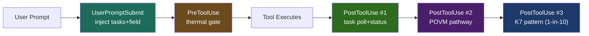
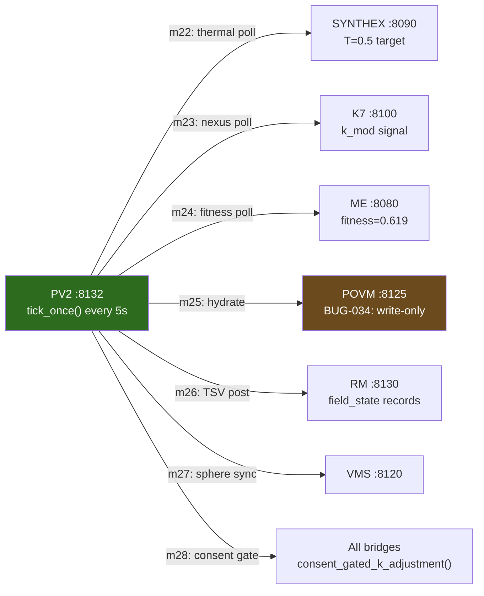
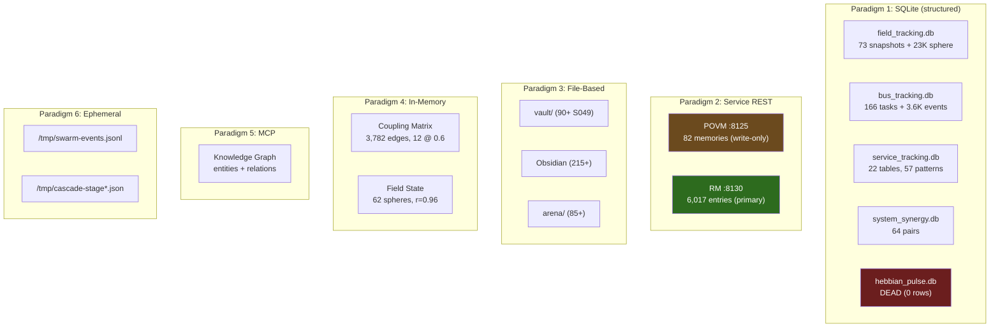

# Session 049 — Master Architecture Diagram

> **16 services, 8 hooks, 6 persistence layers, 3 coordination tiers**
> **Synthesized from all Session 049 analyses**
> **Captured:** 2026-03-21

---

## C4 Architecture — Full System View

```mermaid
graph TB
    subgraph "TIER 1: Fleet Coordination Layer"
        direction LR
        CC1["Claude Instance<br/>(Tab 4 ALPHA)"]
        CC2["Claude Instance<br/>(Tab 5 BETA)"]
        CC3["Claude Instance<br/>(Tab 6 GAMMA)"]
        ORCH["Orchestrator<br/>(Tab 1 Command)"]
    end

    subgraph "TIER 2: Hook Pipeline (8 hooks)"
        direction LR
        H1["SessionStart<br/>20s timeout"]
        H2["UserPromptSubmit<br/>5s timeout"]
        H3["PreToolUse<br/>3s thermal gate"]
        H4["PostToolUse<br/>5s task+status"]
        H5["PostToolUse<br/>3s POVM pathway"]
        H6["PostToolUse<br/>3s K7 pattern"]
        H7["SubagentStop<br/>5s aggregate"]
        H8["Stop<br/>10s crystallize"]
    end

    subgraph "TIER 3: Service Mesh (16 services)"
        subgraph "Batch 1 (no deps)"
            DE["DevOps :8081<br/>40 agents PBFT"]
            CSV7["CodeSynthor :8110<br/>62 modules"]
            POVM_E["POVM :8125<br/>82 mem, 2427 paths"]
        end

        subgraph "Batch 2"
            SX["SYNTHEX :8090<br/>thermal PID"]
            K7["SAN-K7 :8100<br/>59 modules"]
            ME["ME :8080<br/>fitness 0.619"]
            ARCH["Architect :9001"]
            PROM["Prometheus :10001"]
        end

        subgraph "Batch 3"
            NAIS["NAIS :8101<br/>71K requests"]
            BASH["Bash :8102<br/>45 patterns"]
            TM["Tool Maker :8103"]
        end

        subgraph "Batch 4"
            CCM["CCM :8104"]
            TL["Tool Library :8105"]
            RM_S["RM :8130<br/>6,017 entries"]
        end

        subgraph "Batch 5"
            VMS["VMS :8120"]
            PV["PV2 :8132<br/>62 spheres r=0.96"]
        end
    end

    subgraph "TIER 4: Persistence Layer"
        direction LR
        FT["field_tracking.db<br/>23,630 rows"]
        BT["bus_tracking.db<br/>3,779 rows"]
        SS["system_synergy.db<br/>64 pairs"]
        ST["service_tracking.db<br/>22 tables, 213 rows"]
        VAULT["vault/<br/>90+ Session 049 files"]
    end

    %% Fleet → Hooks
    CC1 -->|"every tool"| H4
    CC1 -->|"every prompt"| H2
    CC2 -->|"every tool"| H4
    CC3 -->|"every tool"| H4

    %% Hooks → Services
    H1 -->|"register"| PV
    H1 -->|"hydrate"| POVM_E
    H1 -->|"discoveries"| RM_S
    H2 -->|"field state"| PV
    H2 -->|"thermal"| SX
    H3 -->|"temperature"| SX
    H4 -->|"task poll/claim"| PV
    H4 -->|"pv2:done"| RM_S
    H5 -->|"pathways"| POVM_E
    H6 -->|"pattern"| K7
    H7 -->|"aggregate"| RM_S
    H7 -->|"steer"| PV
    H8 -->|"crystallize"| POVM_E
    H8 -->|"summary"| RM_S

    %% Service bridges
    PV ===|"m22 bridge"| SX
    PV ===|"m23 bridge"| K7
    PV ===|"m24 bridge"| ME
    PV ===|"m25 bridge"| POVM_E
    PV ===|"m26 bridge"| RM_S
    PV ===|"m27 bridge"| VMS

    K7 ---|"59 integration pts"| SX

    %% Persistence
    PV -->|"tick Phase 4"| FT
    PV -->|"bus events"| BT
    ORCH -->|"analysis"| VAULT

    style PV fill:#2d6b1e,color:#fff
    style RM_S fill:#2d6b1e,color:#fff
    style SX fill:#6b4a1e,color:#fff
    style K7 fill:#1e3a6b,color:#fff
    style ME fill:#6b1e4a,color:#fff
    style POVM_E fill:#6b4a1e,color:#fff
```

---

## Hook Pipeline — Sequence Per Tool Use

**Total hook latency budget per tool:** 5s + 3s + 5s + 3s + 3s = **19s max** (sequential)

---

## Bridge Layer — PV2 to Services

---

## Memory Paradigm Layer

---

## Cross-References

- [[ULTRAPLATE Master Index]] — full service topology
- [[Fleet Coordination Spec]] — hook wiring and task protocol
- [[Session 049 - Persistence Architecture]] — detailed ER diagrams
- [[Session 049 - Service Memory Mining]] — service_tracking.db deep dive
- [[Session 049 - Memory Workflow Analysis]] — crystallize/hydrate cycles
- [[Session 049 - Fleet Workflow Analysis]] — task discovery + cascade
- [[Session 049 — Master Index]]
