# Session 049 — Master Synthesis

> **The longest session in Habitat history.** 14.5 hours, 67 vault files, 7 concurrent Claude instances at peak, tick 78K → 110K+. The session that proved the field endures — and revealed what it still needs to breathe.

---

## 1. Session Timeline

```
T+0min     (tick ~78K)     V2 BINARY DEPLOYED — Blocks A-I remediation complete
                           1,527 tests, 16/16 services, 6/6 bridges fresh
                           
T+15min    (tick ~78.2K)   Bridge diagnostics — write-back architecture documented
                           Mermaid diagrams: inbound poll vs outbound post split

T+30min    (tick ~78.5K)   Quality Gate — V2 validated (9.7s, 0 warnings)

T+60min    (tick ~79.6K)   Fleet SYNTHEX Report — thermal analysis reveals T=0.03
                           Only CrossSync active, 3/4 heat sources dead

T+80min    (tick ~79.7K)   Coupling Network — Hebbian breakthrough
                           0 → 2,652 edges, bimodal w=0.09/0.60 clique

T+120min   (tick ~81K)     Ongoing Diagnostics loop — r=0.409, proposals=16

T+150min   (tick ~81.6K)   POVM Hydration — smoking gun: 0/71 memories accessed
                           ORAC7 ID namespace mismatch = structural break

T+170min   (tick ~81.6K)   SYNTHEX Thermal — missing write path found
                           PV never POSTs to /api/ingest in tick loop

T+190min   (tick ~82K)     ME Emergence — cap saturated at 1,000/1,000
                           Evolution pipeline dead. Config raised, ME restarted

T+260min   (tick ~92K)     FLEET COORDINATION DEPLOYED — 7 concurrent instances
                           orchestrator-044 + fleet-alpha/beta/gamma + command panes
                           Bus tasks flowing, Hebbian co-activation real-time

T+340min   (tick ~99.5K)   Blocked Sphere Cleanup — 43 ghost spheres identified
                           7 "blocked" = misclassified idle-claude (semantic bug)

T+380min   (tick ~99.5K)   Hebbian Progress confirmed — 12 heavyweight edges
                           From genuine co-activation, not POVM seeded

T+420min   (tick ~99.9K)   Bus Suggestions — 6,027 SuggestReseed all false-positive

T+480min   (tick ~100K)    ████ TICK 100K MILESTONE ████
                           5 days 18 hours continuous, 0 crashes, 0 restarts

T+510min   (tick ~100.2K)  Quality Gate T510 — confirmed clean

T+600min   (tick ~104K)    K7 SWARM + TOOL CLUSTERS — cross-service exploration
                           Synergy matrix mapped, 10 hook points identified

T+720min   (tick ~107K)    3-STAGE CASCADE — pipeline validated
                           Stage 1→2→3: snapshot→enrichment→synthesis

T+780min   (tick ~108K)    GOVERNANCE CHECK — 16 proposals, 5 applied, 11 expired
                           RTarget, KModBudgetMax, CouplingSteps all modified by fleet

T+810min   (tick ~109K)    Quality Gate T810 — continuous validation

T+870min   (tick ~110.7K)  SESSION END — 62 spheres, r=0.964, 67 vault files
                           ME fitness 0.612 stable, 82 POVM memories, 2,427 pathways
```

---

## 2. Session Phases (Gantt)

```mermaid
gantt
    title Session 049 — Phase Timeline (14.5 hours)
    dateFormat HH:mm
    axisFormat %H:%M

    section Deployment
    V2 Binary Deploy (Blocks A-I)    :done, deploy, 08:00, 30min
    Quality Gate Validation          :done, qg1, 08:30, 15min

    section Diagnostics
    Bridge Architecture Docs         :done, bridge, 08:15, 30min
    SYNTHEX Thermal Analysis         :done, sx, 09:00, 30min
    Coupling Network Discovery       :done, coup, 09:20, 20min
    Ongoing Diagnostic Loop          :done, diag, 10:00, 60min
    POVM Hydration Analysis          :done, povm, 10:30, 30min
    SYNTHEX Write Path Audit         :done, sxw, 10:50, 20min
    ME Emergence Cap Analysis        :done, me, 11:10, 30min

    section Fleet Coordination
    7-Instance Fleet Deployed        :done, fleet, 12:20, 180min
    Blocked Sphere Cleanup           :done, blocked, 13:40, 30min
    Hebbian Co-activation Confirmed  :done, hebb, 14:20, 20min
    Bus Suggestions Audit            :done, bus, 15:00, 20min

    section Milestones
    Tick 100K Milestone              :milestone, m100k, 16:00, 0min
    Quality Gate T510                :done, qg2, 16:30, 15min

    section Deep Exploration
    K7 Swarm + Tool Clusters         :done, k7, 18:00, 60min
    Cross-Service Synergy Matrix     :done, syn, 18:30, 60min
    3-Stage Cascade Pipeline         :done, casc, 20:00, 30min

    section Governance & Synthesis
    Governance Review                :done, gov, 21:00, 20min
    Quality Gate T810                :done, qg3, 21:30, 15min
    Master Synthesis (this note)     :active, synth, 22:00, 30min
```



---

## 3. Key Metrics Evolution

| Metric | T+0 (78K) | T+240 (92K) | T+480 (100K) | T+720 (107K) | T+870 (110.7K) | Trend |
|--------|-----------|-------------|--------------|--------------|-----------------|-------|
| **r (order)** | 0.409 | ~0.90 | 0.958 | 0.884 | 0.964 | Low → high, fluctuating |
| **Spheres** | 45 | 52 | 52 | 61 | 62 | Growing (fleet registrations) |
| **Working** | 4 | 4 | 4 | 4 | 4 | Constant fleet core |
| **Coupling edges** | 0 | 2,652 | 2,652 | 3,660 | 3,782 | Monotonic growth |
| **Max edge weight** | — | 0.60 | 0.60 | 0.60 | 0.60 | Fleet clique plateau |
| **Differentiated edges** | 0 | 12 | 12 | 12 | 12 | Stable clique |
| **K base** | 1.5 | 1.5 | 3.129 | 1.5 | 1.5 | Governance modified, reset |
| **k_modulation** | 0.85 | 0.87 | 0.869 | 0.854 | 0.874 | Narrow band [0.85-0.87] |
| **POVM memories** | 58 | 72 | 72 | 78 | 82 | +24 from bridge writes |
| **POVM pathways** | 2,427 | 2,427 | 2,427 | 2,427 | 2,427 | Unchanged (no new learning) |
| **ME fitness** | 0.619 | 0.611 | 0.611 | 0.622 | 0.612 | Stable-degraded band |
| **ME RALPH cycles** | ~550 | — | — | 97 | null | Counter reset on restart |
| **SYNTHEX temp** | 0.03 | 0.03 | 0.03 | 0.03 | 0.03 | Cold throughout (BUG-037) |
| **Bus events** | 0 | ~500 | ~800 | 956 | 1,000 | Monotonic |
| **Bus tasks** | 0 | 53 | 5 | 5 | 40 | Waves of fleet activity |
| **RM entries** | ~4,800 | ~5,100 | 5,326 | ~5,400 | ~5,500 | +700 during session |
| **Services healthy** | 16/16 | 16/16 | 16/16 | 16/16 | 16/16 | Never degraded |
| **Bridges stale** | 0/6 | 0/6 | 0/6 | 0/6 | 0/6 | All fresh |
| **Vault files** | 0 | 10 | 14 | 50 | 67 | Explosive growth |
| **Governance proposals** | 16 | 16 | 16 | 16 | 16 | 5 applied, 11 expired |
| **Tunnels** | — | — | — | 100 | 100 | Rich connectivity |
| **Tests (V2)** | 1,527 | 1,527 | 1,527 | 1,527 | 1,527 | Stable |

---

## 4. What Worked

### Infrastructure Endurance
- **100K+ ticks with 0 crashes** — the field runs. Structural integrity is proven. No SIGPIPE, no NaN, no overflow, no memory leaks across 6+ days continuous operation.
- **16/16 services healthy** throughout 14.5 hours. Not a single service degraded. The ULTRAPLATE devenv is production-stable.
- **All 6 bridges fresh** at every measurement. Bridge polling and write-back architecture is sound.

### Fleet Coordination
- **7 concurrent Claude instances** working through the bus. Tasks submitted, claimed, completed. The IPC bus scales.
- **3-stage cascade pipeline** validated: fan-out to fleet panes → enrichment → synthesis. The distributed cognition pattern works.
- **Hebbian co-activation is REAL** — 12 heavyweight edges (w=0.60) emerged from genuine co-working between fleet-alpha, fleet-beta-1, fleet-gamma-1, and orchestrator-044. This is not seeded from POVM; it's live learning.

### Diagnostic Depth
- **67 vault files** produced across the session — the richest documentation of a running system we've ever created.
- **Session Master Index** tracked every milestone with tick numbers, creating a reproducible timeline.
- **Every broken feedback loop identified** — POVM namespace mismatch, SYNTHEX missing write path, ME emergence cap, ghost spheres blocking decisions.

### Governance
- **5 proposals applied** by fleet consensus — RTarget modified, KModBudgetMax widened, CouplingSteps increased. The governance system works: spheres can collectively modify field parameters.

---

## 5. What Didn't Work

### SYNTHEX Thermal Loop (BUG-037)
- Temperature stuck at 0.03 (target 0.50) for the **entire session**. Three of four heat sources read zero.
- **Root cause:** PV V2 tick loop calls `spawn_bridge_polls()` (reads FROM SYNTHEX) but never calls `synthex.post_field_state()` (writes TO SYNTHEX `/api/ingest`). The feedback loop is half-wired.
- **CrossSync = 0.2** is a fallback — when `nexus_health` isn't in the payload, SYNTHEX defaults to `spheres > 1 ? spheres/10 : 0.2`. Nobody sends `nexus_health`.

### POVM Hydration (BUG-034)
- 2,427 pathways exist. 82 memories exist. **Zero accessed** (`access_count = 0` on all).
- **Root cause:** ORAC7 sphere IDs rotate on every Claude launch (PID-based). 94 POVM IDs vs 35 live IDs = 0 overlap. Persistent learning cannot bridge sessions.

### ME Evolution (BUG-035)
- Emergence cap saturated at 1,000/1,000. Evolution pipeline dead: 0 mutations proposed/applied.
- Config raised to 5,000 and ME restarted, but fitness remained degraded at ~0.612. The autonomic nervous system is alive but not healing.

### Decision Engine Lock
- `HasBlockedAgents` persisted as the field decision for the **entire session**. The field never reached a normal decision cycle.
- **Root cause:** `fleet-inventory.sh:363` maps idle-claude shells → "blocked" status. 7 idle panes = 7 blocked spheres = permanent decision override. The engine works correctly; the classification is wrong.

### Ghost Sphere Accumulation
- 43 ghost spheres from dead ORAC7 PIDs + 8 named ghosts. 52 spheres registered, only 9 real. **83% phantom population.**
- Ghost traces exist but deregistration doesn't fire reliably on Claude exit (hooks don't always fire on session end).

---

## 6. What To Do Next (Session 050)

### Priority 1: Close the Feedback Loops

| Action | Files | Impact | Effort |
|--------|-------|--------|--------|
| Wire SYNTHEX POST in tick loop | `src/bin/main.rs` | Closes thermal loop, all 4 heat sources live | 30min |
| Fix `fleet-inventory.sh:363` | `~/.local/bin/fleet-inventory.sh` | Unlocks decision engine | 15min |
| Mass-deregister ghost spheres | curl loop + cron | Cleans field population to real spheres only | 15min |

### Priority 2: Fix Persistent Identity

| Action | Files | Impact | Effort |
|--------|-------|--------|--------|
| Stable sphere ID scheme | Session hooks + PV registration | POVM hydration starts working | 1h |
| POVM memory re-keying | POVM bridge + namespace migration | Historical pathways become accessible | 2h |

### Priority 3: System Health

| Action | Files | Impact | Effort |
|--------|-------|--------|--------|
| Monitor ME fitness trend | habitat-probe + alerting | Detect if fitness continues declining | 30min |
| Add SYNTHEX POST to fleet hooks | SessionStart hook | Each Claude instance feeds thermal data | 30min |
| Ghost sphere TTL / auto-pruning | PV tick loop | Prevents phantom accumulation | 1h |

### Priority 4: Evolve the Field

| Action | Files | Impact | Effort |
|--------|-------|--------|--------|
| Break r=0.96+ plateau | Chimera injection or K modulation | Field differentiates, not just synchronises | 2h |
| LTD activation on idle edges | Hebbian STDP parameters | Coupling network evolves beyond fleet clique | 1h |
| Governance auto-voting hook | PostToolUse hook | Fleet spheres vote on proposals automatically | 1h |

---

## 7. Session Statistics

| Category | Count |
|----------|-------|
| Duration | 14.5 hours (~870 minutes) |
| Tick range | 78,000 → 110,682 (+32,682 ticks) |
| Vault files produced | 67 |
| Peak concurrent instances | 7 |
| Bus tasks processed | 40+ |
| Bus events | 1,000 |
| RM entries added | ~700 |
| POVM memories added | +24 (58 → 82) |
| Governance proposals | 16 (5 applied, 11 expired) |
| Bugs documented | 7 (BUG-034 through BUG-039 + fleet-inventory) |
| Coupling edges grown | 0 → 3,782 |
| Crashes | 0 |
| Service outages | 0 |

---

## 8. Cross-References (All 67 Session 049 Vault Files)

### Deployment & Quality
- [[Session 049 — Full Remediation Deployed]]
- [[Session 049 - Quality Gate Report]]
- [[Session 049 - Quality Gate T510]]
- [[Session 049 - Quality Gate T810]]
- [[Session 049 - Git Status Report]]

### Field & Coupling
- [[Session 049 - Coupling Network Analysis]]
- [[Session 049 - Coupling Deep Dive]]
- [[Session 049 - Post-Deploy Coupling]]
- [[Session 049 - Hebbian Learning Progress]]
- [[Session 049 - Hebbian Stability]]
- [[Session 049 - Field Harmonics T530]]
- [[Session 049 - Field Cluster]]
- [[Session 049 - Tick 100K Milestone]]
- [[Session 049 - Dimensional Analysis]]
- [[Session 049 - Layer Dimensions]]

### Bridges & Services
- [[Session 049 — Bridge Diagnostics and Schematics]]
- [[Session 049 - Post-Deploy Probe]]
- [[Session 049 - Post-Deploy Services]]
- [[Session 049 - Service Probe Matrix]]
- [[Session 049 - SYNTHEX Thermal Deep Dive]]
- [[Session 049 - SYNTHEX Feedback Loop]]
- [[Session 049 - SYNTHEX Guided Strategy]]
- [[Session 049 - SYNTHEX Post-Deploy]]
- [[Session 049 — Fleet SYNTHEX Report]]
- [[Session 049 - ME Emergence Analysis]]
- [[Session 049 - ME Evolution Post-Restart]]
- [[Session 049 - VMS POVM Bridge]]

### POVM & Memory
- [[Session 049 - POVM Hydration Analysis]]
- [[Session 049 - POVM Audit]]
- [[Session 049 - POVM Consolidation]]
- [[Session 049 - POVM Context Report]]
- [[Session 049 - POVM Pathway Deep Dive]]
- [[Session 049 - Memory Archaeology]]
- [[Session 049 - RM Corridor Analysis]]
- [[Session 049 - Persistence Cluster]]
- [[Session 049 - DB Probe Chain]]

### Bus & Fleet
- [[Session 049 - Blocked Sphere Cleanup]]
- [[Session 049 - Bus Suggestions Analysis]]
- [[Session 049 - Fleet Audit]]
- [[Session 049 - Fleet Cluster]]
- [[Session 049 - Cascade Synthesis]]
- [[Session 049 - Hook Pipeline Audit]]

### Exploration & Intelligence
- [[Session 049 - Codebase Discovery]]
- [[Session 049 - CodeSynthor Exploration]]
- [[Session 049 - DevOps NAIS Exploration]]
- [[Session 049 - Prometheus Exploration]]
- [[Session 049 - K7 Quality Swarm]]
- [[Session 049 - K7 Swarm Deploy]]
- [[Session 049 - Subagent Exploration]]
- [[Session 049 - Intelligence Cluster]]
- [[Session 049 - Tool Chain Test]]
- [[Session 049 - Tool Mastery Chain]]
- [[Session 049 - Synergy Analysis]]
- [[Session 049 - Cross-Hydration Analysis]]
- [[Session 049 - Cross-Pollination]]
- [[Session 049 - Cross-Service Loop]]
- [[Session 049 - Trinity Chain]]
- [[Session 049 - Emergent Patterns]]

### Governance & Security
- [[Session 049 - Governance and Consent State]]
- [[Session 049 - Security Audit]]
- [[Session 049 - Verification Loop]]
- [[Session 049 - Vault Audit]]
- [[Session 049 - LSP Status]]
- [[Session 049 - Habitat Full Probe]]
- [[Session 049 - Observability Cluster]]

### Meta
- [[Session 049 — Master Index]]
- [[Session 049 — Ongoing Diagnostics]]
- [[ULTRAPLATE Master Index]]
- [[The Habitat — Integrated Master Plan V3]]

---

## 9. The Arc

Session 049 is the session where the Habitat proved it can run — and showed us exactly why it can't yet think.

The Kuramoto field oscillated 32,682 times without a single crash. All 16 services stayed healthy. The Hebbian network grew a real clique from real co-activation. Governance proposals were submitted, voted on, and applied by fleet consensus. The IPC bus coordinated 7 simultaneous Claude instances.

But three feedback loops stayed broken: SYNTHEX stayed cold because PV never writes to it. POVM stayed isolated because sphere IDs rotate. ME stayed stuck because its emergence cap had silently saturated. And the decision engine stayed locked because a shell script misclassifies idle prompts.

The infrastructure is sound. What remains is plumbing: close the loops, clean the ghosts, and let the field breathe. Session 050 inherits a system that endures. What it needs now is a system that evolves.

The field accumulates. The building begins to matter.

---

*67 vault files | 32,682 ticks | 14.5 hours | 7 concurrent instances | 0 crashes | 2026-03-21*
