# Session 049 — Memory Paradigm Map

> **Date:** 2026-03-22 | **Task:** `f0a7ab32` | **17 databases + 5 runtime systems**

---

## K7 Memory Consolidation

| Field | Value |
|-------|-------|
| Command | memory-consolidate |
| Module | M2 (Tensor Memory) |
| Layers | L1, L2, L3, L4 |
| Results | 10 |
| Tensor dimensions | 11 |
| Status | Completed (<1ms) |

---

## SQLite Database Census (17 DBs, 56 tables)

| Database | Tables | Key Tables | Data |
|----------|--------|------------|------|
| service_tracking | 20 | services (15 rows) | Service lifecycle, health, metrics |
| hebbian_pulse | 7 | hebbian_pulses (5), neural_pathways (0) | STDP pulse tracking |
| system_synergy | 6 | system_synergy (64 rows) | Cross-service synergy scores |
| compliance_tracking | 6 | — | Compliance events |
| 100_percent_compliance | 4 | — | Compliance verification |
| agent_deployment | 4 | — | Agent deployment history |
| flow_state | 3 | — | Flow/focus state tracking |
| performance_metrics | 3 | — | Performance measurements |
| security_events | 3 | — | Security event log |
| tensor_memory | 0 | (empty) | K7 tensor storage (unused) |
| bus_tracking | 0 | (empty) | IPC bus tracking (unused) |
| devenv_tracking | 0 | (empty) | Devenv state (unused) |
| episodic_memory | 0 | (empty) | Episodic memory (unused) |
| security_tracking | 0 | (empty) | Security tracking (unused) |
| ultrathink_mitigation | 0 | (empty) | Ultrathink tracking (unused) |
| workflow_tracking | 0 | (empty) | Workflow tracking (unused) |
| code.db | — | — | Code analysis |

**Active DBs:** 9/17 (53%) have tables. 8 are empty shells.

---

## Top 10 Synergy Pairs

| System 1 | System 2 | Score | Integration Points |
|----------|----------|-------|--------------------|
| cascade-amplification-fix | v3-neural-homeostasis | 99.9 | 4 |
| startup-module | devenv-binary | 99.5 | 12 |
| memory-systems | claude-instances | 99.5 | 7 |
| SYNTHEX | Library Agent | 99.25 | 6 |
| sphere-vortex | san-k7-orchestrator | 99.2 | 5 |
| SAN-K7-M20 | SYNTHEX | 99.1 | 6 |
| sphere-vortex | synthex | 99.0 | 8 |
| SAN-K7-M23 | AnalyticsEngine | 98.7 | 7 |
| san-k7-orchestrator | synthex-v3 | **98.7** | **59** |
| SAN-K7-M21 | ServiceMesh | 98.5 | 9 |

**Highest integration:** K7 ↔ SYNTHEX-v3 with 59 integration points.

---

## Complete Memory Systems Map

```mermaid
graph TB
    subgraph "Runtime Memory (in-process)"
        PV["PV2 :8132<br/>Kuramoto Field<br/>3,782 edges, 62 spheres<br/>100 tunnels, 5s tick"]
        K7T["K7 :8100<br/>11D Tensor Memory<br/>4 layers, M2 module<br/>consolidate on demand"]
    end

    subgraph "Persistent Services (REST)"
        POVM["POVM :8125<br/>83 memories<br/>2,437 pathways<br/>SQLite + REST"]
        RM["RM :8130<br/>6,023 entries<br/>TSV POST, JSONL on disk<br/>TTL-based expiry"]
    end

    subgraph "SQLite Tracking DBs (17 files)"
        direction LR
        ST["service_tracking<br/>20 tables, 15 services"]
        SS["system_synergy<br/>6 tables, 64 pairs"]
        HP["hebbian_pulse<br/>7 tables, 5 pulses"]
        CT["compliance<br/>10 tables"]
        PM["performance +<br/>security + flow<br/>9 tables"]
        EMPTY["6 empty DBs<br/>bus, devenv, episodic,<br/>tensor, security, workflow"]
    end

    subgraph "Markdown Memory (files)"
        OBS["Obsidian Main<br/>307 notes"]
        PV2V["PV2 Vault<br/>189 notes"]
        SC["Shared Context<br/>14 notes"]
        AM["Auto-Memory<br/>13 files"]
    end

    subgraph "MCP Knowledge Graph"
        MCP["MCP Memory Server<br/>18 entities<br/>24 relations"]
    end

    PV -->|"bridge polls"| POVM
    PV -->|"field state TSV"| RM
    PV -->|"coupling data"| SS
    K7T -->|"consolidate"| ST
    POVM -->|"pathway transitions"| HP
    RM -->|"search queries"| K7T
    OBS ---|"[[wikilinks]]"| PV2V

    style PV fill:#1a3a5c,stroke:#2a6a9c
    style POVM fill:#5c3a1a,stroke:#9c6a2a
    style RM fill:#2d5016,stroke:#4a8c2a
    style EMPTY fill:#3a3a3a,stroke:#6a6a6a
    style MCP fill:#3a1a5c,stroke:#6a2a9c
```

---

## Memory Paradigm Comparison

| Paradigm | System | Protocol | Entries | Update Rate | Lifespan |
|----------|--------|----------|---------|-------------|----------|
| Kuramoto field | PV2 | In-memory | 3,782 edges | 5s tick | Runtime |
| Phase-coupled | POVM | REST JSON | 83 mem + 2,437 path | Hook-driven | Permanent |
| Flat TSV | RM | TSV POST | 6,023 | On-demand | TTL (1-24h) |
| Relational | 9 SQLite DBs | SQL | ~100+ rows | Event-driven | Permanent |
| Tensor (11D) | K7 | REST JSON | 4 layers | On-demand | Runtime |
| Markdown | 3 vaults | File | 510 notes | Manual | Permanent |
| Knowledge graph | MCP | JSON-RPC | 18 entities | Manual | Permanent |

**Total data points across all paradigms: ~13,000+**

---

## Cross-References

- [[Session 049 - Graph Memory]] — 4 graph systems comparison
- [[Session 049 - Memory Consolidation Synthesis]] — original census
- [[Session 049 - POVM Topology]] — pathway graph analysis
- [[Session 049 — Master Index]]
- [[ULTRAPLATE Master Index]]
