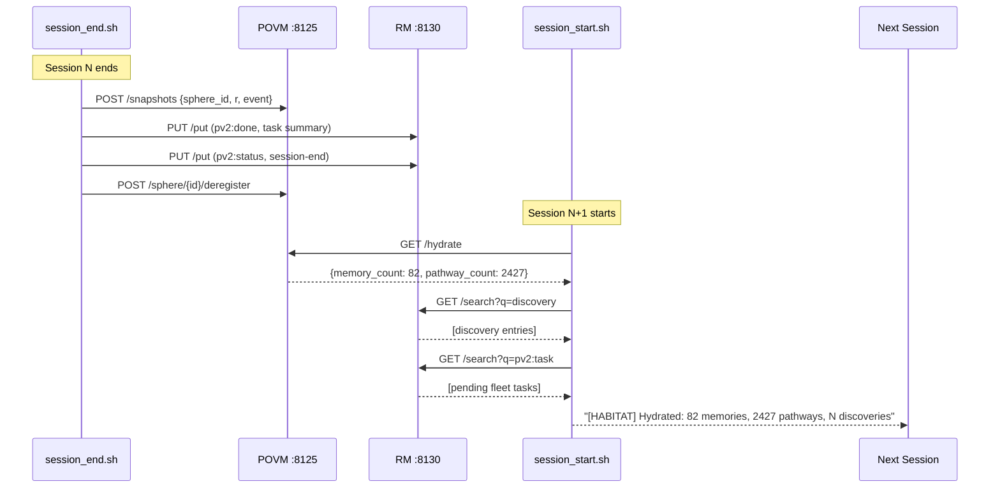
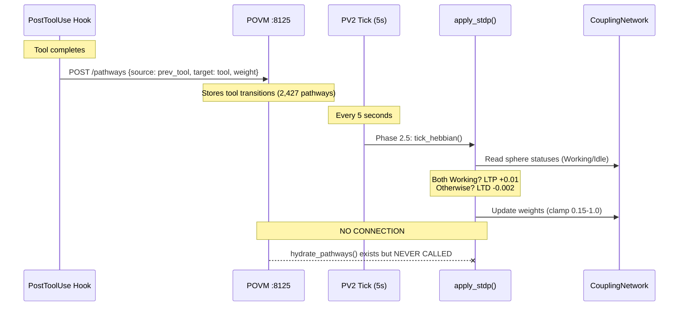

# Session 049 — Memory Workflow Analysis

> **2 memory cycles mapped: Crystallize-Hydrate + Hebbian Learning**
> **Both cycles are OPEN — data written but not read back**
> **Captured:** 2026-03-21

---

## Cycle 1: Crystallize → Hydrate (Cross-Session)

### Verdict: CYCLE IS BROKEN

| Written by session_end | Read by session_start? |
|------------------------|------------------------|
| POVM snapshots (sphere, r, event) | **NO** — reads /hydrate (aggregate counts only) |
| RM pv2:done records | **NO** — searches discovery + pv2:task, not pv2:done |
| RM pv2:status heartbeats | **NO** — never queried |
| Sphere memories (tool names) | **NO** — no API to retrieve |
| Coupling weights | **NO** — lost on restart (in-memory) |

**What survives:** Only aggregate counts (memory_count, pathway_count) and discovery/task entries. Fine-grained session context is crystallized but **never hydrated**.

---

## Cycle 2: Hebbian Learning (In-Session)

### Verdict: LOOP IS OPEN

| Step | Status |
|------|--------|
| PostToolUse → POVM pathways | **Connected** (writes tool transitions) |
| Tick Phase 2.5 → apply_stdp() | **Connected** (runs every 5s) |
| POVM pathways → apply_stdp() | **DISCONNECTED** — hydrate_pathways() exists in code but is never called |
| Namespace bridge | **MISSING** — POVM uses tool names ("Read", "Edit"), STDP uses sphere IDs ("fleet-alpha") |

**Two independent systems:** POVM stores tool-level transitions (2,427 pathways). STDP operates on sphere-level co-activation (12 edges at w=0.6). They share the word "Hebbian" but have zero data exchange.

---

## Cross-References

- [[Session 049 — Master Index]]
- [[Session 049 - LTP LTD Balance]] — STDP dynamics analysis
- [[Session 049 - Cross-Hydration Analysis]] — POVM+RM relationship
- [[Session 049 - Persistence Cluster]] — persistence layer map
