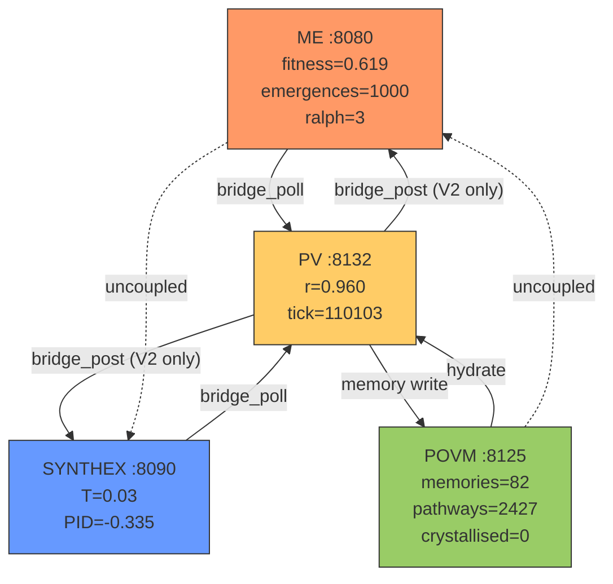

# Session 049 — Observability Cluster (ME + SYNTHEX + POVM)

**Date:** 2026-03-21 | **RM:** r69be91430a89

## Mermaid: Observability Data Flow

## Service States

### ME (Maintenance Engine)
| Metric | Value |
|--------|-------|
| Fitness | 0.619 (below 0.75 target) |
| Emergences detected | 1,000 (capped — BUG-035) |
| RALPH cycles | 3 |

### SYNTHEX
| Metric | Value |
|--------|-------|
| Temperature | 0.03 (target 0.50) |
| PID output | -0.335 |
| Heat sources | Hebbian=0, Cascade=0, Resonance=0, CrossSync=0.2 |
| Damping | 0.0167 |

### POVM
| Metric | Value |
|--------|-------|
| Memories | 82 |
| Pathways | 2,427 |
| Crystallised | 0 |
| Sessions | 0 |

## Cross-Correlation Analysis

### ME fitness vs SYNTHEX temperature
**Both depressed, but uncoupled.**
- ME fitness (0.619) and SYNTHEX temperature (0.03) are both below target
- However, they move independently — ME fitness is driven by internal emergence counting, SYNTHEX temperature by heat source polling
- No causal link: SYNTHEX doesn't read ME fitness, ME doesn't read SYNTHEX temperature
- V2 binary deployment would close this loop via bridge_post/bridge_poll

### POVM memory growth vs ME emergence rate
**No correlation — both stalled.**
- POVM memories grew from 78→82 (4 new this session, from manual writes)
- ME emergences capped at 1000/1000 (BUG-035 deadlock)
- POVM crystallisation rate: 0 (BUG-034, no read-back)
- ME emergence rate: 0 new (capped)
- If both bugs were fixed, emergence events should trigger POVM crystallisation

## Injection Result
SYNTHEX accepted the correlation event but temperature unchanged (0.03). Confirms /api/ingest stores but doesn't feed heat sources.

---
*Cross-refs:* [[Session 049 - SYNTHEX Feedback Loop]], [[Session 049 - POVM Consolidation]], [[The Maintenance Engine V2]]
