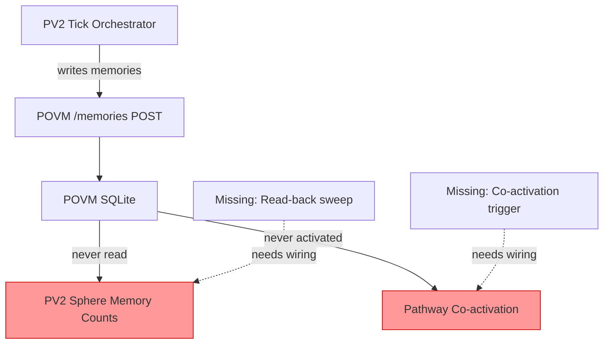

# Session 049 — POVM Pathway Deep Dive

**Date:** 2026-03-21 | **Bus Task:** 34e2fed6

## Hydration State

| Metric | Value |
|--------|-------|
| Memories | 80 |
| Pathways | 2,427 |
| Crystallised | 0 |
| Sessions | 0 |
| Latest r | 0.962 |

## BUG-034 Confirmed: Complete Read/Activation Pathology

### Memories: 80 written, 0 accessed, 0 bound

- **access_count = 0** on all 80 memories
- **sphere_id = null** on all 80 — no memory is bound to any sphere
- Memories span sessions 027 through 049, oldest have survived 6 decay cycles
- Intensities range ~0.53, phases distributed (phi 1.57–2.09)
- 12D tensors present with meaningful data but never read back

### Pathways: 2,427 exist, 0 co-activated

- **co_activations = 0** on all 2,427 pathways
- **last_activated = null** on all pathways
- Weight range: [0.15, 1.046], avg 0.303
- Weights are static initial values — never reinforced or decayed

### Top Weighted Pathways (never activated)

| Pre | Post | Weight |
|-----|------|--------|
| nexus-bus:cs-v7 | synthex | 1.046 |
| nexus-bus:devenv-patterns | pane-vortex | 1.020 |
| operator-028 | alpha-left | 1.000 |
| 5:top-right | opus-explorer | 1.000 |
| 13 | 12 | 1.000 |

## Root Cause Analysis

Three breaks in the loop:
1. **No sphere binding** — memories written without sphere_id tagging
2. **No read-back sweep** — tick orchestrator never polls POVM for sphere memories
3. **No co-activation firing** — pathway pre/post pairs never triggered together

## Impact

- All 62 spheres show `memories: 0` despite 80 memories in POVM
- Hebbian learning in PV2 operates without memory-based co-activation signal
- 2,427 pathways are static topology — no learning, no decay, no reinforcement
- POVM is effectively a write-only append log

## Remediation (Session 048 Block F)

1. Tag memories with sphere_id on write
2. Add periodic read-back sweep in tick Phase 2.7
3. Fire co-activation events when sphere pairs interact
4. Update sphere memory counts from POVM reads

---
*Cross-refs:* [[POVM Engine]], [[Session 049 — Master Index]], [[Session 049 - Post-Deploy Services]]
