# Session 049 — POVM Pathway Topology

> **Date:** 2026-03-21 | **Source:** `localhost:8125/pathways`

---

## Summary

| Metric | Value |
|--------|-------|
| Total pathways | 2,433 |
| Unique source nodes | 193 |
| Unique target nodes | 193 |
| Unique nodes (total) | 227 |
| Density | 4.7% (2433 / 227×226) |
| Co-activated pathways | **0** (BUG-034) |
| Weight range | [0.15, 1.046] |
| Mean weight | 0.303 |

---

## Weight Distribution

| Bucket | Count | Percentage |
|--------|-------|------------|
| w > 1.0 (super-strong) | 2 | 0.08% |
| 0.5 < w ≤ 1.0 (strong) | 78 | 3.2% |
| 0.3 < w ≤ 0.5 (medium) | 22 | 0.9% |
| w ≤ 0.3 (weak/baseline) | 2,331 | **95.8%** |

95.8% of pathways are at baseline weight — no Hebbian reinforcement due to 0 co-activations.

---

## Node Types (227 unique)

| Type | Count | Examples |
|------|-------|---------|
| ORAC (session PIDs) | 94 | ORAC7:3067258, ORAC7:3012890 |
| Other (agents/labels) | 72 | opus-explorer, agent-bus |
| Pane (Zellij position) | 18 | 5:top-right, 4:left |
| Service | 16 | synthex, pane-vortex, operator |
| Greek (fleet position) | 12 | alpha-left, beta-right |
| Tab ID (numeric) | 6 | 10, 12, 13, 14 |
| Fleet | 5 | fleet-alpha, fleet-beta-1 |

---

## Hub Nodes

### Top Sources (highest out-degree)

| Node | Out-degree |
|------|-----------|
| ORAC7:3067258 | 57 |
| ORAC7:3582557 | 57 |
| ORAC7:3611772 | 57 |
| ORAC7:3485165 | 56 |
| ORAC7:3447344 | 55 |

### Top Targets (highest in-degree)

| Node | In-degree |
|------|----------|
| ORAC7:3012890 | **61** |
| ORAC7:3485165 | 58 |
| ORAC7:3144870 | 57 |
| ORAC7:3309665 | 57 |
| ORAC7:3521706 | 56 |

**ORAC7:3485165** is a dual hub — both high out-degree (56) and high in-degree (58). This node was a major session that both consumed and produced many tool transitions.

---

## Top 10 Strongest Pathways

```mermaid
graph LR
    NCS["nexus-bus:cs-v7"] -->|"w=1.046<br/>strongest"| SX[synthex]
    NDP["nexus-bus:devenv"] -->|"w=1.020"| PV[pane-vortex]
    OP28[operator-028] -->|"w=1.0"| AL[alpha-left]
    P5TR["5:top-right"] -->|"w=1.0"| OE[opus-explorer]

    subgraph "Tab Transition Clique (bidirectional)"
        T10["Tab 10"] -->|"w=1.0"| T14["Tab 14"]
        T13["Tab 13"] <-->|"w=1.0"| T14
        T14 -->|"w=1.0"| T12["Tab 12"]
        T12 -->|"w=1.0"| T14
    end

    style NCS fill:#5c3a1a,stroke:#9c6a2a
    style SX fill:#5c3a1a,stroke:#9c6a2a
    style NDP fill:#1a3a5c,stroke:#2a6a9c
    style PV fill:#1a3a5c,stroke:#2a6a9c
```



### Pathway Categories

**Service-to-service (w > 1.0):**
- `nexus-bus:cs-v7 → synthex` (w=1.046) — K7 CodeSynthor routes to SYNTHEX brain
- `nexus-bus:devenv-patterns → pane-vortex` (w=1.020) — devenv patterns flow to PV

**Operator dispatch (w = 1.0):**
- `operator-028 → alpha-left` — operator dispatched to fleet-alpha left pane
- `5:top-right → opus-explorer` — tab 5 launched Opus explorer subagent

**Tab transitions (w = 1.0, bidirectional):**
- Tab 12 ↔ 14, Tab 13 ↔ 14, Tab 10 → 14, Tab 15 ↔ 11
- These represent **Zellij tab navigation patterns** — users moving between fleet tabs
- Tab 14 is the hub with 4 connections (highest-connected tab node)

---

## Topology Characteristics

### 1. Power-law degree distribution
Top nodes have ~57-61 connections while most have < 10. Classic scale-free network — a few hub sessions generated most transitions.

### 2. Three structural layers

```
LAYER 1 (structural): Service→service pathways (w > 1.0)
  nexus-bus → synthex, devenv → pane-vortex
  2 edges, highest weight, reflect ULTRAPLATE architecture

LAYER 2 (operational): Operator→pane dispatch (w = 1.0)
  operator → alpha-left, 5:top-right → opus-explorer
  ~78 edges, fleet coordination traces

LAYER 3 (ephemeral): ORAC session transitions (w ≤ 0.3)
  ORAC7:X → ORAC7:Y
  ~2,331 edges, baseline weight, short-lived sessions
```

### 3. Fully static graph
0 co-activations means no edge has ever been traversed at runtime. All weights are write-time values, never reinforced. The graph captures *what happened* but not *what matters*.

---

## Comparison: POVM vs PV2 Coupling

| Property | POVM Pathways | PV2 Coupling |
|----------|---------------|-------------|
| Nodes | 227 | 62 |
| Edges | 2,433 | 3,782 |
| Density | 4.7% (sparse) | 100% (complete) |
| Weight values | Continuous [0.15, 1.05] | Binary {0.09, 0.60} |
| Differentiated | 80 edges (3.3%) | 12 edges (0.3%) |
| Co-activations | 0 | 12 (fleet clique) |
| Encodes | Tool transitions | Oscillator coupling |
| Update frequency | Hook-driven (per tool use) | Every 5s tick |

---

## Recommendations

1. **Activate co-activation tracking** — wire PostToolUse hook to `POST /pathways/{id}/activate` when tool B follows tool A
2. **Prune ORAC ephemera** — 94 ORAC nodes with baseline weights add noise; consider TTL-based cleanup
3. **Promote service pathways** — the 2 super-strong edges (nexus→synthex, devenv→pane-vortex) should seed SYNTHEX HS-001 Hebbian heat source
4. **Tab transition analysis** — the tab clique (10,12,13,14) reveals operator navigation patterns; feed to UX optimization

---

## Cross-References

- [[Session 049 - Graph Memory]] — 4 graph systems overview
- [[Session 049 - POVM Audit]] — BUG-034, 82 memories, 0 reads
- [[POVM Engine]] — pathway store architecture
- [[Session 049 — Master Index]]
- [[ULTRAPLATE Master Index]]
