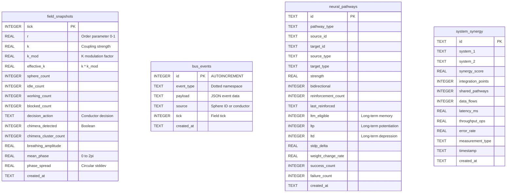

# Session 049 — Persistence Architecture Schematic

> **6 layers, 4 SQLite DBs, 2 service stores, file-based persistence**
> **Total records: ~32,000+ (SQLite) + 5,912 (RM) + 82 (POVM) + 71 vault files**
> **Captured:** 2026-03-21

---

## Architecture Diagram — All 6 Persistence Layers

```mermaid
graph TB
    subgraph "Layer 1: SQLite Databases"
        direction LR
        FT["field_tracking.db<br/>~/.local/share/pane-vortex/<br/>23,630 rows"]
        BT["bus_tracking.db<br/>~/.local/share/pane-vortex/<br/>3,779 rows"]
        HP["hebbian_pulse.db<br/>~/...developer_env.../.<br/>0 rows (DEAD)"]
        SS["system_synergy.db<br/>~/...developer_env.../.<br/>64 rows"]
    end

    subgraph "Layer 2: Service Stores"
        direction LR
        POVM["POVM :8125<br/>82 memories<br/>2,427 pathways<br/>JSON REST"]
        RM["RM :8130<br/>5,912 entries<br/>TSV PUT/search"]
    end

    subgraph "Layer 3: File-Based"
        direction LR
        VAULT["vault/<br/>71 Session 049 files<br/>173 total"]
        OBS["Obsidian<br/>~/projects/claude_code/<br/>215+ notes"]
        SHARED["Shared Context<br/>~/projects/shared-context/<br/>handoffs + codebase/"]
    end

    subgraph "Layer 4: MCP Knowledge Graph"
        MCP["mcp__memory__*<br/>entities + relations<br/>in-process"]
    end

    subgraph "Layer 5: Ephemeral"
        direction LR
        RING["/tmp/swarm-events.jsonl<br/>~1000 events (ring)"]
        CASCADE["/tmp/cascade-stage*.json<br/>inter-stage data"]
    end

    subgraph "Layer 6: In-Memory (PV2)"
        direction LR
        COUPLING["Coupling Matrix<br/>3,782 edges<br/>12 @ w=0.6"]
        FIELD["Field State<br/>62 spheres<br/>r=0.96"]
    end

    %% Write paths (solid)
    TICK["PV2 Tick<br/>Orchestrator"] -->|"Phase 4"| FT
    TICK -->|"bus events"| BT
    TICK -->|"bridge poll"| RM
    TICK -.->|"BUG-034: write only"| POVM
    TICK -->|"in-memory"| COUPLING
    TICK -->|"in-memory"| FIELD

    FLEET["Fleet Instances"] -->|"vault writes"| VAULT
    FLEET -->|"POST /put TSV"| RM
    FLEET -->|"bus submit"| BT

    SIDECAR["Swarm Sidecar"] -->|"ring file"| RING
    SIDECAR -->|"bus bridge"| BT

    %% Read paths (dashed)
    RM -.->|"search/recent"| FLEET
    VAULT -.->|"Read tool"| FLEET
    FT -.->|"sqlite3 queries"| FLEET
    BT -.->|"sqlite3 queries"| FLEET
    POVM -.-x|"NO READS (BUG-034)"| FLEET

    style RM fill:#2d6b1e,color:#fff
    style FT fill:#1e3a6b,color:#fff
    style BT fill:#1e3a6b,color:#fff
    style POVM fill:#6b4a1e,color:#fff
    style HP fill:#6b1e1e,color:#fff
    style VAULT fill:#3a1e6b,color:#fff
    style COUPLING fill:#1e6b5a,color:#fff
    style FIELD fill:#1e6b5a,color:#fff
```

---

## ER Diagram — Key SQLite Tables

---

## Data Volume Table

### SQLite

| Database | Table | Rows | Status | Indices |
|----------|-------|------|--------|---------|
| field_tracking.db | field_snapshots | 73 | **Stale** (stopped tick 27,768) | PK: tick |
| field_tracking.db | sphere_history | 23,550 | **Stale** (stopped tick 60,504) | — |
| field_tracking.db | coupling_history | 0 | Empty (never wired) | — |
| field_tracking.db | executor_tasks | 7 | Sparse | — |
| bus_tracking.db | bus_events | 3,607 | **Active** | 5 indices (type, tick, source, created_at, type+tick) |
| bus_tracking.db | bus_tasks | 166 | **Active** | — |
| bus_tracking.db | cascade_events | 6 | Sparse | — |
| bus_tracking.db | event_subscriptions | 0 | Empty | — |
| bus_tracking.db | task_dependencies | 0 | Empty | — |
| bus_tracking.db | task_tags | 0 | Empty | — |
| hebbian_pulse.db | neural_pathways | 0 | **Dead** | 2 indices (strength, type) |
| system_synergy.db | system_synergy | 64 | Stable | 1 index (system_1, system_2) |
| | **SQLite Total** | **27,473** | | |

### Service Stores

| Service | Store | Records | Format | Read | Write |
|---------|-------|---------|--------|------|-------|
| POVM :8125 | memories | 82 | JSON | **Broken** (BUG-034) | Active |
| POVM :8125 | pathways | 2,427 | JSON | **Broken** | Active |
| RM :8130 | entries | 5,912 | TSV | **Active** | **Active** |
| | **Service Total** | **8,421** | | | |

### File-Based

| Layer | Location | Count | Format |
|-------|----------|-------|--------|
| Vault (Session 049) | vault/ | 71 | Markdown |
| Vault (all) | vault/ | 173 | Markdown |
| Obsidian | ~/projects/claude_code/ | 215+ | Markdown + wikilinks |
| Shared Context | ~/projects/shared-context/ | Variable | Mixed |
| Arena | arena/ | 85+ | Mixed |
| Sidecar ring | /tmp/swarm-events.jsonl | ~1,000 | NDJSON |

### In-Memory (not persisted)

| Store | Size | Notes |
|-------|------|-------|
| Coupling matrix | 3,782 edges | 12 Hebbian-strengthened |
| Field state | 62 spheres | r, phase, frequency per sphere |
| Bus state | ~200 tasks | In-memory task queue |
| Conductor history | ~100 decisions | Rolling window |

---

## Cross-References

- [[ULTRAPLATE Master Index]] — full service topology
- [[Session 049 - Persistence Cluster]] — persistence health assessment
- [[Session 049 - Memory Archaeology]] — archaeological timeline
- [[Session 049 - Cross-Hydration Analysis]] — POVM+RM relationship
- [[Session 049 — Master Index]]
