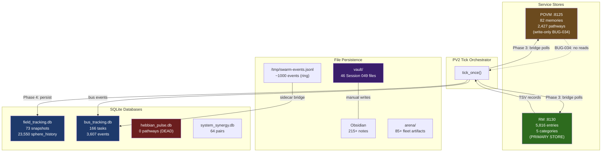

# Session 049 — Persistence Cluster Map

> **6 persistence layers, 8 databases, 33,371 total records**
> **Captured:** 2026-03-21

---

## Persistence Inventory

### SQLite Databases

| Database | Location | Table | Rows | Status |
|----------|----------|-------|------|--------|
| field_tracking.db | ~/.local/share/pane-vortex/ | field_snapshots | 73 | Active |
| field_tracking.db | | sphere_history | 23,550 | Active (heavy) |
| field_tracking.db | | coupling_history | 0 | Empty |
| field_tracking.db | | executor_tasks | 7 | Sparse |
| bus_tracking.db | ~/.local/share/pane-vortex/ | bus_tasks | 166 | Active |
| bus_tracking.db | | bus_events | 3,607 | Active |
| bus_tracking.db | | cascade_events | 6 | Sparse |
| bus_tracking.db | | event_subscriptions | 0 | Empty |
| bus_tracking.db | | task_dependencies | 0 | Empty |
| bus_tracking.db | | task_tags | 0 | Empty |
| hebbian_pulse.db | ~/claude-code-workspace/developer_environment_manager/ | neural_pathways | 0 | **Dead** (Gotcha #9) |
| system_synergy.db | ~/claude-code-workspace/developer_environment_manager/ | system_synergy | 64 | Active |

### Service Memory Stores

| Service | Endpoint | Records | Format | Status |
|---------|----------|---------|--------|--------|
| POVM (:8125) | /memories | 82 | JSON | Write-only (BUG-034) |
| POVM (:8125) | /pathways | 2,427 | JSON | Active but unconsumed |
| RM (:8130) | /put, /search | 5,816 | TSV | **Primary operational store** |

### File-Based Persistence

| Layer | Location | Count | Format |
|-------|----------|-------|--------|
| Vault (Session 049) | vault/ | 46 | Markdown |
| Obsidian | ~/projects/claude_code/ | 215+ | Markdown + wikilinks |
| Arena | arena/ | 85+ | Mixed (fleet artifacts) |
| Sidecar ring file | /tmp/swarm-events.jsonl | ~1000 | NDJSON |

---

## Data Flow Diagram



---

## Analysis

### Record Distribution

```
RM (TSV)            ████████████████████████████████████████  5,816  (57.5%)
sphere_history      ██████████████████████████████████        23,550 (but in separate DB)
bus_events          ████████                                  3,607
POVM pathways       ██████                                    2,427
bus_tasks           ██                                          166
POVM memories       █                                            82
field_snapshots     █                                            73
system_synergy      █                                            64
```

**RM dominates** operational persistence with 5,816 entries. `sphere_history` is the largest single table (23,550 rows) but is a historical archive, not actively queried.

### Health Assessment

| Layer | Status | Issue |
|-------|--------|-------|
| RM | **Healthy** | Primary store, actively read+written |
| field_tracking | **Partial** | sphere_history active, coupling_history empty |
| bus_tracking | **Healthy** | Tasks + events accumulating normally |
| POVM | **Degraded** | Write-only, BUG-034 blocks reads |
| hebbian_pulse | **Dead** | 0 rows, gotcha #9 confirmed |
| system_synergy | **Stable** | 64 pairs, rarely updated |
| Vault | **Active** | 46 files this session alone |

### Dead/Empty Tables

5 tables with 0 rows:
- `coupling_history` — PV tick doesn't write coupling snapshots (only field_snapshots)
- `event_subscriptions` — Bus subscriptions are in-memory, not persisted
- `task_dependencies` — Unused feature
- `task_tags` — Unused feature
- `neural_pathways` (hebbian_pulse.db) — Wrong DB; Hebbian is in PV in-memory coupling matrix

### Recommendations

1. **Wire coupling_history writes** — PV tick Phase 4 should snapshot coupling matrix periodically (every SNAPSHOT_INTERVAL ticks)
2. **Fix BUG-034** — POVM read-back is the highest-impact persistence fix
3. **Drop hebbian_pulse.db** — Confirmed dead, gotcha #9. Hebbian learning lives in PV's in-memory coupling network
4. **Add TTL cleanup to RM** — 5,816 entries growing; stale context entries should expire
5. **Persist bus subscriptions** — Currently lost on restart

---

## Cross-References

- [[Session 049 — Master Index]]
- [[Session 049 - Cross-Hydration Analysis]] — POVM+RM relationship
- [[Session 049 - Synergy Analysis]] — system_synergy.db analysis
- [[ULTRAPLATE Master Index]]
