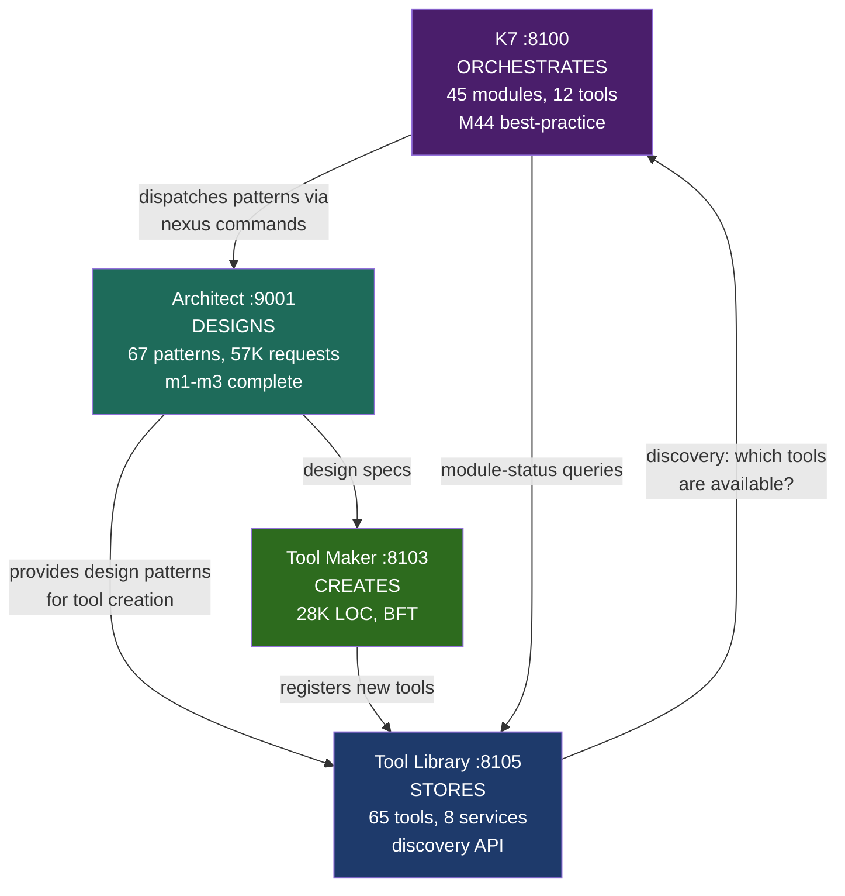

# Session 049 — K7-Architect-ToolLib Service Triangle

> **K7: 45 modules, M44 best-practice | Architect: 67 patterns, 57K requests | ToolLib: 65 tools, 8 services**
> **Captured:** 2026-03-21

---

## Service Profiles

### K7 Orchestrator (:8100)

Best-practice command result:

| Metric | Value |
|--------|-------|
| Module | M44 |
| Confidence | 0.95 |
| Omniscient awareness | true |
| Prediction horizon | 5,000ms |
| Status | Executed |

K7 claims "omniscient_awareness" — it has visibility across all 45 modules and can predict 5 seconds ahead.

### Architect Agent (:9001)

| Metric | Value |
|--------|-------|
| Patterns loaded | **67** |
| Requests processed | 57,781 |
| Uptime | 273,137s (~3.16 days) |
| Internal modules | m1, m2, m3 (all complete) |

Architect has processed 57K pattern-matching requests — the second most active service after NAIS (71K). Its 67 loaded patterns are the design vocabulary of the ecosystem. Endpoint `/patterns` returns plain text, not JSON.

### Tool Library (:8105)

65 tools across 8 registered services. Self-referential (registers 5 of its own tools for discovery).

---

## The Triangle

**Flow:** K7 orchestrates → Architect designs (67 patterns) → Tool Maker creates (BFT-enabled) → Tool Library stores (65 tools) → K7 discovers and dispatches.

---

## Cross-References

- [[Session 049 - Tool Ecosystem]] — full tool analysis
- [[Session 049 - K7 Swarm Deploy]] — K7 swarm results
- [[Session 049 — Master Index]]
