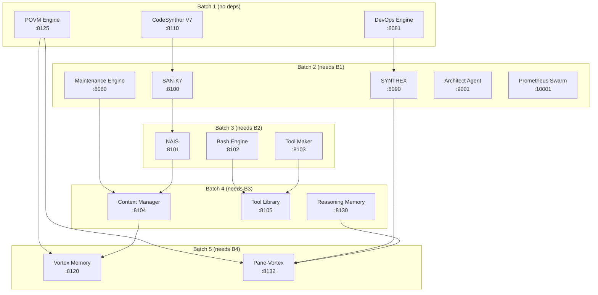
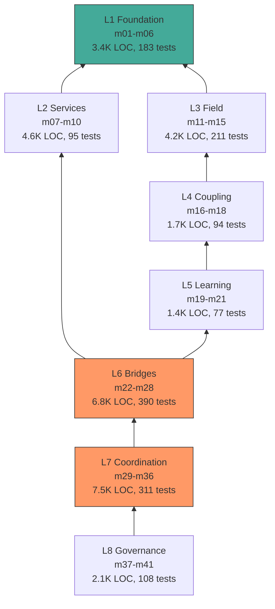
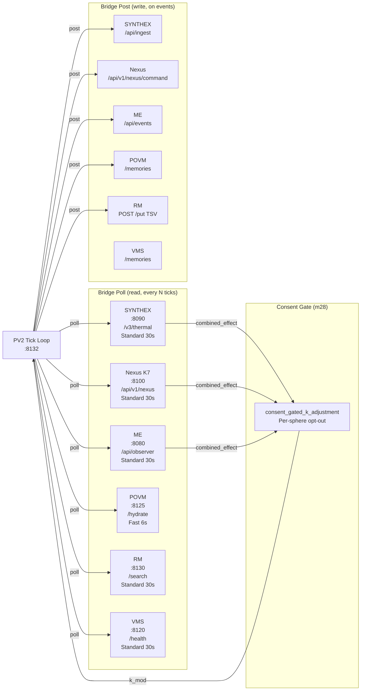

# Session 049 — System Architecture Schematics

**Date:** 2026-03-21 | **All 16/16 services verified live**

## 1. ULTRAPLATE Service Topology (16 Active Services)

## 2. PV2 8-Layer Module Dependency Graph

## 3. Bridge Data Flow (6 Bridges + Consent Gate)

### Poll Tiers

| Tier | Interval | Services |
|------|----------|----------|
| Fast (6s) | Every tick | POVM |
| Standard (30s) | Every 6 ticks | ME, RM, VMS, SYNTHEX |
| Nexus | Every 6 ticks | K7 (combined with poll) |

### Write Triggers

| Bridge | Trigger | Direction |
|--------|---------|-----------|
| SYNTHEX | Tick thermal data | PV → SX |
| Nexus | Pattern events | PV → K7 |
| ME | Field state events | PV → ME |
| POVM | Memory crystallisation | PV → POVM |
| RM | Heartbeats + tasks | PV → RM (TSV!) |

---
*Cross-refs:* [[ULTRAPLATE Master Index]], [[Session 049 — Full Remediation Deployed]]
