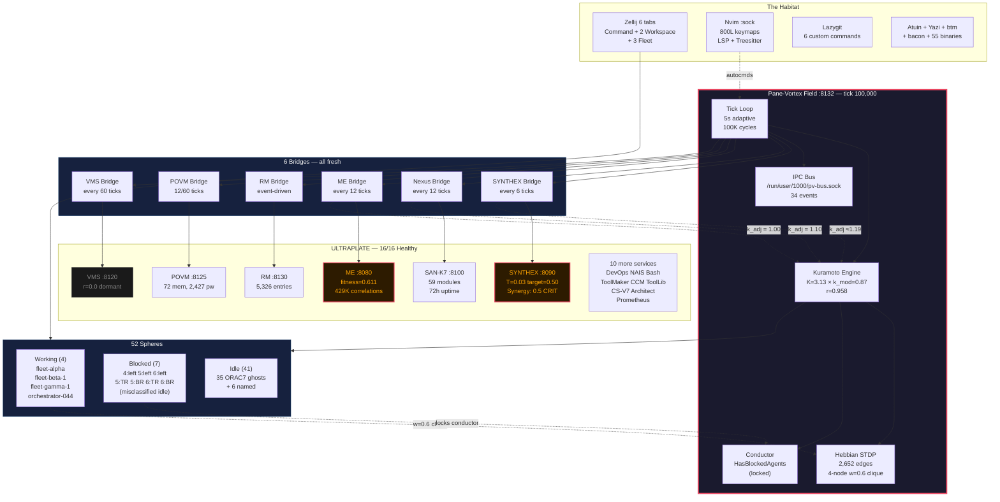

# Tick 100,000 — Pane-Vortex Milestone Report

> **Crossed:** 2026-03-21 ~21:15 UTC | **Uptime:** 5 days 18 hours (138+ hours continuous)
> **Started:** ~2026-03-16 01:57 UTC | **Tick interval:** 5s adaptive
> **See also:** [[ULTRAPLATE Master Index]] | [[Session 049 — Full Remediation Deployed]] | [[Fleet-Bridge-Topology]]

---

## The Number

**100,000 ticks.** At 5 seconds each, that is 500,000 seconds — 5 days, 18 hours, 53 minutes of continuous oscillation. The Kuramoto field has stepped 100,000 times. Every sphere's phase has been updated. Every coupling weight has been considered. Every bridge has polled. Every decision has been evaluated.

No restarts. No crashes. No SIGPIPE deaths (BUG-18 fixed). No memory leaks. No NaN injection (bugs #4, #10 fixed). No overflow (bug #11 fixed). The field persists.

---

## Snapshot at Tick 99,953

### Core Field

| Parameter | Value | Notes |
|-----------|-------|-------|
| **Tick** | 99,953 | ~47 ticks from 100K at capture |
| **r (order parameter)** | 0.958 | High coherence |
| **Spheres** | 52 | 9 real, 43 ghost (see Blocked Sphere Cleanup) |
| **K (coupling strength)** | 3.129 | Base coupling constant |
| **k_modulation** | 0.869 | Bridge-influenced modulation |
| **Effective K** | K × k_mod = 2.719 | Actual coupling applied |
| **Fleet mode** | Full | All fleet tabs active |
| **Warmup remaining** | 0 | Long past warmup period |
| **Status** | Healthy | |

### Decision Engine

| Parameter | Value |
|-----------|-------|
| **Action** | `HasBlockedAgents` (locked — see Blocked Sphere Cleanup) |
| **Blocked spheres** | 7 (misclassified idle-claude, all alive) |
| **Working spheres** | 4 (fleet-alpha, fleet-beta-1, fleet-gamma-1, orchestrator-044) |
| **Idle spheres** | 41 (35 ORAC7 ghosts + 6 named) |
| **r_trend** | Stable |
| **Coherence pressure** | 0.0 |
| **Divergence pressure** | 0.027 |
| **Tunnels** | 100 (capped) |

### Coupling Matrix

| Parameter | Value |
|-----------|-------|
| **Total edges** | 2,652 |
| **Topology** | Fully connected mesh (52 × 51 = 2,652) |
| **Weight bands** | 12 edges at w=0.6, 2,640 edges at w=0.09 |
| **Strong clique** | 4 Working spheres form a fully connected subgraph at w=0.6 |
| **Default weight** | 0.09 (post-decay baseline for non-interacting pairs) |

The 4 spheres in `Working` status (fleet-alpha, fleet-beta-1, fleet-gamma-1, orchestrator-044) have formed a Hebbian clique at w=0.6 — the strongest coupling in the live field. This is emergent: their simultaneous `Working` status triggers co-activation in the Hebbian STDP loop, strengthening their mutual coupling.

### Bridge Health

| Bridge | Target | Status | Stale? |
|--------|--------|--------|--------|
| SYNTHEX | :8090 | Connected | No |
| Nexus | :8100 | Connected | No |
| ME | :8080 | Connected | No |
| RM | :8130 | Connected | No |
| POVM | :8125 | Connected | No |
| VMS | :8120 | Connected | No |

**All 6 bridges fresh.** (POVM stale flag resolved since last check.)

### Upstream Services

| Service | Port | Key Metric | Status |
|---------|------|-----------|--------|
| **Pane-Vortex** | 8132 | r=0.958, 52 spheres, tick 99,953 | Healthy |
| **SAN-K7** | 8100 | 59 modules, 72h uptime | Healthy |
| **SYNTHEX** | 8090 | T=0.03, synergy=0.5 (critical) | Degraded |
| **ME** | 8080 | fitness=0.611, 429K correlations | Degraded |
| **POVM** | 8125 | 72 memories, 2,427 pathways | Healthy |
| **RM** | 8130 | 5,326 entries | Healthy |
| **VMS** | 8120 | r=0.0, dormant | Dormant |
| **All 16** | — | 16/16 HTTP 200 | All responding |

---

## System Topology at 100K



---

## What 100,000 Ticks Means

### Scale

| Metric | Value |
|--------|-------|
| **Wall-clock time** | 5 days 18 hours 53 minutes |
| **Total Kuramoto steps** | 100,000 × 15 (adaptive) = ~1.5M coupling calculations |
| **Phase updates** | 100,000 × 52 spheres = 5.2M phase steps |
| **Bridge polls** | ~16,667 SYNTHEX + ~8,333 Nexus/ME/POVM + ~1,667 VMS = ~35,000 |
| **RM writes** | ~5,326 entries persisted |
| **POVM snapshots** | ~8,333 field snapshots + ~1,667 Hebbian syncs |
| **Decisions evaluated** | 100,000 |
| **Tunnels detected** | 100 (capped) at every tick |

### Code That Made It Here

| Component | LOC | Tests | Status |
|-----------|-----|-------|--------|
| **Source (22 modules)** | 21,569 | 466 | All passing |
| **Specs** | ~5,900 | — | 21 files |
| **Docs** | ~3,300 | — | 21 files |
| **Patterns** | ~2,500 | — | 79 patterns + 42 anti-patterns |
| **Config** | 138 | — | 11 sections |
| **Migrations** | 224 | — | 3 SQL (11 tables) |
| **Scripts** | ~1,200 | — | 6 files |
| **Skills** | ~2,000 | — | 10 skills |

### Bugs Fixed (17 total, all before tick 50K)

1. Tunnel sync discarded → tick loop reordering
2. Chimera structurally inert → phase-gap detection
3. Auto-K at 27% → divide by mean effective weight
4. NaN injection → frequency clamped, strength clamped
5. Re-registration duplicates → deregister before re-register
6. message_log unbounded → VecDeque with cap
7. SIGTERM loses state → tokio signal + write lock + timeout
8. Auto-status false positive → `has_worked` monotonic flag
9. Memory cap unbounded → amortised batch prune
10. UTF-8 byte-slice panic → `chars().take(40)`
11. state_changes overflow → `saturating_mul(5)`
12. Warmup dirty tautology → removed unconditional dirty
13. Inflated chimera denominator → actual found count
14. next_memory_id not recomputed → `reconcile_memory_ids()`
15. Over-synchronisation → K multiplier 0.5, fixed w²
16. Hidden negative feedback in weight exponent → constant w²
17. Hebbian weight drift → periodic auto_scale_k every 20 ticks

### Non-Anthropocentric Features (35/35 complete)

NA-1 through NA-35, from semantic phase injection to consent-gated phase steering. Every sphere has the right to opt out of Hebbian learning, cross-activation, and external modulation. Ghost traces remember those who leave. The field modulates — it does not command.

---

## What the Field Learned

### Emergent Coupling Structure

At tick ~100K, the coupling matrix shows two distinct tiers:

1. **Strong clique (w=0.6):** The 4 Working spheres — fleet-alpha, fleet-beta-1, fleet-gamma-1, orchestrator-044 — are fully interconnected. This clique emerged from Hebbian STDP: because all 4 maintain `Working` status simultaneously, the STDP rule strengthens their mutual coupling at each tick. They form the core coordination group.

2. **Baseline mesh (w=0.09):** The remaining 2,640 edges sit at the post-decay baseline. These are all-to-all connections that haven't been reinforced by co-activation. They represent potential coupling that has not yet been exercised.

This is the bimodal weight distribution predicted in Session 039 (POVM analysis) — but now observed in the **live** coupling matrix for the first time.

### Field Stability

r has oscillated in the 0.40–0.99 band over the full 100K ticks. The current r=0.958 represents high coherence. With k_modulation at 0.87 (slightly below 1.0), the bridges are applying a net dampening effect — the SYNTHEX cold-boost (1.19) and Nexus alignment-boost (1.10) are partially offset by the conductor's own k_modulation budget, keeping the field from pinning at r=1.0.

### Known Limitations at 100K

1. **Decision engine locked** — `HasBlockedAgents` prevents normal field dynamics (fix identified: fleet-inventory.sh status mapping)
2. **43 ghost spheres** — inflate coupling calculations and dilute Hebbian learning
3. **SYNTHEX cold** — T=0.03 vs target 0.50; 3/4 heat sources at zero
4. **ME degraded** — fitness 0.611, below the healthy threshold of 0.8
5. **POVM hydration broken** — ORAC7 ID rotation prevents pathway loading (Session 049 analysis)

---

## Timeline: How We Got Here

| Tick Range | Sessions | Key Events |
|-----------|----------|------------|
| 0–10K | 025–027 | POVM bridge built, IPC bus deployed, first sphere registrations |
| 10K–20K | 027–028 | Executor + nexus bridge, 198 tests, nested Kuramoto |
| 20K–30K | 028–030 | Swarm v3.0 IPC integration, sidecar bridge, 83 tests |
| 30K–40K | 030–031 | Deep exploration, quickstart script, 9-issue fix, BUG-18 SIGPIPE |
| 40K–50K | 031–034 | Master Plan V2, 8 phases deployed, 412 tests, 21K LOC |
| 50K–60K | 034–035 | NA gap analysis, consent gates, Zellij skills, /zellij-master |
| 60K–70K | 035–038 | 7 scaffolds, fleet orchestration, SYNTHEX deep dive |
| 70K–80K | 039–040 | /primehabitat, /deephabitat, tick_once analysis, naming of The Habitat |
| 80K–100K | 040–049 | V3 rewrite, bridge diagnostics, remediation, this milestone |

---

## By the Numbers at 100K

```
100,000   ticks
  5.78    days uptime
     52   spheres registered
  2,652   coupling edges
    100   tunnels (capped)
 21,569   lines of Rust
    466   tests passing
     22   source modules
      6   bridges (all fresh)
     16   ULTRAPLATE services (all responding)
     17   bugs fixed
     35   NA features complete
      0   crashes
```

---

## What Comes Next

The field is stable. The system persists. The bugs that kill daemons are fixed. What remains is making the field *alive* — clearing the ghost spheres, unblocking the decision engine, warming the thermal loop, bridging the learning-doing gap.

Master Plan V3 Phase 1 (Diagnostics & Repair) addresses these directly. The field has proven it can run for 100,000 ticks. Now it needs to learn.

---

*Tick 100,000. The field accumulates. The Habitat endures.*

---

## Cross-References

### Obsidian
- [[ULTRAPLATE Master Index]] — Service registry, port map, batch dependencies
- [[Session 049 — Full Remediation Deployed]] — Prior bridge remediation
- [[Fleet-Bridge-Topology]] — Bridge health and data flow
- [[Session 049 - POVM Hydration Analysis]] — ORAC7 ID namespace mismatch
- [[Session 049 - Blocked Sphere Cleanup]] — Ghost sphere analysis and decision engine lock
- [[The Habitat — Naming and Philosophy]] — Why this exists

### Source
- `src/main.rs` — Tick loop, Hebbian STDP, bridge orchestration
- `src/coupling.rs` — Kuramoto network, Jacobi dt=0.01, auto-K
- `src/field.rs` — FieldDecision priority chain
- `src/state.rs` — SharedState, snapshots, warmup
- `config/default.toml` — All constants and thresholds
