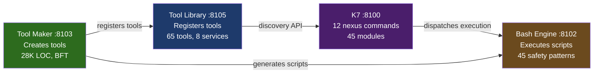

# Session 049 — Tool Ecosystem

> **65 tools across 8 services | Tool Maker: 28,534 LOC, 1,366 tests, BFT-enabled**
> **Captured:** 2026-03-21

---

## Tool Library (:8105) — Registry

65 tools registered across 8 services:

| Service | Port | Tools | Role |
|---------|------|-------|------|
| sphere-vortex | 8120 | 17 | Field operations, sphere management |
| san-k7-orchestrator | 8100 | 12 | Nexus commands, module orchestration |
| tool-master | 8103 | 12 | Tool creation, execution pipeline |
| synthex | 8090 | 12 | Thermal, diagnostics, homeostasis |
| bash-engine | 8101 | 8 | Script execution, safety patterns |
| nais | 8102 | 8 | Adaptive intelligence |
| claude-context-manager | 8104 | 8 | Context window management |
| tool-library | 8105 | 5 | Self-registry, discovery |
| **Total** | | **65** | |

**Note:** Port assignments differ from CLAUDE.md for bash-engine (8101 vs 8102) and nais (8102 vs 8101) — possible registration swap.

## Tool Maker (:8103) — Factory

| Metric | Value |
|--------|-------|
| Status | Operational |
| Version | 1.0.0 |
| Uptime | 273,033s (~3.16 days) |
| Byzantine enabled | true |
| Quality score | 99.0 |
| Total LOC | 28,534 |
| Total tests | 1,366 |

### Subsystem Synergy

| Module | Synergy | Status |
|--------|---------|--------|
| Average | 0.991 | Healthy |
| m1_error_taxonomy | 0.0 | Not active |
| m2_tensor_memory | 0.0 | Not active |
| m3_graph_memory | 0.0 | Not active |
| m4_learning_pipeline | 0.0 | Not active |
| m5_tool_orchestration | 0.0 | Not active |
| m6_execution_engine | 0.0 | Not active |
| m7_distributed_exec | 0.0 | Not active |

**Finding:** All 7 learning/execution modules show 0.0 synergy despite avg 0.991. The modules are initialized but not producing synergy — same pattern as DevOps Engine's empty Hebbian synapses.

## Bash Engine (:8102) — Executor

| Metric | Value |
|--------|-------|
| Version | 1.0.0 |
| Status | Healthy |
| Uptime | 273,009s (~3.16 days) |
| Safety patterns | 45 |

Lightweight health-only interface. The 45 safety patterns are compiled in, not dynamically queryable.

## Service Relationship

**Flow:** Tool Maker creates → Tool Library registers → K7 discovers and dispatches → Bash Engine executes with safety guardrails.

## K7 Module Status Cross-Reference

| Metric | Value |
|--------|-------|
| Total modules | 45 |
| Healthy | 45 |
| Degraded | 0 |
| Unhealthy | 0 |

K7's 12 Tool Library tools map to its 45 internal modules. The 12 tools are the public API surface; the 45 modules are the internal implementation. Ratio: ~3.75 modules per tool.

---

## Cross-References

- [[Session 049 — Master Index]]
- [[Session 049 - DevOps NAIS Exploration]] — DevOps/NAIS relationship
- [[Session 049 - Trinity Chain]] — K7-SYNTHEX-ME analysis
- [[ULTRAPLATE Master Index]]
