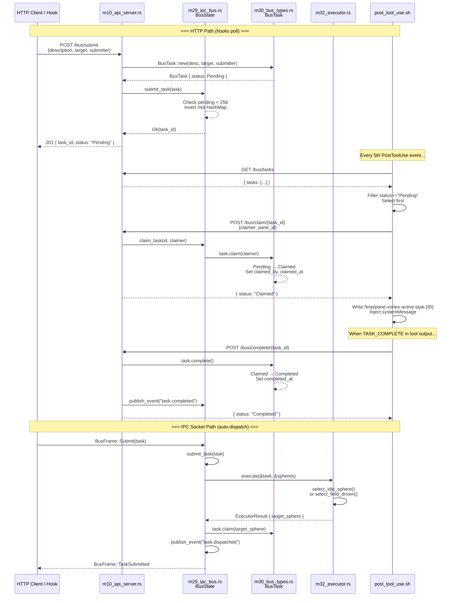
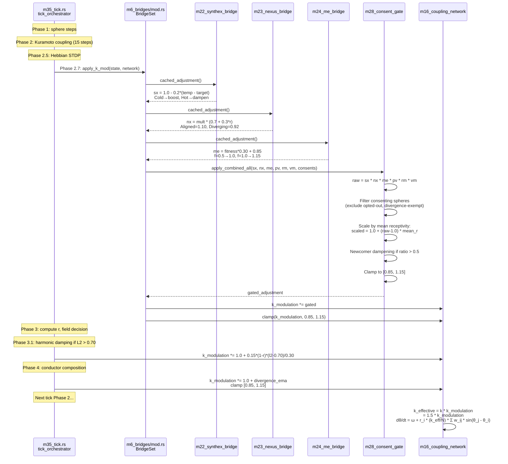

# Session 049 — Workflow Analysis (Dual Code Path Trace)

**Date:** 2026-03-21

---

## 1. Task Submission Workflow

### Sequence Diagram



### Two Submit Paths

| Aspect | HTTP POST /bus/submit | IPC Socket BusFrame::Submit |
|--------|----------------------|---------------------------|
| Auto-dispatch | No — stays Pending | Yes — Executor claims immediately |
| Event published | None | task.dispatched |
| Who claims | Hook polls 1-in-5 | Server auto-claims |
| Backpressure | 256 pending max | Same |

### TaskTarget Selection Strategies

| Target | Filter | Rank By |
|--------|--------|---------|
| AnyIdle | status == Idle | Least recently active |
| FieldDriven | Idle or Working | field_score = receptivity × status_weight × (1 - opt_out) |
| Willing | receptivity > 0.3, !opt_out | Max receptivity |
| Specific | sphere exists | Direct lookup |

### State Machine

```
Pending → Claimed → Completed
                  → Failed
Claimed → Pending  (requeue on stale timeout)
```

---

## 2. Bridge Polling & k_modulation Workflow

### Sequence Diagram



### Bridge Poll Intervals

| Bridge | Endpoint | Interval | Factor Formula |
|--------|----------|----------|----------------|
| SYNTHEX | GET :8090/v3/thermal | 6 ticks | 1.0 - 0.2*(temp - target) |
| Nexus/K7 | GET :8100/nexus/metrics | 60 ticks | mult * (0.7 + 0.3*r) |
| ME | GET :8080/api/observer | 12 ticks | fitness*0.30 + 0.85 |
| POVM | GET :8125/pathways | 60 ticks | Cached, not applied |
| RM | GET :8130/search | On hydration | Cached, not applied |
| VMS | GET :8120/health | 60 ticks | Cached, not applied |

### k_modulation Mutation Chain (per tick)

```
                     Phase 2.7                    Phase 3.1                Phase 4
k_mod = k_mod × consent_gate(Π bridges) → × harmonic_damping → × conductor_factor
        ↓ clamp [0.85, 1.15]                 ↓ clamp               ↓ clamp

Next tick Phase 2:
k_effective = k_base(1.5) × k_modulation
dθᵢ/dt = ωᵢ + receptivityᵢ × (k_eff / N) × Σ wᵢⱼ × sin(θⱼ − θᵢ)
```

### Consent Gate Pipeline

1. Filter: exclude opted-out + divergence-exempt (receptivity < 0.15)
2. Scale: `1.0 + (raw - 1.0) × mean_receptivity`
3. Dampen: if newcomer_ratio > 0.5, reduce deviation
4. Clamp: `[0.85, 1.15]` (budget adjustable via governance)

---

## Cross-References

- [[Session 049 - System Architecture]]
- [[Session 049 - Fleet Architecture]]
- [[Session 049 - Data Flow Verification]]
- [[ULTRAPLATE Master Index]]
