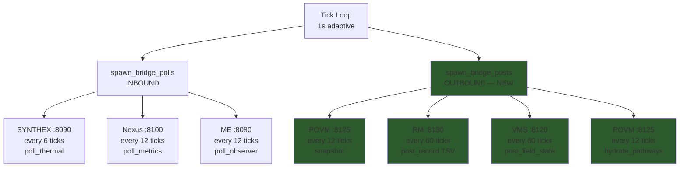
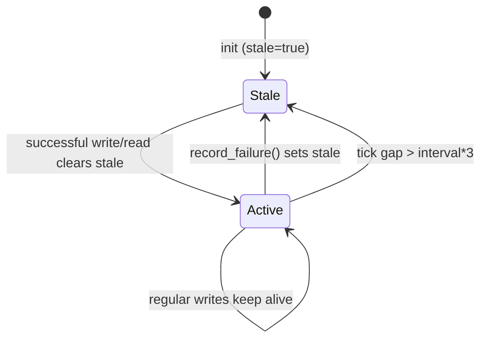

# Session 049 — Bridge Diagnostics and Schematics

> **Date:** 2026-03-21
> **Context:** Diagnostic findings during exploration after Block E/F deployment
> **Cross-refs:** [[Session 049 — Full Remediation Deployed]], [[POVM Engine]], [[ULTRAPLATE Master Index]]
> **ai_docs:** `SCHEMATICS_BRIDGES_AND_WIRING.md`, `SESSION_048_REMEDIATION_PLAN.md`

## Bridge Write-Back Architecture (New in Session 049)



## Staleness Bug Chain (BUG-038 + BUG-039)

### Root Cause Analysis

Each bridge has an internal `BridgeState` with a `stale: bool` flag and tick-based tracking. The `BridgeSet::apply_k_mod()` (called every tick in Phase 2.7) updates `AppState.prev_bridge_staleness` from each bridge's `is_stale(tick)`.

**Before fix:**
```
snapshot() / post_record() / post_field_state()
  └── clears consecutive_failures ✓
  └── does NOT clear stale ✗          ← BUG-038
  └── does NOT update last_poll_tick ✗ ← BUG-039 (RM only)

is_stale(tick) checks:
  state.stale (always true from init)   ← never cleared
  OR current_tick - last_poll_tick >= N  ← always true if never set
```

**After fix:**
```
snapshot() / post_record() / post_field_state()
  └── clears consecutive_failures ✓
  └── clears stale = false ✓           ← FIXED
  └── updates last_poll_tick ✓          ← FIXED (RM)
```

### Bridge Staleness State Machine



## Live Diagnostic Data (Post-Deploy)

### Field Spectrum
- **l0 monopole:** -0.69 (net phase imbalance)
- **l1 dipole:** 0.70 (= order parameter r)
- **l2 quadrupole:** 0.68 (below 0.70 threshold — harmonic damping NOT active yet)
- When l2 rises above 0.70 (4-way clustering), H3 damping kicks in

### Coupling Matrix
- 132 edges (up from 6 at fresh restart)
- All weights uniform at 0.09 — Hebbian STDP hasn't differentiated yet
- Differentiation expected after sustained co-active sphere pairs

### Task Queue
- 53 tasks pending, 0 claimed (pre-existing from before Executor wiring)
- New submissions will dispatch via Executor → `task.dispatched` events

### Governance
- 16 proposals: 5 Applied, 11 Expired
- Voting window now 200 ticks (~17 min) — future proposals get more time

## POVM Write Format Discovery

POVM Engine requires `theta` field in POST /memories payload. Without it:
```
Failed to deserialize the JSON body: missing field `theta`
```

Correct payload:
```json
{
  "content": "field_state tick=N r=X spheres=Y",
  "intensity": 0.5,
  "phi": 0.0,
  "theta": 0.0,
  "tensor": [12 f64 values],
  "session_created": "pv2-tick-N"
}
```

This was discovered during initial deploy and incorporated into `spawn_bridge_posts`.

## Key Files Modified

| File | Lines Changed | Purpose |
|------|--------------|---------|
| `src/m7_coordination/m29_ipc_bus.rs` | +35 | E1: Executor dispatch in Submit handler |
| `src/bin/main.rs` | +85 | E2: `spawn_bridge_posts()` function |
| `src/m7_coordination/m35_tick.rs` | +12 | H3: Harmonic damping Phase 3.1 |
| `src/m8_governance/m37_proposals.rs` | +2 | H4: Voting window 24→200 |
| `src/m6_bridges/m25_povm_bridge.rs` | +1 | BUG-038: stale=false in snapshot |
| `src/m6_bridges/m26_rm_bridge.rs` | +1 | BUG-038: stale=false in post_record |
| `src/m6_bridges/m27_vms_bridge.rs` | +1 | BUG-038: stale=false in post_field_state |

## Lessons Learned

1. **devenv restart doesn't kill processes** — always `kill $(ss -tlnp sport=:PORT)` first
2. **Bridge staleness is dual-tracked** — both `state.stale` flag AND tick-based gap must be addressed
3. **POVM POST /memories requires theta** — not documented in API spec, discovered empirically
4. **Bridge polls vs posts are separate concerns** — polls are inbound (reads), posts are outbound (writes). Staleness must account for both.
5. **`should_poll` vs `should_write`** — RM uses poll semantics, POVM/VMS use write semantics. Different bridges, different patterns.
